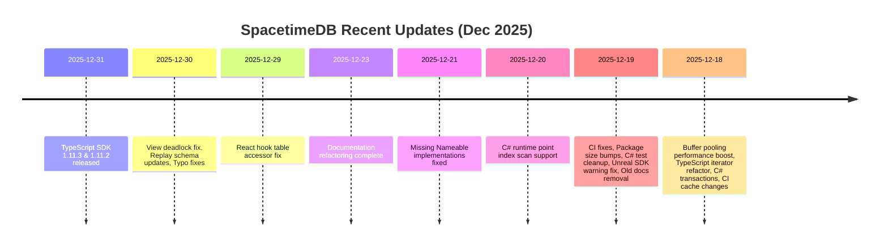

SpacetimeDB has been rolling out significant improvements across its SDK ecosystem, performance infrastructure, and developer experience. Let's break down what matters most from the recent wave of updates.

## Recent Release Wave: TypeScript SDK 1.11.x Series

The TypeScript SDK has seen rapid iterations with two version bumps in quick succession:

- **TypeScript SDK 1.11.3** (Dec 31, 2025) - [Commit](https://github.com/clockworklabs/SpacetimeDB/commit/3c1c3415a287b43459841f44a943ddc44204ccc2)
- **TypeScript SDK 1.11.2** (Dec 31, 2025) - [Commit](https://github.com/clockworklabs/SpacetimeDB/commit/e1b3e3222cfc8c15268e10d14566bcef068e1a7e)

Both are straightforward version bumps with complexity rated at 1/5—low-risk changes primarily for shipping fixes. The 1.11.2 release specifically ships Noa's fix, though the details are in the linked issue tracker rather than the commit message.

## Performance Breakthrough: Buffer Pooling for Subscriptions

The most technically significant recent change landed on Dec 18: [Reuse buffers in ServerMessage<BsatnFormat>](https://github.com/clockworklabs/SpacetimeDB/commit/8e3af49f64a75e5d8744dffe12b0ec4e99aa31a0). This addresses [issue #2824](https://github.com/clockworklabs/SpacetimeDB/issues/2824) and introduces a global buffer pool (`BsatnRowListBuilderPool`) that reclaims buffers from subscription results instead of constantly allocating and deallocating.

The benchmark results are compelling:

| Benchmark | Time Improvement | Performance Change |
|-----------|------------------|-------------------|
| footprint-scan | -7 ms improvement | **-61.4%** |
| full-scan | ~8 ms improvement | **-36.5%** |

The implementation:
- Adds Prometheus metrics reporting similar to `PagePool`
- Refactors `BsatnRowListBuilder` to work with `BytesMut`
- Introduces a `ConsumeEachBuffer` trait for buffer reclamation
- Reclaims buffers after BSATN encoding but before compression

This is exactly the kind of infrastructure work that doesn't make headlines but matters at scale. Complexity is rated 2/5—non-trivial but well-scoped.

## Critical Bug Fixes

### View Deadlock Resolution

A deadlock in the subscription code and HTTP SQL handler was [fixed on Dec 30](https://github.com/clockworklabs/SpacetimeDB/commit/10fd8b2cd0dc2a720a5e7b18f961c558a3536e1b). The issue: calling view methods on the module while holding the transaction lock caused deadlocks.

The solution moves all view-invoking methods from the host into the module itself. The author notes this is a pragmatic fix—future work should consolidate these scattered methods into a common location. This is a solid pattern: unblock now, refactor later.

### Replay Schema Update Handling

[Phoebe Goldman's commit](https://github.com/clockworklabs/SpacetimeDB/commit/41eec04ea6150114247ff4ae7cbd7a68b1144bd5) (Dec 30) fixes a subtle bug where updates to `st_table` during replay weren't properly handled. Previously, deletes from `st_table` were treated as dropped tables, but now inserts are paired with deletes to form proper updates.

The implementation adds a `replay_table_updated` side table to track the most recent `st_table` row for migrating tables, handling a tricky edge case where tables undergo migrations within a single transaction. Complexity is rated 2/5 with a refreshingly honest note: "replay is complicated and scary, but this PR isn't gonna make things *more* broken than they already were."

Phoebe also [fixed two typos](https://github.com/clockworklabs/SpacetimeDB/commit/9f30d42d505729d43ec986a3c596a85dd85a2db0) the same day—one being a flipped boolean condition that broke column-type-altering automigrations. This is exactly why you don't touch things while fixing lints.

## SDK Enhancements

### C# Runtime: Point Index Scans

[Dec 20 commit](https://github.com/clockworklabs/SpacetimeDB/commit/8a0cd87c4f0100b8a2d149c6cc56c0f109b1f94d) adds `datastore_index_scan_point_bsatn` to the C# runtime, resolving [issue #3875](https://github.com/clockworklabs/SpacetimeDB/issues/3875). Previously, unique index `Find()` used range scans then `SingleOrDefault()`, which could return default-initialized structs for value types instead of "missing."

Now:
- Exact-match point lookups return `null` for missing rows
- The C# implementation matches Rust semantics more closely
- Generated `Find()` returns nullable `Row?`
- Codegen detects struct vs class rows and chooses appropriate base types

This is a non-breaking change that fixes a real confusion point: `Find()` now correctly represents "not found" rather than returning default values.

### TypeScript Iterator Refactor

[Dec 18 refactor](https://github.com/clockworklabs/SpacetimeDB/commit/66f55471da60bf37eb8443f91ff343499573be9b) converts TypeScript table iterators to generator functions, yielding proper `Iterator` objects. This means:

- Users can use `filter()`, `find()`, `reduce()` and other iterator combinators
- **Resource leaks are fixed**—incomplete iterators now get garbage collected
- Code is significantly more readable

This is straightforward (complexity 1/5) but matters for developer experience.

### C# Transactions for Procedures

[Dec 18 implementation](https://github.com/clockworklabs/SpacetimeDB/commit/39f01289e5f64a884e4d723d7027493d4fe8a01d0) brings transaction support to C# procedures, implementing the C# equivalent of [Rust PR #3638](https://github.com/clockworklabs/SpacetimeDB/pull/3638). The pattern:

```csharp
ctx.TryWithTx<ResultType, Exception>(tx => {
    // transaction logic
    return Result<ResultType, Exception>.Ok(result);
});
```

The implementation uses inheritance with abstract base classes for core logic and generated wrappers. Error handling follows a `Result<T,E>` pattern adapted for C#'s exception system, with an `AbortGuard` pattern for automatic cleanup via `IDisposable`.

### React Hook Table Accessor Fix

[Dec 29 commit](https://github.com/clockworklabs/SpacetimeDB/commit/025ec1841591c9b8a4888f7cbe793c84854645ba) updates the `useTable` hook in `spacetimedb/react` to use client-language-convention-aware table accessor keys. This fixes a bug where multi-word table names (e.g., `crew_assignments`) in Rust modules caused the hook to fail lookup and not connect `onInsert`/`onDelete`/`onUpdate` callbacks.

## Documentation Overhaul

The docs got a significant restructure in [PR #3917](https://github.com/clockworklabs/SpacetimeDB/commit/48b8a31fe02f0fdb71143fa383c3d4a3fbc1e6ba) (Dec 23), closing [issue #3895](https://github.com/clockworklabs/SpacetimeDB/issues/3895). Key changes:

- Merged content into "Core Concepts"
- Collapsed modules + database into one section
- Moved docs to "How-To" for streamlined core concepts
- Added third-tier expanding folders
- Moved "How To" and "References" into "Developer Resources"

The new structure prioritizes discoverability—less scrolling before reaching conceptual content. Jason Larabie followed up with [removing old documentation](https://github.com/clockworklabs/SpacetimeDB/commit/9daf51ea26d0016a063088be6c8a22a5d1d629c7) (Dec 19) that was accidentally left behind.

## Infrastructure and CI

### V8 Linker Issues

The team has been fighting mysterious `rusty_v8` linker issues in CI. Two responses:

1. [Hacky fix](https://github.com/clockworklabs/SpacetimeDB/commit/264e45eafc13254b98be9bd9d69a468d9e9ef455) (Dec 19): Manually check for and build missing `librusty_v8.a`
2. [Cache behavior change](https://github.com/clockworklabs/SpacetimeDB/commit/c38b1350380b6d91b100764df7f32984c2cc56c3) (Dec 18): Disable `cache-on-failure` to prevent propagating broken caches

Both are pragmatic workarounds. The second commits bumps the cache prefix key so PRs don't share caches across the change—smart for debugging.

### Package Size Limits

[Dec 19 commit](https://github.com/clockworklabs/SpacetimeDB/commit/69edb3ebe24314336c54f2522a2188be480625f8) bumps TypeScript package size limits again. The author notes they didn't test but verified the new limit exceeds the package size. Complexity is rated 0/5—it's a release change.

## Minor but Impactful Fixes

- **Missing Nameable implementations** ([Dec 21](https://github.com/clockworklabs/SpacetimeDB/commit/0a192082a8103f3e9b4478835d1d92dec9669c8f)) - Fixes [issue #3919](https://github.com/clockworklabs/SpacetimeDB/issues/3919) where multi-word field names referring to singular SpacetimeTypes failed to compile
- **Cargo.toml whitespace cleanup** ([Dec 30](https://github.com/clockworklabs/SpacetimeDB/commit/cfbdc519242edbc236d809b9558d1f1774cd7d3b)) - Reverts unnecessary whitespace changes to prevent conflicts in old PRs
- **Unreal SDK warning fix** ([Dec 19](https://github.com/clockworklabs/SpacetimeDB/commit/df035c48fff692a9ba93573811da3e1108998fa3)) - Prevents warnings when accessing valid tables via Blueprint
- **C# TimestampCapabilities test removal** ([Dec 19](https://github.com/clockworklabs/SpacetimeDB/commit/f309ea93f9197e76d9d5fb0eed37edcef73e0167)) - Removes flaky test causing inconsistent CI failures

## Recent Timeline



## What This Means

The recent updates show SpacetimeDB maturing in predictable ways:

1. **Performance focus**: Buffer pooling yields 36-61% improvements on subscription-heavy workloads
2. **SDK parity**: C# is getting closer to feature parity with Rust, particularly around transactions and index handling
3. **Stability fixes**: Critical bugs in replay, deadlocks, and view handling are being addressed
4. **Developer experience**: TypeScript iterators, React hooks, and documentation improvements lower friction

The team is shipping frequently (often multiple commits per day from different authors), which suggests healthy velocity. The complexity ratings are mostly 1-2, indicating they're maintaining velocity without accumulating technical debt—though the replay system warrants careful attention going forward.

Keep an eye on [issue #3942](https://github.com/clockworklabs/SpacetimeDB/issues/3942) (scheduled reducer inputs in commitlog) and [issue #3939](https://github.com/clockworklabs/SpacetimeDB/issues/3939) (async locks in datastore)—both represent deeper architectural concerns that could drive substantial changes in the next quarter.
