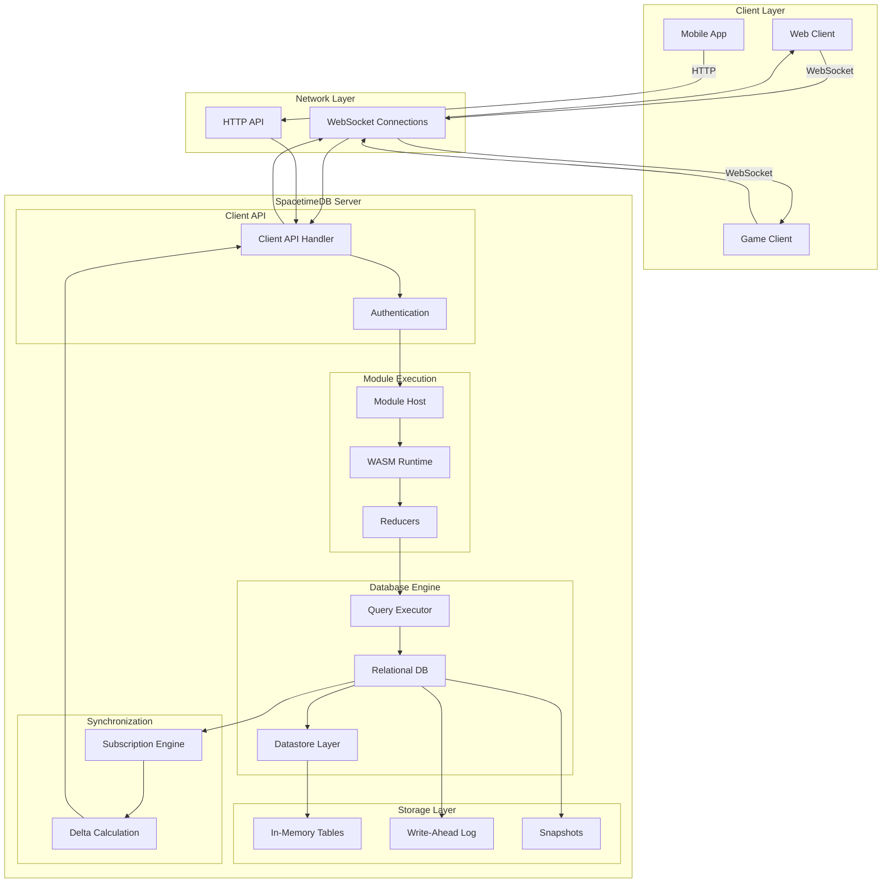
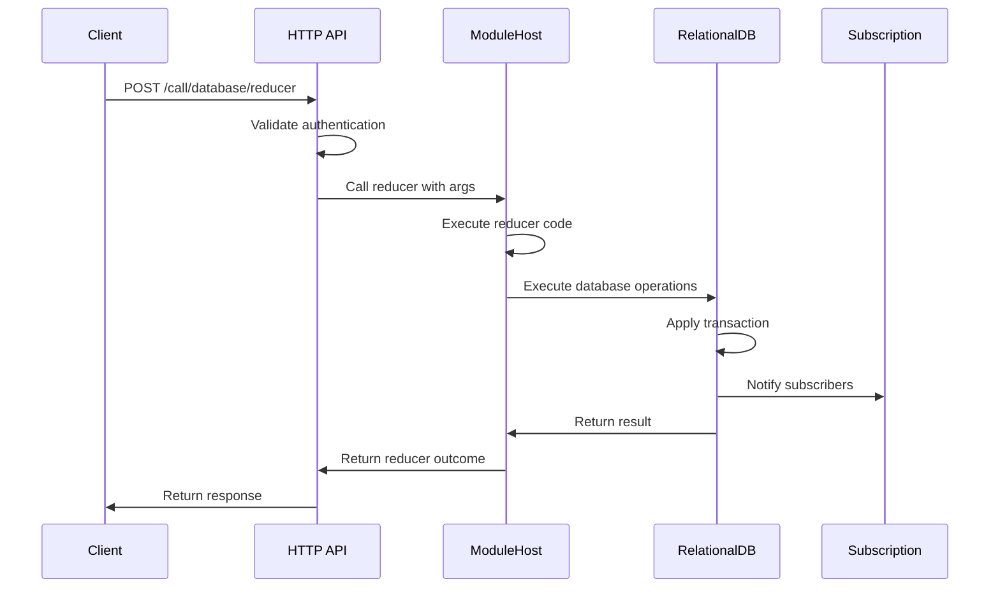
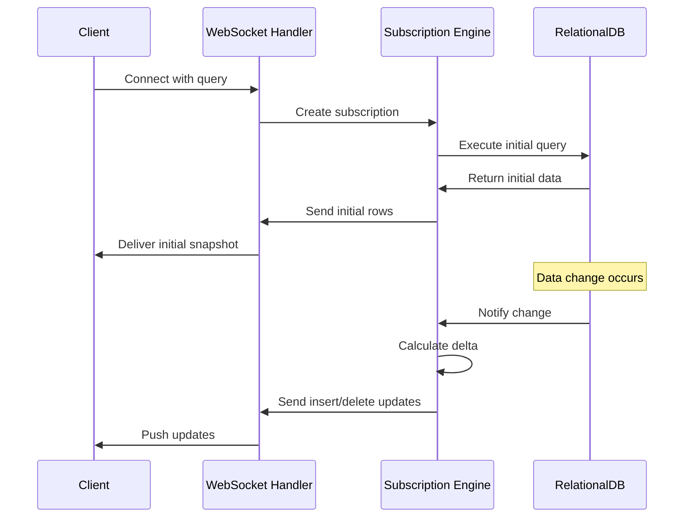
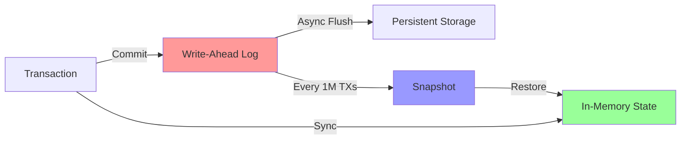

SpacetimeDB represents a fundamental architectural shift in application development by converging database and server into a unified system. Instead of the traditional three-tier architecture (client → application server → database), SpacetimeDB lets you deploy application logic directly into the database, enabling clients to connect and execute operations within the database itself. This section unpacks the architectural patterns that make this possible and explains how the system achieves low-latency real-time performance while maintaining database reliability guarantees.

Sources: [README.md](README.md#L66-L100)

## Architectural Overview

The database-server hybrid architecture eliminates the middleware layer entirely. Your application logic lives inside the database as compiled modules, which clients invoke directly. SpacetimeDB combines a relational database engine with a WASM-based runtime for executing user code, all optimized for real-time applications. The system maintains ACID transaction guarantees while providing subscription-based real-time data synchronization to connected clients.

Sources: [README.md](README.md#L66-L100)

## System Architecture Diagram

This diagram shows how clients connect directly to the SpacetimeDB server, which contains both the database engine and module execution environment in a single process.

Sources: [crates/standalone/src/main.rs](crates/standalone/src/main.rs#L1-L89), [crates/core/src/db/relational_db.rs](crates/core/src/db/relational_db.rs#L1-L150)

## Core Components

### RelationalDB

The `RelationalDB` is the central database implementation that manages all persistent state, transactions, and client connections. It provides the traditional database functionality including table management, indexing, and query execution, but with optimizations for in-memory operation. The database identity and owner identity are tracked for access control, while the inner `Locking` datastore handles concurrent transaction processing with configurable isolation levels.

Sources: [crates/core/src/db/relational_db.rs](crates/core/src/db/relational_db.rs#L120-L150)

### ModuleHost

The `ModuleHost` loads and executes user-provided modules containing reducers—functions that encapsulate application logic. Modules can be written in Rust and compiled to WASM, or directly in Rust with the host environment. The host handles reducer invocation, energy tracking for cost control, and lifecycle management for connected clients. When a client connects, the host calls identity-connected lifecycle reducers; when they disconnect, identity-disconnected reducers execute.

Sources: [crates/core/src/host/module_host.rs](crates/core/src/host/module_host.rs#L1-L100), [crates/core/src/host/mod.rs](crates/core/src/host/mod.rs#L1-L100)

### Datastore Layer

The datastore (`Locking` implementation) provides ACID transaction guarantees with support for multiple isolation levels. It manages concurrent access to tables through a transactional interface, tracking inserts, deletes, and updates within each transaction. The `ExecutionContext` captures details about the executing reducer or SQL operation, providing caller identity, connection ID, and timestamp to database operations for authorization and auditing.

Sources: [crates/datastore/src/lib.rs](crates/datastore/src/lib.rs#L1-L11), [crates/datastore/src/execution_context.rs](crates/datastore/src/execution_context.rs#L1-L100), [crates/datastore/src/traits.rs](crates/datastore/src/traits.rs#L1-L80)

### Query Execution

The execution engine (`spacetimedb_execution`) compiles SQL queries and subscriptions into pipelined execution plans. It supports table scans, index scans (point and range), and joins with efficient streaming execution. The `Datastore` trait provides the interface for querying tables, while `DeltaStore` tracks transaction deltas for incremental view maintenance.

Sources: [crates/execution/src/lib.rs](crates/execution/src/lib.rs#L1-L80)

### Subscription Engine

The subscription system maintains real-time views for connected clients. When data changes, the subscription engine calculates the delta (inserts and deletes) for each active subscription using pipelined execution plans that operate on the delta store. This enables efficient push-based synchronization without full query re-execution.

Sources: [crates/subscription/src/lib.rs](crates/subscription/src/lib.rs#L1-L80)

### Table Implementation

Tables store rows in memory using a page-based allocation system. The `Table` struct manages row layout, indexes, and a blob store for large values. Rows are stored in pages with fixed-size allocations for common types and variable-length storage for others. Indexes maintain separate structures for fast lookups, with support for B-tree indexes on single columns or composite keys.

Sources: [crates/table/src/table.rs](crates/table/src/table.rs#L1-L120)

## Client Communication Architecture

Clients interact with SpacetimeDB through two primary channels: HTTP for one-off reducer calls and WebSocket for persistent connections with subscriptions. The client API (`spacetimedb-client-api`) handles authentication, connection management, and message routing to the appropriate database instance.

Sources: [crates/client-api/src/routes/database.rs](crates/client-api/src/routes/database.rs#L1-L100)

### HTTP API Flow

### WebSocket Subscription Flow

Sources: [crates/client-api/src/routes/database.rs](crates/client-api/src/routes/database.rs#L1-L100)

## Request Execution Flow

When a client invokes a reducer, the request flows through several layers that coordinate execution, data access, and notification:

1. **Client Request**: Client sends reducer call via HTTP or WebSocket with identity authentication
2. **Authentication**: Client API validates the JWT token and extracts caller identity
3. **Module Lookup**: System locates the target database and loads its module
4. **Reducer Invocation**: ModuleHost prepares execution context with caller identity and arguments
5. **WASM Execution**: Reducer code executes in sandboxed runtime environment
6. **Database Operations**: Reducer queries and modifies tables through RelationalDB API
7. **Transaction Commit**: Changes are committed atomically with ACID guarantees
8. **Durability**: Transaction is written to write-ahead log for crash recovery
9. **Subscription Update**: Subscriptions are notified of data changes
10. **Response**: Result is returned to the client

This entire process typically completes in sub-millisecond latency because all components execute in the same process without network hops between tiers.

Sources: [crates/core/src/host/module_host.rs](crates/core/src/host/module_host.rs#L1-L100), [crates/core/src/db/relational_db.rs](crates/core/src/db/relational_db.rs#L1-L150)

## In-Memory Storage Architecture

SpacetimeDB maintains all hot application data in memory for maximum performance, while ensuring durability through the write-ahead log (WAL) and periodic snapshots:

| Component | Purpose | Performance Impact |
|-----------|---------|-------------------|
| Memory Tables | Primary storage for all rows | Sub-millisecond reads/writes |
| Page Pool | Manages memory allocation for rows | Efficient reuse, reduces fragmentation |
| Indexes | B-tree structures for fast lookups | O(log n) query performance |
| Write-Ahead Log | Durable transaction log | Async writes, non-blocking commits |
| Snapshots | Periodic full state dumps | Enables fast recovery from WAL |

<CgxTip>
The page-based memory allocator (`PagePool`) manages row storage in fixed-size pages, reducing memory fragmentation and enabling efficient serialization. Rows are stored contiguously within pages with variable-length data handled separately. This design enables fast in-memory operations while supporting efficient serialization to the WAL.</CgxTip>

Sources: [crates/table/src/table.rs](crates/table/src/table.rs#L1-L120), [README.md](README.md#L66-L100)

## Durability and Recovery

The durability layer ensures data survives crashes while maintaining low-latency operation:

The write-ahead log (`commitlog`) records all transactions with their inserts and deletes. It's segmented for management and includes an offset index for fast recovery. Periodically (every 1 million transactions by default), a full snapshot captures the complete database state. Recovery reads the latest snapshot and replays any WAL entries that occurred after it.

Sources: [crates/commitlog/src/lib.rs](crates/commitlog/src/lib.rs#L1-L100), [crates/core/src/db/relational_db.rs](crates/core/src/db/relational_db.rs#L1-L150)

## Transaction Isolation Levels

SpacetimeDB supports multiple transaction isolation levels following SQL standard semantics:

| Isolation Level | Dirty Reads | Non-repeatable Reads | Phantom Reads | Write Skew |
|-----------------|-------------|----------------------|---------------|------------|
| Read Uncommitted | Possible | Possible | Possible | Possible |
| Read Committed | Prevented | Possible | Possible | Possible |
| Repeatable Read | Prevented | Prevented | Possible | Possible |
| Snapshot | Prevented | Prevented | Prevented | Possible |
| Serializable | Prevented | Prevented | Prevented | Prevented |

The datastore treats unsupported isolation levels as the strongest supported level. Most applications use `Serializable` for full consistency guarantees, though `Snapshot` offers better performance for workloads tolerant of write skew anomalies.

Sources: [crates/datastore/src/traits.rs](crates/datastore/src/traits.rs#L1-L80)

## Architecture Comparison

| Aspect | Traditional 3-Tier | SpacetimeDB Hybrid |
|--------|-------------------|-------------------|
| **Components** | App Server + Database | Unified Database-Server |
| **Network Hops** | 2 (client→server→DB) | 1 (client→database) |
| **Latency** | 2-10ms+ | <1ms |
| **Deployment** | Multiple services, orchestration | Single binary |
| **Data Synchronization** | Custom implementation | Built-in subscriptions |
| **Scalability** | Horizontal scaling required | Vertical scaling + partitioning |
| **Transaction Consistency** | Eventual across services | ACID within database |
| **Real-time Updates** | Manual polling or websockets | Automatic delta push |

<CgxTip>
The unified architecture eliminates the network boundary between application logic and data access, which is the primary source of latency in traditional architectures. This also simplifies deployment and operations significantly—no microservices coordination, no distributed transactions, no eventual consistency handling.</CgxTip>

Sources: [README.md](README.md#L66-L100)

## Module System and Reducers

Modules are the deployment unit for application logic in SpacetimeDB. A module contains:

- **Table definitions**: Schema for persistent data structures
- **Reducer functions**: Entry points for client-invoked operations
- **Lifecycle reducers**: Special functions called on connect/disconnect/init

Reducers are like stored procedures but with modern language features (Rust) and direct access to database APIs. They execute with the caller's identity context, enabling fine-grained authorization logic directly in business logic.

The ModuleHost manages multiple runtime environments (WASM or native), tracks energy consumption for cost control, and handles errors appropriately. Reducers can call each other, but circular calls are prevented to avoid infinite loops.

Sources: [crates/core/src/host/module_host.rs](crates/core/src/host/module_host.rs#L1-L100), [crates/core/src/host/mod.rs](crates/core/src/host/mod.rs#L1-L100)

## Performance Optimization Strategies

### Indexing Strategy

Tables support multiple B-tree indexes on single columns or composite keys. The `TableIndex` provides point lookups and range scans efficiently. Indexes are maintained incrementally during data modifications, ensuring query performance remains consistent regardless of table size.

### Subscription Optimization

The subscription engine uses incremental maintenance to avoid full query re-execution. When a table changes, only the relevant indexes are scanned to determine which subscription queries are affected. The `PipelinedExecutor` compiles subscription queries into efficient fragments that can be evaluated incrementally over the delta store.

### Memory Management

The page-based allocator enables efficient memory reuse and reduces allocation overhead. Variable-length data is stored separately, allowing fixed-size row allocations for optimal cache locality. The `BlobStore` handles large values with reference counting and deduplication.

Sources: [crates/table/src/table.rs](crates/table/src/table.rs#L1-L120), [crates/execution/src/lib.rs](crates/execution/src/lib.rs#L1-L80), [crates/subscription/src/lib.rs](crates/subscription/src/lib.rs#L1-L80)

## When to Use SpacetimeDB Architecture

The database-server hybrid architecture excels in these scenarios:

- **Real-time multiplayer games**: Require sub-millisecond latency and consistent state
- **Collaborative applications**: Need real-time synchronization between multiple users
- **Financial applications**: Demand strong consistency and transactional guarantees
- **Chat and messaging**: Benefit from automatic subscription-based updates
- **IoT data processing**: Require efficient handling of high-volume event streams

The architecture is less ideal for:

- **Batch analytics workloads**: Better served by OLAP-optimized databases
- **Heavy computational tasks**: Compute-intensive workloads may need separate services
- **Multi-region deployment**: Currently optimized for single-region low-latency operation

Sources: [README.md](README.md#L66-L100)

## Next Steps

Now that you understand the database-server hybrid architecture, explore these related topics:

- **[Tables and Data Modeling](10-tables-and-data-modeling)**: Learn how to design schemas and define tables for your application
- **[Reducers: Server-Side Logic](11-reducers-server-side-logic)**: Deep dive into writing reducers and implementing business logic
- **[Understanding Subscriptions](20-understanding-subscriptions)**: Master real-time data synchronization patterns
- **[In-Memory Architecture and WAL](29-in-memory-architecture-and-wal)**: Understand performance characteristics and durability guarantees
