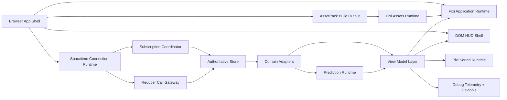
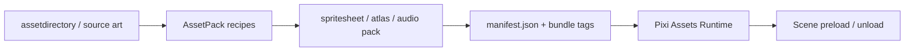

# Client Runtime Architecture

## 1. 목표

클라이언트 런타임은 아래 네 가지를 동시에 만족해야 한다.

- PixiJS v8 기반 2D 월드 렌더링과 상호작용
- SpacetimeDB 구독/리듀서 호출 기반 authoritative MMO 동작
- 이동/전투/건설 preview에서 즉시 반응하는 사용자 경험
- `Layout`, `UI`, `Sound`, `Filters`, `AssetPack`을 적극 활용하는 Pixi 친화적 구조

## 2. 최상위 런타임 구성



## 2.1 레이어 책임

| 레이어 | 책임 |
| --- | --- |
| `app` | boot, login flow, scene state machine, version gate |
| `engine/net` | SpacetimeDB connection, selective subscription 등록, reducer dispatch |
| `engine/state` | authoritative row cache, projection cache, replay/event log |
| `engine/prediction` | input frame buffer, intent buffer, correction 처리, reconciliation |
| `engine/render` | Pixi application, camera, layer tree, chunk render cache, presenter |
| `engine/render-ui` | `@pixi/layout`, `@pixi/ui` 기반 canvas HUD/widget runtime |
| `engine/assets` | AssetPack manifest, Pixi `Assets` bundle load/unload, atlas versioning |
| `engine/audio` | `@pixi/sound` bus, audio event routing, ambient/BGM/SFX ducking |
| `domains/*` | movement/combat/building/inventory/social 등 서버 도메인 adapter |
| `ui/*` | DOM HUD, panel, chat, modal, form, accessibility bridge |

## 3. 제안 폴더 구조

```text
web-client/
  src/
    bootstrap/
      app-bootstrap.ts
      env-config.ts
      version-gate.ts
    build/
      assetpack/
        assetpack.config.ts
        bundles/
        recipes/
    platform/
      browser/
        browser-shell.ts
        resize-service.ts
        input-router.ts
    engine/
      runtime/
        game-runtime.ts
        frame-clock.ts
        scene-runtime.ts
      net/
        spacetime-client.ts
        subscription-coordinator.ts
        reducer-gateway.ts
        protocol-version.ts
      state/
        authoritative-store.ts
        event-log-store.ts
        query-cache.ts
      prediction/
        input-frame-buffer.ts
        intent-buffer.ts
        correction-processor.ts
        reconciliation-engine.ts
      ecs/
        entity-store.ts
        component-store.ts
        visibility-index.ts
      render/
        pixi-app.ts
        camera.ts
        presenters/
        layers/
        chunk-render-cache.ts
        filter-runtime.ts
      render-ui/
        layout-runtime.ts
        widget-runtime.ts
        minimap-widget.ts
        action-bar-widget.ts
      assets/
        asset-manifest.ts
        asset-bundle-runtime.ts
        spritesheet-registry.ts
      audio/
        sound-runtime.ts
        sound-bus.ts
        audio-event-adapter.ts
    domains/
      movement/
      combat/
      building/
      inventory/
      social/
      npc/
      quest/
      housing/
      liveops/
    ui/
      hud/
      panels/
      overlays/
      debug/
```

## 4. Pixi 생태계 채택 방식

`docs/PixiJS/llms-full.txt`와 공식 패키지 문서를 기준으로, Pixi 생태계는 아래처럼 역할을 분명히 나눈다.

| 도구 | 채택 방식 | Stitch 연결 포인트 |
| --- | --- | --- |
| `pixi.js` | 월드 렌더, 이벤트, `Assets`, `Ticker`, `Container`, `Graphics`, `BitmapText`의 기본 축 | terrain/entity/combat/fx presenter 전반 |
| `@pixi/layout` | 캔버스 안에서 flexbox 스타일 HUD와 safe-area 대응을 구현하는 opt-in 레이아웃 계층 | 전투 HUD, 미니맵 프레임, 모바일 액션바, floating system strip |
| `@pixi/ui` | low-latency 인캔버스 위젯 컴포넌트 | 스킬 버튼, progress bar, scrollbox 기반 퀘스트 트래커, 가상 조이스틱 |
| `@pixi/sound` | SFX/BGM bus, WebAudio 필터, Assets 연동 오디오 런타임 | `audio_event`, combat hit, UI confirm, ambient biome audio |
| `pixi-filters` | 상태 강조와 피드백 중심의 제한적 후처리 | correction flash, target glow, build invalid tint, stealth/fog 연출 |
| `@assetpack/core` | 에셋 압축/atlas/manifest 생성과 bundle/tag 파이프라인 | region/dimension 단위 preload, UI atlas, audio pack, fallback placeholder |

핵심 원칙은 아래와 같다.

- `Layout`과 `UI`는 DOM을 대체하는 것이 아니라, 월드와 함께 60 FPS로 반응해야 하는 캔버스 HUD 영역만 담당한다.
- `Filters`는 게임 규칙 표현이 아니라 presentation layer에만 적용한다.
- `Sound`는 `audio_event`와 도메인 상태를 받아 재생하지만, authoritative 판정은 서버가 유지한다.
- `AssetPack`은 단순 파일 복사가 아니라 bundle/tag/version 계약의 소스 오브 truth가 된다.

## 4.1 Pixi v8 기본 패턴

- `Application`은 `new Application()` 후 `await app.init(...)`로 초기화한다.
- `resizeTo`를 사용해 브라우저 레이아웃과 캔버스 크기를 동기화한다.
- 프레임 업데이트는 `app.ticker` 기반으로 처리하되, 네트워크 반영/예측/렌더/오디오를 priority 별로 나눈다.
- 대규모 씬은 `cullable`, 청크 기반 culling, object pooling을 병행한다.
- 반복적으로 사용하는 footprint, target ring, selection marker는 `GraphicsContext` 또는 atlas sprite로 공유한다.
- pointer 상호작용은 `eventMode`, `hitArea`, `cursor`를 명시적으로 설정한다.

## 5. stage/layer 설계

```text
app.stage
  sceneRoot
    worldRoot
      terrainBaseLayer
      terrainOverlayLayer
      biomeFxLayer
      claimOverlayLayer
      buildingFootprintLayer
      entityShadowLayer
      entitySpriteLayer
      entityUiAnchorLayer
      projectileLayer
      worldFxLayer
      debugGridLayer
    worldOverlayRoot
      selectionLayer
      pathPreviewLayer
      placementPreviewLayer
      correctionDebugLayer
  pixiHudRoot
    safeAreaLayoutRoot
      topHudStrip
      leftUtilityColumn
      rightContextColumn
      bottomActionBar
  pixiWidgetRoot
    mobileJoystick
    quickLootBar
    progressWidgets
  debugOverlayRoot
```

규칙은 아래와 같다.

- 월드 좌표를 따르는 요소는 모두 `worldRoot` 하위에 둔다.
- 이름표, 체력바, 퀘스트 마커는 월드 좌표를 추적하지만 렌더는 `entityUiAnchorLayer` 또는 `pixiHudRoot`에 투영한다.
- `@pixi/layout`은 `safeAreaLayoutRoot`와 HUD strip 구성에만 opt-in 적용한다.
- `@pixi/ui` 위젯은 `pixiWidgetRoot`에 모으고, DOM panel과 상태 소스를 공유한다.
- placement preview, correction overlay, AOI 디버그는 별도 overlay layer로 둔다.

## 6. UI 경계

UI는 세 층으로 나눈다.

1. World Presenter
- 이름표
- 체력바
- 타겟 링
- build footprint
- floating text

2. Pixi Canvas HUD
- 액션바
- 미니맵 프레임
- cast/channel bar
- 모바일 조작계
- 화면 가장자리 objective indicator

3. DOM HUD/UI
- 채팅
- 인벤토리 전체 패널
- 길드/파티 패널
- NPC 대화와 상점
- 설정, 접근성, 로그

판단 기준은 아래와 같다.

- 월드 좌표를 따라야 하거나 카메라와 함께 1프레임 이내로 반응해야 하면 Pixi 쪽에 둔다.
- 긴 텍스트 입력, 복잡한 스크롤, 접근성, 복붙이 중요하면 DOM에 둔다.
- 둘 다 필요한 경우 공통 `ViewModel`을 두고 Pixi와 DOM이 같은 snapshot을 읽는다.

## 7. 프레임 루프 분리

클라이언트는 하나의 Pixi ticker 위에서 네 단계로 동작한다.

1. 입력 수집
- 키보드, 마우스, 포인터, HUD 입력을 `InputFrame`에 적재한다.
- `@pixi/ui` 위젯 입력도 동일한 `InputFrame` 경로로 정규화한다.

2. 시뮬레이션/네트워크 반영
- 서버 row delta, event, correction을 `AuthoritativeStore`에 반영한다.
- prediction engine이 pending intent를 재적용한다.
- domain adapter가 authoritative state를 view model로 변환한다.

3. 렌더링
- 카메라, 청크 가시성, sprite animation, filter state를 갱신한다.
- `@pixi/layout` 레이아웃 invalidation이 있으면 이 단계에서만 재계산한다.

4. 오디오/관측성 flush
- `audio_event`와 local UX sound cue를 `@pixi/sound` bus에 반영한다.
- correction, pending intent, chunk decode telemetry를 debug hub에 기록한다.

## 7.1 Priority 예시

| priority | 작업 |
| --- | --- |
| HIGH | subscription queue drain, correction 적용 |
| NORMAL | prediction/reconciliation, domain adapter |
| LOW | camera easing, filter fade, HUD animation |
| LOWEST | telemetry flush, non-critical sound cleanup |

## 8. AssetPack + Pixi Assets 파이프라인

빌드 타임에는 AssetPack을 사용하고, 런타임에는 Pixi `Assets`를 사용한다.



기본 bundle 설계는 아래를 기준으로 한다.

- `boot`
- `ui-core`
- `ui-input-prompts`
- `audio-core`
- `world-common`
- `world-region-{regionId}`
- `dimension-{regionId}-{dimensionId}`
- `biome-{biomeId}`
- `fx-combat`
- `debug-tools`

AssetPack 쪽에서 관리해야 하는 항목은 아래와 같다.

- atlas 생성 기준: terrain tile, UI icon, effect sprite를 separate atlas로 유지
- quality variant: `1x`, `2x`, `mobile-lite`
- tag 기준: `region`, `dimension`, `biome`, `ui`, `audio`, `debug`
- placeholder bundle: 누락 에셋이 있어도 씬이 깨지지 않도록 fallback alias 제공

## 9. AuthoritativeStore와 ViewModel 분리

`AuthoritativeStore`는 서버 row를 거의 그대로 유지한다.

- 예: `transform_state`, `combat_state`, `player_inventory_item_view`, `building_preview_feedback_view`

`ViewModel`은 화면과 UX에 필요한 계산 결과를 가진다.

- 예: 현재 선택 엔티티, 보간된 화면 위치, correction pending 상태, drag ghost 상태, widget cooldown percent

이 둘을 분리해야 하는 이유는 아래와 같다.

- 서버 row는 디버깅과 재동기화의 기준이 된다.
- 화면 상태는 보간, 임시 선택, hover, preview, drag 중간값이 필요하다.
- Pixi display object가 authoritative store에 직접 침투하면 rollback과 replay가 어려워진다.

## 9.1 상태 3계층

1. authoritative state
- `player_session_view`
- `player_wallet_view`
- `player_movement_feedback_view`
- `player_inventory_*_view`
- `transform_state`
- `terrain_chunk_stream`
- `terrain_chunk_payload`
- `resource_node`
- `npc_state_stream`
- `building_state`
- `project_site_state`
- `claim_state`
- `combat_state`
- `attack_outcome`

2. predicted state
- self 이동 목표와 pending request
- 공격 windup
- 건설 ghost footprint
- inventory drag/drop ghost
- local widget press/pulse 상태

3. rendered state
- Pixi display object reference
- lerp/fade/highlight/filter 상태
- last visible tick
- audio cooldown token
- debug overlay data

## 10. Entity System 방향

완전한 ECS보다 "ID 기반 authoritative registry + domain adapter + presenter" 구조가 현재 `stitch-server` row 모델과 더 잘 맞는다.

- `Identity` 기반 row와 `u64` 기반 row가 공존하므로 string key normalization이 필요하다.
- world entity는 생성/삭제보다 pool 기반 hide/show를 우선한다.
- subscription callback은 entity presenter를 직접 수정하지 않고 queue에만 적재한다.
- 반복 표시물은 `GraphicsContext`, sprite atlas, pooled `BitmapText`를 우선 활용한다.

## 11. 씬 전환 정책

씬은 서버 `region_id`, `dimension_id`를 기준으로 바꾼다.

- `region_id` 변경: 월드/채팅/AOI/terrain cache와 `world-region-*` bundle을 전환
- `dimension_id` 변경: 같은 region 안의 인테리어, 하우징, 던전 전환과 `dimension-*` bundle preload
- `housing_enter` 같은 reducer는 `transform_state`와 `session_state`를 함께 바꾸므로, 클라이언트도 `session change -> scene rebind -> asset hot-swap` 순서를 가진다

## 12. 성능 예산

| 항목 | 목표 |
| --- | --- |
| 렌더 FPS | 60 FPS |
| authoritative 업데이트 반영 | 15 Hz 이상 |
| correction 적용 지연 | 100 ms 이내 |
| 청크 전환 시 terrain blank | 1 프레임 이하 |
| 동시 visible entity | 300 기준 |
| visible chunk render | 3x3 기본, 5x5 preload |
| 동시 활성 filters | 월드 3개 이하, HUD 2개 이하 |
| 오디오 동시 재생 SFX | 16채널 이내 기본 |

## 13. 필수 런타임 서비스

- `HexMathService`
- `ChunkAoiService`
- `SubscriptionCoordinator`
- `IntentBuffer`
- `ReconciliationEngine`
- `ProjectionViewCache`
- `TerrainPayloadDecoder`
- `ChunkRenderCache`
- `AssetBundleRuntime`
- `PixiLayoutRuntime`
- `SoundRuntime`
- `PermissionGateService`
- `FeatureFlagRuntime`
- `DebugOverlayRuntime`

## 14. 구현 메모

- `@pixi/layout`은 전체 stage가 아니라 HUD subtree에만 적용해 invalidation 범위를 제한한다.
- `@pixi/ui`는 전부 도입하지 말고, action bar, slider, progress, scrollbox 같이 DOM 대비 이점이 큰 영역부터 적용한다.
- `pixi-filters`는 연출 budget을 초과하지 않도록 preset registry로 관리한다.
- `@pixi/sound`는 `audio_event`와 local UX cue를 같은 bus에서 처리하되, mute/ducking 규칙은 bus 단위로 둔다.
- 초기 버전부터 `data-id` 속성을 캔버스와 주요 DOM 요소에 부여해 E2E 테스트를 준비한다.
- `stitch-server`는 v1 reducer/view 계약과 `tables/v2.rs`/`reducers/v2/mod.rs` 기반 확장 계약이 같이 있으므로, transport adapter를 분리해 두는 편이 안전하다.
