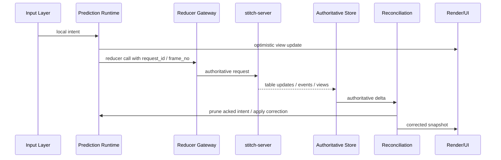
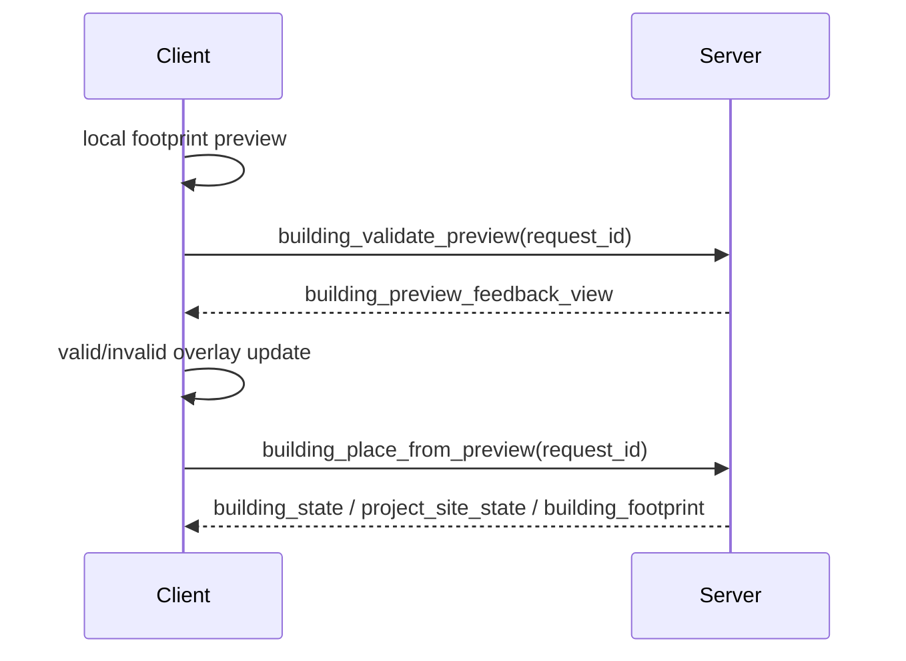

# Sync Pipeline

## 1. 목표

이 문서는 Stitch MMO 클라이언트의 핵심인 동기화 파이프라인을 정의한다.

핵심 규칙은 하나다.

`입력은 클라이언트에서 시작하지만, 상태는 항상 서버로 수렴한다.`

## 2. 공통 데이터 흐름



## 3. 현재 서버 계약 맵

### 3.1 이동

| 서버 경로 | 역할 | 클라이언트 사용법 |
| --- | --- | --- |
| `move_to` | 레거시 이동 reducer | 디버그/호환 경로로 유지 |
| `player_movement_feedback_view` | 요청 수락/거절 피드백 | reason code UI와 correction source |
| `sync_client_frame` | frame 동기화 | prediction 프레임 기준점 |
| `submit_motion_intent` | 이동 의도 제출 | 주 이동 입력 경로 |
| `physics_state` | 권위 위치/속도 | reconciliation 기준 |
| `server_correction` | 보정 메시지 | rollback/smoothing 기준 |
| `ack_server_correction` | 보정 ack | correction lifecycle 종료 |

### 3.2 전투

| 서버 경로 | 역할 | 클라이언트 사용법 |
| --- | --- | --- |
| `attack_start` | 레거시 공격 시작 | 초기 호환 경로 |
| `attack_outcome` | 권위 피해 결과 | HP/피격 확정 |
| `combat_state` | 전투 상태 | HUD, target plate, in-combat flag |
| `submit_combat_intent` | `v2` 전투 의도 | 스킬 입력 제출 |
| `combat_hit` / `combat_hit_event` | 히트 결과 | floating text, hit flash |
| `fx_event` / `audio_event` | 연출 이벤트 | 이펙트/사운드 실행 |

### 3.3 건설

| 서버 경로 | 역할 | 클라이언트 사용법 |
| --- | --- | --- |
| `building_validate_preview` | placement 검증 | ghost preview 검증 |
| `building_preview_feedback_view` | preview 결과 | valid/invalid overlay |
| `building_place_from_preview` | preview 기반 확정 배치 | confirm action |
| `building_state` / `project_site_state` / `building_footprint` | 월드 건설 상태 | AOI building sync |

### 3.4 인벤토리

| 서버 경로 | 역할 | 클라이언트 사용법 |
| --- | --- | --- |
| `item_stack_move` | 슬롯 이동 | drag/drop submit |
| `player_inventory_container_view` | container projection | 패널 구성 |
| `player_inventory_slot_view` | slot projection | slot grid |
| `player_inventory_item_view` | item projection | tooltip, quantity, icon |

### 3.5 NPC/소셜

| 서버 경로 | 역할 | 클라이언트 사용법 |
| --- | --- | --- |
| `npc_talk` | 대화 시작 | dialogue request |
| `npc_state_stream` | NPC 월드 상태 | actor sync |
| `chat_*`, `party_*`, `guild_*`, `social_feed` | 소셜 상태 | 채팅/HUD/패널 |

## 4. subscription coordinator 계획

`SubscriptionCoordinator`는 서버 helper query를 그대로 쓰되, 클라이언트 내부에서 다음 세 범주로 나눈다.

1. 월드 AOI 구독
- `terrain_chunk_stream_query`
- `terrain_chunk_payload_stream_query`
- `resource_node_stream_query`
- `npc_state_stream_query`
- `building_state_stream_query`
- `claim_state_stream_query`
- `aoi_stream_query`

2. 개인 projection 구독
- `inventory_container_stream_query`
- `inventory_slot_stream_query`
- `inventory_item_stream_query`
- `correction_stream_query`

3. 세션/도메인 구독
- `combat_state_stream_query`
- `attack_outcome_stream_query`
- `chat_message_stream_query`
- `party_member_stream_query`
- `guild_member_stream_query`

## 4.1 subscription apply barrier

SpacetimeDB 클라이언트는 구독을 붙였다고 바로 로컬 캐시가 유효해졌다고 가정하면 안 된다.

초기 씬 진입과 dimension 전환에서는 아래 단계를 강제한다.

1. query attach
2. subscription applied 확인
3. authoritative store ready 플래그 설정
4. 그 이후에만 world scene unfreeze

즉, loading screen을 닫는 기준은 `query sent`가 아니라 `subscription applied`여야 한다.

## 5. 현재 서버 helper의 한계와 대응

현재 구현상 아래 쿼리는 AOI가 완전히 좁혀져 있지 않다.

- `position_stream_query`
- `combat_state_stream_query`
- `physics_state_query`

대응은 아래와 같다.

1. 단기
- 클라이언트에서 region/dimension 단위 수신 후, local AOI index로 다시 필터링한다.
- visible entity budget을 두고 렌더와 시뮬레이션 대상 수를 제한한다.

2. 중기
- 서버에 chunk/AOI 기반 세부 query helper를 추가한다.
- `physics_state`와 `combat_state`에 chunk 혹은 hex index를 노출하는 서버 후속 작업을 연계한다.

## 6. 공통 로컬 자료구조

```ts
export interface ClientIntent {
  localId: string;
  domain: "movement" | "combat" | "building" | "inventory";
  frameNo?: number;
  requestId?: string;
  createdAtMs: number;
}

export interface AuthoritativeDelta<T> {
  table: string;
  rows: readonly T[];
  receivedAtMs: number;
}

export interface CorrectionEnvelope {
  correctionId: string;
  reason: string;
  serverPosition: [number, number, number];
  velocity: [number, number, number];
  acknowledged: boolean;
}
```

## 7. 도메인별 prediction 정책

| 도메인 | 로컬 예측 허용 | authoritative source | rollback 방식 |
| --- | --- | --- | --- |
| 이동 | 높음 | `physics_state`, `server_correction`, `player_movement_feedback_view` | 위치 재설정 + smoothing |
| 전투 | 중간 | `combat_hit_event`, `attack_outcome`, `combat_state` | HP/상태 재계산, VFX 유지 |
| 건설 preview | 중간 | `building_preview_feedback_view` | ghost 색상/상태 갱신 |
| 건설 확정 | 낮음 | `building_state`, `project_site_state` | 미배치 상태로 복귀 |
| 인벤토리 | 낮음 | `player_inventory_*_view` | drag ghost 제거, authoritative layout 반영 |
| 소셜 메시지 | 중간 | `chat_message`, moderation 결과 | pending badge 제거/실패 표시 |
| NPC 대화 | 매우 낮음 | `npc_interaction_log`, conversation state | pending -> confirmed/failed |

## 8. 이동 reconciliation 상세

### 8.1 권장 알고리즘

1. 입력을 `InputFrame`으로 캡처
2. `frame_no`와 `intent_id`를 생성
3. 로컬 physics preview를 즉시 진행
4. `submit_motion_intent` 전송
5. `physics_state` 갱신 수신 시 authoritative baseline 갱신
6. `server_correction` 수신 시 해당 frame 이후 intent를 재적용
7. correction 적용 후 `ack_server_correction` 호출

### 8.2 correction 적용 규칙

- 작은 오차: 80~120ms 내 smoothing
- 큰 오차: 즉시 snap 후 one-shot flash
- 거절 reason이 `terrain_blocked`, `slope_blocked`, `invalid_position`이면 UX에도 같은 code를 노출

### 8.3 reason code UI

| reason | UX |
| --- | --- |
| `ok` | 표시 없음 |
| `terrain_blocked` | 이동 경로 막힘 배지 |
| `slope_blocked` | 경사 과다 배지 |
| `invalid_position` | 입력 이상 경고 |
| `region_mismatch` | 세션 재동기화 필요 |

## 9. 전투 presentation pipeline

전투는 prediction과 state 확정을 분리한다.

1. 입력 시점
- 타게팅 하이라이트
- 스킬 슬롯 cooldown ghost 시작
- 선행 애니메이션 재생

2. 서버 확정 시점
- `combat_hit_event`로 floating damage text
- `fx_event`, `audio_event`로 연출 실행
- `attack_outcome`로 체력/피해 확정

3. 불일치 시점
- 예측 히트였지만 outcome 없음: VFX는 유지하고 HP는 롤백
- crit 예측과 서버 crit 불일치: outcome 우선

## 10. 건설 preview pipeline



규칙은 아래와 같다.

- 로컬 preview는 즉시 보여주되 authoritative placement가 아니다.
- 서버 validation 결과가 늦게 와도 항상 그 결과로 색상/툴팁/경고 문구를 갱신한다.
- confirm은 `building_place_from_preview`로만 수행하고, preview와 다른 좌표로 재사용하지 않는다.

## 11. 인벤토리 동기화 정책

인벤토리는 strong consistency 도메인으로 취급한다.

- 슬롯 드래그는 로컬 ghost까지만 허용
- 실제 배치는 `player_inventory_*_view` 수신 후 확정
- lock 상태는 authoritative value만 사용
- `item_stack_move` 실패 시 사용자는 즉시 원래 레이아웃을 본다

## 12. NPC/대화 정책

- `npc_talk` 호출 후 곧바로 응답 본문을 가정하지 않는다
- 대화창은 `pending`, `accepted`, `timed_out`, `policy_blocked` 상태를 가진다
- 월드 NPC actor와 대화 세션 상태는 분리된 store slice로 유지한다

## 13. 네트워크 오류/복구

재접속 정책은 아래와 같다.

1. 소켓 끊김
- 입력 잠금
- HUD에 reconnect 상태 표시
- 기존 authoritative store는 읽기 전용 유지

2. 재연결 성공
- 세션 뷰 재확인
- AOI 구독 전부 재구성
- 개인 projection 재구독
- 미확정 intent buffer 폐기

3. 재연결 실패
- 로그인/캐릭터 선택 화면 또는 메인 메뉴로 후퇴

## 14. 동기화 계약 테스트 우선순위

- 이동 correction 재적용
- inventory authoritative overwrite
- building preview mismatch
- combat event-ordering
- housing dimension change 후 scene rebind
