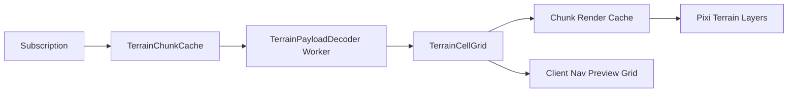

# World, Map, and Entity Plan

## 1. 좌표 계약

클라이언트 좌표 서비스는 서버와 동일한 개념을 사용한다.

- 기본 월드 차원: `dimension_id = 1`
- 헥스 좌표 기반 월드
- 12방향 방향 체계 지원
- 청크 크기: 32x32
- 기본 active AOI: 3x3 chunk
- preload AOI: 5x5 chunk

클라이언트의 모든 시스템은 하나의 `HexMathService`를 사용해야 한다.

## 2. 핵심 좌표 모듈

```ts
export interface HexCoord {
  q: number;
  r: number;
  dimensionId: number;
}

export interface ChunkCoord {
  x: number;
  y: number;
  dimensionId: number;
}
```

필수 함수는 아래와 같다.

- `worldToHex(x, z, dimensionId)`
- `hexToWorld(q, r, dimensionId)`
- `hexDistance(a, b)`
- `hexRing(center, radius)`
- `chunkFromHex(hex)`
- `aoiFromChunk(chunk, radius)`

## 3. terrain 데이터 파이프라인

현재 서버는 terrain을 둘로 나눈다.

1. `terrain_chunk_stream`
- 바이옴, seed, 높이 최소/최대, water ratio 등 메타데이터

2. `terrain_chunk_payload`
- 실제 cell payload bytes
- `cell_payload_version`에 따라 decoder가 달라짐

클라이언트 파이프라인은 아래로 구성한다.



## 4. terrain 캐시 정책

- 메타데이터와 payload를 분리 저장한다.
- 현재 active 3x3, preload 5x5 범위는 memory hot cache에 둔다.
- 범위 밖 청크는 decoded grid를 버리고 compressed payload만 유지할 수 있게 한다.
- 동일 `chunk_key + cell_payload_version`이면 재디코딩을 피한다.

## 5. 월드 렌더 레이어

| 레이어 | 데이터 소스 | 역할 |
| --- | --- | --- |
| terrain base | `terrain_chunk_payload` | 지면 타일 |
| terrain overlay | biome/water/height meta | 경계, 수면, 강조 |
| resource layer | `resource_node` | 채집 노드 |
| claim layer | `claim_state` | 소유 경계/권한 오버레이 |
| building layer | `building_state`, `building_footprint` | 구조물 |
| npc/player layer | `transform_state`, `npc_state_stream`, `physics_state` | actor 렌더 |
| effect layer | `fx_event`, `audio_event` | 타격/환경 연출 |
| debug layer | AOI, chunk, collision, correction | 개발 도구 |

## 6. entity 시스템 설계

서버 테이블 기반으로 entity cache를 구성한다.

| component slice | 서버 테이블 |
| --- | --- |
| identity | `player_state`, `entity_core`, `npc_state_stream` |
| transform | `transform_state`, `physics_state` |
| combat | `combat_state`, `attack_outcome`, `status_effect` |
| building | `building_state`, `project_site_state`, `building_footprint` |
| resource | `resource_node` |
| social marker | party/guild membership projection |

클라이언트 엔티티는 세 단계 상태를 가진다.

- `warming`: 구독은 왔지만 render object는 아직 생성 전
- `visible`: render object 활성
- `cooling`: AOI 밖으로 나갔지만 fade-out 또는 quick return 가능

## 7. entity 캐시 전략

```ts
export interface EntityRecord {
  id: string;
  kind: "player" | "npc" | "building" | "resource" | "project_site";
  authoritative: Record<string, unknown>;
  presentation: {
    interpolatedPosition?: [number, number, number];
    animationState?: string;
    selected?: boolean;
    correctionPending?: boolean;
  };
}
```

규칙은 아래와 같다.

- 서버 row는 `authoritative`에 저장한다.
- 화면 연출용 값은 `presentation`에 저장한다.
- despawn 직전 fade-out도 `presentation`에만 둔다.

## 8. pathfinding 계획

클라이언트 pathfinding은 편의 기능이며 authoritative 이동 엔진이 아니다.

용도는 아래와 같다.

- 클릭 이동 preview
- NPC 이동 방향 표시
- 건설/채집 위치 접근성 미리보기
- 목표 타일까지의 거리/비용 표시

데이터 소스는 아래를 사용한다.

- terrain payload에서 walkability/slope 추출
- `building_footprint`로 정적 장애물 반영
- `collision_proxy`가 안정화되면 동적 장애물 반영

원칙은 아래와 같다.

- 로컬 path는 추천 경로일 뿐이다.
- 실제 이동은 서버 validation과 correction으로 수렴한다.
- 서버와 다른 path가 나오더라도 클라이언트는 correction을 받아들여야 한다.

## 9. 카메라 계획

카메라는 월드 기준과 HUD 기준을 분리한다.

- 월드 카메라: pan, zoom, bounds clamp
- UI 카메라: 독립적인 screen-space

필수 기능은 아래와 같다.

- `worldToScreen`
- `screenToWorld`
- selection rectangle
- hex hover/picking
- minimap projection

## 10. chunk streaming 정책

### 10.1 active/preload 규칙

- 현재 플레이어 chunk를 중심으로 3x3은 active
- 그 바깥 한 겹인 5x5는 preload
- preload는 terrain만 유지하고 entity는 light sync 또는 무시 가능

### 10.2 청크 전환 UX

- 새 청크가 늦게 도착하면 이전 청크를 한 프레임 유지
- terrain blank가 보이지 않도록 skeleton chunk 또는 average biome fill을 사용
- 청크 도착 직후 entity spawn이 몰릴 때는 frame budget에 맞춰 분산 생성

## 11. building/claim 시각화 정책

- `claim_state`는 미니맵과 월드 경계선 모두에 반영한다.
- `building_footprint`는 debug mode뿐 아니라 placement preview mismatch 분석에도 사용한다.
- `project_site_state`와 `building_state`는 다른 시각 자산과 interaction affordance를 가진다.

## 12. housing/dimension 전환

`housing_enter`는 session과 transform을 동시에 바꾼다.

따라서 클라이언트는 아래 순서를 강제한다.

1. 기존 dimension의 active chunk 구독 정지
2. scene anchor와 camera reset
3. 새 `dimension_id` 기준 terrain/NPC/building 구독 시작
4. HUD와 minimap context 갱신

## 13. 메모리/렌더링 최적화

- chunk container 단위 pooling
- terrain atlas 및 icon atlas 번들화
- offscreen chunk는 render object detach
- 자주 갱신되는 텍스트는 BitmapText 또는 텍스트 풀 사용
- selection/debug layer만 필요 시 활성화

## 14. 구현 완료 기준

- chunk 이동 시 world blank가 눈에 띄지 않는다
- AOI 전환 후 entity spawn/despawn가 튀지 않는다
- 동일 authoritative store로 Pixi world, minimap, selection logic이 모두 작동한다
- housing/dimension 전환 시 stale entity가 남지 않는다
