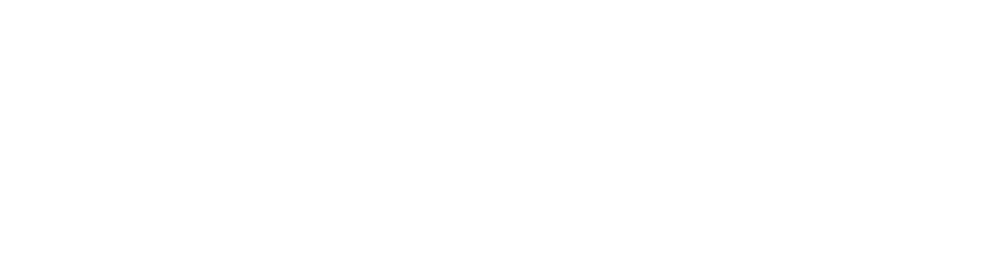
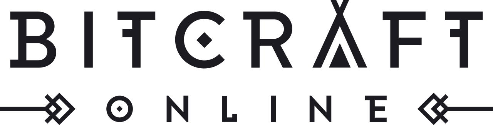
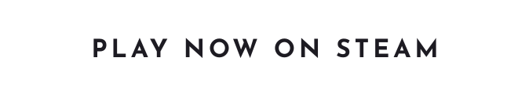
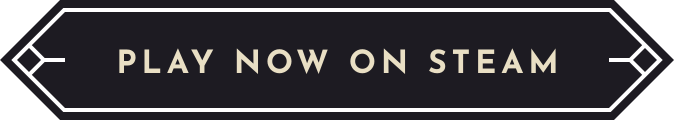

    
    

    
    

    
    
    &nbsp;
    
    
    &nbsp;
    
    
    &nbsp;
    
    
    &nbsp;
    
    
    &nbsp;
    
    
    &nbsp;

This repository contains the **server-side code** for **BitCraft**, a community sandbox MMORPG developed by Clockwork Labs.

BitCraft blends cooperative gameplay, city-building, crafting, exploration, and survival — all in a single seamless world shared by players around the globe.
This repository represents the first phase of our open source initiative. It is being made available for public inspection, experimentation, and contribution.

In this first phase we are only open sourcing the server side code. You can read more about our decision to open source the game here:
- [Open Sourcing BitCraft Online](https://bitcraftonline.com/news/open-sourcing-bitcraft-online)
- [BitCraft Open Sourcing Update](https://bitcraftonline.com/news/bitcraft-open-sourcing-update)

## About BitCraft

BitCraft is a community-driven MMORPG where players collaborate to shape a procedurally generated world. There are no fixed classes or roles — instead, players build, craft, explore, trade,
and govern together to shape their civilizations.

- Game website: [https://bitcraftonline.com](https://bitcraftonline.com)  
- Steam page: [https://store.steampowered.com/app/3454650/BitCraft_Online/](https://store.steampowered.com/app/3454650/BitCraft_Online/)

## About This Repository

This repository contains the code for running a BitCraft server. It includes game logic, state management, and server-side systems, but does not yet include the client or tools required to connect to the official game.

The server for BitCraft is built on [SpacetimeDB](https://spacetimedb.com), a real-time, reactive, backend platform designed for multiplayer game development.
The BitCraft server is structured as a SpacetimeDB module, all the data is stored in spacetimeDB `tables` and all the logic runs inside `reducers`.

The source code for SpacetimeDB itself is also [available on GitHub](https://github.com/clockworklabs/SpacetimeDB). If you're interested in learning bout SpacetimeDB, please give the repo a star!

If you're interested in exploring the server or trying to run a minimal version locally, start with the spacetimeDB documentation:

- [SpacetimeDB Docs](https://spacetimedb.com/docs)

## Contributing

We welcome contributions that improve correctness, stability, or player experience.

Please see [CONTRIBUTING.md](./CONTRIBUTING.md) for details on contribution scope and process.

## Reporting Exploits

We truly appreciate any reporting of in game exploits. To ensure that exploits are addressed quickly and not abused by other players, we ask that you submit them to us privately using 
[**this form**](https://docs.google.com/forms/d/e/1FAIpQLSdlQMdxjTmUScKeVL9T-rs7lZOU4VrYl80ida0Kb0d38Nah8w/viewform?usp=sharing&ouid=112232658922648279400).

Accounts that report meaningful, previously unreported, and verified exploits will receive a unique in-game reward that cannot be obtained through normal gameplay.

## License

The BitCraft source code is licensed under the Apache 2.0 license. See [LICENSE](./LICENSE) for license details. The license applies only to the contents of this repository. It doesn't extend to any other assets or code that is not part of BitCraftPublic. For more information see [NOTICE](./NOTICE).

## What you can and cannot do

To avoid any confusion, here is a clear summary what is allowed and what is not allowed:

You can:
- Read and study the code to better understand how the game works
- Modify and experiment with the code locally
- Run your own servers for experimentation
- Use it as a reference for building your own projects
- Make a game similar to BitCraft with your own IP (art and themes) using our code as a basis

You cannot:
- Use BitCraft’s art, game content, music, or other protected assets
- Use BitCraft’s IP or present forks as official
- Share information about any discovered exploits in the game with anyone other than us
- Operate official, unofficial, private or any otherwise competing BitCraft servers
- Do anything that violates the open source license

The game’s assets and IP remain protected, and the official BitCraft servers will continue to be operated by us.

For more information see [NOTICE](./NOTICE).

This repository is released as part of our commitment to openness and long-term collaboration with the community. It is not connected to the live game infrastructure, and any changes here will not affect the official BitCraft servers.
