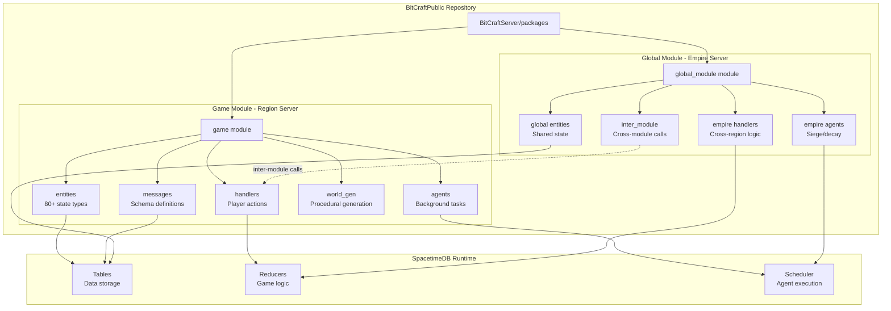

Welcome to the BitCraftPublic repository, the server-side codebase for BitCraft—a community sandbox MMORPG developed by Clockwork Labs. This repository represents the first phase of an open source initiative, making the game's server architecture available for public inspection, experimentation, and contribution.


BitCraft blends cooperative gameplay, city-building, crafting, exploration, and survival in a single seamless world shared by players globally. The server is built on **SpacetimeDB**, a real-time reactive backend platform designed specifically for multiplayer game development, with all data stored in SpacetimeDB tables and logic executed through reducers.

Sources: [README.md](README.md#L1-L60)

## About This Repository

This repository contains the complete server-side implementation for running a BitCraft server, including game logic, state management, procedural world generation, and server-side systems. It does **not** include the client code or tools required to connect to the official game. The codebase is organized into two primary modules that work together to deliver the complete MMORPG experience.

**BitCraft** is a community-driven MMORPG where players collaborate to shape a procedurally generated world without fixed classes or roles. Players build, craft, explore, trade, and govern together to shape their civilizations in a persistent, shared world.

Sources: [README.md](README.md#L30-L42), [BitCraftServer/packages/game/Cargo.toml](BitCraftServer/packages/game/Cargo.toml#L1-L33)

## Repository Architecture

The BitCraft server is architected around SpacetimeDB's reactive paradigm, where data persistence and game logic are tightly integrated. The codebase is divided into two main packages (modules) that each compile to a WebAssembly module for deployment:



**Game Module** handles regional gameplay where players interact within specific game regions. **Global Module** manages empire-level systems, claims, and cross-region coordination that persist across the entire game world. Both modules communicate through inter-module reducers to maintain consistency.

Sources: [BitCraftServer/packages/game/src/lib.rs](BitCraftServer/packages/game/src/lib.rs#L1-L10), [BitCraftServer/packages/global_module/src/lib.rs](BitCraftServer/packages/global_module/src/lib.rs#L1-L10)

## Core System Architecture

### SpacetimeDB Integration

The BitCraft server leverages SpacetimeDB's unique architecture where all data is stored in **tables** and all game logic runs in **reducers**. This reactive model ensures that state changes automatically propagate to connected clients in real-time. The `initialize` reducer sets up the database with essential configuration, admin roles, and global state when the server starts. The `identity_connected` reducer handles client authentication and authorization for each new connection.

Sources: [BitCraftServer/packages/game/src/lib.rs](BitCraftServer/packages/game/src/lib.rs#L24-L80), [README.md](README.md#L44-L52)

### Handler System

Handlers contain the core game logic for player actions and server operations. Each handler is a reducer that responds to specific events or player requests, validating actions and updating game state accordingly. The handlers are organized by domain:

| Handler Category | Purpose | Examples |
|----------------|---------|----------|
| Authentication | Player login, identity verification | `sign_out`, `has_role` validation |
| Player | Movement, actions, character management | Movement handlers, state updates |
| Buildings | Construction, placement, demolition | `create_building_claim`, building components |
| Claim | Territory ownership, empire management | Claim registration, empire integration |
| Inventory | Item management, crafting systems | Inventory operations, item stacking |
| Combat | Attack resolution, PvP mechanics | Combat state updates, damage calculations |
| World | Resource gathering, terrain interaction | Resource collection, world modification |
| Admin | Server administration, debugging | Configuration updates, system commands |

Sources: [BitCraftServer/packages/game/src/game/handlers/mod.rs](BitCraftServer/packages/game/src/game/handlers/mod.rs#L1-L25), [BitCraftServer/packages/game/src/game/handlers/authentication.rs](BitCraftServer/packages/game/src/game/handlers/authentication.rs#L1-L10)

### Entity System

The entity system manages all persistent game state through **80+ entity types** stored as SpacetimeDB tables. Each entity type represents a specific aspect of game state, from player statistics to building structures to resource deposits. The entity modules include:

- **Player State**: `player_state`, `inventory_state`, `stamina_state`, `health_state`
- **Building System**: `building_state`, `building_desc`, `building_function`, `building_spawn`
- **Combat**: `combat_state`, `enemy_state`, `attack_outcome_state`, `buff`
- **Economy**: `trade_session_state`, `auction_listing_state`, `trade_order_state`
- **World**: `terrain_cell`, `resource_deposit`, `resource_clump`, `footprint_tile_state`
- **Empire**: `claim_description`, `claim_tiles`, `permission_state`

These entities are defined in the `messages` module and automatically generate SpacetimeDB table schemas.

Sources: [BitCraftServer/packages/game/src/game/entities/mod.rs](BitCraftServer/packages/game/src/game/entities/mod.rs#L1-L80), [BitCraftServer/packages/game/src/messages/mod.rs](BitCraftServer/packages/game/src/messages/mod.rs#L1-L16)

### Agent System

Agents are scheduled background tasks that run periodically to maintain game state and implement time-based systems. The agent system includes tasks like:

| Agent | Purpose | Frequency |
|-------|---------|-----------|
| `player_regen_agent` | Regenerate player health/stamina | Periodic |
| `enemy_regen_agent` | Respawn enemies and heal | Periodic |
| `building_decay_agent` | Manage building degradation over time | Periodic |
| `environment_debuff_agent` | Apply environmental effects | Periodic |
| `npc_ai_agent` | Update NPC behavior and decisions | Periodic |
| `resources_regen` | Regenerate resource deposits | Periodic |
| `day_night_agent` | Manage day/night cycle | Periodic |
| `trade_sessions_agent` | Clean up expired trades | Periodic |

Agents are initialized through the `agents::init` function when the server starts and run only when `agents_enabled` is true in the configuration.

Sources: [BitCraftServer/packages/game/src/agents/mod.rs](BitCraftServer/packages/game/src/agents/mod.rs#L1-L50)

### Procedural World Generation

The world generation system creates a vast, procedurally generated world using noise-based algorithms. Key components include:

- **Noise-Based Elevation**: `noise_based_elevation_layer`, `noise_map`, `open_simplex_noise` generate terrain height
- **Biome Distribution**: `biome_definition`, `biomes_map_definition` determine ecological zones
- **Resource Placement**: `resource_definition`, `resources_map_definition` distribute resources across terrain
- **World Structure**: `world_generator`, `world_definition` coordinate the generation process
- **Special Modes**: `dev_island`, `flat_world` provide specialized world configurations for testing

The world generation system uses layered noise functions to create realistic terrain features including mountains, rivers, and biomes, then populates the world with resources and points of interest according to deterministic algorithms.

Sources: [BitCraftServer/packages/game/src/game/world_gen/mod.rs](BitCraftServer/packages/game/src/game/world_gen/mod.rs#L1-L22)

## Project Structure

The repository follows a clear, hierarchical structure that organizes code by functional area:

```
BitCraftServer/
├── packages/
│   ├── game/                    # Regional game module
│   │   ├── src/
│   │   │   ├── agents/          # Background task agents
│   │   │   ├── game/
│   │   │   │   ├── handlers/    # Player action handlers
│   │   │   │   ├── entities/    # State entity definitions
│   │   │   │   ├── world_gen/   # Procedural generation
│   │   │   │   ├── coordinates/ # Hex grid system
│   │   │   │   └── generic/     # Shared utilities
│   │   │   ├── messages/        # SpacetimeDB schemas
│   │   │   └── inter_module/    # Cross-module reducers
│   │   └── config/              # Environment configurations
│   └── global_module/           # Empire server module
│       ├── src/
│       │   ├── agents/          # Empire-level agents
│       │   ├── game/
│       │   │   ├── handlers/    # Empire management
│       │   │   └── entities/    # Global state entities
│       │   └── inter_module/    # Inter-module communication
```

The configuration system supports multiple environments (dev, testing, qa, staging, production) with environment-specific settings for cheats, debugging, and game parameters.

Sources: [BitCraftServer/packages/game/config/local.example.json](BitCraftServer/packages/game/config/local.example.json#L1-L8), [get_repo_structure](#L1-L50)

## Technology Stack

| Technology | Version | Purpose |
|------------|---------|---------|
| Rust | 2021 Edition | Systems programming language |
| SpacetimeDB | 1.6.0 | Real-time reactive backend platform |
| spacetimedb-bindings | 1.6.0 | SpacetimeDB runtime bindings |
| strum | 0.24 | Enum stringification |
| glam | 0.30.9 | Vector math library |
| probability | 0.20.3 | Probability calculations |
| regex | 1.10.4 | Pattern matching |

The project uses a `cdylib` crate type to compile to WebAssembly for deployment on the SpacetimeDB runtime. Release builds are optimized for size (`opt-level = 's'`) with link-time optimization enabled.

Sources: [BitCraftServer/packages/game/Cargo.toml](BitCraftServer/packages/game/Cargo.toml#L1-L33), [BitCraftServer/packages/global_module/Cargo.toml](BitCraftServer/packages/global_module/Cargo.toml#L1-L31)

## Contribution Guidelines

We welcome contributions that improve correctness, stability, or player experience. Contributions must be server-side focused and follow these guidelines:

**What We Accept:**
- Bug fixes for crashes, panics, or incorrect behavior
- Memory leaks or thread safety issues
- User/developer experience improvements
- Better error messages or logging
- Build system or dependency fixes
- Security improvements (submitted privately)

**What We're Not Accepting (Yet):**
- New gameplay, mechanics, or systems
- Large-scale formatting or stylistic refactors
- Speculative work without clear motivation

Before submitting a PR, ensure your change builds with `spacetime build`, is small and focused, includes clear motivation, and explains verification steps.

Sources: [CONTRIBUTING.md](CONTRIBUTING.md#L1-L88)

<CgxTip>
All game logic in BitCraft is implemented as SpacetimeDB reducers—functions that are called by clients or scheduled by the runtime and can read/write to tables. This architecture ensures automatic real-time synchronization with clients and simplifies state management by making all state changes explicit and traceable.
</CgxTip>

## What You Can and Cannot Do

To avoid confusion, here's a clear summary of allowed and restricted uses:

**You Can:**
- Read and study the code to understand how the game works
- Modify and experiment with the code locally
- Run your own servers for experimentation
- Use it as a reference for building your own projects
- Create a game similar to BitCraft with your own IP using this code as a basis

**You Cannot:**
- Use BitCraft's art, game content, music, or other protected assets
- Use BitCraft's IP or present forks as official
- Share information about discovered exploits with anyone other than the developers (submit privately via [the exploit form](https://docs.google.com/forms/d/e/1FAIpQLSdlQMdxjTmUScKeVL9T-rs7lZOU4VrYl80ida0Kb0d38Nah8w/viewform))

Sources: [README.md](README.md#L78-L109)

## Next Steps

Now that you understand the architecture, explore specific systems in depth:

- **[Quick Start](2-quick-start)** - Learn how to set up and run a local BitCraft server
- **[Project Architecture](3-project-architecture)** - Deep dive into module interactions and design patterns
- **[SpacetimeDB Fundamentals](4-spacetimedb-fundamentals)** - Understand the underlying database and reducer system

For specific gameplay systems, visit the Deep Dive sections:
- **[Hex Grid Coordinate System](5-hex-grid-coordinate-system)** - Learn about the unique hex-based world representation
- **[World Generator Architecture](6-world-generator-architecture)** - Explore procedural terrain generation
- **[Agent Lifecycle and Scheduling](10-agent-lifecycle-and-scheduling)** - Understand background task execution
- **[Authentication and Authorization](20-authentication-and-authorization)** - Study player authentication flow


