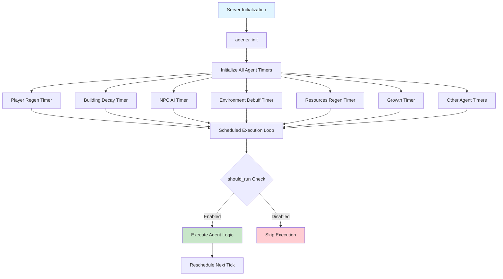

The Agent Lifecycle and Scheduling system forms the backbone of BitCraft's background processing infrastructure, enabling autonomous game mechanics that operate independently of player actions. These scheduled tasks handle everything from resource regeneration to NPC AI, building maintenance, and environmental effects—all orchestrated through SpacetimeDB's built-in scheduling capabilities.

## Agent Architecture Overview

The agent system follows a consistent architectural pattern where each agent operates as an autonomous background task with its own execution cycle. All agents are centralized in the `agents` module and initialized together during server startup, ensuring predictable and manageable background processing.

The architecture leverages SpacetimeDB's table-based scheduling system, where each agent maintains a dedicated timer table that automatically triggers the agent's logic at defined intervals. This design provides several advantages: centralized lifecycle management, runtime configuration updates, and authorization checks before agent execution.



The agent initialization process is coordinated through the central module, which sequentially initializes each agent's timer using parameters from the `parameters_desc_v2` table [agents/mod.rs](BitCraftServer/packages/game/src/agents/mod.rs#L22-L45). This centralized approach ensures that all agents are configured with their appropriate tick intervals before the server begins accepting connections.

## Agent Lifecycle Phases

Every agent in the system follows a well-defined lifecycle consisting of four distinct phases: initialization, scheduling, execution, and maintenance. This pattern ensures consistency across all agents while allowing for customization of specific behaviors.

### Initialization Phase

During server startup, each agent's `init()` function is called to create its timer entry. The initialization process reads configuration parameters from the database to determine the appropriate execution interval. For example, the Player Regen Agent reads `player_regen_tick_millis` from the parameters table [player_regen_agent.rs](BitCraftServer/packages/game/src/agents/player_regen_agent.rs#L39-L50):

```rust
pub fn init(ctx: &ReducerContext) {
    let params = ctx.db.parameters_desc_v2().find(&0).unwrap();
    ctx.db
        .player_regen_loop_timer()
        .try_insert(PlayerRegenLoopTimer {
            scheduled_id: 0,
            scheduled_at: Duration::from_millis(params.player_regen_tick_millis as u64).into(),
        })
        .ok()
        .unwrap();
}
```

This pattern is repeated across all agents, with each reading its specific parameter for timing configuration. The Building Decay Agent uses `building_decay_tick_millis`, the Resources Regen Agent uses `resources_regen_tick_millis`, and so on [building_decay_agent.rs](BitCraftServer/packages/game/src/agents/building_decay_agent.rs#L45-L56).

<CgxTip>The initialization phase occurs only once during server startup. Attempting to initialize an agent that already has a timer entry will fail gracefully due to the `try_insert` operation, which prevents duplicate timers from being created.</CgxTip>

### Scheduling Phase

SpacetimeDB's scheduling mechanism is activated through the `#[spacetimedb::table(name = ..., scheduled(..., at = scheduled_at))]` attribute. This attribute transforms a regular table into a scheduled table that automatically invokes a reducer function when the `scheduled_at` timestamp is reached.

Each agent defines its timer table with this attribute, linking it to a specific loop function:

```rust
#[spacetimedb::table(name = player_regen_loop_timer, scheduled(player_regen_agent_loop, at = scheduled_at))]
pub struct PlayerRegenLoopTimer {
    #[primary_key]
    #[auto_inc]
    pub scheduled_id: u64,
    pub scheduled_at: spacetimedb::ScheduleAt,
}
```

The `scheduled_at` field contains a `ScheduleAt` value representing when the agent should next execute. Agents either update an existing timer entry or insert a new one to schedule their next execution. Some agents, like the Day/Night Agent, calculate dynamic intervals based on game time rather than using fixed periods [day_night_agent.rs](BitCraftServer/packages/game/src/agents/day_night_agent.rs#L43-L52).

### Execution Phase

When the scheduled timestamp is reached, SpacetimeDB automatically invokes the agent's loop function. The first action in every agent is to validate that the caller is authorized to execute the agent [player_regen_agent.rs](BitCraftServer/packages/game/src/agents/player_regen_agent.rs#L54-L59):

```rust
fn player_regen_agent_loop(ctx: &ReducerContext, _timer: PlayerRegenLoopTimer) {
    if ServerIdentity::validate_server_or_admin(&ctx).is_err() {
        log::error!("Unauthorized access to player_regen agent");
        return;
    }

    if !agents::should_run(ctx) {
        return;
    }
    // Agent logic continues...
}
```

This security check prevents unauthorized clients from triggering agent execution. The `should_run()` function checks a global configuration flag that allows agents to be disabled without server restarts [agents/mod.rs](BitCraftServer/packages/game/src/agents/mod.rs#L17-L22).

### Maintenance Phase

Agents can be updated at runtime through the `update_scheduled_timers_from_static_data` reducer, which is an admin-only function that reconfigures all agent timers from static data [agents/mod.rs](BitCraftServer/packages/game/src/agents/mod.rs#L49-L63). Each agent implements an `update_timer()` function that modifies the `scheduled_at` field to adjust execution intervals:

```rust
pub fn update_timer(ctx: &ReducerContext) {
    let params = ctx.db.parameters_desc_v2().find(&0).unwrap();
    let mut count = 0;
    for mut timer in ctx.db.player_regen_loop_timer().iter() {
        count += 1;
        timer.scheduled_at = Duration::from_millis(params.player_regen_tick_millis as u64).into();
        ctx.db.player_regen_loop_timer().scheduled_id().update(timer);
        log::info!("player regen agent timer was updated");
    }
    if count > 1 {
        log::error!("More than one PlayerRegenLoopTimer running!");
    }
}
```

<CgxTip>The maintenance phase includes safeguards against duplicate timers. The count check logs errors if multiple timer entries exist, which helps identify configuration issues during development.</CgxTip>

## Agent Categories and Responsibilities

The agent system encompasses twenty distinct agents, each responsible for specific game mechanics. These can be categorized into player management, world simulation, resource management, and system maintenance categories.

### Player Management Agents

Agents in this category handle player-related autonomous processes, ensuring fair game mechanics and proper player state management.

| Agent | Tick Rate | Primary Responsibility |
|-------|-----------|------------------------|
| Player Regen Agent | Configurable (ms) | Restores health, stamina, and satiation for logged-in players |
| Auto Logout Agent | 30 seconds | Automatically logs out inactive players after 30 minutes |
| Teleportation Energy Regen | Configurable (ms) | Regenerates teleportation energy for players |

The Player Regen Agent demonstrates sophisticated regeneration logic with different rates for active and passive recovery [player_regen_agent.rs](BitCraftServer/packages/game/src/agents/player_regen_agent.rs#L70-L83):

```rust
let mut health_regen = character_stats_state.get(CharacterStatType::ActiveHealthRegenRate);

if ctx
    .timestamp
    .duration_since(health_state.last_health_decrease_timestamp)
    .unwrap_or_default()
    .as_secs()
    >= min_seconds_to_passive_regen_health
    && !ThreatState::in_combat(ctx, health_state.entity_id)
{
    health_regen += character_stats_state.get(CharacterStatType::PassiveHealthRegenRate);
}
```

This system applies different regeneration rates based on combat status and time since last damage, creating strategic gameplay depth where players must choose between fighting and recovering.

### World Simulation Agents

These agents manage autonomous aspects of the game world, creating a living environment with independent behaviors.

| Agent | Tick Rate | Primary Responsibility |
|-------|-----------|------------------------|
| NPC AI Agent | 300 seconds | Controls NPC movement, behavior, and interactions with ruins |
| Day/Night Agent | Dynamic (day/night duration) | Manages game time and day/night cycle transitions |
| Environment Debuff Agent | Configurable (ms) | Applies environmental effects based on player location and biome |
| Building Decay Agent | Configurable (ms) | Handles building health decay and claim maintenance |

The NPC AI Agent showcases complex autonomous behavior, managing a population of traveling NPCs that move between ruins in the world [npc_ai_agent.rs](BitCraftServer/packages/game/src/agents/npc_ai_agent.rs#L45-L68):

```rust
// Identify how many npc instances are required for each type based on population in csv
for npc in ctx.db.npc_desc().iter() {
    required_spawns.insert(
        NpcType::to_enum(npc.npc_type),
        (npc.population * traveler_ruins.len() as f32) as usize,
    );
}
```

The Environment Debuff Agent applies damage or status effects based on biome and player resistance, creating environmental challenges that players must prepare for [environment_debuff_agent.rs](BitCraftServer/packages/game/src/agents/environment_debuff_agent.rs#L70-L85).

### Resource Management Agents

Resource agents ensure the world's resources regenerate properly, preventing resource depletion from making the game unplayable.

| Agent | Tick Rate | Primary Responsibility |
|-------|-----------|------------------------|
| Resources Regen Agent | Configurable (ms) | Spawns depleted resources at their original locations |
| Growth Agent | Configurable (ms) | Evolves resources from one growth stage to the next |

The Resources Regen Agent handles complex resource respawning logic, maintaining resource distribution across the entire world [resources_regen.rs](BitCraftServer/packages/game/src/agents/resources_regen.rs#L67-L95). It uses a resources log to track where resources should spawn and ensures proper distribution based on world coordinates.

The Growth Agent handles staged resource development, allowing resources to evolve from smaller to larger versions over time [growth_agent.rs](BitCraftServer/packages/game/src/agents/growth_agent.rs#L59-L82):

```rust
for grown in ctx.db.growth_state().iter().filter(|ga| ga.end_timestamp < now) {
    if let Some(deposit) = ctx.db.resource_state().entity_id().find(&grown.entity_id) {
        deposit.despawn_self(ctx);
        
        let recipe = ctx.db.resource_growth_recipe_desc().id().find(&grown.growth_recipe_id).unwrap();
        let target_resource_id = recipe.grown_resource_id;
        if target_resource_id != 0 {
            ResourceState::spawn(ctx, None, target_resource_id, coordinates, direction, ...).unwrap();
        }
    }
}
```

### System Maintenance Agents

These agents handle cleanup and maintenance tasks that keep the game running smoothly.

| Agent | Tick Rate | Primary Responsibility |
|-------|-----------|------------------------|
| Chat Cleanup Agent | 1 hour | Removes chat messages older than 2 days |
| Storage Log Cleanup Agent | Configurable | Cleans up old storage transaction logs |
| Crumb Trail Cleanup Agent | Configurable | Removes old player movement crumb trails |
| Duel Agent | 1 second | Manages PvP duel state and timeout enforcement |
| Trade Sessions Agent | Configurable | Manages trade session timeouts and cleanup |
| Player Housing Income Agent | Configurable | Distributes housing income to players |
| Rent Collector Agent | Configurable | Collects rent from properties |
| Region Population Agent | Configurable | Tracks and manages region population metrics |

The Chat Cleanup Agent demonstrates simple but essential maintenance, pruning old messages to prevent database bloat [chat_cleanup_agent.rs](BitCraftServer/packages/game/src/agents/chat_cleanup_agent.rs#L57-L76):

```rust
let two_days_ago = ctx
    .timestamp
    .checked_sub_duration(Duration::from_secs(2 * SECONDS_IN_A_DAY))
    .unwrap();
let delete_threshold = game_state::unix(two_days_ago);

let mut count = 0;
for chat_message in ctx.db.chat_message_state().iter() {
    if chat_message.timestamp <= delete_threshold {
        count += 1;
        ctx.db.chat_message_state().entity_id().delete(chat_message.entity_id);
    }
}
```

## Scheduling Patterns and Timer Management

Agents employ two distinct scheduling patterns: fixed-interval scheduling and dynamic scheduling. The choice of pattern depends on whether the agent needs to execute at precise regular intervals or can adjust based on game state.

### Fixed-Interval Scheduling

Most agents use fixed-interval scheduling, where they reschedule themselves with the same tick rate every execution. This pattern is implemented by updating or inserting a timer with a duration calculated from the current timestamp:

```rust
timer.scheduled_at = Duration::from_millis(params.player_regen_tick_millis as u64).into();
```

The `update_timer()` functions implement this pattern, allowing administrators to adjust tick rates at runtime without restarting the server. This is particularly useful for game balance tuning, as agents can be sped up or slowed down to test different gameplay dynamics.

### Dynamic Scheduling

Some agents calculate their next execution time based on game state rather than using fixed intervals. The Day/Night Agent exemplifies this pattern, scheduling its next execution based on when the next day or night transition occurs [day_night_agent.rs](BitCraftServer/packages/game/src/agents/day_night_agent.rs#L60-L71):

```rust
pub fn day_tick(ctx: &ReducerContext) {
    let time = time_of_day(ctx);
    let night_fall_time = ((day_duration(ctx) - time) * 1000) as u64;
    ctx.db
        .day_night_loop_timer()
        .try_insert(DayNightLoopTimer {
            scheduled_id: 0,
            scheduled_at: now_plus_millis(night_fall_time, ctx.timestamp),
        })
        .ok()
        .unwrap();
}
```

This approach ensures the agent executes exactly when needed—when day turns to night or vice versa—rather than checking continuously at fixed intervals.

## Configuration and Control

The agent system provides multiple layers of configuration and control, enabling administrators to manage agent behavior without code changes.

### Global Agent Control

The `should_run()` function provides a master switch for all agents, reading a configuration flag from the database [agents/mod.rs](BitCraftServer/packages/game/src/agents/mod.rs#L17-L22):

```rust
pub fn should_run(ctx: &ReducerContext) -> bool {
    if let Some(config) = ctx.db.config().version().find(&0) {
        return config.agents_enabled;
    }
    return false;
}
```

This allows agents to be disabled globally, which can be useful during maintenance or testing scenarios. All agents check this flag before executing their logic.

### Parameter-Based Configuration

Each agent reads its timing parameters from the `parameters_desc_v2` table, allowing fine-grained control over execution frequencies. Parameters include:

- `player_regen_tick_millis`: Controls how frequently player regeneration occurs
- `building_decay_tick_millis`: Determines building decay rate
- `resources_regen_tick_millis`: Sets resource respawn speed
- `environment_debuff_tick_millis`: Controls how often environmental damage is applied
- `resource_growth_tick_rate_milliseconds`: Sets resource growth speed

### Runtime Updates

The `update_scheduled_timers_from_static_data` reducer allows administrators to update all agent timers simultaneously using values from static data [agents/mod.rs](BitCraftServer/packages/game/src/agents/mod.rs#L49-L63). This is particularly useful when deploying new configuration changes, as it ensures all agents adopt new timing parameters without requiring a server restart.

## Security and Authorization

The agent system implements strict security measures to prevent unauthorized execution. Every agent loop function validates that the caller is either the server itself or an administrator [player_regen_agent.rs](BitCraftServer/packages/game/src/agents/player_regen_agent.rs#L54-L59):

```rust
if ServerIdentity::validate_server_or_admin(&ctx).is_err() {
    log::error!("Unauthorized access to player_regen agent");
    return;
}
```

This check prevents malicious clients from triggering agent execution, which could be exploited to manipulate game state. The `ServerIdentity::validate_server_or_admin()` function ensures that only authorized system components can invoke agent logic.

## Performance Considerations

The agent system is designed with performance in mind, employing several strategies to minimize computational overhead:

### Selective Processing

Agents iterate only through relevant entities rather than scanning the entire database. The Player Regen Agent, for example, only processes signed-in players [player_regen_agent.rs](BitCraftServer/packages/game/src/agents/player_regen_agent.rs#L67-L69):

```rust
for signed_in_player_state in ctx.db.signed_in_player_state().iter() {
    // Process only logged-in players
}
```

### Early Termination

Agents include checks to skip processing when conditions aren't met. The Player Regen Agent skips players who are incapacitated or haven't yet reached the threshold for passive regeneration [player_regen_agent.rs](BitCraftServer/packages/game/src/agents/player_regen_agent.rs#L75-L78).

### Batching Operations

Some agents batch database updates to minimize transaction overhead. The Resources Regen Agent collects all resource spawns and commits them together rather than updating individually.

## Integration with Other Systems

Agents integrate with various game systems to accomplish their tasks:

### Combat System

The Player Regen Agent interacts with the combat system through threat state tracking, only applying passive regeneration when players are not in combat [player_regen_agent.rs](BitCraftServer/packages/game/src/agents/player_regen_agent.rs#L82-L88). This creates strategic depth where players must exit combat to recover health faster.

### Building System

The Building Decay Agent integrates with the building and claim systems, applying decay only to buildings outside claims and managing claim maintenance costs [building_decay_agent.rs](BitCraftServer/packages/game/src/agents/building_decay_agent.rs#L63-L95).

### Environment System

The Environment Debuff Agent uses the terrain system to determine player location and biome, applying appropriate environmental effects based on the player's surroundings [environment_debuff_agent.rs](BitCraftServer/packages/game/src/agents/environment_debuff_agent.rs#L86-L100).

## Next Steps

To deepen your understanding of BitCraft's agent systems, explore these related topics:

- **[Player Regeneration and Stamina Systems](11-player-regeneration-and-stamina-systems)**: Detailed examination of how player stats regenerate and interact with agent systems
- **[Building Decay Agent](12-building-decay-agent)**: In-depth look at building maintenance mechanics and decay calculations
- **[NPC AI and Behavior](13-npc-ai-and-behavior)**: Comprehensive guide to NPC AI patterns and decision-making processes
- **[Environment Debuffs and Status Effects](14-environment-debuffs-and-status-effects)**: Full documentation of environmental mechanics and resistance systems

The agent lifecycle and scheduling system provides the foundation for BitCraft's autonomous game mechanics, ensuring that the world continues to evolve and function independently of direct player intervention while maintaining performance and security standards.
