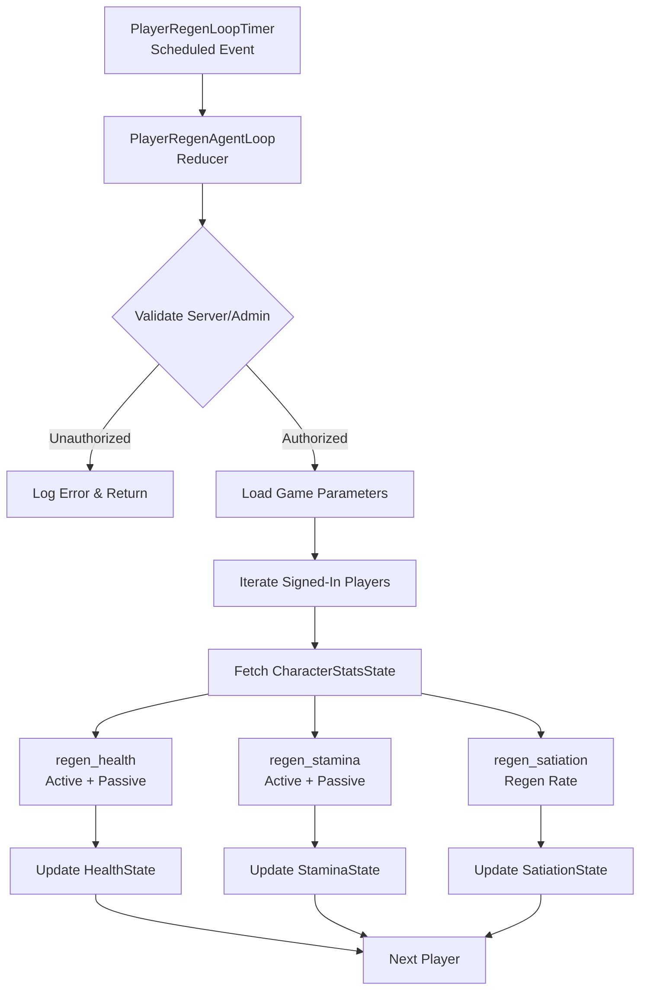

The Player Regeneration and Stamina Systems in BitCraft form a comprehensive resource management framework that governs player vitality through health recovery, stamina restoration, and satiation mechanics. These systems operate on a scheduled agent architecture that processes regeneration at configurable intervals, with dual-layer regeneration logic that distinguishes between continuous active recovery and delayed passive restoration triggered by periods of inactivity.

## System Architecture

The regeneration architecture follows a distributed agent pattern where resource restoration is decoupled from player actions and executed on a scheduled timer loop. The `PlayerRegenAgent` operates as the central coordinator, iterating through all signed-in players and applying regeneration calculations to health, stamina, and satiation resources based on their current state and elapsed time since resource consumption.

**Core Design Principles:**
- **Scheduled Execution**: Regeneration occurs on a configurable tick interval via SpacetimeDB's scheduler
- **Dual-Layer Regeneration**: Both active (always-on) and passive (delayed) regeneration rates contribute
- **State-Aware Processing**: Regeneration logic respects combat state, incapacitation, and activity timestamps
- **Stat-Driven Calculations**: All regeneration rates derive from CharacterStatsState for modifiable gameplay

## Scheduled Agent Implementation

The `PlayerRegenLoopTimer` table serves as the scheduling mechanism, leveraging SpacetimeDB's `scheduled` decorator to invoke the `player_regen_agent_loop` reducer at configured intervals. The timer entry contains a single record with a `scheduled_at` field that determines when the next iteration executes. During server initialization, the `init` function inserts the initial timer entry with the tick duration specified in game parameters, while the `update_timer` function allows runtime adjustment of the regeneration frequency.

The agent loop begins with security validation, ensuring only server or admin contexts can execute regeneration. It then retrieves game parameters that specify the minimum time intervals required before passive regeneration becomes active for both health and stamina. These parameters allow game designers to balance the tension between continuous regeneration and recovery after periods of resource expenditure.

Sources: [player_regen_agent.rs](BitCraftServer/packages/game/src/agents/player_regen_agent.rs#L15-L66)

## Health Regeneration Mechanics

Health regeneration implements a sophisticated two-tier system that applies both active regeneration (always active) and passive regeneration (triggered after a cooldown period). The system fetches the player's `HealthState` and first checks if the player is incapacitated, skipping regeneration for dead or unconscious characters. The active regeneration rate is retrieved from character stats, then the system evaluates whether to add the passive regeneration component.

**Passive Activation Conditions:**
1. Time elapsed since last health decrease exceeds `min_seconds_to_passive_regen_health`
2. Player is not in combat (verified via `ThreatState::in_combat`)

The health delta is applied using `add_health_delta_clamped`, which ensures the resulting value stays within the range [0, MaxHealth]. Importantly, this method also updates the last decrease timestamp if the delta is negative, preventing passive regen from activating immediately after taking damage. If health changes occur, the system triggers `update_health_and_check_death` to process potential death scenarios and update terrain caches.

Sources: [player_regen_agent.rs](BitCraftServer/packages/game/src/agents/player_regen_agent.rs#L82-L115), [health_state.rs](BitCraftServer/packages/game/src/game/entities/health_state.rs#L39-L55)

## Stamina Regeneration System

Stamina regeneration follows an identical two-tier architecture to health but operates independently with its own cooldown threshold and stat references. The system retrieves the player's `StaminaState`, applies active stamina regeneration from `ActiveStaminaRegenRate` stats, then conditionally adds `PassiveStaminaRegenRate` if the time since the last stamina decrease exceeds `min_seconds_to_passive_regen_stamina`.

The clamped delta application ensures stamina stays within [0, MaxStamina] bounds. Like health, negative deltas update the `last_stamina_decrease_timestamp`, creating a natural rhythm where intense stamina expenditure delays the onset of accelerated passive recovery. The stamina state is updated only when the clamped calculation results in an actual value change, optimizing database writes.

Sources: [player_regen_agent.rs](BitCraftServer/packages/game/src/agents/player_regen_agent.rs#L117-L144), [stamina_state.rs](BitCraftServer/packages/game/src/game/entities/stamina_state.rs#L14-L29)

## Satiation Management

Satiation (hunger) operates differently than health and stamina, using a single regeneration rate rather than dual-layer mechanics. The system applies `SatiationRegenRate` directly to the player's satiation state without time-based conditions. However, satiation incorporates critical debuff mechanics through the `StarvingPlayerState`.

**Starving Debuff Activation:**
- When satiation reaches zero, the system activates a starving debuff identified by `BuffCategory::Starving`
- A `StarvingPlayerState` record is inserted to track the starving condition
- When satiation increases from zero (via food consumption), the debuff is deactivated and the starving state is removed

This design creates gameplay consequences for failing to manage hunger, as starving debuffs can impose penalties to movement speed, health regeneration, or other combat capabilities. The satiation system includes utility functions for increasing and decreasing values with proper clamping against `MaxSatiation` from character stats.

Sources: [player_regen_agent.rs](BitCraftServer/packages/game/src/agents/player_regen_agent.rs#L146-L153), [satiation_state.rs](BitCraftServer/packages/game/src/game/entities/satiation_state.rs#L14-L103)

## State Tracking and Delta Mechanics

All three resource systems (health, stamina, satiation) employ consistent delta application patterns with timestamp tracking for state transitions. The core `add_stamina_delta_clamped` and `add_health_delta_clamped` methods implement the essential logic for tracking resource changes.

**Delta Application Algorithm:**
1. For negative deltas, update `last_*_decrease_timestamp` if current value exceeds minimum
2. Calculate new value: `previous + delta`, then clamp to [min, max]
3. Return `true` only if the clamped value differs from the previous value

This design ensures that passive regeneration cooldowns are correctly triggered by resource consumption events, while allowing regeneration to proceed without resetting cooldowns. The clamping prevents values from exceeding maximum stats or dropping below zero, while the conditional return optimizes database writes by only persisting meaningful state changes.

<CgxTip>
The timestamp tracking mechanism enables sophisticated gameplay where different actions can consume resources at different rates without interfering with the passive regeneration timer. For example, a sprint action might consume small stamina amounts without triggering the full cooldown, while a special ability might consume a large chunk that significantly delays passive recovery.</CgxTip>

Sources: [stamina_state.rs](BitCraftServer/packages/game/src/game/entities/stamina_state.rs#L14-L29), [health_state.rs](BitCraftServer/packages/game/src/game/entities/health_state.rs#L39-L55)

## Food Consumption System

The food consumption system provides players with consumable items that can restore health, stamina, satiation, and even teleportation energy. The `eat` reducer validates that the player is not incapacitated, not sleeping, and has the specified item in their inventory pocket. Food items defined in static data specify the effects they provide:

**Food Effect Properties:**
- `hp`: Health restoration (positive) or damage (negative)
- `up_to_hp`: Upper bound for health restoration (enables "restore up to X" mechanics)
- `stamina`: Stamina restoration
- `up_to_stamina`: Upper bound for stamina restoration
- `hunger`: Satiation restoration
- `teleportation_energy`: Teleportation energy restoration
- `buffs`: Array of temporary buff effects to apply
- `consumable_while_in_combat`: Boolean flag allowing or preventing consumption during combat

The health and stamina application logic includes sophisticated clamping to support both "full restoration" and "partial restoration up to threshold" mechanics. For example, a healing potion might restore full health, while a ration might restore health only up to 50% of maximum. Negative values can also be specified for poisonous or spoiled foods.

<CgxTip>
The `up_to_hp` and `up_to_stamina` fields enable nuanced food design where consumables provide diminishing returns at higher resource levels. This supports gameplay where food is more effective when the player is critically wounded but less effective near full health, encouraging strategic resource management.</CgxTip>

Sources: [eat.rs](BitCraftServer/packages/game/src/game/handlers/player/eat.rs#L1-L134)

## Character Stats Integration

All regeneration calculations ultimately derive from the `CharacterStatsState`, which stores a vector of stat values indexed by `CharacterStatType`. This architecture enables equipment, buffs, and other game systems to dynamically modify regeneration rates through stat modifications.

**Relevant Stat Types:**
- `ActiveHealthRegenRate`: Continuous health regeneration
- `PassiveHealthRegenRate`: Additional regeneration after cooldown
- `ActiveStaminaRegenRate`: Continuous stamina regeneration
- `PassiveStaminaRegenRate`: Additional regeneration after cooldown
- `SatiationRegenRate`: Continuous satiation regeneration
- `MaxHealth`: Upper bound for health calculations
- `MaxStamina`: Upper bound for stamina calculations
- `MaxSatiation`: Upper bound for satiation calculations

The stats system provides a `get` method for retrieving values and `set` for modifications, allowing other systems like equipment, buff application, or skill progression to influence regeneration behavior. The character stats are initialized from static data definitions but can be modified at runtime through various game mechanics.

Sources: [character_stats.rs](BitCraftServer/packages/game/src/game/entities/character_stats.rs#L13-L39), [player_regen_agent.rs](BitCraftServer/packages/game/src/agents/player_regen_agent.rs#L93-L104)

## Configuration Parameters

The regeneration system is configured through game parameters stored in the `parameters_desc_v2` table. These parameters allow runtime adjustment of regeneration behavior without code changes:

| Parameter | Description | Default Purpose |
|-----------|-------------|-----------------|
| `player_regen_tick_millis` | Milliseconds between regeneration agent executions | Controls regeneration frequency |
| `min_seconds_to_passive_regen_health` | Seconds of inactivity before passive health regen activates | Balances combat recovery |
| `min_seconds_to_passive_regen_stamina` | Seconds of inactivity before passive stamina regen activates | Balances action economy |

These parameters can be modified through admin commands or configuration files to tune the game's pacing. Shorter tick intervals provide more responsive regeneration at higher server load cost, while longer cooldowns make resource management more punishing and strategic.

Sources: [player_regen_agent.rs](BitCraftServer/packages/game/src/agents/player_regen_agent.rs#L24-L29), [player_regen_agent.rs](BitCraftServer/packages/game/src/agents/player_regen_agent.rs#L60-L65)

## Related Systems and Interactions

The regeneration system integrates with several other game systems to create cohesive gameplay mechanics:

**Combat System:** The `ThreatState::in_combat` check prevents passive health regeneration during active combat, forcing players to disengage before recovery accelerates. This creates tactical decisions around when to retreat and recover versus pushing forward with limited resources.

**Action System:** Player actions that consume stamina or health update the respective decrease timestamps, resetting the passive regeneration cooldowns. This creates natural pacing where intense activity must be balanced with rest periods.

**Buff System:** Both food consumption and the starving debuff activate buff effects, demonstrating how the regeneration system integrates with the buff framework for temporary stat modifications.

**Death System:** The health regeneration loop checks for incapacitated players and skips them, while the `update_health_and_check_death` call handles death processing when health reaches zero.

**Environment Debuffs:** The related `environment_debuff_agent` applies environmental penalties that may affect regeneration rates, demonstrating how external factors can influence resource recovery.

Sources: [player_regen_agent.rs](BitCraftServer/packages/game/src/agents/player_regen_agent.rs#L101-L102), [player_regen_agent.rs](BitCraftServer/packages/game/src/agents/player_regen_agent.rs#L89-L91), [satiation_state.rs](BitCraftServer/packages/game/src/game/entities/satiation_state.rs#L80-L92)

## Next Steps

For comprehensive understanding of related systems, continue with:

- [Agent Lifecycle and Scheduling](10-agent-lifecycle-and-scheduling) - Deep dive into SpacetimeDB's scheduled agent architecture and timer management
- [Environment Debuffs and Status Effects](14-environment-debuffs-and-status-effects) - External factors that can modify regeneration rates
- [Player State Management](15-player-state-management) - Broader player state architecture including health and stamina
- [Combat and Enemy State](18-combat-and-enemy-state) - Combat mechanics that interact with regeneration timing
- [Quest and Achievement System](28-quest-and-achievement-system) - Reward systems that may grant regeneration bonuses
