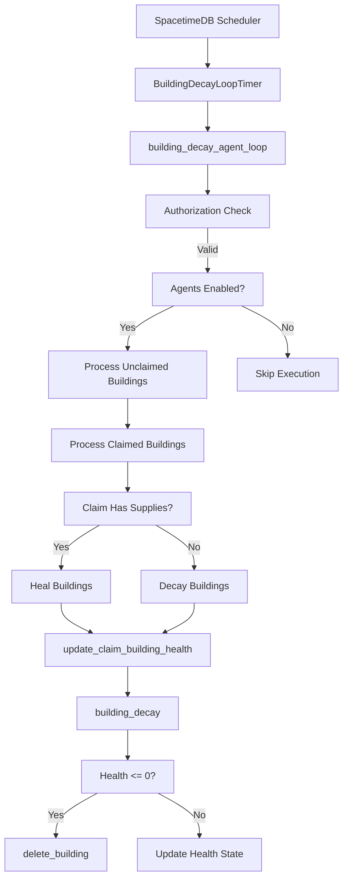
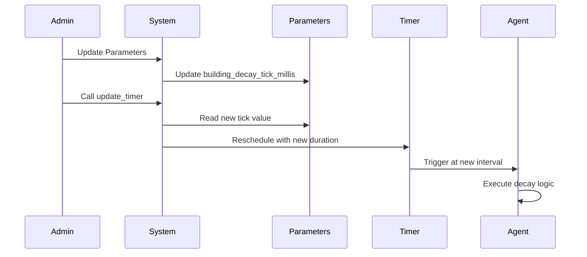

The Building Decay Agent is a scheduled system that manages building durability within the game world, ensuring structures decay over time when not properly maintained within claims. This agent serves as a critical mechanic for preventing unchecked expansion and encouraging active territory management through the claim system.

## Architecture Overview

The Building Decay Agent operates on a scheduled timer system provided by SpacetimeDB, executing periodic checks on building health states across all regions. The agent distinguishes between protected buildings within claims and unprotected structures in the wild, applying different health modification rules based on claim ownership and supply levels.

Sources: [building_decay_agent.rs](BitCraftServer/packages/game/src/agents/building_decay_agent.rs#L1-L175), [agents/mod.rs](BitCraftServer/packages/game/src/agents/mod.rs#L1-L80)

## Timer System and Initialization

The agent utilizes SpacetimeDB's built-in scheduling mechanism through the `BuildingDecayLoopTimer` table, which automatically triggers the `building_decay_agent_loop` reducer at specified intervals. The tick duration is configurable via the `building_decay_tick_millis` parameter in the global parameters system, allowing server administrators to adjust decay frequency based on gameplay balance requirements.

Sources: [building_decay_agent.rs](BitCraftServer/packages/game/src/agents/building_decay_agent.rs#L16-L22), [agents/mod.rs](BitCraftServer/packages/game/src/agents/mod.rs#L31-L45)

The initialization process creates a single timer instance with the configured tick length. Admins can update timer values dynamically through the `update_timer` function, which retrieves the current parameter value and reschedules the agent accordingly. This design enables runtime configuration changes without requiring server restarts.

Sources: [building_decay_agent.rs](BitCraftServer/packages/game/src/agents/building_decay_agent.rs#L24-L42), [building_decay_agent.rs](BitCraftServer/packages/game/src/agents/building_decay_agent.rs#L68-L72)

## Main Decay Logic

The core `building_decay_agent_loop` function implements a two-phase process: first processing unclaimed buildings, then iterating through all active claims to determine their buildings' fate based on supply levels. The system validates server or admin authorization before proceeding and checks whether agents are globally enabled.

Sources: [building_decay_agent.rs](BitCraftServer/packages/game/src/agents/building_decay_agent.rs#L44-L91)

### Unclaimed Buildings Decay

All buildings with `claim_entity_id` of 0 are immediately subjected to health decay. The system queries all unclaimed buildings and passes them to `update_claim_building_health` with the `decrease_health` flag set to true, causing them to lose health based on their individual decay rates defined in the building description.

Sources: [building_decay_agent.rs](BitCraftServer/packages/game/src/agents/building_decay_agent.rs#L52-L59)

### Claim-Based Building Management

For each non-neutral claim in the world, the agent evaluates the claim's supply status to determine whether buildings should heal or decay. Claims with positive supplies consume maintenance costs proportional to their tile count, and buildings within these claims receive healing. Conversely, claims with depleted supplies have their buildings undergo decay, creating an economic pressure on players to maintain their territories.

Sources: [building_decay_agent.rs](BitCraftServer/packages/game/src/agents/building_decay_agent.rs#L61-L91)

<CgxTip>The maintenance cost calculation uses `full_maintenance` scaled by available supplies, ensuring claims never consume more resources than available while maintaining consistent building health outcomes.</CgxTip>

## Health Update Mechanism

The `update_claim_building_health` function processes a collection of buildings, applying health modifications based on the `decrease_health` parameter. For each building, it retrieves the associated `BuildingDesc` to access decay rates and configuration flags. Buildings marked with `ignore_damage` are skipped entirely, allowing for permanent structures like decorative elements or admin-placed buildings to persist indefinitely.

Sources: [building_decay_agent.rs](BitCraftServer/packages/game/src/agents/building_decay_agent.rs#L93-L132)

The system verifies each building's location exists in the location state and filters for overworld dimension buildings only, preventing decay in interior dimensions or specialized environments. The actual health change applies the building's decay rate multiplied by -1 for healing or +1 for damage.

Sources: [building_decay_agent.rs](BitCraftServer/packages/game/src/agents/building_decay_agent.rs#L93-L132)

## Building Destruction

The `building_decay` function handles individual building health modifications and destruction logic. When health reaches zero, the system triggers `delete_building`, a comprehensive cleanup function that removes all associated game entities including inventories, combat states, light sources, and footprint tiles. Buildings with empire affiliations send inter-module messages to coordinate removal across global state.

Sources: [building_decay_agent.rs](BitCraftServer/packages/game/src/agents/building_decay_agent.rs#L134-L175), [building_helpers.rs](BitCraftServer/packages/game/src/game/reducer_helpers/building_helpers.rs#L500-L600)

| State Change | Condition | Result |
|--------------|-----------|--------|
| Health Decrease | Building outside claim OR claim empty | Decay applied, potential destruction at 0 health |
| Health Increase | Building within supplied claim | Healing applied up to max_health |
| No Change | Building marked `ignore_damage` | Health remains unchanged regardless of context |
| Destruction | Health reaches 0 | Building and all components deleted from world |

Sources: [building_decay_agent.rs](BitCraftServer/packages/game/src/agents/building_decay_agent.rs#L134-L175)

## Configuration Parameters

The Building Decay Agent's behavior is controlled through the global `parameters_desc_v2` system, with the primary configuration value being `building_decay_tick_millis`. This parameter determines the frequency of decay checks and can be modified by administrators through admin commands or direct parameter updates.

Sources: [building_decay_agent.rs](BitCraftServer/packages/game/src/agents/building_decay_agent.rs#L24-L42), [agents/mod.rs](BitCraftServer/packages/game/src/agents/mod.rs#L61-L72)

<CgxTip>The timer update system includes error logging if multiple timer instances exist, helping administrators detect configuration issues during development or debugging.</CgxTip>

## Integration with Agent System

The Building Decay Agent is initialized through the central `agents::init` function, which sets up all periodic game systems alongside other agents like player regeneration, resource regeneration, and NPC AI. This central initialization ensures the agent system starts cleanly when the server boots, with proper parameter validation and logging.

Sources: [agents/mod.rs](BitCraftServer/packages/game/src/agents/mod.rs#L31-L45)

The agent respects the global `agents_enabled` configuration flag, allowing administrators to disable all agent systems for testing or maintenance purposes. The `should_run` function provides a centralized gate for agent execution, ensuring consistent behavior across all agent types.

Sources: [agents/mod.rs](BitCraftServer/packages/game/src/agents/mod.rs#L13-L28)

## Next Steps

To understand the broader agent system architecture and scheduling patterns, explore the [Agent Lifecycle and Scheduling](10-agent-lifecycle-and-scheduling) documentation. For details on building construction and placement systems that create the entities this agent manages, see [Building Construction](22-building-construction). The claim system that determines building protection is covered in [Building and Claim System](16-building-and-claim-system).
