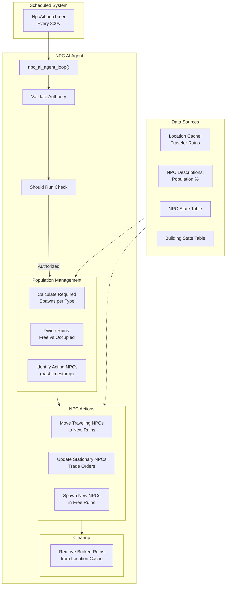

The NPC (Non-Player Character) AI system in BitCraft manages autonomous traveler entities that inhabit ancient ruins throughout the world. These NPCs create dynamic economic opportunities by establishing trading posts, moving between locations, and providing commerce to players. The system operates as a scheduled agent that runs periodically to spawn, move, and maintain NPC populations across the game world.

Sources: [npc_ai_agent.rs](/BitCraftServer/packages/game/src/agents/npc_ai_agent.rs#L1-L10), [npc_state.rs](/BitCraftServer/packages/game/src/game/entities/npc_state.rs#L1-L20)

## Architecture Overview

The NPC AI system is built around a scheduled reducer that executes every 5 minutes to update NPC positions, spawns, and trade orders. The architecture divides NPCs into two distinct categories: traveling NPCs that move between ruins and stationary NPCs that remain at a single location. Both types contribute to the game's economy through trade order creation.



The system maintains a delicate balance between NPC population and available ruins, using population percentages defined in static data to determine spawn counts. The AI agent tracks free and occupied ruins separately, ensuring that traveling NPCs always have valid destinations while preventing overpopulation.

Sources: [npc_ai_agent.rs](/BitCraftServer/packages/game/src/agents/npc_ai_agent.rs#L18-L50), [npc_state.rs](/BitCraftServer/packages/game/src/game/entities/npc_state.rs#L20-L60)

## Scheduled Agent Loop

The NPC AI system operates through a scheduled reducer that executes every 300 seconds (5 minutes). The `NpcAiLoopTimer` table contains a single entry with a `scheduled_at` field that triggers the `npc_ai_agent_loop` reducer automatically. During initialization, this timer is created with an initial 5-second delay to allow the system to stabilize before the first AI cycle begins.

The agent loop begins with security validation, ensuring that only the server or an authorized admin can invoke the AI logic. It then checks whether the agent should run using the global agent scheduler, which prevents AI execution during maintenance or other system states. The main logic proceeds by fetching the location cache, which contains precomputed lists of traveler ruins available throughout the world.

Sources: [npc_ai_agent.rs](/BitCraftServer/packages/game/src/agents/npc_ai_agent.rs#L12-L35)

### Population Calculation and Ruin Division

The first major phase calculates how many NPCs of each type should exist based on the population percentages defined in the `npc_desc` table. The system iterates through all NPC type descriptions, multiplying the population percentage by the total number of traveler ruins to determine the target count for each type.

```rust
// Calculate required spawns: population percentage * traveler_ruins count
required_spawns.insert(
    NpcType::to_enum(npc.npc_type),
    (npc.population * traveler_ruins.len() as f32) as usize,
);
```

The agent then divides all traveler ruins into two categories: free ruins (unoccupied) and occupied ruins (hosting an NPC). This division is crucial for both spawning new NPCs and providing destinations for traveling NPCs. The system iterates through existing NPCs, tracking which ruins they occupy and decrementing the required spawn count for each NPC type found.

Sources: [npc_ai_agent.rs](/BitCraftServer/packages/game/src/agents/npc_ai_agent.rs#L40-L75)

<CgxTip>
The population calculation is vulnerable to configuration errors - if the sum of all population percentages exceeds 1.0, the system will log an error but continue attempting to spawn NPCs, potentially leading to incomplete spawns or errors. Always validate that population percentages sum to 1.0 or less in your CSV configuration.
</CgxTip>

### Identifying Acting NPCs

Not all NPCs require action during each cycle. The system identifies "acting" NPCs by comparing the current timestamp with each NPC's `next_action_timestamp`. NPCs whose timestamp has passed require immediate action: traveling NPCs need to move to a new location, while stationary NPCs need to refresh their trade orders. This timestamp-based approach ensures that each type of NPC operates at its own pace, with some NPCs being more active than others.

Sources: [npc_ai_agent.rs](/BitCraftServer/packages/game/src/agents/npc_ai_agent.rs#L60-L75)

## NPC Behavior Types

### Traveling NPC Behavior

Traveling NPCs represent the nomadic aspect of BitCraft's economy, moving between ancient ruins to provide trade opportunities across different regions. These NPCs maintain a history of their last three visited buildings in the `previous_buildings` vector, which influences their destination selection logic.

When a traveling NPC's action timestamp expires, the system selects a new ruin as its destination. The `pick_free_ruin_index` function implements a sophisticated selection algorithm that balances exploration with avoidance of recently visited locations:

1. **Distance Calculation**: Sort all free ruins by their distance from the NPC's current location
2. **Recent Visit Filtering**: Remove ruins that appear in the NPC's `previous_buildings` history
3. **Fallback Strategy**: If all ruins were recently visited, fall back to the full sorted list
4. **Top-3 Random Selection**: Randomly select from the 3 closest eligible ruins

This approach creates natural roaming patterns where NPCs explore nearby areas first while ensuring variety over time. The random selection among the top 3 closest ruins prevents NPCs from always choosing the absolute nearest location, adding organic unpredictability to their movement patterns.

Sources: [npc_ai_agent.rs](/BitCraftServer/packages/game/src/agents/npc_ai_agent.rs#L200-L232)

### Stationary NPC Behavior

Stationary NPCs serve as permanent trading posts at specific ruins, refreshing their trade orders periodically rather than moving between locations. When a stationary NPC's action timestamp expires, the system performs three key operations:

1. **Trade Order Cleanup**: Delete all existing trade orders associated with the NPC's current building
2. **Trade Order Recreation**: Generate new trade orders based on the NPC's type and configuration
3. **Timestamp Reset**: Calculate and set a new action timestamp based on the NPC's configured time range

Stationary NPCs also have special handling if their building is destroyed (e.g., by player deconstruction). In this case, the NPC is removed from the game entirely, preventing orphaned NPCs from accumulating in the database.

Sources: [npc_ai_agent.rs](/BitCraftServer/packages/game/src/agents/npc_ai_agent.rs#L120-L135)

## NPC Teleportation and Movement

When a traveling NPC selects a new destination, the system performs a seamless teleportation operation through the `teleport` method. This method handles all the bookkeeping required to move the NPC between buildings:

1. **History Update**: Add the current building to the `previous_buildings` history, maintaining only the last 3 entries
2. **Trade Order Migration**: Delete existing trade orders at the old location (these will be recreated at the new location)
3. **Building Assignment**: Update the NPC's `building_entity_id` to the new destination
4. **Timestamp Reset**: Calculate a new action timestamp based on the NPC type's time range
5. **Coordinate Calculation**: Determine the exact spawn coordinates at the new building using `BuildingSpawnDesc::get_traveler_spawn_coordinates`
6. **Location Update**: Update the NPC's position in the mobile entity state table
7. **Trade Order Creation**: Generate new trade orders at the destination building

The coordinate calculation considers both the building's base position and its direction index, ensuring NPCs spawn at the correct entrance or designated spawn point for each building type. This creates visual consistency as NPCs appear at predictable locations relative to each building's architecture.

Sources: [npc_state.rs](/BitCraftServer/packages/game/src/game/entities/npc_state.rs#L118-L158)

## Trade Order Management

Trade orders are the primary economic contribution of NPCs to the game world. Each NPC generates both "always_offered" trades and a randomized subset of optional trades when arriving at a new location.

### Always-Offered Trades

Certain trades are guaranteed to be available at every NPC location. These trades, marked with the `always_offered` flag in the `traveler_trade_order_desc` table, provide essential economic anchors and ensure baseline availability of key items. The system creates these trades first for every NPC, providing players with reliable access to important resources or items.

Sources: [npc_state.rs](/BitCraftServer/packages/game/src/game/entities/npc_ai_agent.rs#L40-L60)

### Randomized Trade Selection

After creating always-offered trades, the system randomly samples a subset of optional trades. The sample size is controlled by the `selected_traveler_order_count` parameter in the global configuration table (`parameters_desc_v2`). This allows game designers to control trade variety across the world: higher values create more diverse trading posts, while lower values create more focused, specialized locations.

The sampling uses SpacetimeDB's random number generator (`ctx.rng()`) to ensure unbiased selection from the pool of optional trades associated with each NPC type. This means that two NPCs of the same type will typically have different subsets of optional trades, encouraging players to explore multiple locations to find optimal trading opportunities.

Sources: [npc_state.rs](/BitCraftServer/packages/game/src/game/entities/npc_state.rs#L62-L90)

### Trade Order Lifecycle

| Phase | Trigger | Actions |
|-------|---------|---------|
| Creation | NPC spawn or arrival | Create always-offered trades + random subset of optional trades |
| Refresh | Stationary NPC timestamp expires | Delete all orders → recreate new orders at same location |
| Migration | Traveling NPC moves | Delete all orders at old location → recreate at new location |
| Deletion | NPC removed or building destroyed | Delete all associated trade orders |

This lifecycle ensures that trade orders remain fresh and relevant, with stationary NPCs providing predictable refresh intervals and traveling NPCs constantly introducing new trade opportunities across different regions.

Sources: [npc_state.rs](/BitCraftServer/packages/game/src/game/entities/npc_state.rs#L62-L95), [npc_ai_agent.rs](/BitCraftServer/packages/game/src/agents/npc_ai_agent.rs#L120-L135)

## NPC Spawning System

New NPCs are spawned during the agent loop when the current population is below the target calculated from population percentages. The spawning process occurs for each NPC type in sequence, attempting to spawn the required number of NPCs of that type.

### Spawn Algorithm

1. **Availability Check**: Verify that free ruins remain available
2. **Random Selection**: Choose a random ruin from the free ruins pool
3. **Building Validation**: Confirm the building still exists (players may have deconstructed ruins)
4. **Coordinate Calculation**: Determine spawn coordinates using the building's spawn descriptor
5. **NPC Creation**: Create a new NPC entity with the appropriate type, direction, and flags
6. **State Updates**: Move the ruin from free to occupied pool
7. **Trade Order Generation**: Create initial trade orders for the new NPC

The random selection from free ruins (using `ctx.rng().gen_range(0..free_ruins.len())`) ensures even distribution of NPCs across the available ruins rather than sequential filling. This creates a more organic distribution pattern where NPCs are scattered throughout the world rather than clustered in specific areas.

Sources: [npc_ai_agent.rs](/BitCraftServer/packages/game/src/agents/npc_ai_agent.rs#L136-L190)

### NPC Spawn Parameters

The `NpcState::spawn` method accepts several parameters that define the new NPC's initial state:

| Parameter | Type | Purpose |
|-----------|------|---------|
| `traveler_type` | `NpcType` | Determines NPC type, trade behavior, and timing parameters |
| `direction` | `i32` | Facing direction (derived from building spawn descriptor) |
| `ruin_entity_id` | `u64` | The building this NPC occupies |
| `offset_coord` | `OffsetCoordinatesSmall` | Precise spawn coordinates relative to building |
| `traveling` | `bool` | Whether this NPC moves between ruins (true) or stays stationary (false) |

The spawn method initializes the NPC's `next_action_timestamp` immediately using `get_next_timestamp`, which calculates a random duration within the range defined in the NPC type's description (`min_time_at_ruin` to `max_time_at_ruin`). This timestamp determines when the NPC will first act after spawning.

Sources: [npc_state.rs](/BitCraftServer/packages/game/src/game/entities/npc_state.rs#L20-L60)

## Cleanup and Error Handling

The NPC AI system includes robust error handling for edge cases, particularly when player actions interfere with NPC operations.

### Broken Ruin Detection

The system maintains a `broken_ruins` vector to track buildings that have been destroyed or deconstructed while NPCs were attempting to interact with them. This can occur when players deconstruct ruins during the 5-minute interval between AI cycles. When the AI attempts to move an NPC to or spawn an NPC in a broken ruin:

1. The system detects the missing building via `building_state().entity_id().find()`
2. The ruin's entity ID is added to the `broken_ruins` vector
3. The operation is skipped gracefully
4. At the end of the cycle, broken ruins are removed from the location cache

This cleanup process prevents the AI from repeatedly attempting to interact with non-existent buildings, which would cause errors and degrade performance. The location cache update ensures that future AI cycles will not attempt to use these ruins.

Sources: [npc_ai_agent.rs](/BitCraftServer/packages/game/src/agents/npc_ai_agent.rs#L95-L110), [npc_ai_agent.rs](/BitCraftServer/packages/game/src/agents/npc_ai_agent.rs#L190-L210)

### Orphaned NPC Handling

Stationary NPCs that lose their building (due to destruction) are immediately removed from the game rather than being left in an invalid state. This prevents database bloat and ensures that the NPC population accurately reflects available locations. The system deletes the NPC entity and all associated trade orders when this condition is detected.

Traveling NPCs have additional protection: before attempting to teleport, the system verifies that both the source and destination buildings exist. If either is missing, the NPC is removed rather than left in an inconsistent state.

Sources: [npc_ai_agent.rs](/BitCraftServer/packages/game/src/agents/npc_ai_agent.rs#L130-L135)

## NPC Configuration

NPC behavior is primarily configured through the `npc_desc` table in static data, which defines parameters for each NPC type:

### Configuration Parameters

| Parameter | Type | Description |
|-----------|------|-------------|
| `npc_type` | `NpcType` | Enum identifier for the NPC type |
| `population` | `f32` | Percentage of ruins this NPC should occupy (sum should be ≤ 1.0) |
| `min_time_at_ruin` | `i32` | Minimum seconds before next action (travel or refresh) |
| `max_time_at_ruin` | `i32` | Maximum seconds before next action |

The time range parameters create variation in NPC activity cycles, preventing all NPCs from acting simultaneously. A broader range creates more unpredictable timing, while a narrower range creates more predictable patterns.

<CgxTip>
For balanced gameplay, ensure that the sum of all NPC `population` values equals approximately 0.8-0.9, leaving 10-20% of ruins free. This buffer ensures traveling NPCs always have valid destinations and prevents the system from running out of spawn locations.
</CgxTip>

Sources: [npc_ai_agent.rs](/BitCraftServer/packages/game/src/agents/npc_ai_agent.rs#L45-L55), [npc_state.rs](/BitCraftServer/packages/game/src/game/entities/npc_state.rs#L92-L100)

## Next Steps

To deepen your understanding of the NPC AI system and its integration with broader game mechanics, explore these related topics:

- **[Agent Lifecycle and Scheduling](10-agent-lifecycle-and-scheduling)** - Learn how the scheduled reducer system works and how the NPC AI agent fits into the broader agent architecture
- **[Trade and Auction Systems](19-trade-and-auction-systems)** - Understand the detailed mechanics of trade order creation, player interaction, and the trading economy
- **[Building and Claim System](16-building-and-claim-system)** - Explore how buildings are created, destroyed, and managed in relation to NPC occupation
- **[Pathfinding Algorithm](26-pathfinding-algorithm)** - Although NPCs teleport between ruins, understanding the pathfinding system provides context for movement mechanics in BitCraft

The NPC AI system demonstrates a sophisticated approach to autonomous entity management in SpacetimeDB, combining scheduled execution, state management, and economic interaction to create a living, breathing world for players.
