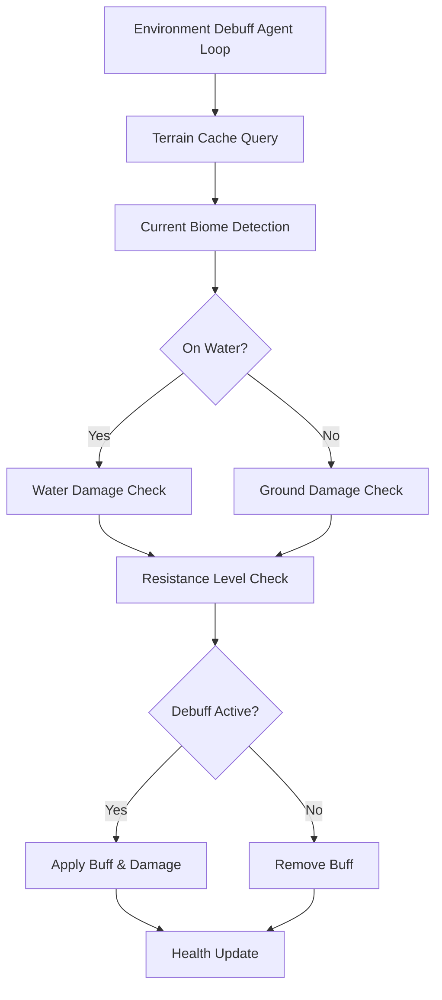

Environment debuffs and status effects in BitCraft represent a sophisticated system that challenges players to adapt their equipment and strategies based on the diverse biomes they explore. This system integrates with the agent architecture, buff management, and character stats to create dynamic environmental hazards.

## System Architecture

The environment debuff system operates as a scheduled agent that periodically evaluates each player's environmental context and applies or removes status effects accordingly. The architecture consists of three primary components working in concert: the environment debuff agent that performs the evaluation loop, the static data definitions that configure debuff parameters, and the buff management system that tracks and applies status effects.

The system leverages a centralized timer managed through the `EnvironmentDebuffLoopTimer` table, which triggers the evaluation cycle at intervals defined by the `environment_debuff_tick_millis` parameter in the game configuration. Each iteration validates authorization and ensures the agent should run before proceeding with debuff evaluation.

Sources: [environment_debuff_agent.rs](BitCraftServer/packages/game/src/agents/environment_debuff_agent.rs#L10-L25)

## Environment Debuff Definitions

Environment debuffs are defined in the static data system using `EnvironmentDebuffDesc` structures. These definitions establish the core parameters for each debuff type, linking environmental conditions to specific buff identifiers and damage values.

The system currently supports two primary environment resistance types: **Cold** (associated with SnowyPeaks biome) and **Heat** (associated with Desert biome). Each debuff definition includes:

- **buff_id**: The identifier for the buff to apply when conditions are met
- **resistance_type**: Enum value specifying Cold or Heat
- **ground_damage**: Damage per tick when standing on affected terrain
- **water_damage**: Damage per tick when submerged in affected biome water
- **resistance_level**: Required character stat threshold to resist the debuff

*Table: Environment Debuff Configuration*

| Property | Type | Purpose |
|----------|------|---------|
| buff_id | i32 | Links to BuffDesc for the debuff effect |
| resistance_type | EnvironmentResistanceType | Cold or Heat |
| ground_damage | f32 | Damage per tick on affected terrain |
| water_damage | f32 | Damage per tick in affected water |
| resistance_level | i32 | Stat threshold to prevent debuff |

<CgxTip>TODO comment in the code indicates plans to add CSV columns for more flexible matching between character stats and biomes, suggesting the architecture is designed for expansion beyond the current two types.</CgxTip>

Sources: [environment_debuff_agent.rs](BitCraftServer/packages/game/src/agents/environment_debuff_agent.rs#L43-L58)

## Debuff Activation Logic

The core debuff activation logic operates through a two-phase evaluation for each signed-in player: terrain assessment followed by resistance calculation. The agent iterates through all configured debuffs, checking if environmental conditions warrant activation or removal.

For each player, the system retrieves their current coordinates and queries the terrain cache to determine the biome at their location. The `TerrainChunkCache` provides efficient lookup of terrain properties, including biome type and whether the player is standing on submerged terrain. The on_water boolean distinguishes between ground and water damage application, allowing debuffs to have different effects based on player state.

The activation condition combines three checks: the current biome must match the debuff's target biome, the appropriate damage value (ground or water) must exceed zero, and the player's corresponding resistance stat must be below the configured threshold. When all conditions are met and the debuff is not already active, the system activates the debuff through the buff management interface. Conversely, if a debuff is active but conditions are no longer met, it is deactivated.

Sources: [environment_debuff_agent.rs](BitCraftServer/packages/game/src/agents/environment_debuff_agent.rs#L70-L105)

## Damage Application and Health Integration

When an environment debuff is active, the agent applies damage on each tick cycle independent of buff activation state. This design separates the visual/effect state (buff) from the mechanical consequence (damage), allowing for potential future extensions where debuffs might have additional effects beyond damage.

Damage application follows a straightforward pattern: the system retrieves the player's health state, verifies they are alive (health > 0), then applies the damage delta. The `add_health_delta` method handles the actual health modification, and `update_health_and_check_death` processes any potential death consequences, including handling the terrain cache for proper death event processing.

This integration ensures that environmental damage follows the same health management pipeline as other damage sources in the game, maintaining consistency with combat and other damaging systems. The damage values are drawn directly from the debuff configuration, making it trivial to balance different biome hazards through static data modifications.

Sources: [environment_debuff_agent.rs](BitCraftServer/packages/game/src/agents/environment_debuff_agent.rs#L107-L115), [environment_debuff_agent.rs](BitCraftServer/packages/game/src/agents/environment_debuff_agent.rs#L8)

## Buff System Integration

The environment debuff system leverages the generic buff management system for tracking and applying status effects. The `buff` module provides core functions for `activate` and `deactivate` operations that interface with the `ActiveBuffState` table maintained for each entity.

Activation requires an entity identifier and buff ID, with optional overrides for duration and parameter values. The system retrieves the entity's active buff state, calls `add_active_buff_with_data` to apply the buff, and updates the database. Deactivation follows a similar pattern, calling `remove_active_buff` to clear the buff state. Both operations return `Result` types for error handling, with the environment debuff agent logging errors if activation or deactivation fails.

The `ActiveBuffState` maintains a collection of active buffs with metadata including start timestamp, duration, and parameter values. For environment debuffs, these typically represent persistent effects that remain active as long as environmental conditions persist, though the underlying buff system supports temporary effects with expiration timers.

Sources: [buff.rs](BitCraftServer/packages/game/src/game/entities/buff.rs#L33-L54)

## Character Stat Resistance

Resistance to environment debuffs is determined by character stats that players can potentially improve through equipment, skills, or other game mechanics. The system maps environment resistance types to specific character stat types: `ColdProtection` for cold environments and `HeatProtection` for hot environments.

The resistance check compares the player's current stat value against the `resistance_level` defined in the debuff configuration. If the player's stat value meets or exceeds the threshold, they resist the debuff entirely, preventing both the buff activation and damage application. This creates a clear progression path where players who invest in appropriate protection gear or skills can safely explore hazardous biomes.

Character stats are retrieved through the `CharacterStatsState::get_entity_stat` function, which queries the entity's current stat values. This integration ties the environment debuff system directly into the broader character progression system, allowing environmental resistance to scale with player advancement.

Sources: [environment_debuff_agent.rs](BitCraftServer/packages/game/src/agents/environment_debuff_agent.rs#L43-L56)

## Timer and Scheduling

The environment debuff agent operates on a scheduled timer system that determines the frequency of debuff evaluation and damage application. The tick length is configurable through the `environment_debuff_tick_millis` parameter in the game's configuration, allowing server operators to adjust the balance between performance and gameplay responsiveness.

Timer initialization occurs through the `init` function, which creates an `EnvironmentDebuffLoopTimer` entry with the initial schedule time. The `update_timer` function handles reconfiguration, updating existing timers when parameters change. The system includes error handling to detect and log if multiple timers are running simultaneously, which could indicate configuration issues.

The timer table uses SpacetimeDB's scheduling features to automatically trigger the `environment_debuff_agent_loop` reducer at the specified intervals. This distributed timing approach ensures consistent debuff processing across the game world without requiring manual timer management in the agent code itself.

Sources: [environment_debuff_agent.rs](BitCraftServer/packages/game/src/agents/environment_debuff_agent.rs#L27-L40)

## Configuration and Tuning

Environment debuff behavior is primarily controlled through static data loaded from CSV files and configuration parameters. This data-driven approach enables game designers to adjust debuff effects without code changes, supporting rapid iteration and balancing.

Key configuration parameters include:

- **environment_debuff_tick_millis**: Milliseconds between debuff evaluation cycles
- **ground_damage/water_damage**: Damage per tick for each debuff type
- **resistance_level**: Stat threshold required to resist each debuff
- **buff_id**: Connection to the broader buff system for visual effects and status display

The parameters are stored in the `ParametersDescV2` table, which includes the tick interval alongside other game-wide settings. Individual debuff configurations live in the `EnvironmentDebuffDesc` table, allowing for granular control over each environmental hazard.

<CgxTip>Separate ground and water damage values per debuff enable biomes to present different challenges depending on whether players are traveling on foot or swimming through water, adding tactical depth to exploration.</CgxTip>

Sources: [static_data.rs](BitCraftServer/packages/game/src/messages/static_data.rs#L2087)

## Next Steps

To understand how the environment debuff system fits into the broader game architecture, consider exploring these related systems:

- **[Player Regeneration and Stamina Systems](11-player-regeneration-and-stamina-systems)**: Learn how health regeneration interacts with environmental damage
- **[Agent Lifecycle and Scheduling](10-agent-lifecycle-and-scheduling)**: Understand the agent scheduling architecture that powers the environment debuff timer
- **[Player State Management](15-player-state-management)**: Explore how character stats and health state are managed across the game
- **[Biome and Resource Distribution](8-biome-and-resource-distribution)**: Discover how biomes are generated and distributed throughout the world

The environment debuff system demonstrates BitCraft's modular approach to game systems, combining agent-based processing, data-driven configuration, and integration with core entity systems to create a rich, dynamic world that responds to player choices and progression.
