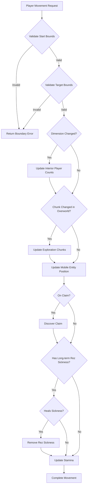

The Player State Management system forms the backbone of player entity tracking in BitCraft, implementing a distributed component architecture that persists player data across SpacetimeDB tables. This system handles position tracking, skill progression, character statistics, inventory management, and ability systems through a collection of interconnected state tables and management methods.

## Core Player State Architecture

The `PlayerState` implementation provides centralized methods for player data access and manipulation, coordinating between multiple specialized state tables. The architecture follows a **component-based design** where each aspect of player state resides in its own dedicated table, allowing for efficient queries and selective data synchronization based on player proximity and relevant game systems.

The primary `PlayerState` methods handle skill progression requirements, movement validation, stat collection, and ability management. Key functionality includes skill level retrieval through `get_skill_level()` which supports querying specific skills or returning the maximum skill level when using the `ANY_SKILL_ID` constant, and `meets_level_requirement()` for checking if players satisfy prerequisites for actions or items.

Sources: [player_state.rs](BitCraftServer/packages/game/src/game/entities/player_state.rs#L19-L38)

## Movement and Exploration System

Player movement is orchestrated through the `move_player_and_explore()` method, which enforces **boundary validation** to prevent players from moving outside world bounds. The system validates both origin and target coordinates against dimension boundaries defined in `DimensionDescriptionState`, returning detailed error messages when validation fails. This approach prevents exploits related to world-border traversal and ensures players remain within valid coordinate ranges.

Movement across dimensions triggers interior player count tracking through `InteriorPlayerCountState` increment and decrement operations. When players move between dimensions, the system automatically updates the player count for both the dimension being exited and the dimension being entered, enabling accurate capacity management for interior spaces.

The exploration system integrates with movement through chunk-based discovery. When players enter new chunks in the overworld, the `ExplorationChunksState` is updated and ruins within the discovered chunk are automatically revealed. This discovery mechanism uses the `Discovery` component to acquire claim information and ruin coordinates, creating a progressive world exploration experience.

Sources: [player_state.rs](BitCraftServer/packages/game/src/game/entities/player_state.rs#L40-L141)

<CgxTip>
The `move_player_and_explore()` method includes a critical boundary check that prevents negative coordinates and values at exactly 0,0, which can cause issues with SpacetimeDB subscription queries. Coordinates are clamped to a minimum value of 1 to avoid these floating-point conversion problems.</CgxTip>

## Character Statistics System

Player statistics are derived through a **multi-source aggregation system** that combines base stats from equipment, active buffs, deployables, and acquired knowledge. The `collect_stats()` method orchestrates this aggregation by gathering stat modifiers from each source into a HashMap before applying cumulative percentage and flat bonuses to calculate final values.

The stat collection process follows a specific order of operations:
1. **Equipment Stats**: Collected from `EquipmentState` which tracks equipped items and their stat contributions
2. **Buff Stats**: Applied from `ActiveBuffState` which contains temporary stat modifiers from consumables, abilities, or environmental effects
3. **Deployable Stats**: Added when players are mounted on deployables like vehicles
4. **Knowledge Stats**: Incorporated from `KnowledgeState` for acquired knowledge that provides passive bonuses

Stat calculations apply both flat bonuses (added directly) and percentage bonuses (multiplied after flat additions), with final values clamped to min/max boundaries defined in stat descriptors. This approach ensures that stat stacking remains within designed gameplay limits while allowing for complex build optimization through equipment and buff combinations.

Sources: [player_state.rs](BitCraftServer/packages/game/src/game/entities/player_state.rs#L477-L538)

## Skill and Experience System

Player progression is tracked through the `ExperienceState` table, which stores experience stacks for each skill using the `ExperienceStack` structure. Each stack contains a `skill_id` identifying the skill type and a `quantity` field representing accumulated experience points. The system supports fractional experience tracking through `PartialExperienceState`, allowing for partial experience gains that don't immediately translate to whole experience points.

Skill levels are calculated from accumulated experience using the `ExperienceStack::level_for_experience()` method, which implements the experience-to-level curve. The `get_skill_level()` function supports querying specific skills or retrieving the maximum skill level across all skills when passed `ANY_SKILL_ID`. This flexibility enables systems like crafting or combat to check either specific skill requirements or overall player capability.

Level requirements are enforced through the `meets_level_requirement()` function, which compares a player's current skill level against a `LevelRequirement` specification containing the required skill and minimum level. This check is used throughout the game system to validate player eligibility for actions, equipment, crafting recipes, and building construction.

Sources: [player_state.rs](BitCraftServer/packages/game/src/game/entities/player_state.rs#L19-L38), [components.rs](BitCraftServer/packages/game/src/messages/components.rs#L323-L334)

## State Table Architecture

The player state system uses **14 primary state tables** to track different aspects of player entities. These tables are designed with optimized memory layouts, sorting fields by decreasing size and alignment to take advantage of SpacetimeDB serialization fast-paths. Each table uses a u64 `entity_id` as the primary key, enabling consistent entity referencing across the system.

| State Table | Purpose | Key Fields | Size |
|-------------|---------|------------|------|
| MobileEntityState | Position & movement | chunk_index, location_x/z, destination_x/z, dimension, is_running | 48 bytes |
| HealthState | Health tracking | health, last_health_decrease_timestamp, died_timestamp | Variable |
| StaminaState | Stamina management | stamina, last_stamina_decrease_timestamp | Variable |
| TeleportationEnergyState | Teleport energy | energy | Variable |
| ExperienceState | Skill progression | experience_stacks: Vec<ExperienceStack> | Variable |
| ActiveBuffState | Temporary modifiers | active_buffs: Vec<ActiveBuff> | Variable |
| CharacterStatsState | Derived stats | values: Vec<f32> | Variable |
| InventoryState | Item storage | pockets: Vec<Pocket>, owner_entity_id | Variable |
| EquipmentState | Equipped items | equipment_slots: Vec<EquipmentSlot> | Variable |
| AbilityState | Ability tracking | ability, cooldown | Variable |
| ToolbarState | Ability shortcuts | actions: Vec<u64>, index | Variable |
| ExplorationChunksState | World discovery | explored_chunks: Vec<u64> | Variable |

The `MobileEntityState` table is particularly notable for its strict size requirements at exactly 48 bytes, achieved through manual padding to eliminate internal struct padding. This optimization enables efficient serialization for the frequently-updated position data, which is critical for multiplayer synchronization performance.

Sources: [components.rs](BitCraftServer/packages/game/src/messages/components.rs#L150-L265)

## Ability and Combat System

Player abilities are managed through the `AbilityState` table, which tracks learned abilities and their cooldown states. The ability system integrates closely with the equipment system through toolbelt management - when weapons are added or removed from the toolbelt, related combat abilities are automatically configured or cleaned up.

Weapon initialization occurs through `init_toolbelt()`, which scans combat actions compatible with the weapon type and creates corresponding abilities on the player's toolbar. Each ability is assigned a cooldown based on the combat action's base cooldown modified by character statistics including cooldown multipliers and weapon-specific cooldown multipliers. This allows player stats to influence ability recharge rates, creating strategic depth in stat allocation.

<CgxTip>
When swapping weapons between toolbelt slots, the system preserves cooldowns for abilities that remain valid across weapon types. This is handled through `on_updated_toolbelt()` which checks if both previous and new items are weapons, only resetting abilities when changing to a different weapon type to avoid unnecessary cooldown penalties.</CgxTip>

The ability system distinguishes between **auto-cast abilities** (triggered automatically) and manually-triggered abilities. Auto-cast abilities are created when weapons are equipped but don't appear on the toolbar, while manual abilities are assigned specific toolbar positions for player activation. This separation enables passive ability effects while maintaining UI space for player-controlled abilities.

Sources: [player_state.rs](BitCraftServer/packages/game/src/game/entities/player_state.rs#L268-L403)

## Traveler Task System

Players receive procedurally-generated quests from NPCs through the traveler task system. The `refresh_traveler_tasks()` method manages task generation by comparing the current time against the `traveler_tasks_expiration` timestamp. When tasks expire, old tasks are deleted and new ones are generated based on NPC requests and configuration parameters.

The task generation process uses a hash map of NPC requests and distributes tasks according to the `traveler_tasks_per_npc` parameter from the game configuration. Each task is associated with specific expiration times, allowing for periodic refresh cycles that create dynamic quest opportunities for players. This system integrates with the broader NPC AI and quest management systems to provide engaging player-driven content.

Sources: [player_state.rs](BitCraftServer/packages/game/src/game/entities/player_state.rs#L561-L576)

## Database Performance Considerations

The state table architecture incorporates several **performance optimizations** for SpacetimeDB environments. Location-related tables exclude dimension indexes to prevent massive performance degradation, instead using dimension filter methods for queries. This design choice acknowledges the high cardinality of dimension fields and the performance cost of maintaining such indexes.

Indexing strategies are carefully selected based on query patterns. For example, `InventoryState` includes indexes on `owner_entity_id` and `player_owner_entity_id` to support efficient inventory lookups by owner, while `TradeSessionState` indexes both initiator and acceptor fields to facilitate bidirectional trade session queries. These targeted indexes balance query performance against index maintenance overhead.

Table structures use explicit field ordering to minimize padding, with fields sorted by decreasing size and alignment. Combined with `#[repr(C)]` attributes and size assertions, this ensures predictable memory layouts that enable efficient serialization and network transmission.
