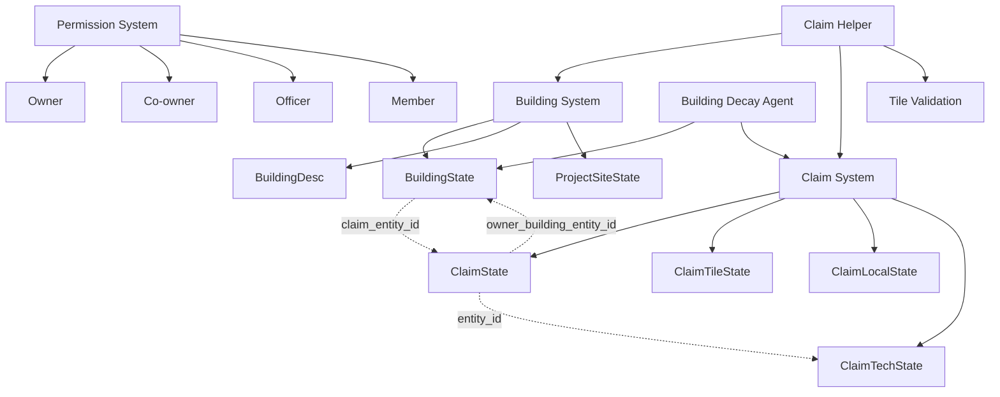
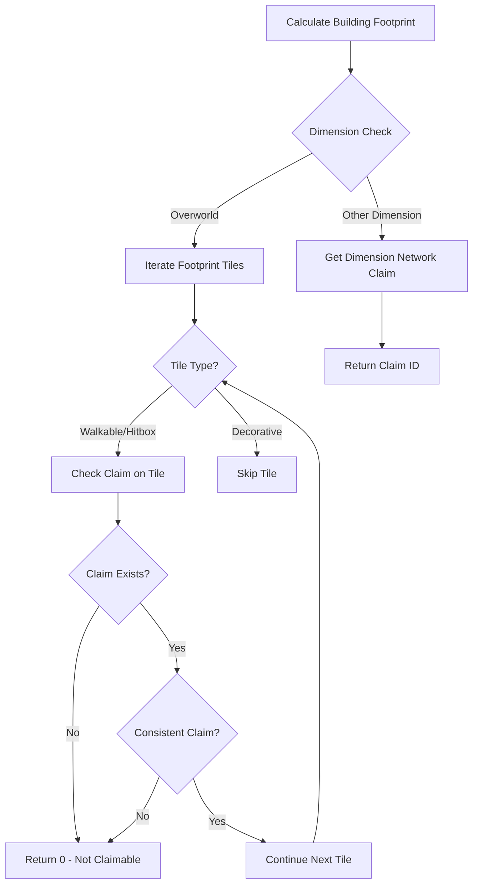

The Building and Claim System forms the territorial and structural foundation of BitCraft, enabling players to establish ownership, construct structures, and organize settlements within the procedural hex-grid world. This system integrates spatial claims, building placement, maintenance mechanics, and hierarchical permissions into a cohesive territorial management framework.

## System Architecture Overview

The architecture operates on a multi-layered foundation where buildings serve as claim anchors, claims define territorial boundaries, and permissions govern access control. The system employs hexagonal coordinate systems for precise spatial calculations and maintains separate entity states for buildings, claims, and their relationships.

## Claim Core Mechanics

### Claim Structure and State Management

Claims are territorial domains anchored to a central building, typically a claim totem. The `ClaimState` entity stores claim metadata including owner information, while `ClaimLocalState` tracks dynamic properties such as supplies consumption, tile count, and building maintenance costs. Claims maintain a bidirectional relationship with their owner building through the `owner_building_entity_id` field, enabling efficient reverse lookups [claim_description.rs](BitCraftServer/packages/game/src/game/entities/claim_description.rs#L1-L100).

Territorial boundaries are represented through individual `ClaimTileState` entities, each linked to a specific hexagonal coordinate. This granular tile-based approach enables precise spatial queries and supports complex claim geometries. The system employs caching mechanisms through `ClaimTileStateCache` to optimize frequent tile lookups during placement validation and footprint verification operations [claim_tiles.rs](BitCraftServer/packages/game/src/game/entities/claim_tiles.rs#L1-L14).

### Claim Technology and Progression

Claims advance through a technology tree represented by `ClaimTechState`, which tracks learned technologies and calculates derived limits. The technology system governs three critical parameters: maximum territory size (`max_tiles`), maximum membership capacity (`max_members`), and maximum supply storage (`max_supplies`). Each technology learned by a claim can increase one or more of these limits, with the maximum value across all learned technologies taking precedence [claim_tech_state.rs](BitCraftServer/packages/game/src/game/entities/claim_tech_state.rs#L1-L52).

<CgxTip>Claim technologies are cumulative—the system always uses the highest value from all learned technologies for each limit. This means players can strategically choose tech combinations that provide balanced expansion across all dimensions without redundant investment.</CgxTip>

### Permission Hierarchy

The permission system implements a four-tier hierarchy that determines what actions players can perform within a claim. The `has_co_owner_permissions` method checks both direct ownership and co-owner status, providing a convenient accessor for administrative operations. Permission checks cascade through ownership checks first, then member state lookups, ensuring that owners retain ultimate authority regardless of their membership record [claim_description.rs](BitCraftServer/packages/game/src/game/entities/claim_description.rs#L60-L85).

The permission levels in descending order of authority are:

| Permission Level | Capabilities | Access Method |
|-----------------|--------------|---------------|
| Owner | Full control, can transfer ownership, delete claim | Direct ownership comparison |
| Co-owner | Can modify territory, manage members, spend treasury | Member state with co_owner_permission flag |
| Officer | Limited administrative access, can manage basic operations | Member state with officer_permission flag |
| Member | Basic access, can interact with permitted buildings | Member record without elevated permissions |

## Building Placement and Claim Integration

### Footprint-Based Claim Verification

Buildings occupy spatial territories defined by their footprints, which are collections of coordinate-type pairs representing walkable, hitbox, and decorative areas. The `get_claim_under_building` function verifies that all walkable and hitbox footprint tiles fall under a single, consistent claim. If a building's footprint spans multiple claims or partially overlaps unclaimed territory, the building cannot be claimed by any claim [claim_helper.rs](BitCraftServer/packages/game/src/game/claim_helper.rs#L12-L30).

The footprint validation process follows this logic:

### Project Site Construction Process

Building construction occurs through a two-phase process starting with project site placement. The `project_site_place` reducer validates player permissions, knowledge prerequisites, and spatial requirements before creating a `ProjectSiteState` entity. During placement, the system checks whether the building footprint overlaps existing claims, with different behaviors for claim totems versus other building types [project_site_place.rs](BitCraftServer/packages/game/src/game/handlers/buildings/project_site_place.rs#L1-L150).

For claim totems specifically, the system enforces minimum distance constraints from existing claims using `can_place_claim_totem`. This prevents claim overcrowding and ensures territorial expansion occurs naturally through adjacency rather than concentration. Once constructed, claim totems automatically create new claims with an initial territorial radius defined by their `BuildingClaimDesc` configuration [world_place_building.rs](BitCraftServer/packages/game/src/game/handlers/world/world_place_building.rs#L95-L115).

### Building Claim Association

Buildings become associated with claims through the `BuildingState::claim` method, which performs several critical operations. First, it validates that the building isn't already claimed. If the building has maintenance costs, it increments the claim's `building_maintenance` tracker, which affects supply consumption rates. The system also handles special cases like portal buildings, which automatically claim their entire interior dimension network when placed under a claim [building_state.rs](BitCraftServer/packages/game/src/game/entities/building_state.rs#L80-L130).

The claiming process extends beyond the base building state to related components:
- Waystones: Enable fast travel within the claim
- Banks: Store claim treasury and player funds
- Marketplaces: Facilitate trade under claim jurisdiction

<CgxTip>Building maintenance is cumulative—every building claimed adds to the claim's total maintenance cost. Players must balance territorial expansion with supply production capacity, as claims with insufficient supplies will cease maintaining their buildings, leading to potential collapse.</CgxTip>

## Claim Territory Management

### Tile Expansion Rules

Claims expand by adding adjacent tiles through the `claim_add_tile` reducer, which enforces several spatial and gameplay constraints. Tiles must be adjacent to existing claimed territory, cannot overlap other claims, and must maintain minimum distances from foreign claims as defined by game parameters. The system also prevents claiming within spawn areas (Safe Meadows biome) to preserve new player experience [claim_add_tile.rs](BitCraftServer/packages/game/src/game/handlers/claim/claim_add_tile.rs#L1-L98).

The tile addition process validates against multiple failure conditions:
- Permission: Only co-owners and above can modify claims
- Dimension: Cannot claim interior dimensions
- Adjacency: New tiles must touch existing claims
- Distance: Must maintain separation from other claims
- Tech limits: Cannot exceed `max_tiles` from claim technology
- Contiguity: Cannot create claim enclosures around other claims

### Tile Removal Constraints

Removing claim tiles requires additional validation to prevent territorial fragmentation. The `claim_remove_tile` reducer ensures that removing a tile won't orphan other claim areas, meaning all remaining tiles must maintain a connected path to the claim center. The system uses a flood-fill algorithm starting from the claim center, verifying that all claimed tiles remain reachable [claim_remove_tile.rs](BitCraftServer/packages/game/src/game/handlers/claim/claim_remove_tile.rs#L1-L100).

Additional removal restrictions include:
- Cannot remove tiles within the claim's initial radius
- Cannot unclaim tiles containing buildings or project sites
- Cannot remove tiles that would separate the claim into disconnected regions

## Maintenance and Decay System

### Supply Consumption Mechanics

Claims consume supplies based on their territorial size and building maintenance costs. The `building_decay_agent` runs periodically to deduct supplies from claims, calculated as `full_maintenance` which accounts for both tile count and building maintenance requirements. When supplies reach zero, claims can no longer maintain their buildings, triggering the decay process for all claimed structures [building_decay_agent.rs](BitCraftServer/packages/game/src/agents/building_decay_agent.rs#L45-L85).

The maintenance calculation formula considers:
- Base supply cost per tile
- Cumulative building maintenance (`building_maintenance` from ClaimLocalState)
- Claim technology modifiers

### Unclaimed Building Decay

Buildings not associated with any claim are subject to rapid decay. The building decay agent systematically reduces health of all unclaimed buildings each tick, eventually causing their destruction when health reaches zero. This mechanism prevents abandonment of structures and encourages players to either claim their buildings or dismantle them intentionally [building_decay_agent.rs](BitCraftServer/packages/game/src/agents/building_decay_agent.rs#L30-L45).

Conversely, buildings within claims with sufficient supplies receive automatic healing, creating a strong incentive for maintaining supply reserves. This duality of decay and reinforcement reinforces the territorial nature of the game—claims protect investments, while neglect leads to loss.

## Permission and Access Control

### Building Interaction Levels

Buildings define interaction requirements through their descriptions, specifying which permission levels can access their functionality. The `BuildingInteractionLevel` enum defines four tiers: `All` (public access), `None` (restricted), `Empire` (empire-aligned only), and `ClaimOwner` (claim members only). The `can_interact_with_building` function evaluates these requirements against the requesting player's permissions and claim affiliations [permission_helper.rs](BitCraftServer/packages/game/src/game/permission_helper.rs#L15-L60).

The permission resolution logic follows this hierarchy:
1. Check building interaction level from description
2. For `All` permission, grant access immediately
3. For `ClaimOwner` permission, verify claim membership
4. For `Empire` permission, verify empire alignment and empire-specific permissions
5. For `None` permission, deny access universally

### Tile-Based Permission Checks

The `can_interact_with_tile` function provides a unified interface for checking whether a player can perform specific actions on a given tile. Actions include building placement, resource harvesting, and terraforming, each requiring different permission levels defined by `ClaimPermission`. If a tile is unclaimed, access is automatically granted, but claimed tiles require membership verification [permission_helper.rs](BitCraftServer/packages/game/src/game/permission_helper.rs#L8-L13).

| Claim Permission | Typical Actions | Required Role |
|------------------|-----------------|---------------|
| Build | Place buildings, modify structures | Owner/Co-owner |
| Usage | Interact with buildings, activate functions | Owner/Co-owner/Officer/Member (varies by building) |
| Inventory | Access storage, manage items | Owner/Co-owner/Officer (varies by building) |
| Harvest | Gather resources, extract materials | Owner/Co-owner (varies by resource) |

## Empire Integration

### Settlement Alignment

Claims can align with empires through the `EmpireSettlementState` entity, which establishes the connection between a claim and an empire entity ID. This alignment enables empire-specific building placement and unlocks imperial features. The `claim_create_empire_settlement_state` inter-module function propagates settlement state across server regions, ensuring consistent empire alignment regardless of player location [claim_create_empire_settlement_state.rs](BitCraftServer/packages/global_module/src/inter_module/claim_create_empire_settlement_state.rs#L1-L35).

### Empire Building Placement Rules

Empire buildings require special placement validation. Watchtowers, for example, must maintain minimum distance from existing claim totems to prevent empire encroachment on established settlements. Empire foundries have additional restrictions—they can only be built in empire capitals, identified by matching the claim's owner building with an empire capital record [world_place_building.rs](BitCraftServer/packages/game/src/game/handlers/world/world_place_building.rs#L115-L145).

The empire building validation process includes:
- Watchtower proximity checks against settlement totems
- Verification that the underlying claim is empire-aligned
- Capital verification for foundries
- Empire permission checks for the constructing player

## System Interdependencies

The Building and Claim System deeply integrates with several other game systems:

- **[Agent System](10-agent-lifecycle-and-scheduling)**: The building decay agent is a scheduled agent that runs periodically to process supply consumption and building health updates
- **[Permission and Access Control](27-permission-and-access-control)**: The claim permission system extends the global permission framework with claim-specific role hierarchies
- **[Inventory and Item Stacks](17-inventory-and-item-stacks)**: Building construction requires material consumption from player inventories, and claim treasuries use inventory mechanics for supply storage
- **[Procedural World Generation](6-world-generator-architecture)**: The hex grid coordinate system used for claims originates in the world generation system, ensuring consistent spatial references

## Next Steps

To deepen your understanding of the BitCraft architecture, explore these related systems:

- **[Building Construction](22-building-construction)** - Learn about the complete building lifecycle from project site placement to completion
- **[Claim and Empire Management](23-claim-and-empire-management)** - Explore empire-level operations including diplomacy and warfare
- **[Permission and Access Control](27-permission-and-access-control)** - Understand the broader permission system that extends beyond claims
- **[Building Decay Agent](12-building-decay-agent)** - Examine the decay system in detail, including configuration and tuning
