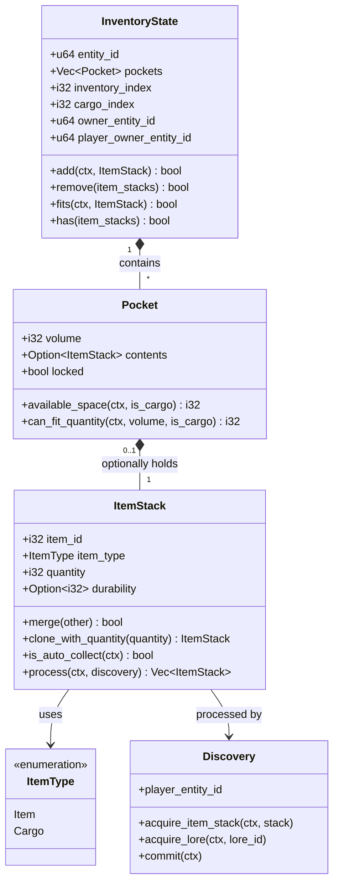

The inventory and item stack system in BitCraft forms the foundational infrastructure for managing all physical objects within the game world. This system enables sophisticated item manipulation across multiple inventory types, supports volume-based capacity constraints, and provides probabilistic item generation through item lists. The architecture emphasizes type safety, transaction integrity, and seamless integration with the broader entity management system.

## Core Data Structures

The inventory system is built upon three primary abstractions: ItemStack, Pocket, and InventoryState. Each serves a distinct purpose in the item management hierarchy, from individual item representation to comprehensive inventory containers.

### ItemStack

The `ItemStack` struct represents a collection of identical items with a single, atomic unit that can be stacked, moved, and processed as one entity. Each stack contains an `item_id` identifying the specific item, an `item_type` enum distinguishing between regular items and cargo, a `quantity` field for the count, and an optional `durability` field that tracks degradation for items that suffer wear over time. ItemStack implements `Copy`, enabling efficient value semantics throughout the system. The type enum supports two variants: `ItemType::Item` for standard game items and `ItemType::Cargo` for bulk resources that occupy inventory space differently. ItemStacks can be constructed through multiple factory methods: `new()` creates a stack with durability initialized from the item definition, `new_ignore_durability()` bypasses durability calculations, and static constructors like `hex_coins()` and `single_cargo()` provide convenient creation for common item types. The `merge()` operation enables combining two stacks when they share identical item_id and item_type, with the quantity aggregated automatically. This merging capability is essential for efficient inventory operations, as it reduces fragmentation by consolidating like items into larger stacks. The system also provides `merge_multiple()` for processing entire vectors of stacks, producing a merged vector where duplicate items are consolidated.

Sources: [item_stack.rs](BitCraftServer/packages/game/src/game/entities/item_stack.rs#L1-L100)

### Pocket

The `Pocket` abstraction represents a single storage slot within an inventory container. Each pocket has a `volume` attribute defining its capacity in volume units, a `contents` field holding an optional `ItemStack`, and a `locked` flag preventing operations when set. Pocket implements methods for space calculation and quantity manipulation that respect volume constraints. The `available_space()` method calculates remaining capacity by subtracting the occupied volume of any contained ItemStack from the pocket's total volume. When no contents exist, the full volume is available. For volume calculations, the system retrieves the item definition from either `item_desc` or `cargo_desc` tables based on the ItemType, enabling consistent volume handling across item types. The `can_fit_quantity()` method determines how many items of a specified volume can be accommodated, returning `i32::MAX` when volume constraints are zero or negative (indicating unlimited capacity). Pocket provides operations for quantity manipulation: `remove_quantity()` extracts a specified count from contained items, returning the actual quantity removed, while `add_quantity()` appends to existing stack quantities. The `set()` method allows direct assignment of item stack contents, and `empty()` creates a vacancy with specified volume for initialization purposes.

Sources: [pocket.rs](BitCraftServer/packages/game/src/game/entities/pocket.rs#L1-L73)

### InventoryState

The `InventoryState` entity represents a complete inventory container composed of multiple pockets. It maintains a `pockets` vector organizing all storage slots, an `inventory_index` distinguishing between different inventory types (0 for player inventory, 1 for toolbelt, 2 for wallet), a `cargo_index` demarcating the boundary between item pockets and cargo pockets, an `owner_entity_id` identifying the possessing entity, and a `player_owner_entity_id` linking to the player owner when applicable. The inventory creation process through `create_with_pockets()` initializes pockets with appropriate volumes based on their position relative to the cargo_index—pockets before this index receive `item_pocket_volume`, while those after receive `cargo_pocket_volume`. This design enables hybrid inventories supporting both items and cargo within the same container. The `add()` operation attempts to insert an ItemStack into the inventory, returning success only if the entire quantity fits. The implementation employs a two-phase strategy: first filling existing partial pockets containing the same item type and ID without durability mismatches, then occupying empty pockets of the appropriate type (item or cargo) based on the pocket index relative to `cargo_index`. The `add_partial()` variant supports partial insertions, modifying the input ItemStack to reflect any quantity that couldn't be accommodated.

Sources: [inventory_state.rs](BitCraftServer/packages/game/src/game/entities/inventory_state.rs#L1-L299)

## Inventory Operations

The inventory system provides comprehensive operations for manipulating items through a handler-based architecture, with each reducer addressing specific player actions while maintaining consistency and enforcing game rules.

### Item Movement

Item transfer between inventories is handled by the `item_stack_move` reducer, which validates source and target inventory accessibility before executing the transfer. The operation begins by confirming the player is not incapacitated and refreshing the player timestamp to maintain activity tracking. Source and target inventories are retrieved and validated for interaction permissions, which include distance constraints and ownership verification. The `inventory_helper::validate_interact()` function performs comprehensive checks: for player inventories, ownership is confirmed; for building inventories, category verification ensures the building supports item storage (Storage, TradingPost, Barter, RentTerminal, or Bank categories); for deployables, ownership and distance constraints are enforced; for loot chests and dropped inventories, tile interaction permissions are validated. When transferring cargo to buildings with typed storage (where each slot accepts specific cargo IDs), the system identifies valid target slots by matching cargo IDs against the building function's `allowed_item_id_per_slot` configuration, preventing invalid cargo placement. The actual transfer uses `InventoryState::add_partial_to_inventory_and_discover()`, which integrates discovery tracking for new item acquisitions.

Sources: [item_stack_move.rs](BitCraftServer/packages/game/src/game/handlers/inventory/item_stack_move.rs#L1-L150)

### Item Acquisition

Players acquire items from dropped inventories through the `item_pick_up` reducer, which handles two distinct pickup scenarios based on the `to_deployable` flag. For direct player inventory pickup, the system validates the dropped inventory's accessibility and retrieves the item stack from the specified pocket index, confirming the item ID matches the request to prevent race conditions. A `Discovery` instance tracks newly discovered items, and the `InventoryState::add_partial_and_discover()` method attempts to add items to the player's inventory while simultaneously registering discoveries. The operation succeeds only if at least one item was actually transferred; otherwise, the reducer returns an error indicating insufficient inventory space. For deployable pickup (the `to_deployable` path), the system attempts to distribute items to nearby deployables through `deposit_to_player_inventory_and_nearby_deployables()`, using a distance function to prioritize closer storage containers. This enables efficient bulk material transfer from ground piles to nearby deployable storage structures, a common pattern when harvesting resources near storage facilities. After successful transfer, the `update_inventories()` function removes the transferred quantity from the dropped inventory and commits discovery updates.

Sources: [item_pick_up.rs](BitCraftServer/packages/game/src/game/handlers/player_inventory/item_pick_up.rs#L1-L92)

### Item Dropping

The `item_drop` reducer enables players to discard items from their inventory or equipment slots, creating dropped inventories in the game world that persist independently. The operation begins by retrieving the player's location for spawn point calculation and determining the item stack source. For equipment slots, the reducer retrieves the equipment state, identifies the equipped item from the specified slot, clears the slot, and triggers `PlayerState::collect_stats()` to update character statistics based on the unequipped item. For inventory slots, the system validates interaction permissions with the source inventory, retrieves the item stack from the specified pocket, removes it via `remove_at()`, and when dropping from the toolbelt (inventory_index == 1), calls `PlayerState::on_removed_from_toolbelt()` to handle tool-specific cleanup. The spawn location selection includes intelligent corner avoidance logic: when the player is positioned on a corner tile, the system evaluates neighboring tiles to find a suitable drop location that respects elevation constraints (maximum 4-unit difference), permission requirements (Usage permission on the tile), and footprint collision (avoiding Hitbox and Walkable footprints). This prevents items from being dropped on impassable terrain or in locations where they would become permanently inaccessible.

Sources: [item_drop.rs](BitCraftServer/packages/game/src/game/handlers/inventory/item_drop.rs#L1-L129)

## Advanced Inventory Features

The inventory system incorporates sophisticated mechanisms for item processing, durability management, and permission validation that extend beyond basic storage and retrieval operations.

### Item Processing and Discovery

The `ItemStack::process()` method implements a multi-stage transformation pipeline that prepares incoming items for integration into the inventory system. The pipeline begins with discovery tracking, where a provided `Discovery` instance registers the item and its contained components in the player's discovered items registry. Next, the system resolves ItemList references through `ItemListDesc::extract_item_stacks_from_item()`, which recursively expands nested item lists into their constituent ItemStacks. This enables items to represent probabilistic loot tables that yield varying contents when "processed." For items with an `item_list_id` in their definition, the extraction process performs a roll for each quantity unit in the original stack, potentially yielding multiple output stacks. The discovery phase continues on the resolved items, with special handling for auto-collectible items: collectibles marked with `auto_collect` are automatically added to the player's vault, and knowledge scrolls marked for auto-collection immediately grant their associated lore or secondary knowledge. Durability normalization occurs in the final stage, where stacks with durability of 0 are converted to `None` to represent pristine items without degradation. The `process_all()` convenience method applies this pipeline to vectors of stacks, consolidating results into a single output vector for batch processing scenarios.

Sources: [item_stack.rs](BitCraftServer/packages/game/src/game/entities/item_stack.rs#L150-L286)

### Durability System

Item durability provides a mechanism for tracking equipment degradation through use, with zero durability triggering item transformation or destruction. The `InventoryState::reduce_tool_durability()` function handles durability reduction for tools equipped in the toolbelt inventory. The system identifies the appropriate tool slot based on the `tool_type` parameter (converting from 1-based to 0-based indexing), retrieves the current durability value, and subtracts the specified `durability_lost` amount. When durability reaches zero or below, the system checks the item definition's `convert_to_on_durability_zero` field to determine the outcome. If this field is zero, the item is destroyed (pocket contents cleared and `on_removed_from_toolbelt()` called). If a conversion item ID is specified, the system creates a new ItemStack of that type, tracks discovery for the replacement item, and attempts to add it to the player's inventory via `deposit_to_player_inventory_and_nearby_deployables()`. This enables equipment to morph into degraded or broken versions (e.g., a pristine tool becoming a worn version) rather than disappearing entirely, preserving player progress while representing wear and tear.

Sources: [inventory_state.rs](BitCraftServer/packages/game/src/game/entities/inventory_state.rs#L500-L699)

### Permission and Access Control

Inventory interactions are governed by a comprehensive permission system that validates authorization at multiple levels. The `inventory_helper::validate_interact()` function serves as the central validation routine, returning an `InventoryType` enum indicating the nature of the accessible inventory. For player-owned inventories, ownership is trivially confirmed. For building inventories, the system validates that the player is within `MAX_INTERACTION_DISTANCE` (2 tiles), that the building category permits inventory interaction, and that both permission states (claim-based and permission helper systems) grant inventory access rights. Barter stalls impose additional restrictions, requiring co-owner status beyond basic inventory permissions. Deployable inventory interaction requires ownership verification and distance checking (up to `MAX_DEPLOYABLE_INTERACTION_DISTANCE` of 10 tiles), with mounted deployables bypassing distance requirements. Loot chests and dropped inventories enforce tile-based permission checks, requiring Usage permission on both the permission state and claim permission systems. The `validate_move()` function enforces directional restrictions, preventing item movement into loot chests (which only support extraction) and dropped inventories (which require manual dropping rather than direct transfers).

Sources: [inventory_helper.rs](BitCraftServer/packages/game/src/game/handlers/inventory/inventory_helper.rs#L1-L150)

### Inventory Doubling

The `InventoryState::double()` method supports inventory capacity expansion by duplicating existing pockets while maintaining the cargo index boundary. The implementation creates a new pockets vector by first copying the original item pockets (indices 0 to cargo_index-1), then appending empty pockets with matching volumes. This process repeats for cargo pockets (indices cargo_index to end), effectively doubling both item and cargo storage capacity. The `inventory_index` and `cargo_index` are also doubled to maintain proper indexing in the expanded space. This pattern enables inventory upgrades without data migration complexity, as existing pockets retain their positions while new capacity is appended at the end of each section.

Sources: [inventory_state.rs](BitCraftServer/packages/game/src/game/entities/inventory_state.rs#L100-L299)

## Inventory Architecture

The inventory system implements a multi-layered architecture that separates concerns between data representation, business logic, and player interaction handlers.

The architecture demonstrates clear separation of concerns: ItemStacks represent atomic item quantities, Pockets provide volume-constrained storage units, and InventoryState composes pockets into functional containers. The ItemType enum distinguishes between regular items and bulk cargo, which receive different handling for volume calculations and storage placement. Discovery tracking operates orthogonally to inventory operations, automatically registering new items without requiring explicit management from calling code.

Sources: [item_stack.rs](BitCraftServer/packages/game/src/game/entities/item_stack.rs#L1-L100), [inventory_state.rs](BitCraftServer/packages/game/src/game/entities/inventory_state.rs#L1-L299)

## Item List and Probabilistic Generation

The `ItemListDesc` system enables probability-weighted item generation for loot tables, resource deposits, and reward structures. Each item list contains an array of possibility entries, each with a probability weight and associated item stacks. The `roll()` method performs weighted random selection based on cumulative probability calculations: it first sums all probability weights, then generates a random value in the range [0, sum], and iterates through possibilities subtracting probabilities until the random value becomes zero or negative, indicating selection. This approach enables precise control over drop rates without requiring expensive rejection sampling algorithms. The system supports nested item lists through recursive resolution: when a selected item has a non-zero `item_list_id`, the system recursively extracts item stacks from the referenced list, enabling complex loot tables with multiple layers of probability. The `extract_item_stacks_from_item()` method handles the conversion from ItemList-referencing items to their constituent ItemStacks, rolling once per quantity unit in the source stack to support variable outputs.

Sources: [item_list.rs](BitCraftServer/packages/game/src/game/entities/item_list.rs#L1-L100)

## Integration with Game Systems

The inventory system integrates deeply with BitCraft's entity management, permission system, and discovery tracking to provide a cohesive item management experience.

### Entity Lifecycle Integration

Inventories are attached to entities through the `owner_entity_id` field, creating relationships with players, buildings, deployables, loot chests, and dropped inventories. Player-specific inventories are identified by index values: 0 for the main backpack inventory, 1 for the quick-access toolbelt, and 2 for the currency wallet. Convenience methods like `get_player_inventory()`, `get_player_toolbelt()`, and `get_player_wallet()` retrieve these specific inventories by querying for the appropriate owner and index combination. Building inventories support player-owned storage through bank functions, where `inventory_create_personal()` creates dedicated storage compartments for individual players within shared building structures. This enables banking systems where multiple players maintain secure, segregated storage within the same building entity.

Sources: [inventory_state.rs](BitCraftServer/packages/game/src/game/entities/inventory_state.rs#L500-L699), [inventory_create_personal.rs](BitCraftServer/packages/game/src/game/handlers/inventory/inventory_create_personal.rs#L1-L57)

### Discovery Tracking Integration

The inventory system automatically tracks item discoveries through the Discovery component, which registers items players encounter for the first time. The `acquire_item_stack()` method recursively processes item stacks and their nested components, ensuring that all constituent items from ItemList expansions are properly registered. Special handling for auto-collectible items ensures that collectibles and knowledge scrolls are immediately integrated into their respective systems (vault collectibles and lore/knowledge registries) rather than remaining as physical inventory items. This automatic discovery tracking eliminates boilerplate from inventory handlers, as the processing pipeline handles registration transparently. The discovery commit operation propagates changes to persistent storage, ensuring that discovery progress persists across game sessions.

Sources: [item_stack.rs](BitCraftServer/packages/game/src/game/entities/item_stack.rs#L150-L286)

## Summary

The inventory and item stack system in BitCraft represents a sophisticated implementation of storage management that balances performance, flexibility, and game-specific requirements. The volume-based pocket system provides fine-grained capacity control, the ItemStack abstraction enables efficient aggregation and manipulation of identical items, and the handler-based architecture provides clear separation between data structures and game logic. The integration with discovery tracking, permission systems, and probabilistic item generation creates a cohesive system that supports complex gameplay patterns like banking, trading, crafting, and exploration rewards. The extensibility of the inventory system through typed storage slots, cargo/item differentiation, and nested item lists provides developers with powerful tools for creating diverse inventory-based mechanics while maintaining consistent behavior across different inventory types.

For understanding how inventory operations integrate with player movement and interactions, see [Player Movement and Actions](21-player-movement-and-actions). The discovery system's integration with inventory operations is further explored in [Quest and Achievement System](28-quest-and-achievement-system). For inventory interactions with building systems, refer to [Building Construction](22-building-construction).
