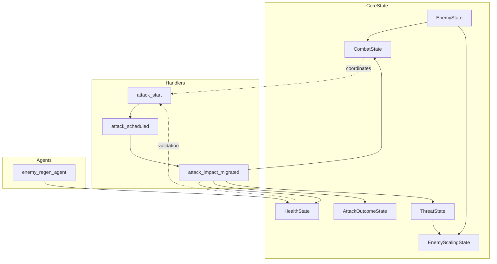
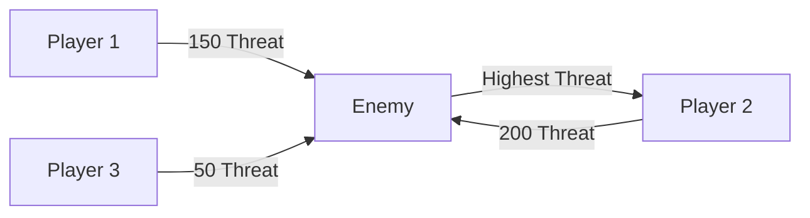

The combat and enemy state system in BitCraft forms a sophisticated network of interconnected components that manage combat interactions, enemy behavior, damage calculations, and threat management across multiple entity types including players, enemies, and buildings. This system leverages SpacetimeDB's scheduled reducer architecture to handle complex timing scenarios like attack wind-ups, projectile travel times, and regeneration cycles.

## Architecture Overview

The combat system is built around several core state types that work together to create a comprehensive combat experience:



The architecture demonstrates a clear separation of concerns where state management, attack handling, and background regeneration are distinct but interconnected systems. Combat flows through multiple stages from initiation to impact, with each stage having its own validation and processing logic.

## Combat State Management

The `CombatState` entity serves as the foundation for tracking an entity's combat readiness and timing information. Each combat-capable entity maintains a combat state that tracks attack cooldowns, global cooldowns, and recent combat activity.

The combat state initialization creates cooldown entries for each available attack, with enemies defaulting to "CHARGE" and "AGGRO" attack types. The system maintains both individual attack cooldowns through `AbilityState` and a global cooldown that prevents rapid ability usage.

```rust
CombatState {
    entity_id,
    last_attacked_timestamp: 0,
    global_cooldown: Some(ActionCooldown {
        timestamp: 0,
        cooldown: 0.0,
    }),
    last_performed_action_entity_id: 0,
}
```

Sources: [combat_state.rs](BitCraftServer/packages/game/src/game/entities/combat_state.rs#L1-L24)

The global cooldown mechanism ensures that entities cannot chain combat actions too rapidly, creating natural pacing in combat encounters. When an entity performs an attack, the system updates the combat state's timestamp and last performed action entity ID, which allows clients to synchronize combat animations and effects.

## Enemy Entity Structure

Enemies represent a distinct entity type with specialized state tracking and behavior patterns. The `EnemyState` encapsulates fundamental enemy properties including their type classification, herd association for group behaviors, facing direction, and activity status.

During enemy spawning, the system creates a comprehensive set of interconnected state entities:

- **Location State**: Position tracking using hex grid coordinates
- **Health State**: Health tracking with death timestamp management
- **EnemyMobMonitorState**: For enemies associated with herds, tracks herd location and association
- **CrumbTrailContributionLockState**: Manages contribution locks for prize enemies
- **TargetableState**: Marks the entity as valid for targeting
- **CombatState**: Combat capability tracking with attack cooldowns
- **AttackOutcomeState**: Damage and combat result tracking
- **ActiveBuffState**: Buff and debuff management

Sources: [enemy_state.rs](BitCraftServer/packages/game/src/game/entities/enemy_state.rs#L1-L107)

The spawning system demonstrates the complexity of entity initialization in BitCraft, where a single logical enemy requires multiple state tables to be properly configured. This design allows for modular functionality where each system (health, combat, buffs) operates independently while sharing a common entity identifier.

Enemies maintain an `EnemyStatus` field that can be `Inactive` or other active states, controlling their participation in combat encounters. The `last_ranged_attack_timestamp` field provides timing control for ranged enemy attacks, preventing ability spamming.

## Attack Flow and Timing

The attack system implements a multi-stage process that handles the delay between attack initiation and impact. This two-phase approach supports both instant attacks (melee) and delayed attacks (projectile-based).

### Attack Initiation Phase

The `attack_start` reducer serves as the entry point for combat actions, performing initial validation and scheduling the actual attack processing. Player and enemy attacks follow different paths through this system:

For players, the system validates that the attacker is signed in and not incapacitated, then initiates a player action with a wind-up delay. Player attacks while mounted have additional validation to ensure the deployable allows hunting and the target is huntable.

For enemies, the attack system creates an `AttackTimer` scheduled reducer that will execute the actual attack logic after the wind-up period. This allows enemy AI to initiate attacks with appropriate timing while maintaining server authority over the actual damage calculation.

```rust
AttackTimer {
    scheduled_id: 0,
    scheduled_at: now_plus_secs_f32(delay, ctx.timestamp),
    attacker_entity_id: request.attacker_entity_id,
    defender_entity_id: request.defender_entity_id,
    combat_action_id: request.combat_action_id,
    attacker_type: request.attacker_type,
    defender_type: request.defender_type,
}
```

Sources: [attack.rs](BitCraftServer/packages/game/src/game/handlers/attack.rs#L1-L150)

### Attack Impact Phase

When the attack timer fires, the `attack` reducer processes the actual combat logic. This phase includes multi-target detection, range validation, and damage calculation. The system supports area-of-effect attacks through `CombatActionMultiHitDesc`, which defines maximum secondary targets and targeting radius.

The attack flow creates `AttackImpactTimerMigrated` entries for both instant and projectile attacks. For projectile attacks, the timer delay is calculated based on distance divided by projectile speed, creating realistic travel times.

<CgxTip>The separation between attack initiation and impact allows the server to validate all conditions at both stages, preventing exploits where players might move out of range after initiating an attack. This architecture ensures combat actions remain authoritative even with network latency.</CgxTip>

## Damage Calculation and Outcomes

The damage calculation system in BitCraft implements a sophisticated hit resolution system that accounts for multiple factors including attacker statistics, defender defenses, critical hit chances, and dodge mechanics. The `calculate_hit_outcome` function (referenced but not shown in detail) produces a tuple of (damage, scaled_damage, dodged, critical) that determines the attack's effectiveness.

The `AttackOutcomeState` entity tracks the most recent combat result for each entity:

```rust
AttackOutcomeState {
    entity_id,
    last_attacked_timestamp: 0,
    damage: 0,
    crit_result: false,
    dodge_result: false,
}
```

Sources: [attack_outcome_state.rs](BitCraftServer/packages/game/src/game/entities/attack_outcome_state.rs#L1-L22)

When an attack impacts, the system updates the defender's attack outcome state with the result, allowing clients to display appropriate visual and audio feedback. The outcome state includes the final damage value after all modifiers, whether the attack was critical, and whether the defender dodged.

Damage application includes special handling for "ignore_damage" flags on certain enemy types and buildings, which can make entities immune to certain damage sources. When damage is applied, the system integrates with the contribution tracking system for enemies that support it, allowing players to receive credit for their damage toward rewards.

<CgxTip>The health delta system applies damage through `add_health_delta`, which automatically clamps values to prevent negative health and updates the last health decrease timestamp. This timestamp is used by the regeneration system to determine when passive regeneration can begin.</CgxTip>

## Threat and Aggression System

The threat system manages enemy aggression and target selection through a network of `ThreatState` entities. Each threat entry represents a directed relationship where one entity generates threat toward another, commonly representing enemies targeting players or players gaining threat on enemies.



The threat system supports two fundamental operations:

1. **Add Threat**: Increments threat from one entity toward another. When a new threat relationship is created, the system triggers `EnemyScalingState::update` to adjust the enemy's difficulty based on the number of distinct threats.

2. **Equalize Threat Then Add**: Used by taunt mechanics to set threat to the current maximum plus a value, forcing the target to switch attention. This enables tanking abilities where defenders can draw enemy attention away from other party members.

Sources: [threat_state.rs](BitCraftServer/packages/game/src/game/entities/threat_state.rs#L1-L100)

Threat generation in combat follows a multi-factor formula: `base_threat + threat_per_damage * damage`. Additionally, attacks generate self-threat (threat generated by the attacker on the target), with separate multipliers for buildings versus enemies. The `is_taunt_action` flag on combat actions determines whether the attack uses equalization or additive threat.

## Enemy Scaling System

The enemy scaling system provides dynamic difficulty adjustment based on the number of players engaging an enemy. This system ensures that content remains challenging regardless of group size, while still allowing smaller groups to overcome encounters through skill.

```rust
EnemyScalingState {
    entity_id,
    enemy_scaling_id,
}
```

Sources: [enemy_scaling_state.rs](BitCraftServer/packages/game/src/game/entities/enemy_scaling_state.rs#L1-L43)

The scaling process counts distinct threat entries (players currently engaging the enemy) and selects the highest applicable scaling tier from the static data configuration. Each scaling tier specifies a `required_players_count` threshold, and the system applies the highest tier that the threat count meets.

Scaling is triggered whenever a new threat relationship is created (player starts attacking) or removed (player stops attacking), ensuring dynamic adjustment throughout combat encounters. The scaling data can modify enemy statistics, health, damage output, and other combat parameters through the referenced `enemy_scaling_id`.

## Health and Incapacitation

The health system provides unified health management across all entity types with shared mechanics for damage application, healing, and incapacitation detection. The `HealthState` entity tracks current health along with timestamps for the last health decrease and death.

Health modification uses the `add_health_delta` method which handles damage (negative values) and healing (positive values) with automatic bounds checking. The system maintains separate maximum health calculation methods for different entity types:

- Players: Derived from character stats and equipment
- Buildings: Based on building type and upgrades  
- Enemies: Determined by enemy type and scaling

Incapacitation is checked through `HealthState::check_incapacitated`, which validates that health is greater than zero and returns an error for dead entities. This validation is used throughout combat code to prevent actions by incapacitated entities and provide appropriate error messages.

Sources: [health_state.rs](BitCraftServer/packages/game/src/game/entities/health_state.rs#L1-L100)

The health system includes special handling for player health maximums, which are calculated dynamically based on character statistics and can be modified by equipment, buffs, and other factors. Enemy health maximums are primarily determined by static enemy data but can be modified by the scaling system.

## Enemy Regeneration System

The enemy regeneration system operates as a scheduled agent that periodically restores health to enemies outside of combat. This system ensures that enemies can reset between encounters while preventing regeneration during active combat.

```rust
EnemyRegenLoopTimer {
    scheduled_id: 0,
    scheduled_at: Duration::from_millis(tick_length).into(),
}
```

Sources: [enemy_regen_agent.rs](BitCraftServer/packages/game/src/agents/enemy_regen_agent.rs#L1-L100)

The regeneration process runs on a configurable tick interval (specified in `parameters_desc_v2`) and processes all enemies in the game world. Each enemy is evaluated for passive regeneration eligibility based on:

- Time since last damage (must exceed `min_seconds_to_passive_regen_health`)
- Not being in active combat (no threat entries)
- Not being incapacitated

The system supports buff-based regeneration through `ActiveHealthRegenRate` stat modifications, allowing enemies with specific buffs to regenerate at different rates. The regeneration amount is calculated based on the enemy's maximum health and configuration parameters.

The regeneration agent demonstrates the scheduled reducer pattern where background game logic runs on periodic intervals without player intervention, ensuring consistent game world behavior.

## Combat Action Abilities

Combat actions in BitCraft are implemented through the ability system, which provides a unified interface for tracking cooldowns, availability, and usage of all entity abilities including combat moves. Each combat action has an associated `AbilityState` that tracks cooldown timers and usage statistics.

When an attack is executed, the ability system updates the cooldown for the specific combat action being used:

```rust
ability_state.set_combat_action_cooldown(
    &combat_action,
    cooldown_multiplier,
    weapon_cooldown_multiplier,
    ctx.timestamp,
    false,
);
```

Sources: [attack.rs](BitCraftServer/packages/game/src/game/handlers/attack.rs#L350-L549)

Cooldown multipliers allow for temporary modification of ability speed through buffs, debuffs, and equipment bonuses. Enemy cooldowns are modified by `ActiveBuffState::collect_enemy_stats`, while player cooldowns consider both general and weapon-specific multipliers.

The ability system also handles global cooldown management, where successful combat actions set a shared cooldown that prevents use of any other abilities during the recovery period. This global cooldown is tracked in the `CombatState` entity.

## Targeting and Range Validation

The combat system includes sophisticated targeting validation that ensures attacks can only be executed against valid targets within range. The `targetable_entities_in_radius` function scans the surrounding area for potential targets based on multiple criteria:

- **Type Matching**: Ensures attacker can target the defender type (player vs enemy)
- **Level Requirements**: Validates that defender's defense level doesn't exceed attacker's attack level
- **Distance Checks**: Confirms target is within attack range considering entity radii
- **Health Status**: Excludes incapacitated targets
- **Targeting Matrix**: Applies faction and alliance rules through `TargetingMatrixDesc`
- **Buff Protections**: Respects protective buffs like Inner Light on players

Sources: [attack.rs](BitCraftServer/packages/game/src/game/handlers/attack.rs#L150-L349)

The range validation uses interpolated position calculation for mobile entities, accounting for movement between game ticks. This ensures that range checks reflect actual target positions rather than discrete tick positions, creating more responsive combat feel.

Multi-target attacks use the targeting system to identify additional targets within the attack's radius, with sorting by distance to ensure consistent target selection. The `CombatActionMultiHitDesc` specifies the maximum number of secondary targets that can be affected by area-of-effect attacks.

## Weapon Durability and Resource Costs

Combat actions have associated resource costs that are deducted when attacks execute:

- **Stamina**: Players consume stamina based on the combat action's `stamina_use` value
- **Weapon Durability**: Tools and weapons lose durability based on `weapon_durability_lost`
- **Special Resources**: Certain combat actions may consume other resources

The durability system identifies the appropriate tool type based on whether the target is a huntable enemy or standard combat target, applying durability loss to the correct equipment slot. This ensures that hunting weapons degrade when attacking huntable enemies while combat weapons degrade in normal combat.

Sources: [attack.rs](BitCraftServer/packages/game/src/game/handlers/attack.rs#L550-L749)

Durability reduction happens after damage calculation and impact, ensuring that weapon durability cannot prevent successful attacks that have already been initiated. This ordering prevents exploits where weapon breaking might interrupt combat resolution.

## Experience and Rewards

Combat success is integrated with the experience and reward systems through several mechanisms:

1. **Damage-Based Experience**: Players receive experience based on damage dealt to enemies
2. **Contribution Tracking**: For enemies with contribution locks, damage is tracked to determine reward eligibility
3. **Kill Credit**: The attacker that delivers the fatal blow receives special kill rewards

The `game_state_filters::award_experience_on_damage` function handles experience distribution during combat impact, scaling rewards based on the damage dealt and the enemy's difficulty level.

Sources: [attack.rs](BitCraftServer/packages/game/src/game/handlers/attack.rs#L550-L749)

The contribution system ties into the crumb trail mechanics, where players who contribute sufficient damage to prize enemies become eligible for special rewards. This system uses `CrumbTrailContributionLockState` to track which enemies have contribution requirements and which players have met the thresholds.

## Client Synchronization

The combat system is designed for networked multiplayer with careful attention to client-server synchronization:

- **Timestamp-Based Cooldowns**: All cooldowns use server timestamps for consistent timing across clients
- **Scheduled Timers**: Attack wind-ups and projectile travel are server-scheduled for authoritative timing
- **Outcome Broadcasting**: Attack results are broadcast to relevant clients for visual feedback
- **State Replication**: Combat state changes are automatically replicated through SpacetimeDB's subscription system

The `AttackOutcomeState` entity serves as a communication channel for combat results, allowing clients to display damage numbers, critical hit effects, and dodge outcomes based on server-authoritative results rather than client predictions.

This architecture ensures that combat interactions are consistent across all clients while maintaining responsive feel through predictive animations and effects that can be corrected when server results arrive.

## Integration Points

The combat and enemy state system integrates with numerous other game systems:

- **Buffs and Debuffs**: Combat actions apply buffs to attacker and target through `ActiveBuffState`
- **Character Stats**: Attack damage and defense are calculated from `CharacterStatsState`
- **Equipment**: Weapons and armor modify combat capabilities through `EquipmentState`
- **Inventory**: Consumables and tools are accessed through inventory system
- **Player Actions**: Combat is integrated with the broader player action system for state management
- **Quests**: Combat achievements can trigger quest progression

These integration points allow the combat system to leverage and modify game state across multiple domains, creating a cohesive gameplay experience where combat affects and is affected by many other game systems.

## Next Steps

For deeper understanding of related systems, explore:

- [Player State Management](15-player-state-management) to understand how player state integrates with combat
- [NPC AI and Behavior](13-npc-ai-and-behavior) for details on enemy decision-making and behavior patterns
- [Combat and PvP Systems](25-combat-and-pvp-systems) for player-versus-player combat mechanics
- [Player Regeneration and Stamina Systems](11-player-regeneration-and-stamina-systems) for resource management during combat
