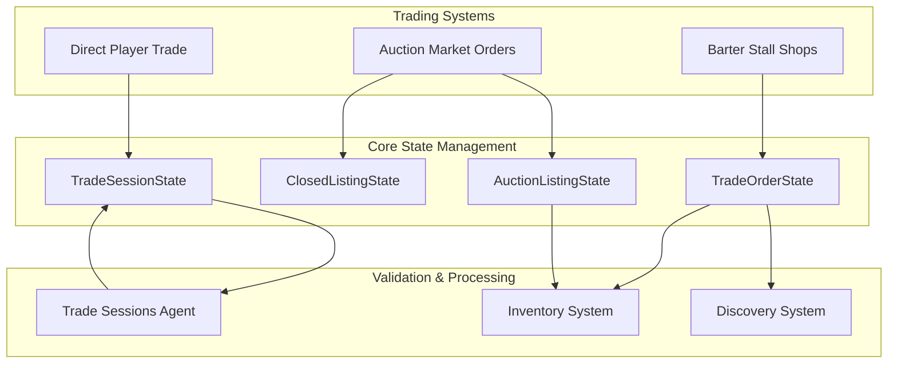
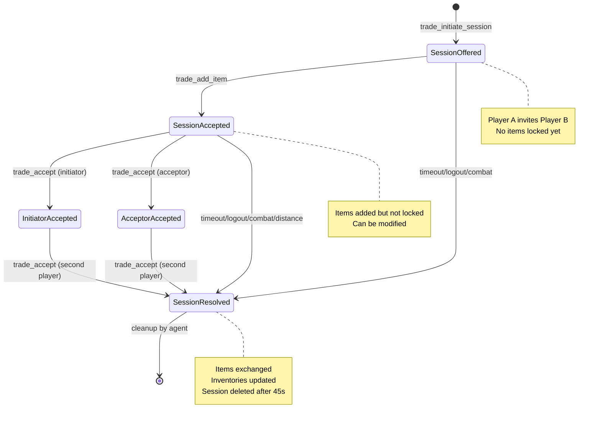

BitCraft implements a sophisticated multi-faceted trading economy that enables player-to-player direct trades, decentralized auction markets through buy/sell orders, and permanent shop structures called barter stalls. This documentation explores the architecture, state management, and transaction flows that power these systems.

## Architecture Overview

The trading systems operate through three distinct but interconnected mechanisms, each serving different use cases in the player economy. The architecture leverages SpacetimeDB's distributed database for consistent state management across all trading operations.



The three systems share common infrastructure including inventory validation, distance checking, and player authentication while maintaining separate state entities optimized for their specific use cases.

Sources: [trade_session_state.rs](BitCraftServer/packages/game/src/game/entities/trade_session_state.rs), [auction_listing_state.rs](BitCraftServer/packages/game/src/game/entities/auction_listing_state.rs), [trade_order_state.rs](BitCraftServer/packages/game/src/game/entities/trade_order_state.rs)

## Direct Player-to-Player Trading

Direct trades enable synchronous, real-time exchanges between two players through a structured session lifecycle. This system provides immediate gratification for peer-to-peer transactions with built-in safety mechanisms.

### Trade Session Lifecycle

Trade sessions progress through multiple states from initiation to finalization, with comprehensive validation at each stage:



The session begins when an initiator sends a trade request through `trade_initiate_session`. The system validates that both players are available (not in combat, not already trading, and signed in) before creating a `TradeSessionState` entity. The system also enforces proximity requirements to prevent trading across unreasonable distances.

Sources: [trade_initiate_session.rs](BitCraftServer/packages/game/src/game/handlers/player_trade/trade_initiate_session.rs)

### Item Locking Mechanism

A critical safety feature of direct trading is the pocket locking mechanism. When players add items to their trade offer, those specific inventory pockets become locked, preventing the items from being used, consumed, or moved elsewhere during the negotiation:

```rust
player_inventory.lock_pocket(inventory_pocket_index as usize);
ctx.db.inventory_state().entity_id().update(player_inventory);
```

The locking system extends to both regular inventory items and cargo items. The trade session maintains separate pocket arrays for each participant, with an additional dedicated slot for cargo items. Players can modify their offers until both parties explicitly accept, at which point the system validates that all items remain present before finalizing the exchange.

Sources: [trade_add_item.rs](BitCraftServer/packages/game/src/game/handlers/player_trade/trade_add_item.rs)

### Transaction Finalization

When both players accept the trade, the `finalize` function executes an atomic exchange. The system performs several validation steps:

1. **Inventory Verification**: Confirms all offered items still exist in the expected pockets
2. **Capacity Check**: Validates that each player has sufficient inventory space to receive the offered items
3. **Item Transfer**: Removes items from each player's inventory and adds them to the other's inventory
4. **Discovery Tracking**: Updates item discovery states for newly acquired items

The transaction uses the `Discovery` system to ensure players properly discover any items they receive through trading. After successful finalization, all pockets are unlocked and the session status changes to `SessionResolved`.

Sources: [trade_accept.rs](BitCraftServer/packages/game/src/game/handlers/player_trade/trade_accept.rs)

### Session Timeout and Cleanup

A dedicated agent, `trade_sessions_agent`, runs on a 5-second timer to handle session lifecycle management. This agent identifies sessions that should be resolved or cleaned up based on three conditions:

- **Timeout**: Sessions inactive for 45 seconds
- **Player Logout**: Either initiator or acceptor has signed out
- **Resolution Cleanup**: Sessions already marked as resolved but not yet deleted

When sessions are terminated due to timeout or logout, the `cancel_session_and_update` method safely returns all locked items to their respective owners by unlocking the associated inventory pockets.

Sources: [trade_sessions_agent.rs](BitCraftServer/packages/game/src/agents/trade_sessions_agent.rs), [trade_session_state.rs](BitCraftServer/packages/game/src/game/entities/trade_session_state.rs)

## Auction Market System

The auction market provides asynchronous trading through buy orders and sell orders, allowing players to list items for purchase or post requests to buy specific items. This system creates a decentralized marketplace where players can participate in commerce without requiring both parties to be online simultaneously.

### Order Types and State Management

The auction system uses the `AuctionListingState` entity to represent both buy and sell orders. While the schema is shared, orders are stored in separate tables (`buy_order_state` and `sell_order_state`) for efficient querying. The key fields include:

- **owner_entity_id**: The player who created the order
- **claim_entity_id**: The building/claim where the order was posted
- **item_id/item_type**: The item being traded
- **price_threshold**: Maximum price for buy orders, asking price for sell orders
- **quantity**: Amount of items remaining in the order
- **stored_coins**: For buy orders, the coins held in escrow

The system allows orders to persist indefinitely until canceled or fully fulfilled, enabling long-term market participation.

Sources: [auction_listing_state.rs](BitCraftServer/packages/game/src/game/entities/auction_listing_state.rs)

### Sell Order Processing

When a player posts a sell order through `order_post_sell_order`, the system immediately attempts to match it against existing buy orders. The algorithm uses an optimized matching strategy:

1. **Withdraw Items**: Remove the listed items from the player's inventory (and nearby deployables if applicable)
2. **Find Matching Orders**: Query buy orders for the same item type within the claim that meet or exceed the asking price
3. **Price-Priority Sorting**: Sort buy orders by decreasing price, with timestamp as tiebreaker
4. **Fulfill Orders**: Match against buy orders until either all items are sold or no suitable orders remain
5. **Persist Remaining**: Create a sell order for any unfilled quantity

The matching process creates `ClosedListingState` records for each fulfilled transaction. The seller receives coins, while buyers receive the items they purchased. This dual-listing approach ensures both parties receive their agreed-upon exchange even if they are not online at the same time.

Sources: [order_post_sell_order.rs](BitCraftServer/packages/game/src/game/handlers/player/order_post_sell_order.rs)

<CgxTip>
The auction system implements price matching with savings calculation for buy orders. When a buyer's maximum price exceeds the actual sale price, the difference is refunded through a separate `ClosedListingState`. This encourages buyers to set higher price thresholds while protecting them from overpayment.
</CgxTip>

### Buy Order Processing

Buy orders operate similarly but with reversed logic. When a player posts a buy order through `order_post_buy_order`:

1. **Deduct Coins**: Remove the full order amount from inventory based on `max_unit_price × quantity`
2. **Find Matching Orders**: Query sell orders for the same item type at or below the maximum price
3. **Price-Priority Sorting**: Sort sell orders by increasing price (cheapest first), with timestamp tiebreaker
4. **Fulfill Orders**: Purchase items from matching sell orders until either the quantity is met or budget exhausted
5. **Refund Savings**: If the actual cost is less than the budgeted amount, refund the difference
6. **Persist Remaining**: Create a buy order with the remaining quantity and stored coins

Buy orders store the full escrow amount in the `stored_coins` field, which is depleted as orders are fulfilled. When a buy order is partially filled, the remaining quantity and stored coins are preserved for future matches.

Sources: [order_post_buy_order.rs](BitCraftServer/packages/game/src/game/handlers/player/order_post_buy_order.rs)

### Order Cancellation and Collection

Players can cancel their active orders through `order_cancel`, which triggers appropriate refund logic:

- **Sell Orders**: Canceling refunds the unsold items to the seller's inventory
- **Buy Orders**: Canceling refunds the remaining stored coins to the buyer's inventory

All refunds are processed through `ClosedListingState` entities, which players collect through `closed_listing_collect`. This two-step approach ensures players must explicitly claim their refunds, preventing accidental inventory overflow and providing a clear transaction history.

Sources: [order_cancel.rs](BitCraftServer/packages/game/src/game/handlers/player/order_cancel.rs), [closed_listing_collect.rs](BitCraftServer/packages/game/src/game/handlers/player/closed_listing_collect.rs)

## Barter Stall System

Barter stalls provide a persistent shop interface where players can create custom trading orders for items, including currency-based exchanges. Unlike the auction system's buy/sell orders, barter stalls support multi-item trades and are tied to specific buildings or deployables.

### Trade Order Structure

`TradeOrderState` entities represent individual listings within a barter stall. Each order specifies:

- **shop_entity_id**: The building or deployable containing the stall
- **remaining_stock**: How many times the order can be fulfilled
- **offer_items**: Items the shop offers (what buyers receive)
- **required_items**: Items required to complete the transaction (what buyers pay)
- **traveler_trade_order_id**: Optional link to static traveler trade data

Unlike auction orders, barter stall orders can include multiple item types on both sides of the transaction, enabling complex trades like "10 wood + 5 stone → 1 copper sword." The `remaining_stock` field allows limited-time offers that automatically expire after a set number of transactions.

Sources: [trade_order_state.rs](BitCraftServer/packages/game/src/game/entities/trade_order_state.rs)

### Creating Barter Orders

Players create barter orders through `barter_stall_order_create` with comprehensive validation:

1. **Location Verification**: Ensures the player is within 5 tiles of the barter stall
2. **Permission Check**: Validates building permissions or deployable ownership
3. **Capacity Limits**: Enforces maximum order count based on building/deployable type
4. **Discovery Validation**: Requires players to have discovered all items they're offering or requesting
5. **Market Mode Rules**: If market mode is enabled, restricts orders to currency-only exchanges

For market mode orders, the system enforces strict rules: only one side of the transaction can contain items, while the other side must be exclusively Hex Coins (currency). This prevents ambiguity and simplifies pricing.

<CgxTip>
Traveler trade orders use `TradeOrderState` but with empty `offer_items` and `required_items` arrays. The system pulls actual item definitions from static data based on the `traveler_trade_order_id`, allowing centralized management of NPC merchant inventories.
</CgxTip>

Sources: [barter_stall_order_create.rs](BitCraftServer/packages/game/src/game/handlers/player_trade/barter_stall_order_create.rs)

### Fulfilling Barter Orders

When a player fulfills a barter stall order, the system performs similar validation and item exchange logic as direct trades:

1. **Distance Check**: Ensures the player is near the barter stall
2. **Inventory Validation**: Confirms the player has the required items
3. **Item Exchange**: Transfers required items to the stall, offered items to the player
4. **Stock Reduction**: Decrements `remaining_stock`
5. **Order Cleanup**: Removes orders that reach zero stock

The system uses `InventoryState::withdraw_full_durability_from_player_inventory_and_nearby_deployables` to pull items from both the player's inventory and any nearby deployable storage, providing flexibility in how players access their items.

Sources: [barter_stall_order_accept.rs](BitCraftServer/packages/game/src/game/handlers/player_trade/barter_stall_order_accept.rs)

## System Integration and Constraints

The three trading systems share common validation and infrastructure while maintaining distinct behaviors optimized for their use cases.

### Distance and Proximity Validation

All trading systems enforce proximity constraints to maintain logical consistency:

- **Direct Trades**: Players must remain within `max_trade_distance_large_tiles` (configurable) of each other
- **Auction Orders**: Players must be at the building where the order book is managed
- **Barter Stalls**: Players must be within 5 tiles of the stall to create or fulfill orders

The trade session agent continuously validates distance for active sessions, automatically canceling trades if players move too far apart.

Sources: [trade_session_state.rs](BitCraftServer/packages/game/src/game/entities/trade_session_state.rs)

### Combat and State Restrictions

Trading is prohibited when players are in combat to prevent abuse and maintain fair gameplay:

- **Trade Initiation**: Blocked if either player is in combat
- **Barter Orders**: Cannot be created while in combat
- **Auction Orders**: Can be posted at any time (asynchronous)

The `ThreatState` system tracks combat status across all trading interactions, with clear error messages informing players when trading is unavailable.

### Discovery Requirements

Players must have discovered items before they can trade them, preventing exploitation of unknown items:

- **Direct Trades**: Both parties must have discovered items they're offering
- **Barter Orders**: Offer and required items must be discovered by the order creator
- **Auction Orders**: Discovery is checked when items are withdrawn from inventory

This requirement integrates with the [Discovery System](14-environment-debuffs-and-status-effects) to ensure players progress through item discovery naturally.

### Inventory and Cargo Support

All trading systems support both regular items and cargo items:

- **Direct Trades**: Dedicated cargo pocket in trade sessions
- **Auction Orders**: Can trade cargo items through the market
- **Barter Stalls**: Support cargo items in both offer and required arrays

The system uses `ItemType::Item` and `ItemType::Cargo` enums to distinguish between these categories, with specialized handling for each.

## Security and Edge Cases

The trading systems implement multiple safeguards to prevent exploits and handle edge cases:

### Integer Overflow Protection

All arithmetic operations use checked arithmetic (`checked_add`, `checked_mul`) to prevent integer overflow in coin and quantity calculations. The system explicitly validates that `available_coins` and `coins_spent` remain positive throughout transactions.

### Concurrent Modification Protection

Inventory pockets are locked during trades to prevent concurrent modification. The `cancel_session_and_update` method ensures that if a trade session is cancelled, all locked pockets are properly unlocked, preventing permanent inventory loss.

### Entity Existence Validation

Before processing any transaction, the system validates that referenced entities (buildings, players, inventories) still exist. This prevents processing of stale orders or transactions involving deleted entities.

### Permission Enforcement

Building and deployable permissions are validated before allowing order creation or modification. This prevents unauthorized players from managing orders on structures they don't control.

## Related Systems

The trading systems integrate with several other game systems:

- **[Inventory and Item Stacks](17-inventory-and-item-stacks)**: Core inventory management for storing and transferring items
- **[Building and Claim System](16-building-and-claim-systems)**: Location-based trading infrastructure
- **[Player State Management](15-player-state-management)**: Player authentication and availability checking
- **[Permission and Access Control](27-permission-and-access-control)**: Building and stall permissions

Understanding these systems provides deeper insight into how trading fits within the broader BitCraft economy.
