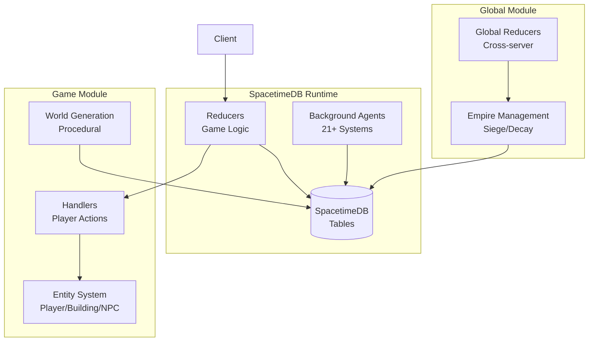
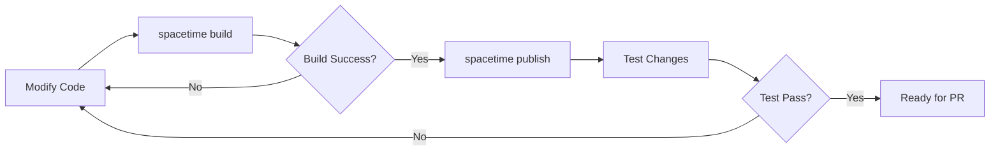

This guide helps you set up and run the BitCraft server locally for development and experimentation. The BitCraft server is built on **SpacetimeDB**, a real-time reactive backend platform designed for multiplayer game development [README.md](README.md#L48-L51). All game data is stored in SpacetimeDB tables and game logic runs inside reducers, providing a reactive, event-driven architecture.


## Prerequisites

Before you begin, ensure you have the following tools installed:

- **Rust** (latest stable version) - The primary language for BitCraft server development
- **SpacetimeDB CLI** - Required for building, running, and managing SpacetimeDB modules
- **Git** - For cloning and managing the repository

Install SpacetimeDB by visiting [SpacetimeDB Docs](https://spacetimedb.com/docs) and following their installation guide. The SpacetimeDB CLI provides commands like `spacetime build`, `spacetime generate`, and database management tools essential for this project.

<CgxTip>
The server is implemented in Rust with a WASM target (`cdylib` crate type), which compiles to WebAssembly for execution within the SpacetimeDB runtime. This ensures portable, sandboxed execution of all game logic.
</CgxTip>

## Repository Overview

The BitCraft repository contains two main packages that work together to create the complete server experience:

```
BitCraftServer/
├── game/              # Primary game module with world simulation, agents, and game logic
└── global_module/     # Cross-server empire management and global systems
```

The **game package** contains the core game simulation including hex-grid coordinates, world generation, player actions, building systems, and 21 different background agents that continuously process game state. The **global_module** handles empire-level systems that span across server instances, including siege warfare, empire decay, and resource logistics [BitCraftServer/packages/game/src/lib.rs](BitCraftServer/packages/game/src/lib.rs#L9-L17).

## System Architecture

The BitCraft server follows a modular, component-based architecture centered around SpacetimeDB's table-driven state management:



The architecture separates concerns into distinct layers: **data layer** (SpacetimeDB tables), **business logic layer** (reducers and handlers), and **systems layer** (background agents and world generation). This modular design enables independent development and testing of each system component.

## Getting Started

Follow these steps to get the BitCraft server running on your local machine:

### Step 1: Clone the Repository

Clone the repository and navigate to the game package directory:

```bash
git clone https://github.com/clockworklabs/BitCraftPublic.git
cd BitCraftPublic/BitCraftServer/packages/game
```

### Step 2: Configure Your Environment

Create a local configuration file based on the example configuration:

```bash
cp config/local.example.json config/local.json
```

The local configuration enables development mode with optional cheats. The configuration structure is minimal but powerful:

| Configuration Field | Type | Purpose |
|-------------------|------|---------|
| `env` | string | Environment identifier (`"dev"` for local development) |
| `cheats.creative_mode` | boolean | Enables creative mode testing |
| `cheats.build_consumes_item_stacks` | boolean | Controls whether building consumes resources |
| `cheats.craft_consumes_item_stacks` | boolean | Controls whether crafting consumes resources |

Sources: [local.example.json](BitCraftServer/packages/game/config/local.example.json#L1-L8), [build.rs](BitCraftServer/packages/game/build.rs#L1-L100)

### Step 3: Build the Project

Build the SpacetimeDB module using the SpacetimeDB CLI:

```bash
spacetime build
```

This command compiles the Rust code to WebAssembly and prepares it for deployment. The build process uses build scripts (`build.rs`) to generate knowledge tables and static data structures automatically [build.rs](BitCraftServer/packages/game/build.rs#L9-L100).

### Step 4: Initialize the Database

Create and initialize a new SpacetimeDB database:

```bash
spacetime init
```

This sets up your local database instance and prepares it for the BitCraft module. The initialization process creates the required table structures defined in the codebase.

### Step 5: Publish and Run the Module

Publish your built module to the SpacetimeDB instance:

```bash
spacetime publish
```

The `initialize` reducer runs automatically on first deployment, setting up the game world, initializing configuration, and starting background agents [lib.rs](BitCraftServer/packages/game/src/lib.rs#L24-L100). After initialization, you can interact with the server through the SpacetimeDB CLI or a connected client application.

## Key Development Workflows

### Building and Testing



The development cycle follows a simple pattern: modify code, build with `spacetime build`, publish changes, and test. The build system includes Rust formatting checks (`rustfmt`) to ensure code consistency [CONTRIBUTING.md](CONTRIBUTING.md#L71-L74).

### Generating Client Files

If you're developing a client that connects to this server, generate the necessary client bindings:

```bash
# For C# clients (Unity)
./generate-client-files.sh

# For TypeScript clients
./generate-client-files.sh -l ts
```

This script generates strongly-typed client code from the SpacetimeDB schema, ensuring type safety between server and client [generate-client-files.sh](BitCraftServer/packages/game/generate-client-files.sh#L1-L24).

<CgxTip>
Always run `spacetime generate` after modifying table structures or reducer signatures to keep client bindings synchronized with the server schema.
</cgg_tip>

## Understanding the Codebase

The BitCraft server is organized into several key systems:

### Background Agents

The server runs 21+ background agents that continuously process game state independently of player actions [agents/mod.rs](BitCraftServer/packages/game/src/agents/mod.rs#L10-L41):

| Agent | Purpose |
|-------|---------|
| `player_regen_agent` | Handles health and stamina regeneration |
| `enemy_regen_agent` | Manages enemy health restoration |
| `building_decay_agent` | Processes building degradation over time |
| `npc_ai_agent` | Controls NPC behavior and decision-making |
| `day_night_agent` | Manages the day/night cycle |
| `resources_regen` | Regenerates harvestable resources |
| `trade_sessions_agent` | Manages trade session timeouts |

These agents are initialized during server startup and run according to their configured schedules, handling time-dependent game mechanics that don't require direct player input.

### Reducer System

Reducers are the primary interface for player actions and game events. They're organized into functional modules [handlers/mod.rs](BitCraftServer/packages/game/src/game/handlers/mod.rs#L1-L25):

- **authentication** - Player login and identity management
- **player** - Player movement, actions, and interactions
- **buildings** - Construction, placement, and building systems
- **inventory** - Item management and storage
- **empires** - Empire creation and management
- **attack** - Combat mechanics and PvP systems
- **player_trade** - Trading and commerce

Reducers are essentially functions that receive a `ReducerContext` containing database access and sender information, validate the action, update game state in SpacetimeDB tables, and return success or error results.

### World Generation

The server features sophisticated procedural world generation using noise algorithms and biome systems [world_gen/mod.rs](BitCraftServer/packages/game/src/game/world_gen/mod.rs):

- **Hex grid coordinate system** - All world positions use axial coordinates for hexagonal tiles
- **Noise-based elevation** - Terrain height maps generated using Simplex noise
- **Biome distribution** - Climate and vegetation patterns based on elevation and latitude
- **Resource deposits** - Procedural placement of harvestable resources
- **Building generation** - Automatic placement of structures in generated worlds

The world generation system creates infinite, seamless worlds with consistent geography and resource distribution.

### Configuration Management

The server supports multiple deployment environments through configuration files:

| Environment | File | Purpose |
|-------------|------|---------|
| Development | `config/local.json` | Local testing with cheats enabled |
| Testing | `config/testing.json` | Automated testing environment |
| QA | `config/qa.json` | Quality assurance testing |
| Staging | `config/staging.json` | Pre-production verification |
| Production | `config/production.json` | Live game servers |

Each environment can have different game balance parameters, feature flags, and security settings.

## Common Operations

### Starting and Stopping Agents

Agents can be controlled through admin reducers. To restart all agents:

```rust
// Admin-only reducer in lib.rs
force_start_agents(&ctx)
```

This is useful during development when agents need to be reinitialized after code changes [lib.rs](BitCraftServer/packages/game/src/lib.rs#L680-L703).

### Enabling Cheats

For local development, you can enable creative mode and disable resource consumption through the configuration:

```json
{
  "env": "dev",
  "cheats": {
    "creative_mode": true,
    "build_consumes_item_stacks": false,
    "craft_consumes_item_stacks": false
  }
}
```

This allows rapid testing without gathering resources or waiting for craft times.

### Database Queries

Query the SpacetimeDB database directly using the CLI or through reducers:

```bash
# View all players
spacetime sql "SELECT * FROM player_state"

# View player inventory
spacetime sql "SELECT * FROM inventory_state WHERE player_id = <id>"
```

All game state is queryable through SQL, making debugging and monitoring straightforward.

## Next Steps

Now that you have the BitCraft server running locally, you can explore its architecture and systems in more depth:

- **[Overview](1-overview)** - Learn more about BitCraft's design philosophy and goals
- **[Project Architecture](3-project-architecture)** - Deep dive into the system architecture and module organization
- **[SpacetimeDB Fundamentals](4-spacetimedb-fundamentals)** - Understand the SpacetimeDB platform and its integration with BitCraft

For hands-on exploration, examine the handler modules in `src/game/handlers/` to see how player actions are processed, or review the agent implementations in `src/agents/` to understand time-based game systems.

Remember that this repository includes only the server-side code. Connecting to the official game or running a full client-server environment requires additional client-side software and assets that are not included in this open-source release [README.md](README.md#L54-L57).
