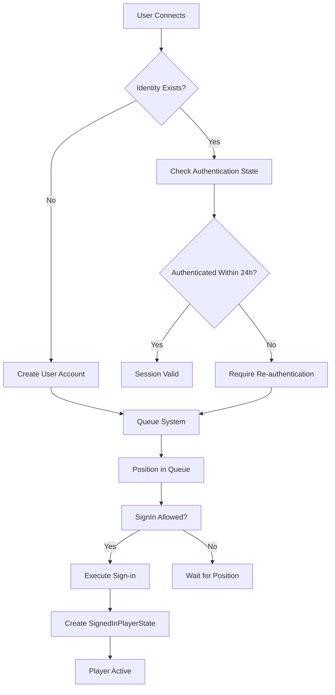

Authentication and Authorization form the security foundation of the BitCraft server infrastructure. This documentation explains how players are verified, roles are managed, and permissions are enforced across the game world. These systems work together to ensure that only authorized users can access specific features and perform sensitive operations while maintaining the integrity of the multiplayer experience.

## Authentication Overview

The authentication system validates user identity and tracks active sessions through a distributed database architecture. At its core, authentication relies on SpacetimeDB's Identity system, which provides unique cryptographic identifiers for each user. The system maintains an authentication state that expires after 24 hours of inactivity, requiring users to re-authenticate periodically. This approach balances security with user convenience, preventing indefinite session hijacking while not forcing frequent re-login during active play.


Sources: [authentication.rs](BitCraftServer/packages/game/src/messages/authentication.rs#L1-L27), [authentication.rs](BitCraftServer/packages/game/src/game/handlers/authentication.rs#L10-L28)

### Authentication Flow



The authentication flow begins when a user connects to the server with their SpacetimeDB Identity. If the identity is new, the system creates a UserState entry and places the player in a queue system. Existing users have their authentication state checked against a 24-hour window. Only after clearing the queue and passing authentication checks can a player execute the sign-in process, which creates a SignedInPlayerState entry and grants full access to game features.

Sources: [player_create.rs](BitCraftServer/packages/game/src/inter_module/player_create.rs#L35-L55), [sign_in.rs](BitCraftServer/packages/game/src/game/handlers/player/sign_in.rs#L19-L39)

## Role-Based Access Control

The authorization system employs a hierarchical role structure that determines what operations users can perform. Roles are defined in ascending order of access, with each higher role inheriting all permissions of lower roles. This design allows for granular control over game features, from basic player actions to powerful administrative commands.

### Role Hierarchy

| Role | Access Level | Typical Use Case |
|------|-------------|------------------|
| **Player** | Base level | All regular gameplay features |
| **Partner** | Enhanced access | Partner program participants |
| **SkipQueue** | Queue bypass | Priority access to servers |
| **Mod** | Moderation tools | Community management |
| **Gm** | Game Master | In-game event management |
| **Admin** | Full access | Server administration |
| **Relay** | System level | Inter-server communication |

The role system is implemented as an enum with integer representation, enabling efficient comparison through simple integer comparison. When checking permissions, the system verifies if a user's role value is greater than or equal to the required role level. This design makes permission checks computationally inexpensive and easy to maintain.

Sources: [authentication.rs](BitCraftServer/packages/game/src/messages/authentication.rs#L6-L17), [authentication.rs](BitCraftServer/packages/game/src/game/handlers/authentication.rs#L30-L43)

### Role Assignment and Storage

Role assignments are stored in the IdentityRole table, which maps each user's identity to their assigned role. This table is designated as a shared table, meaning it's owned by the global module and replicated to all region modules. This ensures consistent role enforcement across the entire game world, preventing users from exploiting regional differences to gain unauthorized access.

The system also maintains a Developer table for tracking developers separately from role assignments. This includes developer names, service names, and email addresses, though the email field remains private for security reasons. Developers can be marked as external or internal, allowing for different access patterns for third-party collaborators.

Sources: [authentication.rs](BitCraftServer/packages/game/src/messages/authentication.rs#L31-L49)

## Session Management

Session management handles the lifecycle of player connections, from sign-in through sign-out and automatic logout. The system tracks session duration, manages authentication state, and ensures proper cleanup when players disconnect. This includes handling edge cases like network interruptions and graceful disconnections.

### Sign-In Process

The sign-in reducer performs comprehensive validation before granting a player access to the game world. It checks multiple security conditions, verifies the player's queue status, and initializes all necessary game state components. The process is atomic—either all checks pass and the player is fully signed in, or the operation fails completely.

Key validation steps during sign-in include:

- **Server availability check**: Verifies if the server is accepting new connections, with GMs able to bypass this restriction
- **Duplicate session prevention**: Ensures a player isn't already signed in from another session
- **Queue verification**: Confirms the player has cleared the queue system
- **Moderation checks**: Validates the player hasn't been blocked temporarily or permanently
- **Location validation**: Ensures the player exists in a valid chunk, teleporting them if necessary

Sources: [sign_in.rs](BitCraftServer/packages/game/src/game/handlers/player/sign_in.rs#L19-L75)

### Sign-Out Process

When a player signs out, either voluntarily or due to disconnection, the system performs extensive cleanup to maintain world consistency. This includes pausing buffs, clearing combat sessions, interrupting ongoing actions, and scheduling the hiding of deployables after a configurable timeout.

The sign-out process also manages a "grace period" system. Players who sign out voluntarily are given a grace period during which they can quickly reconnect without losing their queue position. This is handled through the EndGracePeriodTimer, which can process either sign-in grace periods or queue join grace periods depending on the player's state.

Sources: [sign_out.rs](BitCraftServer/packages/game/src/game/handlers/player/sign_out.rs#L27-L55)

### Auto-Logout Mechanism

An autonomous logout agent monitors player inactivity and automatically signs out players who have been idle for too long. This prevents server resource consumption by inactive connections and ensures fair access to limited server capacity. The auto-logout agent works by checking PlayerTimestampState entries that track the last action time for each signed-in player.

Sources: [auto_logout_agent.rs](BitCraftServer/packages/game/src/agents/auto_logout_agent.rs)

## Permission System

Beyond role-based access control, BitCraft implements a sophisticated permission system that governs interactions with claims, buildings, and resources. This system enables players to control who can access their property and what those users can do.

### Claim-Based Permissions

The claim system divides the world into hexagonal tiles that can be owned by players or empires. Each claim maintains a list of members with specific permissions for three categories: Build, Inventory, and Usage. These permissions are stored in the ClaimMemberState table and are checked before any interaction with claimed territory.

| Permission Type | Description |
|----------------|-------------|
| **Build** | Ability to construct, destroy, or modify structures |
| **Inventory** | Access to storage and crafting facilities |
| **Usage** | Basic interaction with buildings and resources |

The permission resolution logic follows a hierarchical decision tree. First, it checks if the tile is claimed at all. If not, anyone can interact. For claimed tiles, it evaluates multiple conditions including whether the claim is neutral, has an owner, or has defensive supplies (which protect against unauthorized interaction).

Sources: [permission_helper.rs](BitCraftServer/packages/game/src/game/permission_helper.rs#L161-L235)

### Building Interaction Permissions

Buildings have additional layers of access control beyond claim permissions. Each building type defines an interaction level that determines who can use it:

- **All**: Anyone can interact
- **None**: No one can interact
- **Empire**: Only empire members can interact
- **Owner**: Only the building owner can interact

Empire buildings, such as Watchtowers and Hexite Capsule Reserves, have special permission rules. Watchtowers, for example, can be used by any empire to start sieges or join the controlling empire, regardless of claim membership. This design encourages political maneuvering and conflict in the game world.

Sources: [permission_helper.rs](BitCraftServer/packages/game/src/game/permission_helper.rs#L18-L159)

### Rental System Integration

The permission system also integrates with the housing rental system. When a dimension (interior space) is rented, claim-based permissions are overridden in favor of the rental whitelist. Only players explicitly added to the rent's whitelist can access the rented space, regardless of their claim permissions. This separation allows for economic systems where players can rent out properties without granting broader access to their claims.

Sources: [permission_helper.rs](BitCraftServer/packages/game/src/game/permission_helper.rs#L168-L181)

## Security Measures

The authentication and authorization systems include multiple layers of security to protect against unauthorized access and abuse. These measures protect both the server infrastructure and player experience.

### Identity Blocking

The BlockedIdentity table maintains a list of identities that are permanently blocked from accessing the server. This is a last-resort measure for dealing with malicious actors. When an identity is blocked, all connection attempts are rejected before any game state is accessed.

Sources: [authentication.rs](BitCraftServer/packages/game/src/messages/authentication.rs#L58-L64)

### User Moderation

For more nuanced control, the system supports user moderation policies that can temporarily or permanently block specific users from logging in. These policies are stored in the UserModerationState table and can have expiration times. Moderation checks are performed during sign-in, allowing for targeted interventions without affecting the entire server.

Sources: [sign_in.rs](BitCraftServer/packages/game/src/game/handlers/player/sign_in.rs#L62-L74)

### Server Identity Validation

Certain sensitive operations can only be performed by the server itself or administrators. The ServerIdentity table stores the server's cryptographic identity, and functions like `validate_server_only()` ensure that critical actions originate from authorized sources. This prevents users from invoking server-side functions that could manipulate game state inappropriately.

Sources: [authentication.rs](BitCraftServer/packages/game/src/messages/authentication.rs#L90-L101)

### Development Mode Bypass

In development environments, the authentication and role checks are bypassed automatically. This allows developers to test all functionality without needing to configure roles for their development identities. The system detects the "dev" environment through the config table and skips authorization checks when appropriate.

<CgxTip>The development mode bypass is a critical quality-of-life feature for developers, but it's important to ensure it's never enabled in production environments, as it would completely disable security controls.</CgxTip>

Sources: [authentication.rs](BitCraftServer/packages/game/src/game/handlers/authentication.rs#L13-L20)

## Implementation Details

### Authentication State Storage

UserAuthenticationState stores the timestamp of each user's last successful authentication. This table is shared across modules, ensuring consistency between the global module and regional modules. The timestamp is checked against the current time to determine if authentication is still valid within the 24-hour window.

```rust
pub struct UserAuthenticationState {
    #[primary_key]
    pub identity: Identity,
    pub timestamp: Timestamp,
}
```

Sources: [authentication.rs](BitCraftServer/packages/game/src/messages/authentication.rs#L19-L26)

### Permission Checking Functions

The system provides multiple helper functions for checking permissions at different levels:

- `is_authenticated()`: Validates if a user has authenticated within 24 hours
- `has_role()`: Checks if a user has a specific role (with dev bypass)
- `has_role_no_dev()`: Role check without dev bypass (for critical operations)
- `has_permission()`: General claim permission checking
- `can_interact_with_tile()`: Tile-specific interaction permissions
- `can_interact_with_building()`: Building-specific interaction permissions

These functions form the building blocks for all authorization checks throughout the codebase, providing consistent security enforcement across all game features.

Sources: [authentication.rs](BitCraftServer/packages/game/src/game/handlers/authentication.rs#L10-L50)

### Database Schema Design

The authentication and authorization tables are designed with performance and consistency in mind. Primary keys use user identities for fast lookups, and shared tables are explicitly marked to ensure proper replication between modules. The schema supports both simple lookups (by identity) and filtered queries (by claim membership), enabling efficient permission checks across various access patterns.

<CgxTip>Tables that are replicated across modules (marked with `#[shared_table]`) must be manually maintained in all modules due to SpacetimeDB schema migration limitations. This requires careful coordination when modifying shared table structures.</CgxTip>

Sources: [authentication.rs](BitCraftServer/packages/game/src/messages/authentication.rs#L20-L49)

## Next Steps

Now that you understand the authentication and authorization foundations, explore these related systems:

- **[Player Movement and Actions](21-player-movement-and-actions)**: See how permissions are enforced during gameplay actions like movement and interactions
- **[Permission and Access Control](27-permission-and-access-control)**: Deep dive into the comprehensive permission system that governs all player interactions
- **[Building and Claim System](16-building-and-claim-system)**: Learn how claims and buildings integrate with the authorization system for property ownership
- **[Agent System - Agent Lifecycle and Scheduling](10-agent-lifecycle-and-scheduling)**: Understand how autonomous agents like the auto-logout agent are scheduled and managed
- **[Project Architecture](3-project-architecture)**: Review the overall system architecture to understand how authentication fits into the broader design

The authentication and authorization systems provide the security infrastructure that enables all other game systems to operate safely. Understanding these foundations is essential for working with any feature that involves user identity, permissions, or sensitive operations.
