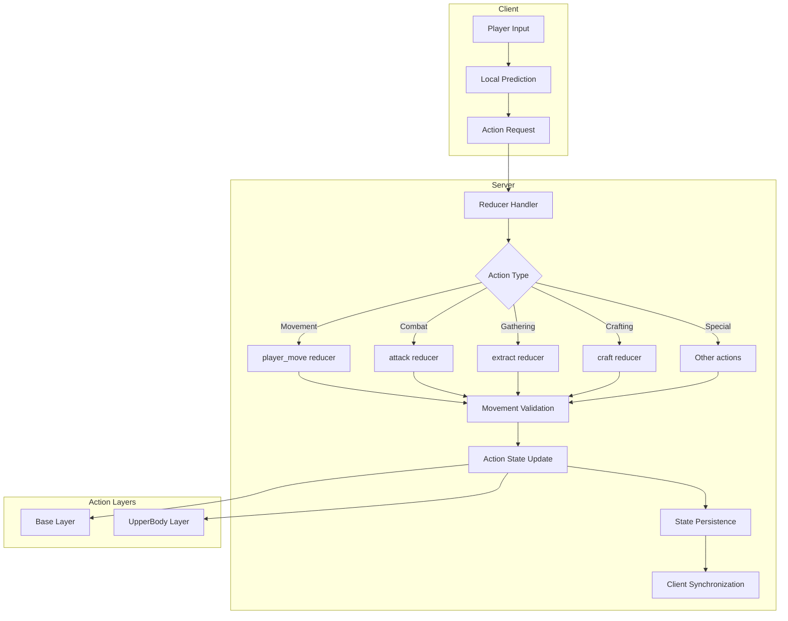
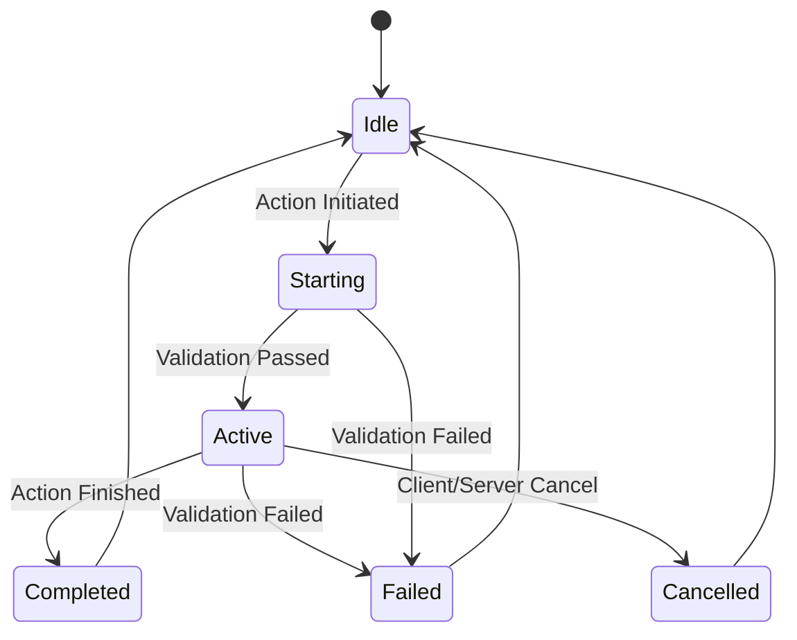

The player movement and actions system in BitCraft forms the core interactive foundation, enabling real-time navigation through the hex-grid world while managing complex player activities ranging from basic movement to crafting, combat, and environmental interactions. This system integrates seamlessly with the hex grid coordinate system and leverages SpacetimeDB's reducer pattern for authoritative server-side validation.

## Architecture Overview

The movement and action system follows a layered architecture with clear separation of concerns between client prediction, server validation, and state management. The system supports concurrent actions through multiple action layers and provides comprehensive validation to prevent cheating and ensure fair gameplay.



The architecture employs a **two-phase validation system** where basic movement is validated on every request, while complex actions like gathering, crafting, and combat use an action state machine with timing validation. This approach balances performance with security.

## Player Movement System

### Core Movement Mechanics

Player movement is handled through the `player_move` reducer, which processes movement requests containing origin and destination coordinates, timestamps, and duration metadata. The system validates movement against server-side state to prevent speed hacks and position manipulation.

Sources: [player_move.rs](/BitCraftServer/packages/game/src/game/handlers/player/player_move.rs#L1-L35), [action_request.rs](/BitCraftServer/packages/game/src/messages/action_request.rs#L14-L22)

**Movement Request Structure**:

| Field | Type | Description |
|-------|------|-------------|
| `timestamp` | u64 | Client-side timestamp for synchronization |
| `destination` | Option\<OffsetCoordinatesFloat\> | Target position coordinates |
| `origin` | Option\<OffsetCoordinatesFloat\> | Starting position coordinates |
| `duration` | f32 | Expected movement duration in seconds |
| `move_type` | i32 | Movement type classification |
| `running` | bool | Whether player is sprinting |

### Speed Calculation and Terrain Interaction

Movement speed is dynamically calculated based on terrain type and water depth. The system queries terrain data from the chunk cache and applies speed multipliers for different surfaces:

Sources: [player_move.rs](/BitCraftServer/packages/game/src/game/handlers/player/player_move.rs#L36-L60)

```rust
let water_body_type = terrain_chunk
    .get_water_body_type_index(prev_chunk_index)
    .unwrap_or(SurfaceType::Ground as u8);
let water_depth = terrain_chunk.get_water_depth_index(prev_chunk_index);
let speed = game_state_filters::get_speed_on_water_type(
    &ctx.db.parameters_player_move_desc().version().find(&0).unwrap().default_speed,
    water_body_type,
    Some(water_depth),
    true,
);
```

The system also incorporates **paving tile modifiers**, which can apply stat-based speed bonuses through the paving tile description system. This allows for gameplay mechanics like roads and pathways providing movement speed bonuses.

### Stamina and Running Mechanics

Running consumes stamina based on distance traveled and player stats. The system implements a graceful degradation mechanism that automatically transitions players to walking when stamina becomes insufficient:

Sources: [player_move.rs](/BitCraftServer/packages/game/src/game/handlers/player/player_move.rs#L61-L88)

```rust
let stamina_used = if prev_mobile_entity.is_running {
    let distance_traveled = prev_origin.distance_to(source_coordinates.clone());
    let mut run_stamina_use = player_stats.get(CharacterStatType::SprintStaminaDrain);
    if let Some(paving) = &paving {
        run_stamina_use = paving.apply_stat_to_value(ctx, run_stamina_use, CharacterStatType::SprintStaminaDrain);
    }
    let s = distance_traveled * run_stamina_use;
    // Stamina validation with rubber-banding prevention
    if (s < 0.0) & (stamina_state.stamina < 0.2) {
        prev_mobile_entity.is_running = false;
        request.running = false;
        0.0
    } else {
        s
    }
} else {
    0.0
};
```

<CgxTip>The stamina system includes a 0.2 threshold check to prevent rubber-banding from minor calculation discrepancies. When stamina drops below this threshold, the system automatically transitions to walking rather than failing the movement request.</CgxTip>

### Movement Validation

The movement validation system performs multiple checks to ensure client-submitted movements are legitimate:

Sources: [player_move.rs](/BitCraftServer/packages/game/src/game/handlers/player/player_move.rs#L90-L130), [move_validation_helpers.rs](/BitCraftServer/packages/game/src/game/reducer_helpers/move_validation_helpers.rs#L1-L50)

**Validation Layers**:

1. **Timestamp Validation**: Ensures movement requests arrive in correct chronological order
2. **Distance Validation**: Checks that origin and destination are within acceptable ranges
3. **Speed Validation**: Verifies movement speed doesn't exceed calculated maximum
4. **Elevation Validation**: Prevents movement through cliffs or impossible terrain
5. **Collision Validation**: Prevents walking through buildings and hitboxes

```rust
// Elevation difference validation between chunks
let terrain_start = unwrap_or_err!(
    terrain_cache.get_terrain_cell(ctx, &prev_origin.parent_large_tile()),
    "Invalid coordinates"
);
let terrain_target = unwrap_or_err!(
    terrain_cache.get_terrain_cell(ctx, &source_coordinates.parent_large_tile()),
    "Invalid coordinates"
);
let elevation_diff = terrain_target.player_surface_elevation() - terrain_start.player_surface_elevation();
if elevation_diff.abs() > 6 {
    return Err("~Origin elevation mismatch".into());
}
```

### Cargo and Mounting Restrictions

The movement system enforces gameplay rules that prevent running while carrying cargo or mounting deployables:

Sources: [player_move.rs](/BitCraftServer/packages/game/src/game/handlers/player/player_move.rs#L13-L19)

```rust
if ctx.db.mounting_state().entity_id().find(&actor_id).is_some() {
    return Err("Can't walk while in a deployable.".into());
}

if request.running && InventoryState::get_player_cargo_id(ctx, actor_id) > 0 {
    return Err("Can't run with cargo.".into());
}
```

## Action State Management

### Multi-Layer Action System

BitCraft implements a sophisticated action state system supporting **concurrent actions** through multiple layers. The primary layers are the Base layer for full-body actions like movement and the UpperBody layer for actions that can be performed while moving, such as certain combat abilities.

Sources: [player_action_state.rs](/BitCraftServer/packages/game/src/game/entities/player_action_state.rs#L1-L30)

**Action Layer Types**:

| Layer | Purpose | Examples |
|-------|---------|----------|
| Base | Full-body actions | Movement, climbing, terraforming |
| UpperBody | Partial actions | Combat, eating, emotes |

The system maintains separate `PlayerActionState` records for each layer, allowing players to perform actions like attacking while walking, but preventing incompatible action combinations like climbing and fighting simultaneously.

### Action Lifecycle

Actions follow a defined lifecycle from initiation to completion or cancellation:



**Action State Fields**:

- `action_type`: The type of action being performed
- `layer`: Which action layer this state belongs to
- `last_action_result`: Success, fail, or cancel status
- `start_time`: When the action began
- `duration`: Expected action duration
- `target`: Optional target entity ID
- `recipe_id`: Optional recipe identifier for crafting/gathering

Sources: [player_action_state.rs](/BitCraftServer/packages/game/src/game/entities/player_action_state.rs#L50-L85)

### Action Timing Validation

The system implements sophisticated timing validation to prevent clients from completing actions too quickly. Actions must reach at least 80% completion before being considered valid, with a grace period allowing up to 95%:

Sources: [player_action_state.rs](/BitCraftServer/packages/game/src/game/entities/player_action_state.rs#L115-L135)

```rust
let elapsed_normalized = (timestamp - player_action.start_time) as f32 / player_action.duration as f32;
if elapsed_normalized >= 0.95f32 {
    return Ok(());
}

if elapsed_normalized >= 0.80f32 {
    return move_validation_helpers::action_validation_strike(ctx, entity_id, action_type);
}

player_action_helpers::fail_timing(ctx, entity_id, action_type, format!("Tried to {{0}} too quickly|~{:?}", action_type))
```

<CgxTip>Between 80-95% completion, the system issues an "action validation strike" rather than immediate failure. This allows for minor network timing discrepancies while catching significant attempts to speed-hack actions.</CgxTip>

## Special Movement Actions

### Climbing System

The climbing system enables vertical movement through the terrain, with climb time calculated based on elevation difference. Climbing requires dedicated action state management and cannot be cancelled once initiated:

Sources: [player_climb.rs](/BitCraftServer/packages/game/src/game/handlers/player/player_climb.rs#L1-L100)

**Climb Validation**:

- Maximum distance: 15 hex units
- Player must be within 2 units of climb origin
- Elevation difference determines climb duration
- Cannot climb while mounted

```rust
fn event_delay(ctx: &ReducerContext, terrain_cache: &mut TerrainChunkCache, request: &PlayerClimbRequest) -> Result<Duration, String> {
    let start_cell = unwrap_or_err!(
        terrain_cache.get_terrain_cell(ctx, &LargeHexTile::from(start_coord)),
        "Invalid climb coordinates"
    );
    let end_cell = unwrap_or_err!(
        terrain_cache.get_terrain_cell(ctx, &LargeHexTile::from(end_coord)),
        "Invalid climb coordinates"
    );
    let elevation_diff = end_cell.player_surface_elevation() - start_cell.player_surface_elevation();
    let desc = unwrap_or_err!(get_climb_descriptions(elevation_diff), "Invalid climb request");
    let time = desc.get_climb_time(elevation_diff);
    return Ok(Duration::from_secs_f32(time));
}
```

### Elevator System

Elevators provide structured vertical transportation between platform levels. The system implements exclusive platform locking to prevent conflicts and applies movement sickness debuffs:

Sources: [player_use_elevator.rs](/BitCraftServer/packages/game/src/game/handlers/player/player_use_elevator.rs#L1-L100)

**Elevator Features**:

- Travel duration based on elevation delta and elevator speed
- Threat clearing and target unbinding during transit
- Platform exclusivity to prevent multiple users simultaneously
- Movement sickness debuff preventing rapid reuse

```rust
let traverse_duration = elevation_delta.abs() as f32 / elevator_desc.speed;

ThreatState::clear_all(ctx, actor_id);
game_state_filters::untarget(ctx, actor_id);
deployable_helpers::dismount_deployable(ctx, actor_id, false);
```

### Terraforming Actions

Terraforming allows players to modify terrain elevation, requiring progressive action state management. The system tracks terraform progress toward a final height target:

Sources: [terraform.rs](/BitCraftServer/packages/game/src/game/handlers/player/terraform.rs#L1-L100)

**Terraform Mechanics**:

- Building-specific terraform progress tracking
- Recipe-based time requirements modified by construction skill
- Directional height adjustment (raising or lowering)
- Validation against original terrain elevation

```rust
let height_difference = i16::min(
    i16::abs(target - terrain_cell.original_elevation),
    TerraformRecipeDesc::max_difference(ctx),
);
let recipe = ctx.db.terraform_recipe_desc().difference().find(&height_difference);
let mut time = recipe.time_per_action;
let skill_speed = stats.get_skill_speed(SkillType::Construction);
let time_multiplier = 1.0 / (stats.get(CharacterStatType::BuildingSpeed) + skill_speed - 1.0);
time = time * time_multiplier;
```

## Target System

The target system manages entity selection for interactions, combat, and other actions. It integrates with the threat system to manage aggro relationships:

Sources: [target_update.rs](/BitCraftServer/packages/game/src/game/handlers/target_update.rs#L1-L71)

**Target Update Flow**:

1. Authorization validation
2. Target health validation (cannot target dead entities)
3. Aggro generation when required
4. Target state insertion or update

```rust
pub fn reduce(ctx: &ReducerContext, actor_id: u64, target_entity_id: u64, generate_aggro: bool) -> Result<(), String> {
    if let Some(health) = ctx.db.health_state().entity_id().find(target_entity_id) {
        if health.health == 0.0 {
            return Err("~This target is no longer valid".into());
        }
    }

    if generate_aggro {
        ThreatState::add_threat(ctx, actor_id, target_entity_id, 0.0);
        ThreatState::add_threat(ctx, target_entity_id, actor_id, 0.0);
    }
    // Target state management...
}
```

## Action Cancellation

Action cancellation provides controlled interruption of ongoing actions, with special handling for actions that should not be cancelled (like climbing and elevator usage):

Sources: [player_action_cancel.rs](/BitCraftServer/packages/game/src/game/handlers/player/player_action_cancel.rs#L1-L35)

**Cancellation Rules**:

- Cannot cancel climbing or elevator use actions
- Server-side actions can clear client-initiated actions
- Client cancellation flag tracks cancellation source
- Completed actions return success without error

```rust
if player_action_state.action_type == PlayerActionType::Climb || player_action_state.action_type == PlayerActionType::UseElevator {
    return Ok(());
}

if player_action_state.action_type == PlayerActionType::None {
    return Ok(());
}

player_action_state.last_action_result = PlayerActionResult::Cancel;
player_action_state.client_cancel = client_cancel;
```

## Progressive Actions

Progressive actions, such as multi-unit crafting, are tracked through a dedicated `ProgressiveActionState` that manages long-running tasks with expiration mechanics:

Sources: [progressive_action_state.rs](/BitCraftServer/packages/game/src/game/entities/progressive_action_state.rs#L1-L93)

**Progressive Action Features**:

- Lock expiration to prevent indefinite resource holding
- Status tracking (Active, Completed, Suspended)
- Progress calculation for partial completion
- Building function type association
- Refund calculation for cancelled actions

```rust
pub fn get_status(&self, ctx: &ReducerContext) -> ProgressiveActionStatus {
    let recipe = ctx.db.crafting_recipe_desc().id().find(self.recipe_id).unwrap();
    self.get_status_from_recipe(&recipe, ctx.timestamp)
}

pub fn is_expired(&self, now: Timestamp) -> bool {
    now >= self.lock_expiration
}
```

## Best Practices

### Movement Implementation

When implementing movement-related features, always validate against server state rather than trusting client inputs. The system provides comprehensive validation helpers in `move_validation_helpers.rs` for common checks.

### Action Development

For new action types, follow the established pattern of:
1. Define the action type in `PlayerActionType`
2. Create start and completion reducers
3. Use `player_action_helpers::start_action` for state management
4. Implement timing validation for action completion
5. Handle cancellation gracefully when appropriate

### Performance Considerations

The movement system performs terrain chunk queries on every move request. Cache terrain data when processing multiple movements or actions in the same region to optimize performance.

Sources: [player_move.rs](/BitCraftServer/packages/game/src/game/handlers/player/player_move.rs#L36-L50)

## Next Steps

To deepen your understanding of the movement and action systems:

- **[Hex Grid Coordinate System](5-hex-grid-coordinate-system)**: Understanding the coordinate foundation that movement operates on
- **[Pathfinding Algorithm](26-pathfinding-algorithm)**: How the AI and server calculate optimal movement paths
- **[Combat and PvP Systems](25-combat-and-pvp-systems)**: Detailed combat action implementation and mechanics
- **[Player State Management](15-player-state-management)**: Complete player state tracking beyond movement and actions

The movement and action system serves as the bridge between player inputs and world state changes, ensuring that every interaction is validated, synchronized, and recorded in the authoritative game state.
