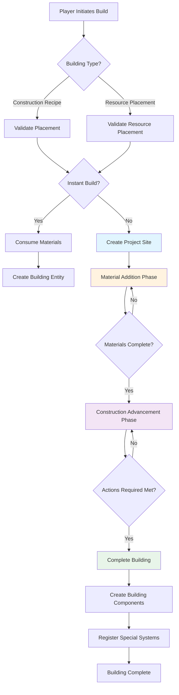
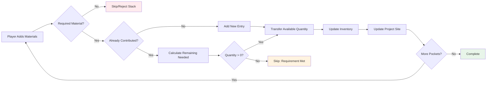

The Building Construction system in BitCraft provides a multi-phase workflow for creating structures in the game world. This system combines resource management, player progression, and spatial validation to deliver a strategic construction experience that integrates with claims, permissions, and empire mechanics.

## Construction System Architecture

The building construction process follows a **project site pattern**, where structures begin as incomplete construction sites that require materials and player labor to complete. This architecture separates building placement from completion, enabling collaborative construction and strategic resource planning across multiple game sessions.

The core construction workflow operates through three primary phases: **site placement**, **material accumulation**, and **construction advancement**. Each phase involves distinct validation rules, resource requirements, and player interactions that progressively transform a designated location into a fully functional building.



The system integrates with multiple game subsystems through well-defined interfaces. The **permission system** governs where players can build based on claim ownership and access rights. The **discovery system** tracks player knowledge of building types and construction recipes. The **inventory system** manages material consumption and tool requirements. This modular integration ensures that construction remains consistent with broader game mechanics while maintaining focused responsibility within the construction handlers themselves.

Sources: [project_site_place.rs](BitCraftServer/packages/game/src/game/handlers/buildings/project_site_place.rs#L1-L100), [mod.rs](BitCraftServer/packages/game/src/game/handlers/buildings/mod.rs#L1-L12)

## Project Site Placement

The project site placement handler (`project_site_place`) serves as the entry point for construction. This reducer validates all prerequisites for construction before creating a new building site, ensuring that every construction project begins from a valid state with appropriate permissions and resources.

**Validation Chain**: The placement process executes a comprehensive validation sequence that checks player state, location constraints, and building-specific requirements. The system first verifies that the player is not incapacitated and has not been blocked from construction through moderation systems [project_site_place.rs](BitCraftServer/packages/game/src/game/handlers/buildings/project_site_place.rs#L23-L30). Players cannot place buildings while mounted in deployables, preventing construction in invalid states.

The validation then examines the building or resource type being constructed. The handler distinguishes between **construction recipes** (for buildings) and **resource placement recipes** (for resources), each requiring different validation logic. For buildings, the system retrieves the building description to determine footprint, categories, and special properties [project_site_place.rs](BitCraftServer/packages/game/src/game/handlers/buildings/project_site_place.rs#L42-L64).

**Footprint Validation**: The building footprint defines the spatial extent of the structure and is critical for collision detection and placement validation. The system calculates the footprint based on building coordinates and facing direction, then validates that all tiles in the footprint are suitable for construction [project_site_place.rs](BitCraftServer/packages/game/src/game/handlers/buildings/project_site_place.rs#L53-L56). This validation checks for terrain compatibility, existing obstacles, and dimensional constraints.

Special building categories trigger additional validation rules:

| Building Category | Special Validation | Purpose |
|-------------------|-------------------|---------|
| Claim Totem | Distance from existing claims, minimum tile spacing | Prevents claim territory conflicts |
| Watchtower | Distance from settlement totems (80+ tiles) | Maintains strategic spacing |
| Empire Foundry | Must be in empire capital, empire membership required | Enforces empire progression rules |
| Rent Terminal | Must be in rentable interior, no other buildings | Enables rental system integration |

Sources: [project_site_place.rs](BitCraftServer/packages/game/src/game/handlers/buildings/project_site_place.rs#L66-L90)

**Dimension Validation**: Construction rules vary significantly between the overworld and interior dimensions. Buildings can only be constructed in dimensions that explicitly support them. Ancient ruins and dungeons prohibit construction entirely [project_site_place.rs](BitCraftServer/packages/game/src/game/handlers/buildings/project_site_place.rs#L191-L195). Interior dimensions have additional constraints related to rental systems and interior tier requirements.

Rent terminals represent a special case that can only be built in claimed, rentable interior dimensions. The system validates that the entire interior network contains only default spawned buildings before allowing rent terminal construction, ensuring that rental properties can be properly managed [project_site_place.rs](BitCraftServer/packages/game/src/game/handlers/buildings/project_site_place.rs#L407-L489).

**Permission Validation**: The permission system enforces access control through multiple layers. The system checks that the player has build permissions at the target coordinates and verifies claim-level permissions for any claims under the building footprint [project_site_place.rs](BitCraftServer/packages/game/src/game/handlers/buildings/project_site_place.rs#L139-L154). Buildings cannot overlap multiple claims unless specifically permitted, preventing territorial conflicts.

For buildings requiring specific claim technologies, the system validates that the claim under the building has unlocked the necessary tech prerequisites [project_site_place.rs](BitCraftServer/packages/game/src/game/handlers/buildings/project_site_place.rs#L155-L167). This ties construction progression directly to claim development and investment.

**Instant Build vs. Project Site**: Once validation passes, the system determines whether to create the building instantly or establish a project site. Buildings marked as instantly built consume their required materials immediately and create the final building entity [project_site_place.rs](BitCraftServer/packages/game/src/game/handlers/buildings/project_site_place.rs#L233-L248). This path is typically used for administrative or special buildings that should appear immediately.

For standard construction, the system creates a `ProjectSiteState` entity that tracks construction progress, materials contributed, and ownership [project_site_place.rs](BitCraftServer/packages/game/src/game/handlers/buildings/project_site_place.rs#L250-L274). The project site registers its location and footprint, clearing any resources in the construction area to prevent conflicts during the construction phase.

Sources: [project_site_place.rs](BitCraftServer/packages/game/src/game/handlers/buildings/project_site_place.rs#L233-L274)

## Material Addition System

Once a project site exists, players contribute materials through the `project_site_add_materials` handler. This system enables collaborative construction by allowing multiple players to contribute resources over time, making large-scale projects community efforts.

**Material Types**: The construction system distinguishes between two material types: **items** and **cargo**. Items represent standard inventory objects like wood, stone, and crafted components. Cargo represents bulk resources that are stored separately and typically have different stacking rules [project_site_add_materials.rs](BitCraftServer/packages/game/src/game/handlers/buildings/project_site_add_materials.rs#L48-L51). Both types are defined in the construction or resource placement recipe and must be contributed in the specified quantities.

**Material Transfer Process**: The material addition process validates that the player can interact with the project site and has access to the inventory containing the materials being contributed. Players must be within a 2-tile radius of the project site to add materials, preventing remote contributions [project_site_add_materials.rs](BitCraftServer/packages/game/src/game/handlers/buildings/project_site_add_materials.rs#L40-L43).

The system processes material contributions pocket by pocket, handling each item stack or cargo stack independently:



For each material stack, the system checks whether the material is required by the construction recipe and whether the requirement has already been met [project_site_add_materials.rs](BitCraftServer/packages/game/src/game/handlers/buildings/project_site_add_materials.rs#L60-L68). If the material is not required or the requirement is already satisfied, the system skips that stack unless the request contains only a single pocket, in which case it returns an error to provide clear feedback to the player.

When adding materials to an existing entry, the system calculates the remaining quantity needed and transfers the minimum of the available quantity and the required amount [project_site_add_materials.rs](BitCraftServer/packages/game/src/game/handlers/buildings/project_site_add_materials.rs#L76-L91). This ensures that players cannot over-contribute materials, preventing waste and maintaining clear progress tracking.

**Permission and Validation**: The system validates that the player has permission to interact with the project site and access to the inventory containing the materials. Permission checks cover both general interaction permissions at the tile level and claim-level usage permissions [project_site_add_materials.rs](BitCraftServer/packages/game/src/game/handlers/buildings/project_site_add_materials.rs#L30-L37). This ensures that players cannot sabotage or interfere with construction projects they don't have rights to access.

<CgxTip>
The material addition system supports multi-pocket transactions in a single request, enabling players to contribute multiple material types efficiently. However, each pocket is processed independently with its own validation, meaning that a partial success scenario where some pockets succeed and others fail cannot occur—the entire transaction either succeeds completely or fails entirely.
</CgxTip>

Sources: [project_site_add_materials.rs](BitCraftServer/packages/game/src/game/handlers/buildings/project_site_add_materials.rs#L1-L163)

## Construction Advancement

With materials in place, players advance construction through the `project_site_advance_project` handler. This phase transforms the accumulated materials and player labor into building progress, eventually resulting in a completed structure.

**Action System Integration**: Construction advancement integrates with the game's action system, which manages time-based player activities. The `project_site_advance_project_start` reducer initiates the action, calculating the required duration based on player stats and recipe requirements [project_site_advance_project.rs](BitCraftServer/packages/game/src/game/handlers/buildings/project_site_advance_project.rs#L54-L64). The `project_site_advance_project` reducer executes the actual advancement when the action completes, either through scheduled completion or immediate execution [project_site_advance_project.rs](BitCraftServer/packages/game/src/game/handlers/buildings/project_site_advance_project.rs#L67-L76).

**Duration Calculation**: The time required for each construction action depends on multiple factors:

- **Base time requirement** from the recipe
- **Building speed stat** from player character stats
- **Skill speed** if the recipe requires a specific skill
- **Tool power** if tools are required

The system combines these factors into a build time multiplier that accelerates or decelerates construction based on player progression and equipment [project_site_advance_project.rs](BitCraftServer/packages/game/src/game/handlers/buildings/project_site_advance_project.rs#L21-L44). More skilled players with better tools can construct faster, creating a meaningful progression incentive.

**Stamina and Tool Costs**: Each construction action consumes stamina based on the recipe requirements [project_site_advance_project.rs](BitCraftServer/packages/game/src/game/handlers/buildings/project_site_advance_project.rs#L123-L130). This prevents infinite construction without休息 and ties building activities to character endurance management.

If the recipe requires tools, the system validates that the player has the appropriate tool equipped and consumes durability from that tool with each action [project_site_advance_project.rs](BitCraftServer/packages/game/src/game/handlers/buildings/project_site_advance_project.rs#L155-L178). This creates an ongoing cost structure for construction and maintains the relevance of equipment progression throughout the game.

**Progress Calculation**: Construction progress is measured in "actions required," where each successful player action advances the project by a certain amount. The actual progress per action depends on the tool power, critical outcome from skill rolls, and the proportion of materials that have been contributed [project_site_advance_project.rs](BitCraftServer/packages/game/src/game/handlers/buildings/project_site_advance_project.rs#L199-L215).

The system calculates the maximum possible progress based on contributed materials, preventing players from advancing construction beyond what the available materials support:

```
max_progress = floor((contributed_materials / required_materials) × actions_required)
```

Players receive error feedback if they attempt to advance without sufficient materials, maintaining clear communication about construction requirements.

**Critical Success System**: Construction actions use a critical success system based on player skill levels relative to recipe requirements. The system compares the player's skill level to the desired skill level from the recipe, calculating a critical outcome multiplier that affects how much progress each action provides [project_site_advance_project.rs](BitCraftServer/packages/game/src/game/handlers/buildings/project_site_advance_project.rs#L145-L150). This system rewards skill investment while maintaining some randomness for player engagement.

**Experience and Discovery**: Successful construction actions grant experience in the relevant skill, proportional to the amount of progress made [project_site_advance_project.rs](BitCraftServer/packages/game/src/game/handlers/buildings/project_site_advance_project.rs#L189-L194). This ties construction to the broader character progression system.

Players also acquire knowledge about buildings and recipes they help construct, even if they didn't initiate the project. The discovery system tracks participation in construction, allowing players to learn about structures through hands-on experience [project_site_advance_project.rs](BitCraftServer/packages/game/src/game/handlers/buildings/project_site_advance_project.rs#L183-L188).

Sources: [project_site_advance_project.rs](BitCraftServer/packages/game/src/game/handlers/buildings/project_site_advance_project.rs#L1-L389)

## Building Completion

When construction progress reaches the required number of actions, the project site transforms into a completed building. This transition involves creating the final building entity, initializing building-specific systems, and cleaning up the project site.

**Building Entity Creation**: The system creates a `BuildingState` entity with the completed building's properties, including the building type, location, direction, and owner [project_site_advance_project.rs](BitCraftServer/packages/game/src/game/handlers/buildings/project_site_advance_project.rs#L229-L230). The building inherits ownership from the project site or from the dimension's claim if applicable [project_site_advance_project.rs](BitCraftServer/packages/game/src/game/handlers/buildings/project_site_advance_project.rs#L231-L234).

**Footprint Updates**: The building's footprint tiles transition from the project site state to their final states. Walkable footprint tiles are explicitly marked as walkable to enable player movement through and around the completed building [project_site_advance_project.rs](BitCraftServer/packages/game/src/game/handlers/buildings/project_site_advance_project.rs#L236-L246). This ensures that navigation properly updates after construction completes.

**Building System Initialization**: Different building categories require specialized initialization:

- **Claim Buildings**: Claim totems and other claim-related buildings create claim entities and register territory ownership
- **Interior Buildings**: Buildings with interior networks create the corresponding interior dimension(s) with proper connectivity
- **Rental Buildings**: Rent-enabled buildings initialize rental systems for property management
- **Empire Buildings**: Empire-aligned structures register with the empire system for strategic gameplay
- **Waystones**: Waystone buildings create teleportation network connections
- **Banks**: Bank buildings initialize financial system integration
- **Marketplaces**: Marketplace buildings create trading infrastructure
- **Distant Visible Buildings**: Large or important buildings register for visibility from distant locations

Each of these systems is initialized conditionally based on the building's categories and properties [project_site_advance_project.rs](BitCraftServer/packages/game/src/game/handlers/buildings/project_site_advance_project.rs#L248-L268).

**Resource Completion**: For resource placement recipes, the completed construction spawns a resource entity rather than a building. This path is used for placing player-controlled resources like crops or decorative resource nodes [project_site_advance_project.rs](BitCraftServer/packages/game/src/game/handlers/buildings/project_site_advance_project.rs#L270-L272).

<CgxTip>
Building completion is an atomic operation—either all building systems initialize successfully, or the completion fails and the project site remains. This prevents partial initialization scenarios that could leave buildings in invalid states or cause data inconsistencies.
</CgxTip>

**Project Site Cleanup**: After the building entity is created, the project site entity is deleted, removing it from the game world [project_site_advance_project.rs](BitCraftServer/packages/game/src/game/handlers/buildings/project_site_advance_project.rs#L251]. The player's action state is cleared, allowing them to engage in other activities [project_site_advance_project.rs](BitCraftServer/packages/game/src/game/handlers/buildings/project_site_advance_project.rs#L274-L281).

Sources: [project_site_advance_project.rs](BitCraftServer/packages/game/src/game/handlers/buildings/project_site_advance_project.rs#L230-L281)

## Post-Construction Operations

After buildings are complete, the construction system provides handlers for managing and modifying existing structures. These operations maintain building integrity while enabling player customization and maintenance.

**Building Repair**: The `building_repair` handler allows players to restore building health using appropriate materials. Repair operations validate that the player has the required materials and permissions before applying repairs. This system ties building maintenance to the resource economy, requiring ongoing investment to maintain structures.

**Building Movement**: The `building_move` handler enables relocation of buildings that haven't been anchored or are specifically designed to be movable. This operation validates that the new location meets all placement requirements before executing the move, preventing players from bypassing construction rules through movement.

**Building Deconstruction**: The `building_deconstruct` handler allows players to remove buildings, typically returning a portion of the invested materials. Deconstruction validates permissions and may have restrictions based on building type or claim status to prevent strategic abuses.

**Customization Handlers**: Additional handlers enable building customization:
- `building_set_nickname`: Assign custom names to buildings
- `building_set_sign_text`: Set text for building-mounted signs

These customization options enhance player expression and roleplaying opportunities while maintaining server-side validation.

Sources: [mod.rs](BitCraftServer/packages/game/src/game/handlers/buildings/mod.rs#L1-L12)

## Construction Configuration

Construction recipes and building definitions are configured through static data loaded from external configuration files. This data-driven architecture allows game designers to modify construction requirements without code changes.

**Construction Recipes**: `ConstructionRecipeDescV2` defines the requirements and properties of each building recipe:
- **Consumed item/cargo stacks**: Materials required for construction
- **Time requirement**: Base time per construction action
- **Actions required**: Number of actions needed to complete
- **Stamina requirement**: Stamina cost per action
- **Tool requirements**: Required tools and their properties
- **Level requirements**: Required skill levels
- **Experience rewards**: Experience granted per action
- **Required knowledges**: Knowledge prerequisites
- **Required claim techs**: Claim technology prerequisites
- **Required interior tier**: Minimum interior dimension tier
- **Instant build flag**: Whether building appears instantly

**Resource Placement Recipes**: `ResourcePlacementRecipeDescV2` provides similar configuration for resource placement, with fields specific to resource types rather than building types.

**Building Descriptions**: `BuildingDesc` defines building properties including:
- **Footprint configuration**: Spatial extent and tile types
- **Building categories**: Classification for special behaviors
- **Build permission level**: Required permission level (Player, Empire, etc.)
- **Interior networks**: Associated interior dimensions
- **Spawn configurations**: Default spawned entities

This separation of concerns allows the same building logic to support diverse building types through configuration rather than code branching.

Sources: [project_site_place.rs](BitCraftServer/packages/game/src/game/handlers/buildings/project_site_place.rs#L42-L68)

## Integration with Related Systems

The building construction system operates within a broader ecosystem of game systems, each providing essential functionality for construction gameplay.

**Claim System**: Buildings integrate with the claim system through multiple touchpoints. Claim totems create new claims, while other buildings must respect claim boundaries and permissions. Claims can require specific technologies to enable certain building types, creating progression dependencies [project_site_place.rs](BitCraftServer/packages/game/src/game/handlers/buildings/project_site_place.rs#L155-L167). The building and claim systems are tightly coupled, with construction rules varying based on claim status and ownership.

**Empire System**: Empire buildings introduce additional construction constraints and benefits. Empire-aligned buildings can only be built on empire-aligned claims by empire members [project_site_place.rs](BitCraftServer/packages/game/src/game/handlers/buildings/project_site_place.rs#L213-L232). Special empire buildings like foundries and watchtowers have unique placement rules that support empire warfare and progression mechanics.

**Permission System**: All construction operations validate against the permission system, ensuring that players can only build where they have appropriate access. The permission system checks both tile-level permissions and claim-level permissions, providing fine-grained control over construction activities [project_site_advance_project.rs](BitCraftServer/packages/game/src/game/handlers/buildings/project_site_advance_project.rs#L104-L110).

**Inventory System**: Construction consumes materials from player inventories and cargo stores. The inventory system provides validation that materials exist in accessible locations and handles the transfer of materials from player inventories to project sites [project_site_add_materials.rs](BitCraftServer/packages/game/src/game/handlers/buildings/project_site_add_materials.rs#L45-L47).

**Skill and Experience Systems**: Construction activities reward experience in relevant skills, creating a progression loop where players become more efficient builders through practice. Skill levels affect construction speed and critical success rates, investing character progression meaningfully in construction activities [project_site_advance_project.rs](BitCraftServer/packages/game/src/game/handlers/buildings/project_site_advance_project.rs#L145-L150).

For deeper understanding of related systems, explore [Building and Claim System](16-building-and-claim-system) for claim mechanics, [Permission and Access Control](27-permission-and-access-control) for permission rules, and [Player State Management](15-player-state-management) for character progression integration.
