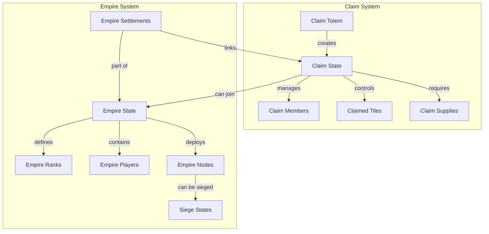

The Claim and Empire Management system forms the core territorial governance framework in BitCraft, orchestrating player-owned territories through a hierarchical structure that progresses from individual claims to empire-wide control. This dual-layer system manages land ownership, permissions, resource distribution, and territorial warfare through a sophisticated set of reducers, validation logic, and inter-module communication patterns.

## System Architecture Overview

The claim-empire system operates through a distributed architecture where territorial ownership exists at two levels: individual claims managed by player-owned totems, and empire-wide territories governed by federated settlements. Claims represent the foundational unit of territorial control, while empires provide the organizational layer for coordinating multiple claims under unified leadership, warfare capabilities, and resource pooling.

The architecture leverages SpacetimeDB's distributed capabilities to split concerns between regional modules (handling claim-local operations) and global modules (managing empire-wide coordination and warfare). This separation enables efficient scaling of territory management while maintaining consistency across the game world through inter-module message passing.

Sources: [BitCraftServer/packages/game/src/game/handlers/claim/mod.rs](BitCraftServer/packages/game/src/game/handlers/claim/mod.rs#L1-L25), [BitCraftServer/packages/game/src/game/handlers/empires/mod.rs](BitCraftServer/packages/game/src/game/handlers/empires/mod.rs#L1-L11), [BitCraftServer/packages/game/src/messages/empire_shared.rs](BitCraftServer/packages/game/src/messages/empire_shared.rs#L24-L137)

## Claim Ownership and Transfer

Claim ownership represents the fundamental authority mechanism within territorial management. The system implements a graduated transfer process that prevents sudden ownership changes in well-supplied, populated claims while allowing swift transfer in abandoned territories. The transfer logic respects hierarchical permission levels, with different time requirements based on the transferring player's role within the claim.

The ownership transfer reducer validates several critical conditions before permitting a transfer: proximity of the player to the claim totem (within 3 tiles), current supply levels, and the requesting player's membership status. For claims with active supplies, the system enforces a supply-based time barrier—co-owners can transfer after the shortest duration, officers after a medium duration, and regular members after the longest duration. This design prevents hostile takeovers of active communities while enabling recovery of abandoned claims.

Sources: [BitCraftServer/packages/game/src/game/handlers/claim/claim_take_ownership.rs](BitCraftServer/packages/game/src/game/handlers/claim/claim_take_ownership.rs#L19-L76)

### Claim Expansion Mechanics

Territorial expansion follows a hexagonal grid system with strict adjacency requirements and maximum tile limits based on technological advancement. The `claim_add_tile` reducer implements comprehensive validation including adjacency checks (tiles must be adjacent to existing claim territory), biome restrictions (cannot claim near safe meadows spawn areas), minimum distance enforcement between claims, and convex shape requirements to prevent claim fragmentation.

<CgxTip>The system uses raycasting validation to ensure claims maintain convex shapes, preventing territorial enclaves that could disrupt gameplay or enable abusive claim patterns that surround other territories.</CgxTip>

Each claim maintains a tile count tracked in local state, which cannot exceed the maximum tiles allowed by the claim's technology level. The tile addition process also updates neighbor counts, which influences various gameplay systems including pathfinding and territorial influence calculations.

Sources: [BitCraftServer/packages/game/src/game/handlers/claim/claim_add_tile.rs](BitCraftServer/packages/game/src/game/handlers/claim/claim_add_tile.rs#L25-L97)

## Empire Integration and Federation

Claims can voluntarily federate into empires through the empire settlement system, which transforms independent territories into coordinated administrative units. The integration process begins with the `empire_claim_join` reducer, which validates that the claim owner has unlocked settlement technology (via EmpireSettlementState) and is not already affiliated with another empire.

The federation process establishes bidirectional relationships: claims receive empire-wide benefits including organized warfare capabilities and resource pooling, while empires gain territorial control points that contribute to expansion potential and tax generation. The system tracks settlements per chunk, enabling strategic placement of empire influence nodes across the game world.

Sources: [BitCraftServer/packages/game/src/game/handlers/empires/empire_claim_join.rs](BitCraftServer/packages/game/src/game/handlers/empires/empire_claim_join.rs#L11-L54), [BitCraftServer/packages/game/src/inter_module/claim_create_empire_settlement_state.rs](BitCraftServer/packages/game/src/inter_module/claim_create_empire_settlement_state.rs#L10-L22)

### Empire Permission System

Empire governance operates through a granular permission system defined by the `EmpirePermission` enum, which controls access to critical empire functions. Permissions are assigned per rank through the `EmpireRankState` table, which associates titles with boolean permission vectors. This design enables flexible political structures where empires can customize rank hierarchies and delegate authority appropriately.

The available permissions span supply management, resource collection (hexite capsules), defensive construction (watchtowers), diplomatic actions (settlement invitations), offensive operations (siege warfare), administrative functions (approval of submissions and rank promotions), territorial expansion, and specialized crafting capabilities.

Sources: [BitCraftServer/packages/game/src/messages/empire_shared.rs](BitCraftServer/packages/game/src/messages/empire_shared.rs#L7-L22), [BitCraftServer/packages/game/src/messages/empire_shared.rs](BitCraftServer/packages/game/src/messages/empire_shared.rs#L107-L121), [BitCraftServer/packages/game/src/game/handlers/empires/empires_shared.rs](BitCraftServer/packages/game/src/game/handlers/empires/empires_shared.rs#L13-L24)

## Empire Nodes and Territorial Influence

Empire nodes represent the physical projection of empire power across the world map. These structures, implemented through `EmpireNodeState`, function as influence centers that project control into surrounding chunks. The system enforces strict placement rules: only one active node per chunk, and nodes cannot be placed in contested areas where other empires already control territory.

Node activation requires validation of chunk control status and competing node presence. Once active, nodes consume upkeep energy that must be maintained through player-supplied hexite capsules. This creates a strategic maintenance requirement where empires must balance territorial expansion with resource sustainability, as inactive nodes lose their influence projection capabilities.

Sources: [BitCraftServer/packages/game/src/messages/empire_shared.rs](BitCraftServer/packages/game/src/messages/empire_shared.rs#L40-L55), [BitCraftServer/packages/game/src/game/handlers/empires/empires_shared.rs](BitCraftServer/packages/game/src/game/handlers/empires/empires_shared.rs#L118-L135)

### Settlement Integration and Node Deployment

Empire settlements function as specialized claim-empire junctions that enable deeper integration than standard member claims. The `EmpireSettlementState` tracks which claims have officially joined empires and their contribution levels through member donations. Settlements can potentially host empire storehouses (though this feature is currently not enforced) and contribute to the empire's chunk-level control tracking.

Watchtower deployment follows strict placement rules centered on large tile coordinates, ensuring uniform spacing and strategic positioning. The validation process checks player permissions, empire membership, and expansion orders before permitting construction. This creates a progressive expansion pattern where empires must secure permissions and plan expansions before projecting power into new territories.

Sources: [BitCraftServer/packages/game/src/messages/empire_shared.rs](BitCraftServer/packages/game/src/messages/empire_shared.rs#L57-L83), [BitCraftServer/packages/game/src/game/handlers/empires/empires_shared.rs](BitCraftServer/packages/game/src/game/handlers/empires/empires_shared.rs#L172-L200)

## Siege Warfare Mechanics

The empire warfare system centers on siege engines and watchtower depletion mechanics that enable territorial conquest. The `empire_start_siege` reducers manage siege deployment through a multi-stage process: players deploy siege engines (deployable ID 1000) within specific distance ranges of target watchtowers, consume player cargo for siege supplies, and initiate inter-module messages that trigger global siege state management.

Siege deployment enforces minimum and maximum distance requirements from target nodes, preventing unrealistic siege placement while ensuring tactical positioning options. The system validates that no active siege exists on the target node and that the player has proper empire affiliations. Once deployed, siege engines operate autonomously with energy-based progression that can be influenced by additional supply contributions from participating players.

Sources: [BitCraftServer/packages/game/src/game/handlers/empires/empire_start_siege.rs](BitCraftServer/packages/game/src/game/handlers/empires/empire_start_siege.rs#L39-L133), [BitCraftServer/packages/game/src/messages/empire_shared.rs](BitCraftServer/packages/game/src/messages/empire_shared.rs#L122-L137)

<CgxTip>Siege warfare incorporates a proxy empire system where unaffiliated players can choose which empire to support by supplying specific siege efforts, enabling mercenaries and temporary alliances without requiring full empire membership.</CgxTip>

### Siege Supply Management

Siege operations require continuous supply delivery to maintain offensive pressure. The system tracks per-siege energy states through `EmpireNodeSiegeState`, with distinct states for each attacking empire. Players can add siege supplies using the `EmpireAddSiegeSuppliesRequest`, which validates that an active siege exists and that the player is either affiliated with a participating empire or explicitly chooses a proxy empire to support.

Defensive resupply operations follow similar validation patterns but with additional checks: only empire members with SupplyNode permission can resupply watchtowers, and resupply is blocked when the node is under active siege. This creates strategic timing windows where defenders must maintain pre-siege supply levels to withstand initial attacks before siege engines can be neutralized.

Sources: [BitCraftServer/packages/game/src/game/handlers/empires/empires_shared.rs](BitCraftServer/packages/game/src/game/handlers/empires/empires_shared.rs#L56-L110), [BitCraftServer/packages/game/src/game/handlers/empires/empires_shared.rs](BitCraftServer/packages/game/src/game/handlers/empires/empires_shared.rs#L137-L169)

## Data Model and State Management

The claim-empire system utilizes a multi-table data architecture optimized for distributed queries and territorial calculations. The core state tables include `ClaimState` for individual claim ownership, `EmpireState` for empire-wide properties (treasury, nobility thresholds, claim counts), and `EmpirePlayerDataState` for tracking player citizenship and rank assignments. Critical indexes on chunk indices and empire entity IDs enable efficient territorial queries essential for rendering influence maps and calculating strategic options.

The system employs shared table decorators for empire-related tables, indicating ownership by the global module with replication to regional modules. This design choice ensures that empire-wide state (like total treasury or member lists) remains consistent across all regions while enabling regional modules to access necessary read-only data for validation and gameplay calculations.

Sources: [BitCraftServer/packages/game/src/messages/empire_shared.rs](BitCraftServer/packages/game/src/messages/empire_shared.rs#L24-L39), [BitCraftServer/packages/game/src/messages/empire_shared.rs](BitCraftServer/packages/game/src/messages/empire_shared.rs#L95-L106)

## Claim Member Management

Claim membership operates through a four-tier permission system: owner, co-owner, officer, and member. The `claim_set_member_permissions` reducer enables permission modification, while `claim_add_member` and `claim_remove_member` handle roster management. The system tracks permissions per member, allowing granular control over claim operations without requiring full ownership transfer.

Member management integrates with the broader empire system through the `on_claim_members_changed` inter-module handler, which updates empire-related state when claim rosters change. This integration ensures that empire calculations (such as total member counts or tax bases) remain synchronized with claim-level membership changes.

Sources: [BitCraftServer/packages/game/src/game/handlers/claim/mod.rs](BitCraftServer/packages/game/src/game/handlers/claim/mod.rs#L1-L25), [BitCraftServer/packages/game/src/inter_module/on_claim_members_changed.rs](BitCraftServer/packages/game/src/inter_module/on_claim_members_changed.rs)

## Technology and Progression

Claim capabilities expand through a technology tree tracked in `ClaimTechState`, which determines maximum tile limits, available upgrades, and empire integration prerequisites. The `claim_tech_learn`, `claim_tech_cancel`, and `claim_tech_unlock_tech` reducers manage technology progression, enabling claims to evolve from simple territories to sophisticated settlements capable of empire membership and advanced warfare participation.

Technology progression creates natural pacing for territorial development: new claims start with limited tile capacity and basic capabilities, requiring investment and research to unlock empire integration, enhanced defense, and expansion capabilities. This progression system ties individual claim development to empire-wide strategic objectives, creating interdependent progression paths.

Sources: [BitCraftServer/packages/game/src/game/handlers/claim/mod.rs](BitCraftServer/packages/game/src/game/handlers/claim/mod.rs#L19-L21)

## Next Steps

For deeper understanding of related systems, explore the [Building and Claim System](16-building-and-claim-system) documentation for foundational building mechanics, [Permission and Access Control](27-permission-and-access-control) for comprehensive permission architecture, or [Combat and PvP Systems](25-combat-and-pvp-systems) for warfare mechanics that integrate with siege operations. The [Project Architecture](3-project-architecture) provides broader context for how these systems fit within the overall game infrastructure.
