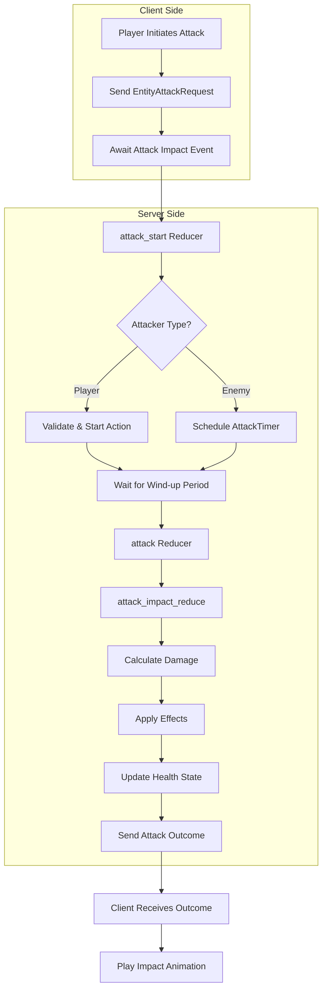
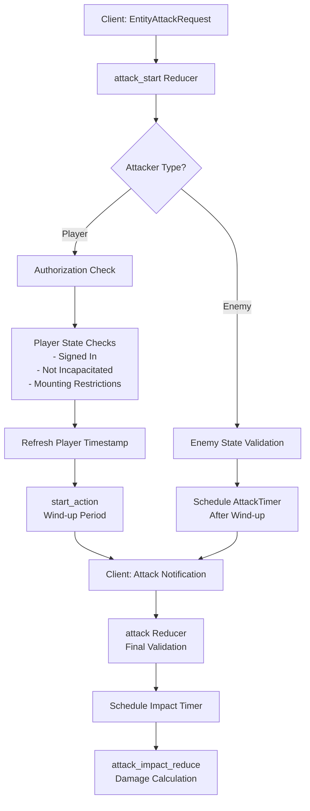

The combat and PvP systems in BitCraft provide a sophisticated framework for entity interactions, spanning player-versus-enemy (PvE) combat, player-versus-player (PvP) duels, and enemy AI threat management. Built on SpacetimeDB's scheduled reducer pattern, these systems deliver predictable combat outcomes with client-side synchronization for animations and feedback. This documentation examines the architectural patterns, damage mathematics, targeting validation, and state management that drive combat mechanics.

## Combat System Architecture

The combat architecture follows a **scheduled reducer pattern** with distributed state management across multiple specialized tables. The system separates attack initiation from impact resolution, enabling client-side animation synchronization while maintaining server-authoritative outcome calculation.




The core components reside in the attack handler and combat state management:

- **Attack Handler** ([`attack.rs`](BitCraftServer/packages/game/src/game/handlers/attack.rs#L1-L1115)): Central combat orchestrator managing attack initiation, validation, scheduling, and impact resolution
- **Duel Agent** ([`duel_agent.rs`](BitCraftServer/packages/game/src/agents/duel_agent.rs#L1-L98)): Scheduled agent monitoring PvP duels for timeout and range violations
- **Target Update Handler** ([`target_update.rs`](BitCraftServer/packages/game/src/game/handlers/target_update.rs#L1-L71)): Manages target selection and threat generation
- **Combat State Entity** ([`combat_state.rs`](BitCraftServer/packages/game/src/game/entities/combat_state.rs#L1-L24)): Tracks per-entity combat state including cooldowns and action history

### Core Combat Tables

| Table | Purpose | Key Fields |
|-------|---------|------------|
| `combat_state` | Entity combat state tracking | `entity_id`, `last_attacked_timestamp`, `global_cooldown` |
| `attack_timer` | Scheduled attack execution | `attacker_entity_id`, `defender_entity_id`, `combat_action_id` |
| `attack_impact_timer_migrated` | Scheduled impact resolution | `attacker_entity_id`, `defender_entity_id`, `main_attack` |
| `duel_state` | Active PvP duels | `entity_id`, `player_entity_ids`, `loser_index` |
| `threat_state` | Enemy aggro management | `entity_id`, `threatening_entities` |
| `attack_outcome_state` | Combat result tracking | `entity_id`, `last_damage`, `last_dodged`, `last_critical` |

Sources: [`attack.rs`](BitCraftServer/packages/game/src/game/handlers/attack.rs#L1-L1115), [`combat_state.rs`](BitCraftServer/packages/game/src/game/entities/combat_state.rs#L1-L24)

## Attack Flow and State Transitions

Combat follows a **four-phase execution model**: initiation, validation, impact calculation, and effect application. This separation enables client-side animation synchronization while maintaining server authority over all combat outcomes.

### Attack Initiation

The `attack_start` reducer ([`attack.rs`](BitCraftServer/packages/game/src/game/handlers/attack.rs#L46-L116)) serves as the entry point for combat actions, implementing different flow paths based on attacker type:



For **player attackers**, the system uses the action system ([`PlayerActionState`](BitCraftServer/packages/game/src/game/entities/player_action_state.rs)) to manage the wind-up period, preventing movement during attack animation when required ([`attack.rs`](BitCraftServer/packages/game/src/game/handlers/attack.rs#L866-L874)). The client sends a follow-up notification after the wind-up completes, triggering the actual attack reducer.

For **enemy attackers**, the system bypasses the player action framework and directly schedules an `AttackTimer` ([`attack.rs`](BitCraftServer/packages/game/src/game/handlers/attack.rs#L80-L92)) to execute the attack after the wind-up delay. This allows enemy AI to initiate attacks without client coordination.

### Attack Validation Pipeline

The `base_checks` function ([`attack.rs`](BitCraftServer/packages/game/src/game/handlers/attack.rs#L645-L800)) implements comprehensive validation before attack execution:

```rust
fn base_checks(
    ctx: &ReducerContext,
    attacker_entity_id: u64,
    defender_entity_id: u64,
    combat_action_id: i32,
    attacker_type: EntityType,
    defender_type: EntityType,
    main_attack: bool,
) -> Result<(), String>
```

<CgxTip>
The targeting matrix system determines attack permissions through `TargetingMatrixDesc::can_attack()`, which overrides base rules for players engaged in duels via `DuelState::are_players_dueling()` ([`attack.rs`](BitCraftServer/packages/game/src/game/handlers/attack.rs#L696-L700)). This enables PvP interactions that would normally be forbidden by standard targeting rules.
</CgxTip>

**Validation checks include**:

1. **Entity existence and vitality**: Verifies attacker and defender exist and are alive
2. **Targeting matrix validation**: Uses `TargetingMatrixDesc` to check attack permissions, with special handling for dueling players
3. **Range verification**: Validates attacker-defender distance against `CombatActionDescV3.max_range`
4. **Ability ownership**: Confirms attacker possesses the combat action ability
5. **Cooldown management**: Ensures ability is not on cooldown, respecting `ignore_global_cooldown` flag
6. **Stamina requirements**: Checks sufficient stamina for players
7. **Weapon compatibility**: Validates equipped weapon type and tier requirements
8. **Movement restriction**: Prevents moving during attack wind-up when required by action configuration
9. **Contribution locking**: Enforces crumb trail contribution requirements for certain interactions

Sources: [`attack.rs`](BitCraftServer/packages/game/src/game/handlers/attack.rs#L645-L800), [`duel_agent.rs`](BitCraftServer/packages/game/src/agents/duel_agent.rs#L1-L98)

## Damage Calculation System

BitCraft implements a **multi-factor damage calculation** system incorporating weapon statistics, character attributes, armor penetration, and scaling modifiers. The `calculate_hit_outcome` function ([`attack.rs`](BitCraftServer/packages/game/src/game/handlers/attack.rs#L817-L998)) computes final damage through a deterministic algorithm with randomized damage rolls.

### Damage Formula

The damage calculation follows this sequential process:

```rust
// Base damage roll from weapon/enemy description
damage_roll = rand_range(min_damage, max_damage)

// Strength bonus scaling
STRENGTH_PER_DAMAGE: f32 = 15.0  // +1 damage per 15 strength
bonus_damage = ceil(strength * strength_multiplier / (1.0 / weapon_cooldown))

// Apply combat action multipliers
final_damage = damage_roll + bonus_damage

// Apply armor reduction (diminishing returns formula)
ARMOR_50PCT_REDUCTION: f32 = 2000.0
damage_reduction = armor / (armor + ARMOR_50PCT_REDUCTION)
mitigated_damage = final_damage * (1.0 - damage_reduction)

// Apply secondary target multiplier for multi-hit attacks
if !main_attack:
    mitigated_damage *= secondary_target_multiplier

// Apply scaled armor from enemy scaling
scaled_damage_reduction = scaled_armor / (scaled_armor + ARMOR_50PCT_REDUCTION)
final_outcome = floor(mitigated_damage * (1.0 - scaled_damage_reduction))
```

### Hit Resolution and Evasion

The system implements an **accuracy vs. evasion roll** mechanic for determining successful hits:

```rust
// Only applies to combat (Strength-based), not hunting
EVASION_MULTIPLIER: f32 = 0.1

attack_roll = rand_range(0.0, accuracy * accuracy_multiplier)
evasion_roll = rand_range(0.0, evasion * EVASION_MULTIPLIER)

if attack_roll <= evasion_roll:
    return (0, 0, true, false)  // Dodged
```

The evasion roll uses a reduced multiplier (0.1) compared to accuracy, making high-evasion builds viable without breaking combat balance. This mechanic only applies to strength-based combat, not hunting interactions where evasion is set to zero.

### Attribute Sourcing

Damage attributes are sourced differently based on entity type and combat context:

| Entity Type | Strength Source | Accuracy Source | Armor Source |
|-------------|-----------------|-----------------|--------------|
| Player (Combat) | `CharacterStatType::Strength` | `CharacterStatType::Accuracy` | `CharacterStatType::Armor` |
| Player (Hunting) | `CharacterStatType::HuntingWeaponPower` | N/A | N/A |
| Enemy | `EnemyDesc.strength` | `EnemyDesc.accuracy` | `EnemyDesc.armor` |
| Building | N/A | N/A | 0.0 |

Enemy attributes are further modified by `ActiveBuffState::collect_enemy_stats()` ([`attack.rs`](BitCraftServer/packages/game/src/game/handlers/attack.rs#L839-L843)) and `EnemyScalingState` ([`attack.rs`](BitCraftServer/packages/game/src/game/handlers/attack.rs#L846-L851)) for dynamic stat adjustments.

Sources: [`attack.rs`](BitCraftServer/packages/game/src/game/handlers/attack.rs#L817-L998), [`character_stats.rs`](BitCraftServer/packages/game/src/game/entities/character_stats.rs)

## Multi-Target and Projectile Systems

The combat system supports both **area-of-effect multi-targeting** and **projectile-based attacks** with travel time calculations for visual synchronization.

### Multi-Target Attacks

Combat actions can include secondary targets through `CombatActionMultiHitDesc` ([`attack.rs`](BitCraftServer/packages/game/src/game/handlers/attack.rs#L216-L242)). The `targetable_entities_in_radius` function identifies valid targets within the attack's maximum range:

```rust
fn targetable_entities_in_radius(
    ctx: &ReducerContext,
    attacker_entity_id: u64,
    attacker_type: EntityType,
    coord: FloatHexTile,
    radius: f32,
) -> Vec<(u64, EntityType, f32)>  // Returns (entity_id, entity_type, distance)
```

Target selection applies multiple filters:
- **Targeting matrix compatibility**: Validates attacker can target defender type
- **Defense level checks**: Prevents attacking entities with higher defense level
- **Radius consideration**: Accounts for attacker and target radii in distance calculations
- **Incapacitation filtering**: Excludes dead or incapacitated entities
- **Inner Light protection**: Prevents attacking players with Inner Light buff ([`attack.rs`](BitCraftServer/packages/game/src/game/handlers/attack.rs#L169-L177))

Secondary targets are sorted by distance and capped at `max_secondary_targets` from the multi-hit configuration. Damage to secondary targets is multiplied by `secondary_target_multiplier` ([`attack.rs`](BitCraftServer/packages/game/src/game/handlers/attack.rs#L951-L954)).

### Projectile Mechanics

For attacks with projectile_speed > 0, the system calculates travel time based on distance:

```rust
distance = attacker_coord.distance_to(defender_coord)
projectile_time = distance / combat_action.projectile_speed

// Schedule impact timer at calculated time
AttackImpactTimerMigrated {
    scheduled_at: now_plus_secs_f32(projectile_time, ctx.timestamp),
    attacker_entity_id,
    defender_entity_id,
    combat_action_id,
    attacker_type,
    defender_type,
    main_attack,
}
```

Instant attacks (projectile_speed ≤ 0) schedule impact immediately. The main attack flag ensures only the primary target triggers certain effects like experience awards and weapon durability loss ([`attack.rs`](BitCraftServer/packages/game/src/game/handlers/attack.rs#L643-L647)).

Sources: [`attack.rs`](BitCraftServer/packages/game/src/game/handlers/attack.rs#L153-L242), [`attack.rs`](BitCraftServer/packages/game/src/game/handlers/attack.rs#L292-L338)

## Cooldown and Action Management

Combat implements a **two-tier cooldown system**: global cooldowns shared across all actions, and individual ability cooldowns specific to combat actions. The `CombatState` entity ([`combat_state.rs`](BitCraftServer/packages/game/src/game/entities/combat_state.rs#L1-L24)) tracks cooldown state for each entity.

### Cooldown Application

When a player executes an attack, the system applies cooldowns through `AbilityState::set_combat_action_cooldown()` ([`attack.rs`](BitCraftServer/packages/game/src/game/handlers/attack.rs#L438-L444)):

```rust
ability_state.set_combat_action_cooldown(
    &combat_action,
    cooldown_multiplier,        // From character stats/buffs
    weapon_cooldown_multiplier, // From equipped weapon
    ctx.timestamp,
    false,                      // Don't trigger cooldown refresh event
)
```

Cooldown multipliers are sourced differently by context:
- **Enemy combat**: Uses `ActiveBuffState::collect_enemy_stats()` with `CharacterStatType::CooldownMultiplier`
- **Player combat**: Derived from `CharacterStatsState::get_cooldown_and_weapon_cooldown_multipliers()`, with special handling for huntable enemies that use hunting weapon cooldowns

### Global Cooldown System

Global cooldowns prevent ability spam by enforcing a shared recovery period after any combat action:

```rust
combat.global_cooldown = if combat_action.global_cooldown / cooldown_multiplier == 0.0 {
    None  // No global cooldown for this action
} else {
    Some(ActionCooldown {
        timestamp: now,
        cooldown: combat_action.global_cooldown / cooldown_multiplier,
    })
}
```

The `ignore_global_cooldown` flag in `CombatActionDescV3` allows certain abilities to bypass global cooldowns, enabling rapid-fire attack combinations for specific combat styles.

Sources: [`combat_state.rs`](BitCraftServer/packages/game/src/game/entities/combat_state.rs#L1-L24), [`attack.rs`](BitCraftServer/packages/game/src/game/handlers/attack.rs#L410-L510)

## Threat and Aggro Management

The threat system enables enemy AI combat behavior through a bidirectional threat tracking mechanism. `ThreatState` entities maintain threat values between enemies and their aggressors ([`attack.rs`](BitCraftServer/packages/game/src/game/handlers/attack.rs#L576-L584)).

### Threat Calculation

Threat is modified by both combat actions and explicit threat generation from targeting:

```rust
// Self-threat from attacking (attacker gains threat from defender)
self_threat = if defender_type == EntityType::Building {
    combat_action.self_threat_against_buildings
} else {
    combat_action.self_threat_against_enemies
}
ThreatState::add_threat(ctx, attacker_entity_id, defender_entity_id, self_threat)

// Base threat from damage
threat = combat_action.base_threat + 
         combat_action.threat_per_damage * damage as f32

// Apply threat with special handling for taunt actions
if combat_action.is_taunt_action:
    ThreatState::equalize_threat_then_add(ctx, defender_entity_id, attacker_entity_id, threat)
else:
    ThreatState::add_threat(ctx, defender_entity_id, attacker_entity_id, threat)
```

Taunt actions equalize threat across all aggressors before adding new threat, forcing enemies to target the taunting character regardless of prior threat distribution.

### Threat Generation from Targeting

The `target_update` reducer ([`target_update.rs`](BitCraftServer/packages/game/src/game/handlers/target_update.rs#L34-L39)) can generate initial threat when players select targets:

```rust
if generate_aggro:
    ThreatState::add_threat(ctx, actor_id, target_entity_id, 0.0)
    ThreatState::add_threat(ctx, target_entity_id, actor_id, 0.0)
```

This bidirectional threat establishment enables enemies to react to player targeting, even before damage is dealt, creating more responsive AI behavior.

Sources: [`attack.rs`](BitCraftServer/packages/game/src/game/handlers/attack.rs#L576-L584), [`target_update.rs`](BitCraftServer/packages/game/src/game/handlers/target_update.rs#L1-L71)

## PvP and Duel System

The duel system provides structured player-versus-player combat with safety restrictions and automatic resolution based on victory conditions or rule violations. The `DuelAgent` ([`duel_agent.rs`](BitCraftServer/packages/game/src/agents/duel_agent.rs#L1-L98)) runs on a one-second scheduled timer to monitor active duels.

### Duel State Management

Active duels are tracked in `DuelState` entities containing:
- `entity_id`: Duel identifier (same as one participant's entity_id)
- `player_entity_ids`: Array of participant entity IDs
- `loser_index`: Index of losing player, set when duel ends
- `out_of_range_timestamps`: Timestamp tracking when each player left range

The agent validates duels against multiple termination conditions:

```rust
for mut duel in ctx.db.duel_state().iter():
    for i in 0..duel.player_entity_ids.len():
        entity_id = duel.player_entity_ids[i]
        
        // Check if still signed in
        if ctx.db.signed_in_player_state().entity_id().find(entity_id).is_none():
            updated = true
            duel.set_loser(ctx, i)
            break
        
        // Check if still alive
        health = ctx.db.health_state().entity_id().find(entity_id).unwrap()
        if health.health <= 0.0:
            updated = true
            duel.set_loser(ctx, i)
            break
        
        // Check range and timeout
        coord = game_state_filters::coordinates_float(ctx, entity_id)
        out_of_range = coord.dimension != duel_coord.dimension || 
                       coord.distance_to(duel_coord) > duel_range
        
        updated |= duel.update_out_of_range_timestamp(ctx, i, out_of_range)
        if out_of_range && duel.timed_out(ctx, i, timeout_millis):
            updated = true
            duel.set_loser(ctx, i)
            break
```

### Duel Parameters

Duel behavior is controlled by static parameters:

| Parameter | Purpose |
|-----------|---------|
| `duel_out_of_range_grace_period_millis` | Time players can remain out of range before forfeit |
| `duel_range` | Maximum distance between duel participants |

The targeting matrix system respects active duels by allowing attacking between dueling players regardless of normal targeting restrictions ([`attack.rs`](BitCraftServer/packages/game/src/game/handlers/attack.rs#L696-L700)).

Sources: [`duel_agent.rs`](BitCraftServer/packages/game/src/agents/duel_agent.rs#L1-L98)

## Combat Effects and Status Application

Combat actions can apply both self-buffs and target debuffs through the `self_buffs` and `target_buffs` arrays in `CombatActionDescV3`. Buff application occurs at different stages of combat execution.

### Self-Buff Application

Self-buffs are applied during `attack_reduce` ([`attack.rs`](BitCraftServer/packages/game/src/game/handlers/attack.rs#L497-L507)), before the attack impact resolves:

```rust
if main_attack && combat_action.self_buffs.len() > 0:
    active_buff_state = ctx.db.active_buff_state().entity_id().find(attacker_entity_id)
    for buff_effect in combat_action.self_buffs:
        active_buff_state.add_active_buff_with_data(
            ctx, 
            buff_effect.buff_id, 
            buff_effect.duration, 
            None  // No additional data
        )
    ctx.db.active_buff_state().entity_id().update(active_buff_state)
```

This timing allows self-buffs to take effect before damage calculation, enabling abilities that enhance the current attack's effectiveness.

### Target Buff/Debuff Application

Target effects are applied during `attack_impact_reduce` ([`attack.rs`](BitCraftServer/packages/game/src/game/handlers/attack.rs#L538-L549)), after successful hit resolution:

```rust
if !dodged && combat_action.target_buffs.len() > 0:
    active_buff_state = ctx.db.active_buff_state().entity_id().find(defender_entity_id)
    for buff_effect in combat_action.target_buffs:
        active_buff_state.add_active_buff_with_data(
            ctx,
            buff_effect.buff_id,
            buff_effect.duration,
            None
        )
    ctx.db.active_buff_state().entity_id().update(active_buff_state)
```

Target buffs are only applied when the attack is not dodged, ensuring debuffs only affect successfully hit targets.

### Inner Light Protection

Players protected by the Inner Light buff cannot be attacked by enemy targeting logic ([`attack.rs`](BitCraftServer/packages/game/src/game/handlers/attack.rs#L169-L177)). However, attacking another player removes the attacker's Inner Light protection ([`attack.rs`](BitCraftServer/packages/game/src/game/handlers/attack.rs#L485-L490)):

```rust
if ctx.db.active_buff_state().entity_id().find(&attacker_entity_id).is_some():
    inner_light = BuffDesc::find_by_buff_category_single(ctx, BuffCategory::InnerLight).unwrap().id
    buff::deactivate(ctx, attacker_entity_id, inner_light).unwrap()
```

This creates a strategic trade-off: players can maintain passive protection by avoiding combat, but must surrender protection when engaging in offensive actions.

Sources: [`attack.rs`](BitCraftServer/packages/game/src/game/handlers/attack.rs#L497-L549), [`buff.rs`](BitCraftServer/packages/game/src/game/entities/buff.rs)

## Death Handling and Experience Distribution

Combat resolution includes automatic death detection and experience award systems that track contributions and distribute rewards based on damage dealt.

### Damage Contribution Tracking

When players damage enemies, the system records damage contributions through `ContributionState::add_damage()` ([`attack.rs`](BitCraftServer/packages/game/src/game/handlers/attack.rs#L611-L616)):

```rust
if attacker_type == EntityType::Player && defender_type == EntityType::Enemy:
    if ContributionState::applies(ctx, defender_entity_id):
        ContributionState::add_damage(
            ctx,
            attacker_entity_id,
            defender_entity_id,
            (damage as f32).min(defender_health.health).ceil() as i32,
        )
```

Contribution tracking enables experience distribution and loot eligibility determination, ensuring players who participate in combat receive appropriate rewards.

### Experience Awarding

The system awards experience on damage through `game_state_filters::award_experience_on_damage()` ([`attack.rs`](BitCraftServer/packages/game/src/game/handlers/attack.rs#L630-L634)). Experience is only awarded for the main attack target, preventing experience farming from multi-hit attacks against secondary targets:

```rust
if main_attack:
    game_state_filters::award_experience_on_damage(
        ctx, 
        damage as f32, 
        defender_entity_id, 
        Some(attacker_entity_id)
    )
```

### Death Resolution

Death is handled by `health_helpers::update_health_and_check_death()` ([`attack.rs`](BitCraftServer/packages/game/src/game/handlers/attack.rs#L636-L641)), which processes death events including:

- Experience reward distribution based on contribution
- Loot table rolling and item generation
- Entity cleanup and state transitions
- Quest progress updates

The system respects `ignore_damage` flags on enemies and buildings, allowing certain entities to be immune to damage while still being valid targets for other interactions.

Sources: [`attack.rs`](BitCraftServer/packages/game/src/game/handlers/attack.rs#L605-L641), [`health_helpers.rs`](BitCraftServer/packages/game/src/game/reducer_helpers/health_helpers.rs)

## Targeting Matrix and PvP Restrictions

The targeting matrix system provides fine-grained control over which entities can attack which others, supporting both PvE and PvP scenarios with configurable restrictions.

### Targeting Matrix Description

`TargetingMatrixDesc` entities define attack permissions through matrix comparisons. The system includes:
- `TargetingMatrixDesc::player()`: Returns targeting matrix for players
- `TargetingMatrixDesc::from_enemy_entity_id()`: Returns targeting matrix for specific enemy types
- `TargetingMatrixDesc::building()`: Returns targeting matrix for buildings

The `can_attack()` method determines if one targeting matrix can target another, with special overrides for dueling players:

```rust
if attacker_entity_id != defender_entity_id && 
   !attacker_targeting_matrix.can_attack(&defender_targeting_matrix):
    if !DuelState::are_players_dueling(ctx, attacker_entity_id, defender_entity_id):
        return Err("Unable to target that entity")
```

This design enables:
- **PvE zones**: Prevent players from attacking other players
- **PvP zones**: Enable unrestricted player combat
- **Duel system**: Allow specific player pairs to attack each other regardless of zone rules
- **Enemy permissions**: Control which enemies can attack which other entity types

### Defense Level System

The defense level system provides tier-based protection where entities with higher defense levels cannot be attacked by entities with lower attack levels ([`attack.rs`](BitCraftServer/packages/game/src/game/handlers/attack.rs#L159-L166)):

```rust
if CharacterStatsState::get_entity_stat(ctx, mes.entity_id, CharacterStatType::DefenseLevel) as i32 > attacker_level:
    return None  // Defense level too high, not targetable
```

This prevents low-level players from engaging high-level enemies or players, providing progression gating and preventing griefing scenarios.

Sources: [`attack.rs`](BitCraftServer/packages/game/src/game/handlers/attack.rs#L153-L180), [`duel_agent.rs`](BitCraftServer/packages/game/src/agents/duel_agent.rs#L1-L98)

## Next Steps

For a complete understanding of combat systems, explore these related documentation:

- **[Player State Management](15-player-state-management)**: Learn about player state synchronization and management
- **[Combat and Enemy State](18-combat-and-enemy-state)**: Deep dive into enemy AI behavior and state machines
- **[NPC AI and Behavior](13-npc-ai-and-behavior)**: Understand how NPCs make combat decisions and target selection
- **[Permission and Access Control](27-permission-and-access-control)**: Explore how targeting permissions are configured across different game zones
