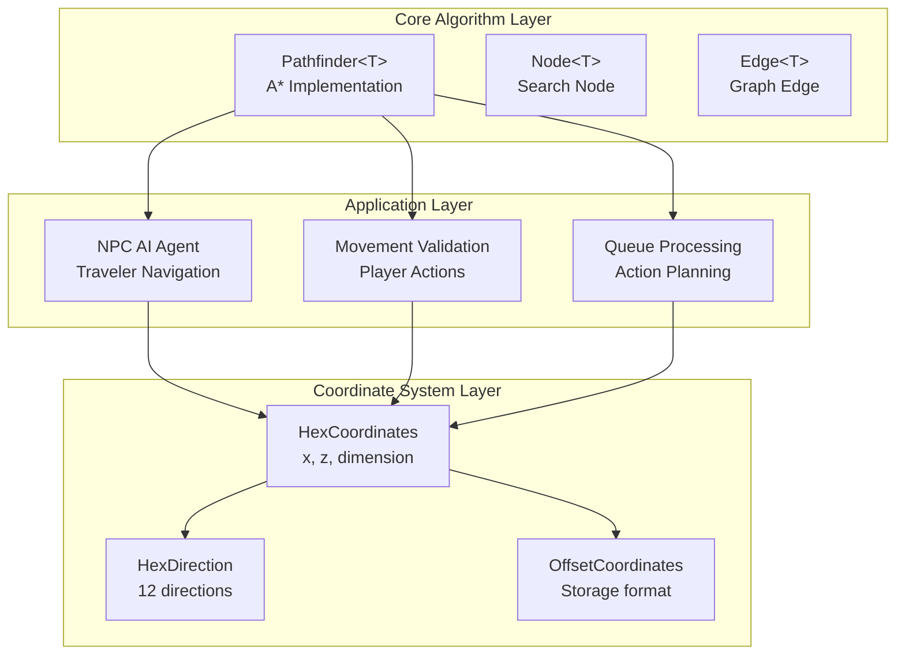

The BitCraft server implements a sophisticated pathfinding system built on A* (A-Star) algorithm optimized for hexagonal grid coordinates. This system serves as the foundation for NPC movement, agent navigation, and spatial queries throughout the procedurally generated world. The implementation balances computational efficiency with path quality through a generic, reusable `Pathfinder<T>` component that can operate on any hashable coordinate type, though it's primarily designed for hexagonal grid navigation.

## Architecture Overview

The pathfinding architecture consists of three interconnected layers: a generic A* algorithm implementation, a hexagonal coordinate system with spatial primitives, and specialized application logic for NPC navigation. This separation of concerns enables the core algorithm to be reused across different game systems while maintaining domain-specific optimizations at the application layer.

The generic `Pathfinder<T>` encapsulates the A* algorithm's core mechanics—open set management with a binary heap, closed set tracking, and node reconstruction—while delegating domain-specific concerns to callback functions. This design allows the same algorithm to handle pathfinding across different coordinate spaces and movement rules without code duplication.

Sources: [pathfinder.rs](BitCraftServer/packages/game/src/game/generic/pathfinder.rs#L4-L11), [npc_ai_agent.rs](BitCraftServer/packages/game/src/agents/npc_ai_agent.rs#L191-L196)

## A* Algorithm Implementation

The pathfinding system implements a classic A* algorithm with several optimization features tailored for real-time game performance. The algorithm maintains three primary data structures: a `HashMap<T, Node<T>>` for node lookup and cost tracking, a `BinaryHeap<Node<T>>` for efficient minimum-cost node extraction from the open set, and a `HashSet<T>` for the closed set of visited nodes.

The core `shortest_path_to_target` method accepts a source location, target location, heuristic cost function (`get_h_costs`), edge traversal function (`get_edges`), and an optional node limit parameter. The node limit acts as a safety mechanism to prevent excessive computation in scenarios where no path exists or the search space is too large, terminating the search after examining the specified number of nodes.

Node prioritization follows the standard A* formulation where each node's total cost (f-score) equals the sum of g-costs (actual distance from source) and h-costs (heuristic estimate to target). The algorithm implements path reconstruction by maintaining parent pointers in each node, enabling efficient backtracking from target to source once the goal is reached.

Sources: [pathfinder.rs](BitCraftServer/packages/game/src/game/generic/pathfinder.rs#L33-L104)

<CgxTip>
The pathfinder implements an important optimization: when a node is rediscovered with a higher g-cost, it updates the existing node and re-adds it to the open set rather than discarding it. This approach prioritizes path quality over minimal memory usage, which is appropriate for the scale of pathfinding queries in BitCraft's world.</CgxTip>

## Hexagonal Grid Coordinate System

Pathfinding operates on a sophisticated hexagonal coordinate system that provides uniform movement costs and natural neighbor relationships. The `HexCoordinates` struct represents positions using axial coordinates (x, z) with an optional dimension field for multi-world support. Axial coordinates are particularly well-suited for hex grids because they simplify distance calculations and neighbor enumeration compared to offset coordinates.

The coordinate system defines twelve cardinal directions rather than six, allowing for more precise angular calculations while maintaining the hexagonal grid's geometric properties. Each direction has specific (x, z) offsets that enable efficient neighbor computation through the `neighbor_n` method, which can calculate neighbors at arbitrary distances by scaling the direction offset.

Distance calculation follows the hexagonal Manhattan distance formula: `(|dx| + |dy| + |dz|) / 2`, where dy is derived from the axial coordinates as `-x - z`. This metric is consistent with hexagonal geometry and provides the true shortest path distance between any two cells, making it an ideal heuristic for A* pathfinding.

Sources: [hex_coordinates.rs](BitCraftServer/packages/game/src/game/coordinates/hex_coordinates.rs#L12-L16), [hex_coordinates.rs](BitCraftServer/packages/game/src/game/coordinates/hex_coordinates.rs#L97-L99), [hex_coordinates.rs](BitCraftServer/packages/game/src/game/coordinates/hex_coordinates.rs#L122-L146), [hex_coordinates.rs](BitCraftServer/packages/game/src/game/coordinates/hex_coordinates.rs#L187-L189)

### Coordinate Transformations

The system supports bidirectional transformations between hex coordinates and offset coordinates. Offset coordinates use a conventional (x, z) system that's more intuitive for storage and serialization, while hex coordinates enable efficient spatial calculations. The transformation formulas preserve coordinate identity while optimizing for their respective use cases.

Conversion from offset to hex coordinates follows: `hex.x = offset.x - offset.z / 2`, `hex.z = offset.z`. The reverse transformation uses integer division and conditional logic to handle the hex grid's staggered pattern. These transformations are computed frequently during pathfinding initialization and result serialization.

Sources: [hex_coordinates.rs](BitCraftServer/packages/game/src/game/coordinates/hex_coordinates.rs#L357-L363), [hex_coordinates.rs](BitCraftServer/packages/game/src/game/coordinates/hex_coordinates.rs#L408-L426)

## Spatial Query and Traversal Primitives

The coordinate system provides powerful spatial query functions that support efficient pathfinding operations. The `ring` method generates all coordinates at a specified distance from a center point, producing hexagonal rings that are useful for expanding searches and distance-based queries. This function implements the hexagonal ring traversal algorithm that walks around the perimeter by moving in each direction for the specified radius.

The `coordinates_in_radius` method combines multiple rings to generate all coordinates within a specified radius, excluding the center point. For memory-efficient iteration, the system provides `ring_iter` and `coordinates_in_radius_with_center_iter`, which return lazy iterators instead of materialized vectors. These iterators are particularly valuable for large-radius queries where memory allocation overhead would be significant.

The `closest` method efficiently finds the nearest coordinate from a collection to a target coordinate, using a linear scan that maintains the minimum distance found. This operation is frequently used in NPC AI for selecting nearest objectives from available options.

Sources: [hex_coordinates.rs](BitCraftServer/packages/game/src/game/coordinates/hex_coordinates.rs#L297-L303), [hex_coordinates.rs](BitCraftServer/packages/game/src/game/coordinates/hex_coordinates.rs#L305-L312), [hex_coordinates.rs](BitCraftServer/packages/game/src/game/coordinates/hex_coordinates.rs#L314-L330), [hex_coordinates.rs](BitCraftServer/packages/game/src/game/coordinates/hex_coordinates.rs#L336-L347)

## NPC AI Pathfinding Application

The primary consumer of the pathfinding system is the NPC AI agent, which coordinates traveler movement between ancient ruins throughout the world. The agent operates on a scheduled loop (every 300 seconds) that processes all active NPCs, spawning new travelers, moving existing ones, and cleaning up invalid states.

For each NPC that needs to move, the system employs a hybrid approach combining pathfinding heuristics with randomized selection. The `pick_free_ruin_index` function identifies the NPC's current location, then sorts available destination ruins by distance using the hex coordinate system's `distance_to` method. It filters out recently visited buildings to promote exploration diversity, then randomly selects from the three closest eligible destinations.

This approach balances computational efficiency with gameplay variety. Rather than computing full A* paths for all possible destinations, the system uses the distance heuristic to quickly narrow candidates to a small subset (3 options), then applies randomness within that subset. This creates natural-looking movement patterns while avoiding the computational overhead of full pathfinding for long-range travel.

Sources: [npc_ai_agent.rs](BitCraftServer/packages/game/src/agents/npc_ai_agent.rs#L17-L34), [npc_ai_agent.rs](BitCraftServer/packages/game/src/agents/npc_ai_agent.rs#L94-L123), [npc_ai_agent.rs](BitCraftServer/packages/game/src/agents/npc_ai_agent.rs#L191-L231)

### Movement and Teleportation

When a traveler NPC moves between ruins, the system performs a teleportation operation rather than continuous path following. This design choice reflects the scale of BitCraft's world—travelers may move hundreds or thousands of hexes between ancient ruins, making continuous pathfinding impractical. The `teleport` method handles the instantaneous position change, updating both the NPC's coordinates and its associated building reference.

After teleportation, the system updates the ruin occupancy tracking, marking the destination as occupied and releasing the source ruin back to the available pool. This bookkeeping prevents multiple NPCs from targeting the same ruin simultaneously and ensures fair distribution of destinations among travelers.

Sources: [npc_ai_agent.rs](BitCraftServer/packages/game/src/agents/npc_ai_agent.rs#L100-L117)

## Performance Characteristics

The pathfinding system's performance is characterized by several key metrics and optimizations:

| Component | Time Complexity | Space Complexity | Typical Usage |
|-----------|----------------|------------------|---------------|
| A* Search | O(b^d) worst case, O(E log V) typical | O(V) | Short to medium paths |
| Distance Calculation | O(1) | O(1) | Heuristics, sorting |
| Ring Generation | O(r) where r is radius | O(r) or O(1) with iterators | Spatial queries |
| Closest Point Search | O(n) linear scan | O(1) | Target selection |

The node limit parameter provides critical performance protection. By default set to `usize::MAX`, it can be configured for specific pathfinding queries to cap search depth. This is particularly important for NPC navigation where the search space might include thousands of potential destinations; limiting the search ensures the game server remains responsive even under heavy load.

Memory allocation is optimized through capacity pre-allocation in the `Pathfinder::with_capacity` constructor, which accepts an estimated node count to size all internal data structures appropriately. This reduces allocation overhead during repeated pathfinding queries, which is essential given the high frequency of NPC movement calculations.

Sources: [pathfinder.rs](BitCraftServer/packages/game/src/game/generic/pathfinder.rs#L25-L31), [pathfinder.rs](BitCraftServer/packages/game/src/game/generic/pathfinder.rs#L39-L40), [pathfinder.rs](BitCraftServer/packages/game/src/game/generic/pathfinder.rs#L53-L55)

<CgxTip>
The binary heap used for the open set provides O(log n) insertion and extraction, which is optimal for A* pathfinding. However, the implementation does not support decrease-key operations for updating existing nodes in the heap. Instead, it inserts duplicate entries with lower costs, relying on the closed set to discard stale entries. This trade-off prioritizes implementation simplicity over optimal heap performance, which is acceptable given the relatively small search spaces involved.</CgxTip>

## Integration with Game Systems

Pathfinding integrates with multiple game systems through well-defined interfaces. Movement validation handlers use distance calculations and neighbor checks to verify player actions comply with terrain constraints. The queue system employs spatial queries to plan action execution order based on proximity and path feasibility.

The location cache system maintains optimized spatial indexes that accelerate pathfinding by precomputing building positions, ruin locations, and other static navigational landmarks. This cache is updated incrementally as buildings are constructed or destroyed, ensuring pathfinding queries operate on current world state without expensive real-time scans.

Sources: [npc_ai_agent.rs](BitCraftServer/packages/game/src/agents/npc_ai_agent.rs#L48-L52), [npc_ai_agent.rs](BitCraftServer/packages/game/src/agents/npc_ai_agent.rs#L173-L188)

## Summary

BitCraft's pathfinding system demonstrates a pragmatic approach to game AI navigation, combining a robust A* implementation with hex grid spatial primitives and domain-specific optimizations for NPC behavior. The generic, reusable algorithm design enables consistent pathfinding across diverse game systems while the specialized coordinate system provides efficient spatial reasoning. The NPC AI agent exemplifies practical application of these components, using heuristic-based destination selection and teleportation movement to create engaging traveler behavior at scale.

For deeper exploration of related systems, see [Hex Grid Coordinate System](5-hex-grid-coordinate-system) for coordinate mathematics, [NPC AI and Behavior](13-npc-ai-and-behavior) for behavioral logic, and [Procedural World Generation](6-world-generator-architecture) for how navigable terrain is created.
