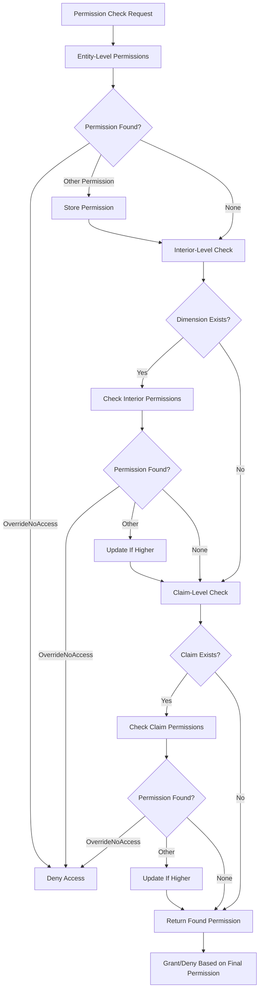

The permission system in BitCraft provides a hierarchical, multi-layered framework for controlling player interactions with game entities, buildings, and territories. This system enables fine-grained access control that scales from individual players to empire-wide permissions, supporting complex social structures like claims, empires, and player alliances.

## Permission Hierarchy

The core permission model uses a hierarchical enum where higher-level permissions implicitly grant lower-level access. Permissions are ordered from least to most restrictive, with each level encompassing the capabilities of all levels below it.

```rust
pub enum Permission {
    PendingVisitor,      // Lowest level - awaiting access approval
    Visitor,             // Basic observation rights
    Usage,               // Ability to use objects but not modify
    Inventory,           // Access to inventory/storage
    Build,               // Construction and modification rights
    CoOwner,             // Shared ownership privileges
    OverrideNoAccess,    // Blocks all except owner
    Owner,               // Full control and authority
}
```

Sources: [components.rs](BitCraftServer/packages/game/src/messages/components.rs#L200-L209)

The system validates permission requirements through a `meets()` method that compares a player's permission level against a required threshold:

```rust
impl Permission {
    pub fn meets(self, target: Permission) -> bool {
        if (self as i32) < (target as i32) {
            return false;
        }
        self != Permission::OverrideNoAccess
    }
}
```

Sources: [permission.rs](BitCraftServer/packages/game/src/game/entities/permission.rs#L1-L11)

<CgxTip>
The `OverrideNoAccess` permission acts as a special blocking level that denies access even to users with elevated permissions like CoOwner, requiring Owner level to bypass it.
</CgxTip>

## Permission Groups

Permissions can be assigned to different types of entities, enabling flexible access control patterns:

| Permission Group | Description | Validation Requirements |
|-----------------|-------------|------------------------|
| Player | Individual player access | Validated at interaction time |
| Claim | All members of a claim | Requires valid claim entity ID |
| Empire | All empire members | Requires valid empire entity ID |
| Everyone | Universal access | No validation required |

Sources: [components.rs](BitCraftServer/packages/game/src/messages/components.rs#L211-L218)

The system validates group membership before permission assignment, ensuring that claims and empires referenced in permissions actually exist:

```rust
pub fn validate_group(ctx: &ReducerContext, allowed_entity_id: u64, group: PermissionGroup) -> Result<(), String> {
    match group {
        PermissionGroup::Player => Ok(()), // Players can be added cross-region
        PermissionGroup::Claim => {
            if ctx.db.claim_state().entity_id().find(allowed_entity_id).is_some() {
                return Ok(());
            } else {
                return Err("Unknown Claim".into());
            }
        }
        PermissionGroup::Empire => {
            if ctx.db.empire_state().entity_id().find(allowed_entity_id).is_some() {
                return Ok(());
            } else {
                return Err("Unknown Empire".into());
            }
        }
        PermissionGroup::Everyone => Ok(()),
    }
}
```

Sources: [permission_state.rs](BitCraftServer/packages/game/src/game/entities/permission_state.rs#L22-L43)

## Permission Resolution Cascade

When checking permissions for entity interaction, the system follows a cascading resolution strategy that checks multiple permission sources in order of specificity. The resolution process:



The system builds an `available_entities` vector containing the player's ID, all claim IDs they're a member of, and their empire ID (if applicable). This enables efficient permission lookups across all relevant groups:

```rust
pub fn get_permission_with_entity(
    ctx: &ReducerContext,
    player_entity_id: u64,
    target_entity_id: u64,
    dimension_id: Option<u32>,
    claim_entity_id: Option<u64>,
) -> Option<Permission> {
    let mut available_entities = vec![player_entity_id];

    // Get all claims the player is a member of
    available_entities.extend(
        ctx.db
            .claim_member_state()
            .player_entity_id()
            .filter(player_entity_id)
            .map(|claim_member_state| claim_member_state.claim_entity_id),
    );

    // Add empire membership
    if let Some(player_empire) = ctx.db.empire_player_data_state().entity_id().find(player_entity_id) {
        available_entities.push(player_empire.empire_entity_id);
    }

    let mut permission_found = None;

    // Check entity-level permissions
    if let Some(p) = Self::found_permission(ctx, target_entity_id, &available_entities) {
        if p == Permission::OverrideNoAccess as i32 {
            return Some(Permission::to_enum(p));
        }
        permission_found = Some(Permission::to_enum(p));
    }

    // Check interior-level permissions
    if let Some(dimension) = dimension_id {
        if let Some(interior) = ctx.db.dimension_description_state().dimension_id().find(dimension) {
            if let Some(p) = Self::found_permission(ctx, interior.entity_id, &available_entities) {
                if p == Permission::OverrideNoAccess as i32 {
                    return Some(Permission::to_enum(p));
                }
                if permission_found.is_none() {
                    permission_found = Some(Permission::to_enum(p));
                }
            }
        }
    }

    // Check claim-level permissions
    if let Some(claim_entity_id) = claim_entity_id {
        if let Some(p) = Self::found_permission(ctx, claim_entity_id, &available_entities) {
            if p == Permission::OverrideNoAccess as i32 {
                return Some(Permission::to_enum(p));
            }
            if permission_found.is_none() {
                permission_found = Some(Permission::to_enum(p));
            }
        }
    }

    permission_found
}
```

Sources: [permission_state.rs](BitCraftServer/packages/game/src/game/entities/permission_state.rs#L134-L194)

<CgxTip>
If no explicit permission is found at any level, the system grants access by default, allowing open interaction unless explicitly restricted through `OverrideNoAccess` or claim membership requirements.
</CgxTip>

## Building Interaction Permissions

Building access control integrates building description metadata with the permission system. Each building defines its interaction level through `BuildingInteractionLevel`, which determines basic accessibility before checking detailed permissions:

| Interaction Level | Description | Access Logic |
|------------------|-------------|--------------|
| All | Open to everyone | Immediate grant |
| None | No access | Immediate deny |
| Empire | Empire-restricted | Requires empire membership verification |

Sources: [permission_helper.rs](BitCraftServer/packages/game/src/game/permission_helper.rs#L12-L133)

The interaction type maps to different permission requirements:

```rust
let interaction_level = match permission {
    ClaimPermission::Usage => building_desc.interact_permission,
    ClaimPermission::Inventory => building_desc.interact_permission,
    _ => building_desc.build_permission,
};
```

Sources: [permission_helper.rs](BitCraftServer/packages/game/src/game/permission_helper.rs#L20-L25)

Special handling exists for empire buildings like Watchtowers and Hexite Capsule Reserves, which require empire-specific permission checks and validation of empire player ranks:

```rust
if let Some(empire_node) = empire_node {
    if permission == ClaimPermission::Usage && building_desc.has_category(ctx, BuildingCategory::Watchtower) {
        // Any empire can interact with watchtowers for sieges
        return true;
    }

    if let Some(player_rank) = ctx.db.empire_player_data_state().entity_id().find(&player_entity_id) {
        if permission == ClaimPermission::Build {
            // Only emperor can interact destructively with active nodes
            return player_rank.rank == 0 && player_rank.empire_entity_id == empire_node.empire_entity_id;
        }

        // Must be part of the building's empire
        return empire_node.empire_entity_id == player_rank.empire_entity_id;
    }
}
```

Sources: [permission_helper.rs](BitCraftServer/packages/game/src/game/permission_helper.rs#L60-L82)

## Claim Permissions

Claim-level permissions control access to claimed territories and buildings within them. The `ClaimPermission` enum defines three granular permission types:

```rust
pub enum ClaimPermission {
    Inventory,  // Access to storage and loot
    Build,      // Construction, destruction, modification
    Usage,      // General interaction and movement
}
```

Sources: [components.rs](BitCraftServer/packages/game/src/messages/components.rs#L50-L55)

Claim membership permissions are stored in `ClaimMemberState` with individual boolean flags for each permission type, allowing fine-grained access control per claim member:

```rust
if let Some(member) = ctx
    .db
    .claim_member_state()
    .player_claim()
    .filter((player_entity_id, claim_entity_id))
    .next()
{
    return match permission {
        ClaimPermission::Build => member.build_permission,
        ClaimPermission::Inventory => member.inventory_permission,
        ClaimPermission::Usage => true,
    };
}
```

Sources: [permission_helper.rs](BitCraftServer/packages/game/src/game/permission_helper.rs#L207-L220)

Special claim states modify default permission behavior:

- **Neutral claims**: Allow usage and inventory access by anyone regardless of membership
- **Abandoned claims** (no owner): Open to all interactions
- **Unprotected claims** (zero supplies): Accessible by anyone
- **Claim owner building protection**: Prevents non-owners from destroying claim owner buildings

```rust
pub fn has_claim_permission(ctx: &ReducerContext, claim_entity_id: u64, player_entity_id: u64, permission: ClaimPermission) -> bool {
    if let Some(claim_desc) = ctx.db.claim_state().entity_id().find(&claim_entity_id) {
        // Neutral claims can be used and looted by anyone
        if claim_desc.neutral && (permission == ClaimPermission::Inventory || permission == ClaimPermission::Usage) {
            return true;
        }

        // Claim with no owner can be interacted with by anyone
        if !claim_desc.neutral && claim_desc.owner_player_entity_id == 0 {
            return true;
        }

        // Claim with no shield can be interacted with by anyone
        if !claim_desc.neutral && claim_desc.local_state(ctx).supplies == 0 {
            return true;
        }

        // ... member permission checks ...
    }
    true
}
```

Sources: [permission_helper.rs](BitCraftServer/packages/game/src/game/permission_helper.rs#L157-L220)

## Rented Interior Permissions

Rented interior spaces (player housing) bypass claim-based permissions entirely, using a whitelist system instead. When a dimension is rented, only players explicitly added to the whitelist can interact within that space:

```rust
pub fn has_permission(
    ctx: &ReducerContext,
    player_entity_id: u64,
    dimension: u32,
    claim_entity_id: u64,
    permission: ClaimPermission,
) -> bool {
    // Check rent permission for rented interiors
    if dimension != dimensions::OVERWORLD {
        let dimension_description_network = DimensionNetworkState::get(ctx, dimension).unwrap();
        // If it's rented, assert that the player is part of the whitelist. Claims don't matter.
        if dimension_description_network.rent_entity_id != 0 {
            let rent = ctx
                .db
                .rent_state()
                .entity_id()
                .find(&dimension_description_network.rent_entity_id)
                .unwrap();
            return rent.white_list.contains(&player_entity_id);
        }
    }

    // If it's not rented, go on with claim permissions
    self::has_claim_permission(ctx, claim_entity_id, player_entity_id, permission)
}
```

Sources: [permission_helper.rs](BitCraftServer/packages/game/src/game/permission_helper.rs#L140-L164)

## Permission Assignment

Creating new permission assignments requires validation to ensure data integrity:

```rust
pub fn new(
    ctx: &ReducerContext,
    ordained_entity_id: u64,
    allowed_entity_id: u64,
    group: PermissionGroup,
    rank: Permission,
) -> Result<Self, String> {
    if group == PermissionGroup::Everyone && rank == Permission::OverrideNoAccess {
        return Err("No Access can't be set to Everyone".into());
    }
    if rank == Permission::Owner && group != PermissionGroup::Player {
        return Err("Owner permission can only be assigned to a single player".into());
    }
    Ok(PermissionState {
        entity_id: game_state::create_entity(ctx),
        ordained_entity_id,
        allowed_entity_id,
        group: group as i32,
        rank: rank as i32,
    })
}
```

Sources: [permission_state.rs](BitCraftServer/packages/game/src/game/entities/permission_state.rs#L9-L31)

<CgxTip>
Owner permissions are restricted to individual players only, preventing potential security issues that could arise from empire or group-level owner assignments.
</CgxTip>

## Integration Points

The permission system integrates with multiple game systems:

- **[Authentication and Authorization](20-authentication-and-authorization)**: Player identity verification before permission checks
- **[Building and Claim System](16-building-and-claim-system)**: Claim membership and ownership hierarchy
- **[Claim and Empire Management](23-claim-and-empire-management)**: Empire permissions and claim member management
- **[Housing and Interior Systems](29-housing-and-interior-systems)**: Rented interior whitelist management

Permission checks are typically invoked at handler entry points for player actions like building construction, inventory access, and movement restrictions, ensuring that all interactions respect the configured access control rules.
