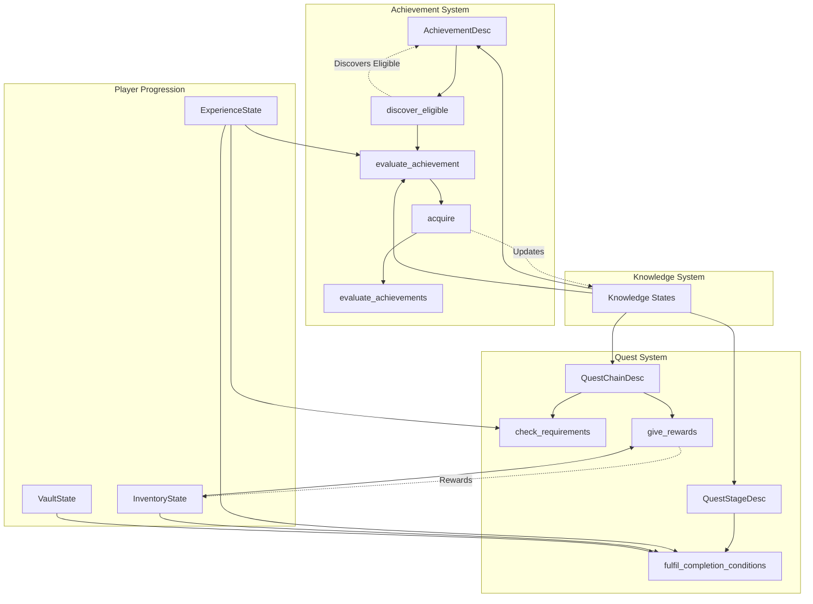

The Quest and Achievement System in BitCraft represents a sophisticated progression framework that tracks player accomplishments through a multi-layered knowledge and reward architecture. This system manages achievement discovery, quest chain progression, and stage-based completion conditions while maintaining tight integration with the game's knowledge system, inventory management, and experience progression mechanisms.

## System Architecture Overview

The quest and achievement systems operate as interconnected subsystems within BitCraft's SpacetimeDB architecture. Achievement tracking uses a discovery-based approach where achievements become visible when prerequisite conditions are met, while quests follow a structured chain model with stages containing specific completion requirements.

The architecture demonstrates how achievements and quests interact with the broader game systems. Achievements serve both as standalone progression milestones and as prerequisites for quest chains, creating a layered progression system where completion in one system can unlock content in another.

## Achievement Discovery and Tracking

The achievement system implements a sophisticated discovery mechanism where achievements only become trackable when players meet initial prerequisites. This design prevents overwhelming players with impossible-to-complete objectives while maintaining long-term progression goals.

The `discover_eligible` method iterates through all achievement descriptions, filtering out those already acquired and checking if all requisite achievements have been completed. When an achievement becomes eligible, it's discovered through the Discovery system, which manages knowledge state transitions from Unknown to Discovered.

Sources: [achievement.rs](/BitCraftServer/packages/game/src/game/entities/achievement.rs#L7-L35)

Achievement evaluation supports multiple requirement types:

| Requirement Type | Description | Validation Method |
|-----------------|-------------|-------------------|
| Prerequisite Achievements | Other achievements that must be completed first | Checks knowledge achievement state entries for Acquired status |
| Skill Level | Minimum level in specific skill | Compares experience state skill level |
| Resource Discovery | Specific resources that must be discovered | Validates knowledge resource state |
| Crafting Discovery | Specific crafting recipes that must be discovered | Validates knowledge craft state |
| Cargo Discovery | Specific cargo types that must be discovered | Validates knowledge cargo state |
| Item Discovery | Specific items that must be discovered | Validates knowledge item state |
| Chunk Discovery | Minimum number of chunks explored | Compares exploration chunks count |
| Chunk Percentage | Minimum percentage of world chunks explored | Calculates percentage from total world chunks |

Sources: [achievement.rs](/BitCraftServer/packages/game/src/game/entities/achievement.rs#L37-L82)

The achievement acquisition process handles the complete lifecycle: discovering the achievement if not yet tracked, evaluating all discovery requirements, rewarding the player upon completion, and triggering discovery of newly eligible achievements. This creates cascading progression where completing one achievement can unlock multiple subsequent achievements.

Sources: [achievement.rs](/BitCraftServer/packages/game/src/game/entities/achievement.rs#L114-L158)

## Quest Chain Requirements and Rewards

Quest chains represent structured progression paths where players complete sequences of objectives. The quest chain system validates complex prerequisite requirements and distributes multi-component rewards upon completion.

The `check_requirements` method validates each quest chain requirement type, returning detailed error messages when prerequisites aren't met. This provides players with clear feedback about why they cannot start a particular quest chain.

Sources: [quest_chain_desc.rs](/BitCraftServer/packages/game/src/game/entities/quest_chain_desc.rs#L46-L87)

Quest chain requirements include:

| Requirement Type | Validation Logic |
|-----------------|------------------|
| Quest Chain | Checks if prerequisite chain exists in completed quest chain states |
| Achievement | Reserved for achievement-based prerequisites |
| Collectible | Reserved for collectible-based prerequisites |
| Level | Validates player meets minimum level requirement via PlayerState |
| Item Stack | Confirms player inventory contains required items |
| Secondary Knowledge | Reserved for knowledge-based prerequisites |

Sources: [quest_chain_desc.rs](/BitCraftServer/packages/game/src/game/entities/quest_chain_desc.rs#L56-L86)

The reward distribution system handles diverse reward types through the `give_rewards` method. Item stack rewards are automatically collected to player storage if possible, with overflow items going directly to inventory. Experience rewards are applied to specific skill tracks, supporting the game's skill-based progression system.

Sources: [quest_chain_desc.rs](/BitCraftServer/packages/game/src/game/entities/quest_chain_desc.rs#L6-L44)

<CgxTip>
The quest system uses the Discovery system for tracking acquired items alongside the Inventory system. This dual tracking ensures that rewards can be both physically possessed and knowledge-acquired, enabling the system to support both temporary and permanent reward mechanics.</CgxTip>

## Quest Stage Completion Conditions

Quest stages break down quest chains into manageable objectives with specific completion conditions. The `fulfil_completion_conditions` method validates stage completion and consumes required resources when appropriate.

Sources: [quest_stage_desc.rs](/BitCraftServer/packages/game/src/game/entities/quest_stage_desc.rs#L6-L46)

Stage completion conditions include:

| Condition Type | Behavior |
|---------------|----------|
| Item Stack | Validates item presence in inventory or wallet; optionally consumes items |
| Achievement | Reserved for achievement-based conditions |
| Collectible | Validates collectible presence in player vault |
| Level | Reserved for level-based conditions |
| Secondary Knowledge | Reserved for knowledge-based conditions |
| Equipped Item | Reserved for equipment-based conditions |

Sources: [quest_stage_desc.rs](/BitCraftServer/packages/game/src/game/entities/quest_stage_desc.rs#L11-L44)

The item stack condition includes sophisticated consumption logic that checks both player inventory and nearby deployables, supporting quest stages that require players to gather and deliver items. This integration with deployables enables quests that involve resource gathering and delivery mechanics.

Sources: [quest_stage_desc.rs](/BitCraftServer/packages/game/src/game/entities/quest_stage_desc.rs#L13-L19)

<CgxTip>
Quest stage conditions support optional consumption of required items through the `is_consumed` flag. This enables designers to create quests that require either possessing items (consumption=false) or sacrificing them (consumption=true), providing flexibility in quest design patterns.</CgxTip>

## System Integration Points

The quest and achievement systems integrate deeply with BitCraft's progression infrastructure. The achievement system leverages the knowledge system's three-state progression model (Unknown → Discovered → Acquired), while quest chains utilize quest chain state tracking for completion monitoring.

The experience system provides skill-level validation for achievement requirements, enabling progression gates that require players to develop specific skills before achieving certain milestones. Exploration chunk tracking supports world-exploration achievements, encouraging players to discover the procedurally generated world.

Sources: [achievement.rs](/BitCraftServer/packages/game/src/game/entities/achievement.rs#L130-L141)

The vault system stores collectible rewards for both achievements and quest chains, providing permanent progression tracking. Inventory and wallet systems handle temporary rewards and quest requirement validation, ensuring that quest stages can require and distribute items effectively.

Sources: [quest_chain_desc.rs](/BitCraftServer/packages/game/src/game/entities/quest_chain_desc.rs#L6-L44), [quest_stage_desc.rs](/BitCraftServer/packages/game/src/game/entities/quest_stage_desc.rs#L24-L29)

## Data Management and Administration

Static data for achievements and quest chains is managed through the staged static data system, enabling administrators to stage and deploy new content without disrupting live game functionality. The `clear_staged_static_data` reducer provides administrative capabilities for managing staged content, requiring admin role verification for security.

Sources: [_static_data.rs](/BitCraftServer/packages/game/src/game/autogen/_static_data.rs#L7-L22)

## Next Steps

For developers looking to extend or integrate with the quest and achievement system, the following documentation provides deeper insights into related systems:

- [Player State Management](15-player-state-management) - Understanding player progression and experience tracking
- [Inventory and Item Stacks](17-inventory-and-item-stacks) - Item management and reward distribution mechanics
- [Permission and Access Control](27-permission-and-access-control) - Role-based administration for quest/achievement management

The quest and achievement system's design prioritizes modular, extensible progression mechanics that can accommodate new requirement types, reward categories, and completion conditions without requiring changes to the core architecture.
