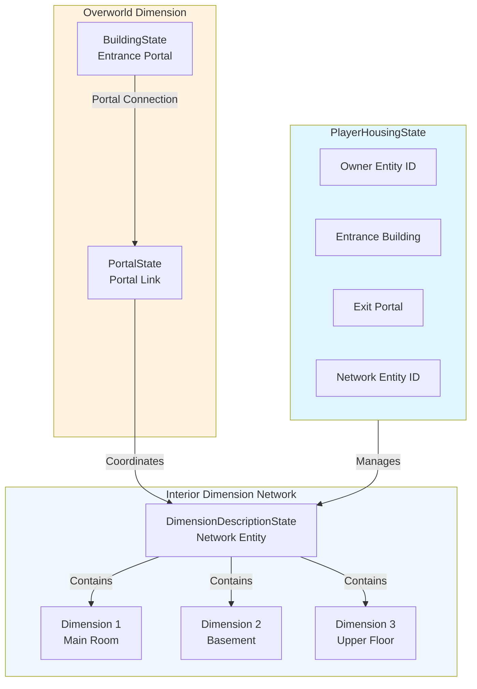
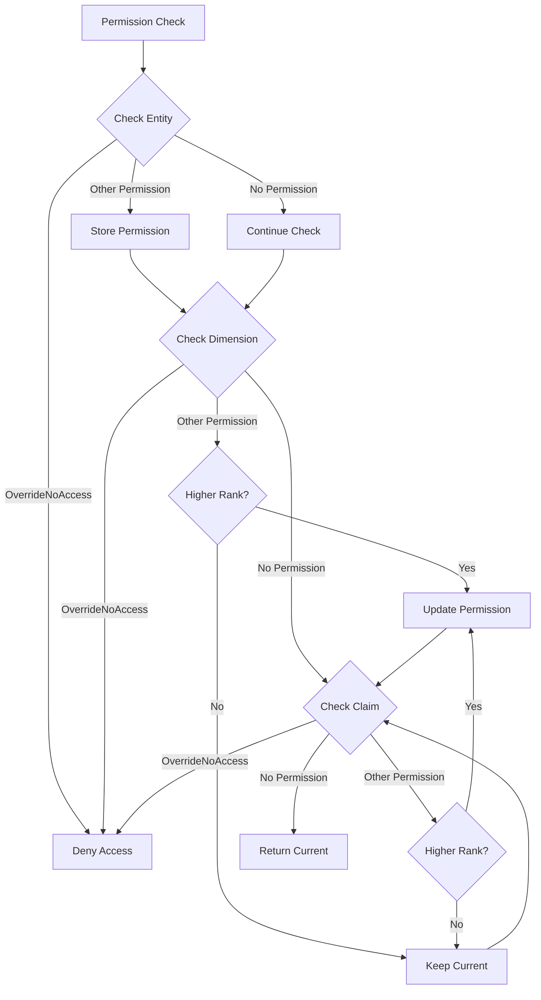

The Housing and Interior Systems in BitCraft represent a sophisticated instance-based architecture that provides players with persistent private spaces within the game world. This system integrates dimension management, permission controls, and economic mechanics through a coordinated network of components that support both individual housing and shared interior environments.

## Architecture Overview

The housing system operates on a **dimension-based instance model**, where each player housing creates a network of separate dimensions (interior spaces) accessible through portal connections. The architecture distinguishes between the overworld (main game world) and interior dimensions, with player housing serving as the bridge between these spaces. Interior instances can also exist independently of player housing, supporting dungeons, ruins, and other shared interior content.

## Player Housing Core Components

### PlayerHousingState Entity

The `PlayerHousingState` entity serves as the authoritative record for each player's personal housing, managing the relationship between overworld buildings and interior dimension networks. Each housing instance maintains references to its entrance building, exit portal, and dimension network entity, enabling coordinated operations across all connected interior spaces.
Sources: [player_housing_state.rs](BitCraftServer/packages/game/src/game/entities/player_housing_state.rs#L1-L200)

Key state fields include:
- **entrance_building_entity_id**: The overworld building serving as the housing entrance
- **exit_portal_entity_id**: The portal returning players to the overworld
- **network_entity_id**: The dimension network containing all interior spaces
- **region_index**: Tracks which region server hosts the housing
- **locked_until**: Timestamp when housing becomes available after operations
- **is_empty**: Flag tracking whether housing contains furniture/decorations

### Dimension Network Management

Interior dimensions are organized through **DimensionNetworkState** entities, which group multiple `DimensionDescriptionState` instances under a single network identifier. This design allows a single housing instance to span multiple interior rooms or floors, each as a separate dimension while sharing common metadata like collapse timers and income generation settings.
Sources: [interior_helpers.rs](BitCraftServer/packages/game/src/game/reducer_helpers/interior_helpers.rs#L401-L500)

The dimension creation process allocates new dimension IDs, generates terrain chunks (flat terrain with specified biome), and populates them based on spawn descriptors defined in the interior templates. Each dimension tracks its parent network entity, enabling bulk operations on all connected spaces.

## Permission System Integration

Housing permissions leverage the global `PermissionState` framework with housing-specific extensions that propagate permissions across all interior dimensions. The system supports four permission levels and three group types, enabling fine-grained access control for individual players, claims, empires, and the general public.

### Permission Hierarchy

| Permission Level | Rank | Capabilities |
|------------------|------|--------------|
| **Owner** | 0 | Full control, can edit all permissions |
| **CoOwner** | 1 | Build/destroy, edit lower-ranked permissions |
| **Visitor** | 2 | Enter and interact, cannot modify |
| **NoAccess** | 3 | Blocked from entry |
| **OverrideNoAccess** | 4 | Explicitly blocks even Owner access |

### Permission Groups

The system recognizes four distinct permission groups that determine who receives assigned permissions:

| Group | Description | Validation |
|-------|-------------|------------|
| **Player** | Specific individual players | Entity ID validation |
| **Claim** | Members of a specific claim | Claim existence check |
| **Empire** | Members of an empire | Empire existence check |
| **Everyone** | All players globally | No validation required |

<CgxTip>
Permission checks cascade through three levels: target entity → interior dimension → claim. If any level returns `OverrideNoAccess`, access is immediately denied. Otherwise, the highest permission found across all levels applies. This enables sophisticated access control patterns like "everyone can visit, but only claim members can build."
</CgxTip>

When editing housing permissions via `PlayerHousingState::set_permissions()`, the system automatically propagates changes to all dimensions within the housing's network through the `get_permission_entities()` method, ensuring consistent access rules across all interior spaces.
Sources: [player_housing_state.rs](BitCraftServer/packages/game/src/game/entities/player_housing_state.rs#L15-L70) [permission_edit.rs](BitCraftServer/packages/game/src/game/handlers/player/permission_edit.rs#L1-L82)

## Interior Creation and Lifecycle

### Interior Dimension Generation

Interior dimensions are created through the `create_player_interior()` function, which orchestrates a complex initialization sequence:

1. **Dimension Allocation**: Creates new dimension ID and entity records
2. **Terrain Generation**: Generates flat terrain chunks with specified biome
3. **Spawn Processing**: Places buildings, resources, chests, enemies based on template
4. **Portal Linking**: Connects exterior building portals to interior spawn points
5. **Combat Setup**: Initializes combat dimension state if enemies are present Sources: [interior_helpers.rs](BitCraftServer/packages/game/src/game/reducer_helpers/interior_helpers.rs#L201-L300)

The spawn system supports five spawn types:
- **Building**: Placeable interior structures
- **Resource**: Mining/harvestable resource nodes
- **Chest**: Loot containers with randomized contents
- **Enemy**: Hostile creatures with AI and respawn mechanics
- **Traveler**: NPC merchants or quest givers (permanent)

### Interior Collapse and Respawn

Interior instances implement a collapse mechanic that resets the interior when all content is consumed. The system monitors collapse triggers attached to spawned entities; when all triggers are satisfied (e.g., all enemies defeated, all resources harvested), the dimension enters a collapsed state and respawns after a configured delay. This prevents interior content from being permanently depleted and provides renewable content for players.
Sources: [interior_helpers.rs](BitCraftServer/packages/game/src/game/reducer_helpers/interior_helpers.rs#L1-L200)

The collapse process follows this sequence:
1. Trigger detection through `InteriorCollapseTriggerState`
2. Set collapse timestamp on dimension and network
3. Schedule timer to trigger collapse
4. Teleport all players to overworld
5. Delete all spawned entities
6. Respawn interior contents after delay

## Housing Operations

### Housing Entry

Players enter housing through the `player_housing_enter` reducer, which validates multiple conditions before granting access:

1. **Health Check**: Verifies player is not incapacitated
2. **Upgrade Check**: Owners trigger housing update logic
3. **Permission Validation**: Confirms player has Visitor-level or higher access
4. **Lock Check**: Ensures housing is not temporarily locked
5. **Teleport**: Transports player to exit portal destination coordinates

The entry process validates permissions using `PermissionState::get_permission_with_entity()`, which cascades through entity, dimension, and claim levels to determine the effective permission level.
Sources: [player_housing_enter.rs](BitCraftServer/packages/game/src/game/handlers/player/player_housing_enter.rs#L1-L46) [permission_state.rs](BitCraftServer/packages/game/src/game/entities/permission_state.rs#L100-L194)

### Housing Relocation

Players can relocate their housing to different buildings through a multi-stage process that varies based on the relocation context:

**Same Claim (Instant)**:
- Housing transfers immediately without cost
- Portal destination updates to new building coordinates
- Players and entities expelled to new exit location

**Different Claim (Time-Based)**:
- Calculate moving cost based on inventory contents
- Validate housing is empty (base cost) or pay scaled time cost
- Set locked_until timestamp to prevent concurrent moves
- After timer expires, housing completes relocation

**Cross-Region (Inter-Module)**:
- Send transfer request to destination region via inter-module messaging
- Destination validates housing is empty
- Delete dimension network on source
- Recreate housing on destination with new building

The moving cost calculation considers both item count and cargo volume, with a base cost of 12 hours if any items are present, plus 30 minutes per item and 10 minutes per cargo unit, capped at 20 days maximum.
Sources: [player_housing_change_entrance.rs](BitCraftServer/packages/game/src/game/handlers/player/player_housing_change_entrance.rs#L1-L128) [transfer_player_housing.rs](BitCraftServer/packages/game/src/inter_module/transfer_player_housing.rs#L1-L103)

### Empty State Management

The `is_empty` flag critically impacts housing operations, determining whether instant relocation is possible and affecting moving cost calculations. The system evaluates emptiness by scanning all dimensions in the network for:
- Buildings (blocks instant moves)
- Resource nodes (blocks instant moves)
- Paved tiles (blocks instant moves)
- Pillar shaping (blocks instant moves)
- Players (ignored for emptiness calculation)
- Deployables (ignored for emptiness calculation) Sources: [player_housing_state.rs](BitCraftServer/packages/game/src/game/entities/player_housing_state.rs#L71-L140)

When players leave housing or log out while inside, the system re-evaluates the empty state and propagates changes across all regions through the inter-module messaging system, ensuring consistency.

## Economic Systems

### Housing Income Generation

Player housing generates passive income for the owning claim on a daily schedule managed by the `player_housing_income_agent`. This agent runs at a configurable time of day (default midnight), iterating through all player housing and collecting income based on the building type.
Sources: [player_housing_income_agent.rs](BitCraftServer/packages/game/src/agents/player_housing_income_agent.rs#L1-L116)

The income calculation follows this flow:
1. Agent schedules first tick based on configured time of day
2. After initial run, schedules repeating daily ticks
3. Each tick collects income from all housing buildings
4. Income is credited directly to the owning claim's treasury
5. Housing with zero income generates no treasury changes

Building income is defined in the static data through `BuildingFunction::player_housing_income()`, allowing different housing types to generate varying amounts of currency. The system only processes housing with positive income, avoiding unnecessary database updates for non-income-generating buildings.

### Moving Cost Calculation

Relocating housing between claims incurs a time-based cost calculated by `get_housing_move_minutes_cost()`. The algorithm examines all building inventories within the housing network and computes:
- **Base Cost**: 720 minutes (12 hours) if any items present
- **Item Cost**: 30 minutes per standard item
- **Cargo Cost**: 10 minutes per cargo unit quantity
- **Maximum Cap**: 28,800 minutes (20 days)

This creates meaningful trade-offs between fully furnishing a house and maintaining flexibility to relocate, encouraging players to either commit to long-term placements or keep housing minimal for portability.
Sources: [player_housing_state.rs](BitCraftServer/packages/game/src/game/entities/player_housing_state.rs#L141-L160)

## Entity Expulsion and Cleanup

When housing undergoes relocation or other major changes, the system must safely evict all occupants. The `expel_players_and_entities()` method handles this critical operation:

1. **Player Eviction**: All players are teleported to the exterior portal coordinates with appropriate notification reasons
2. **Deployable Eviction**: Deployables unmount from players and are moved off-bounds
3. **Item Cleanup**: Dropped inventory piles are deleted to prevent item duplication
4. **Dimension Scanning**: Each dimension in the network is processed independently Sources: [player_housing_state.rs](BitCraftServer/packages/game/src/game/entities/player_housing_state.rs#L161-L220)

For interior destruction operations (cross-region transfers), the more aggressive `delete_dimension_network()` function handles complete cleanup:
- Deletes all buildings, resources, and loot chests
- Converts deployables to "lost and found" items deposited at exterior location
- Removes combat dimension state
- Deletes dimension descriptions and network state

## Permission Validation Logic

The permission system implements sophisticated hierarchical resolution through `get_permission_with_entity()`. The algorithm follows this decision tree:

The system constructs an `available_entities` list containing the player's entity ID plus all claims and empires they belong to. Permission searches then check for matches against this list across three levels, with OverrideNoAccess taking immediate precedence regardless of other permissions found.
Sources: [permission_state.rs](BitCraftServer/packages/game/src/game/entities/permission_state.rs#L120-L194)

## Next Steps

The Housing and Interior Systems integrate with several other major game systems. To deepen your understanding of related architecture, explore these documentation pages:

- **[Building and Claim System](16-building-and-claim-system)** - Understand how housing relates to building construction and claim management
- **[Permission and Access Control](27-permission-and-access-control)** - Detailed exploration of the global permission framework that housing extends
- **[Pathfinding Algorithm](26-pathfinding-algorithm)** - Movement and teleportation mechanics for interior navigation
- **[Player State Management](15-player-state-management)** - Player lifecycle and how it interacts with housing access

The housing system represents one of the more complex instance-based architectures in BitCraft, demonstrating sophisticated coordination between dimension management, permission systems, and inter-module communication to deliver persistent player housing that operates seamlessly across multiple region servers.
