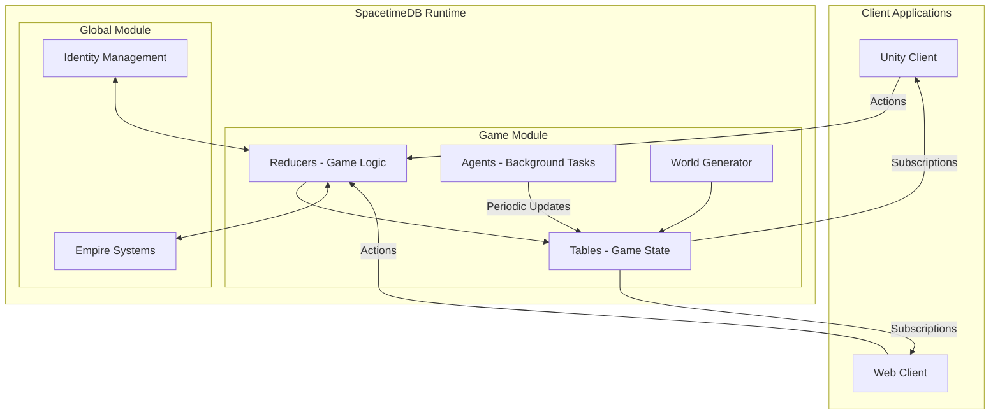
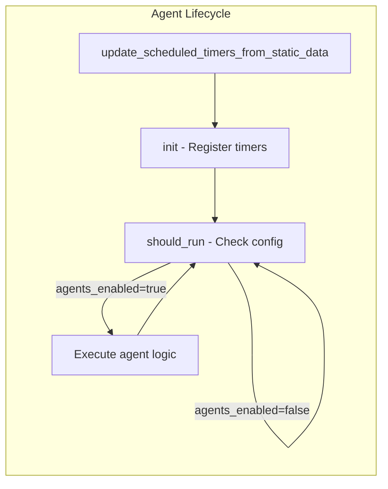

BitCraft's server architecture is built on **SpacetimeDB**, a real-time reactive backend platform designed for multiplayer games. The entire game logic runs as a SpacetimeDB module where all data is stored in tables and all logic executes through reducers. This architecture enables automatic synchronization between server and clients, providing a seamless multiplayer experience without manual network programming.

## Repository Structure

The BitCraftPublic repository contains two primary packages under `BitCraftServer/packages/`, each serving distinct architectural purposes in the game's distributed system.

```
BitCraftServer/packages/
├── game/              # Primary game module - core game logic and systems
└── global_module/     # Cross-region module - empire and global systems
```

### Game Package

The **game package** (`BitCraftServer/packages/game/`) implements the core game logic and is compiled as a WebAssembly module that runs inside SpacetimeDB. This package contains the majority of game mechanics, world generation, and player interactions.

Sources: [BitCraftServer/packages/game/src/lib.rs](BitCraftServer/packages/game/src/lib.rs#L1-L20), [BitCraftServer/packages/game/Cargo.toml](BitCraftServer/packages/game/Cargo.toml#L1-L12)

The game package is organized into several key modules:

| Module | Purpose |
|--------|---------|
| `agents/` | Background processes for game systems (regeneration, decay, AI) |
| `game/handlers/` | Reducer functions handling player actions and game events |
| `game/world_gen/` | Procedural world generation algorithms |
| `game/entities/` | Game entity definitions and state structures |
| `messages/` | Message types and communication protocols |
| `table_caches/` | Performance optimization layers for frequent queries |


### Global Module Package

The **global_module package** (`BitCraftServer/packages/global_module/`) provides cross-region functionality, particularly for empire systems that operate across multiple world regions. This enables the distributed nature of BitCraft's multiplayer world.

Sources: [BitCraftServer/packages/global_module/src/lib.rs](BitCraftServer/packages/global_module/src/lib.rs#L1-L15)

The global module focuses on empire-wide concerns including:
- Empire management and sieges
- Cross-region player identity
- Global resource allocation
- Inter-module communication

## Architectural Components

### Core Architecture Overview

The BitCraft server architecture follows an event-driven, reactive pattern centered on SpacetimeDB's reducer-table model:



### Reducer-Based Logic

All game logic in BitCraft is implemented as **reducers**—pure functions that take a ReducerContext (containing database access, sender identity, and timestamp) and modify database tables. SpacetimeDB automatically invokes reducers based on client requests and synchronizes changes to connected clients.

Sources: [BitCraftServer/packages/game/src/lib.rs](BitCraftServer/packages/game/src/lib.rs#L65-L120), [BitCraftServer/packages/game/src/agents/mod.rs](BitCraftServer/packages/game/src/agents/mod.rs#L1-L20)

Key reducer types include:
- **Initialization reducers**: Set up database state (`initialize`, `identity_connected`)
- **Action reducers**: Handle player actions (movement, crafting, building)
- **Admin reducers**: Server management and configuration changes
- **Agent reducers**: Scheduled background tasks (regeneration, decay)

### Agent System

The **agent system** implements background processes that run periodically to maintain game state. Agents handle time-based game mechanics such as player regeneration, resource respawning, building decay, and NPC AI.

Sources: [BitCraftServer/packages/game/src/agents/mod.rs](BitCraftServer/packages/game/src/agents/mod.rs#L27-L80)



Active agents include:
- `player_regen_agent`: Restores player health and stamina
- `enemy_regen_agent`: Respawns defeated enemies
- `resources_regen`: Regenerates resource nodes
- `building_decay_agent`: Handles building deterioration
- `npc_ai_agent`: Controls NPC behavior
- `day_night_agent`: Manages time-of-day cycles
- `trade_sessions_agent`: Manages trading timeouts

<CgxTip>Agents can be enabled or disabled via the `Config.agents_enabled` flag in the database, allowing granular control over background systems during development and testing.
Sources: [BitCraftServer/packages/game/src/agents/mod.rs](BitCraftServer/packages/game/src/agents/mod.rs#L22-L26)</CgxTip>

### Handler System

The **handler system** organizes reducers into logical categories based on the game mechanics they implement. Each handler module contains related reducers and helper functions.

Sources: [BitCraftServer/packages/game/src/game/handlers/mod.rs](BitCraftServer/packages/game/src/game/handlers/mod.rs#L1-L25)

| Handler Category | Responsibilities |
|------------------|------------------|
| `authentication` | Identity verification, role management |
| `player` | Player state, movement, actions |
| `buildings` | Construction, modification, demolition |
| `inventory` | Item management, crafting, vaults |
| `claim` | Territory claims, permissions |
| `empires` | Empire creation, management, warfare |
| `resource` | Resource gathering, deposits |
| `attack` | Combat mechanics, PvP |

<CgxTip>The handlers directory is auto-generated by `build.rs`, allowing the build system to automatically register new handler modules without manual updates to the module file.
Sources: [BitCraftServer/packages/game/src/game/handlers/mod.rs](BitCraftServer/packages/game/src/game/handlers/mod.rs#L1-L2)</CgxTip>

### World Generation System

The **world generation system** creates the procedurally generated world that players explore. It uses noise-based algorithms to generate terrain, biomes, resources, and structures.

Sources: [BitCraftServer/packages/game/src/game/world_gen/mod.rs](BitCraftServer/packages/game/src/game/world_gen/mod.rs#L1-L22), [BitCraftServer/packages/game/src/game/world_gen/world_generator.rs](BitCraftServer/packages/game/src/game/world_gen/world_generator.rs#L14-L34)

World generation components:
- `biome_definition`: Defines world biomes (forest, desert, tundra)
- `noise_map`: Generates elevation and terrain using noise functions
- `resource_definition`: Places resource deposits based on biome and terrain
- `world_generator`: Orchestrates the generation process
- `resources_log`: Logs generated resources for debugging

The world generation process produces:
- Terrain chunks with elevation and biome data
- Building structures and spawn points
- Resource deposits and clumps
- NPC placement and AI configuration
- Dimension descriptions for the game world

### Entity System

The **entity system** defines all persistent game objects and their state structures. Each entity type is defined as a Rust struct that maps to a SpacetimeDB table.

Sources: [BitCraftServer/packages/game/src/game/entities/mod.rs](BitCraftServer/packages/game/src/game/entities/mod.rs#L1-L80)

Key entity categories:

| Category | Examples | Purpose |
|----------|----------|---------|
| Player State | `player_state`, `health_state`, `stamina_state` | Track player condition and progress |
| Buildings | `building_state`, `footprint_tile_state` | Represent structures and placement |
| Resources | `resource_deposit`, `resource_health_state` | Manage gatherable resources |
| Inventory | `inventory_state`, `item_stack` | Handle item storage |
| Combat | `combat_state`, `enemy_state` | Implement combat mechanics |
| Social | `trade_session_state`, `quest_stage_desc` | Enable player interaction |

### Coordinate System

BitCraft implements a sophisticated **hex-based coordinate system** supporting multiple scales of spatial reference. This enables efficient world representation at different granularities.

Sources: [BitCraftServer/packages/game/src/game/mod.rs](BitCraftServer/packages/game/src/game/mod.rs#L1-L20)

Coordinate types:
- `HexCoordinates`: Fundamental hex grid positions
- `RegionCoordinates`: Large-scale world regions
- `ChunkCoordinates`: Terrain chunk subdivisions
- `OffsetCoordinates`: Cartesian representation
- `LargeHexTile`/`SmallHexTile`: Different tile sizes for various purposes

## Configuration and Initialization

### Database Initialization

The game module initializes through the `initialize` reducer, which sets up initial database state including configuration, global counters, and admin roles.

Sources: [BitCraftServer/packages/game/src/lib.rs](BitCraftServer/packages/game/src/lib.rs#L34-L122)

Initialization creates:
- `Config`: Environment settings (dev, staging, production)
- `Globals`: Entity counters and dimension tracking
- `AdminBroadcast`: Server-wide announcements
- `IdentityRole`: Permissions for database owner

### Configuration System

Game configuration is managed through JSON files in the `config/` directory and stored in the `Config` table.

Sources: [BitCraftServer/packages/game/config/default.json](BitCraftServer/packages/game/config/default.json#L1-L9), [BitCraftServer/packages/game/src/lib.rs](BitCraftServer/packages/game/src/lib.rs#L109-L119)

| Config File | Environment | Purpose |
|-------------|------------|---------|
| `default.json` | Development | Local development settings |
| `testing.json` | Testing | Automated test configuration |
| `qa.json` | QA | Quality assurance environment |
| `staging.json` | Staging | Pre-production testing |
| `production.json` | Production | Live game servers |

Configuration includes:
- Environment type
- Cheat settings (creative mode, resource costs)
- Agent activation flags
- Developer authentication passwords

### Static Data Import

Game content definitions (skills, achievements, buildings, items) are imported via specialized reducers that load static data into the database.

Sources: [BitCraftServer/packages/game/src/import_reducers.rs](BitCraftServer/packages/game/src/import_reducers.rs#L17-L50)

Import reducers include:
- `import_skill_desc`: Load skill definitions
- `import_achievement_desc`: Import achievement criteria
- `import_knowledge_stat_modifier_desc`: Configure stat modifications
- `import_admin_broadcast`: Set server announcements

## Inter-Module Communication

The **inter-module system** enables communication between the game module and global module, particularly for cross-region operations.

Sources: [BitCraftServer/packages/game/src/inter_module/mod.rs](BitCraftServer/packages/game/src/inter_module/mod.rs#L1-L31)

Inter-module functions handle:
- Player transfer between regions
- Empire creation and settlement states
- Building operations across modules
- Identity synchronization

This architecture allows BitCraft to scale horizontally across multiple world regions while maintaining consistent empire and identity state.

## Build System

The project uses a Rust-based build system with WebAssembly compilation for the SpacetimeDB module.

Sources: [BitCraftServer/packages/game/Cargo.toml](BitCraftServer/packages/game/src/game/handlers/mod.rs#L1-L12)

Build configuration:
- **Target**: `cdylib` (C dynamic library) for WebAssembly
- **Optimization**: Size-optimized release builds (`opt-level = 's'`, `lto = true`)
- **Dependencies**: SpacetimeDB SDK, math libraries (glam), and utilities

Utility scripts in the root directory automate common tasks:
- `generate-client-files.sh`: Generate client-side code bindings
- `migration.sh`: Execute database migrations
- `publish.sh`: Deploy the module to SpacetimeDB

## Next Steps

Now that you understand the overall architecture, you can explore specific systems in depth:

- **[SpacetimeDB Fundamentals](4-spacetimedb-fundamentals)**: Learn the core database and reducer patterns
- **[World Generator Architecture](6-world-generator-architecture)**: Dive into procedural world generation
- **[Agent Lifecycle and Scheduling](10-agent-lifecycle-and-scheduling)**: Understand background task management
- **[Player State Management](15-player-state-management)**: Explore how player entities are tracked

The architecture is designed to be modular and extensible, allowing you to focus on specific subsystems while understanding how they integrate into the larger game system.
