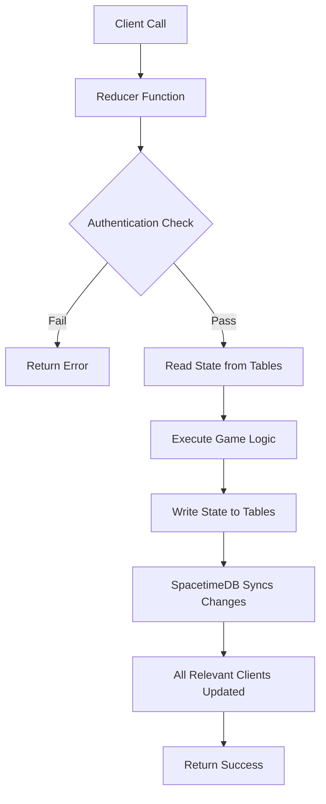
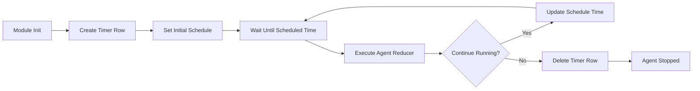
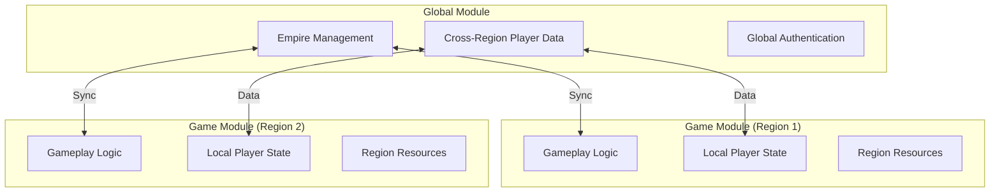

This page introduces the foundational concepts of SpacetimeDB as used in BitCraft. SpacetimeDB is a real-time, reactive backend platform that combines database storage with application logic. In BitCraft, it serves as both the data store and the runtime environment for all server-side game operations, enabling seamless multiplayer experiences with automatic state synchronization.

## What is SpacetimeDB?

SpacetimeDB is a platform that blurs the line between database and application server. Unlike traditional architectures where you have a separate database and application server, SpacetimeDB stores data in tables and runs logic in reducers within the same system. This architecture provides automatic client synchronization, where any changes to tables are immediately pushed to connected clients without manual networking code.

In BitCraft, all game state is stored in SpacetimeDB tables, and all game logic executes as reducers. This means when a player moves, builds a structure, or performs any action, the corresponding reducer modifies the appropriate tables, and those changes automatically propagate to all relevant clients. The system handles identity management, authentication, and real-time updates natively.

Sources: [README.md](README.md#L30-L33), [lib.rs](BitCraftServer/packages/game/src/lib.rs#L30-L31)

## Table Structure and Organization

SpacetimeDB tables are the fundamental data storage units, defined using the `#[spacetimedb::table]` macro. Each table represents a collection of similar entities with a defined structure. Tables can be marked as public (accessible to clients) or private (server-side only). Tables can also be shared between modules, enabling cross-module data synchronization.

The table structure includes:
- **Primary Keys**: Unique identifiers for each row (marked with `#[primary_key]`)
- **Auto-Increment Fields**: Automatically incrementing IDs (marked with `#[auto_inc]`)
- **Indexes**: Performance optimization for queries
- **Public/Private**: Visibility control for clients

Sources: [generic.rs](BitCraftServer/packages/game/src/messages/generic.rs#L5-L8), [authentication.rs](BitCraftServer/packages/game/src/messages/authentication.rs#L12-L18)

### Common Table Types

| Table Type | Purpose | Example | Visibility |
|------------|---------|---------|------------|
| **State Tables** | Store dynamic game state | `MobileEntityState`, `HealthState` | Private/Public |
| **Config Tables** | Store configuration data | `Config`, `Globals` | Private |
| **Auth Tables** | Manage authentication | `IdentityRole`, `ServerIdentity` | Private/Shared |
| **Scheduled Tables** | Define agent timers | `PlayerRegenLoopTimer` | Private |
| **Message Tables** | Inter-module communication | `InterModuleMessageV4` | Public |

Sources: [generic.rs](BitCraftServer/packages/game/src/messages/generic.rs#L18-L31), [player_regen_agent.rs](BitCraftServer/packages/game/src/agents/player_regen_agent.rs#L13-L16), [inter_module.rs](BitCraftServer/packages/game/src/messages/inter_module.rs#L25-L29)

## Reducers: The Application Logic Layer

Reducers are functions that contain the game logic and modify table state. They are analogous to API endpoints in traditional web applications or event handlers in game engines. Reducers receive a `ReducerContext` parameter that provides access to the database and information about the caller.

Reducers in BitCraft follow these patterns:
- Marked with `#[spacetimedb::reducer]` macro
- Accept `ReducerContext` as first parameter
- Can accept additional parameters for input data
- Return `Result<(), String>` for error handling
- Access tables via `ctx.db.<table_name>()`
- Can perform authentication checks using `ctx.sender`

Sources: [import_reducers.rs](BitCraftServer/packages/game/src/import_reducers.rs#L16-L23), [player_move.rs](BitCraftServer/packages/game/src/game/handlers/player/player_move.rs#L14-L16)

### Reducer Types

| Reducer Type | Purpose | Example | Permissions |
|--------------|---------|---------|-------------|
| **Player Actions** | Handle player-initiated actions | `player_move`, `player_action_cancel` | Authenticated players |
| **Admin Operations** | Administrative functions | `import_skill_desc`, `migrate_achievements` | Admin only |
| **System Operations** | Internal system functions | `initialize`, scheduled agents | Server/identity |
| **Inter-module Handlers** | Process cross-module messages | `player_create`, `transfer_player` | From specific modules |

Sources: [import_reducers.rs](BitCraftServer/packages/game/src/import_reducers.rs#L16-L36), [inter_module.rs](BitCraftServer/packages/game/src/inter_module/mod.rs), [player_move.rs](BitCraftServer/packages/game/src/game/handlers/player/player_move.rs#L14-L16)

### Reducer Execution Flow

Sources: [player_move.rs](BitCraftServer/packages/game/src/game/handlers/player/player_move.rs#L14-L100), [import_reducers.rs](BitCraftServer/packages/game/src/import_reducers.rs#L16-L45)

## Authentication and Identity System

SpacetimeDB provides a built-in identity system for authentication. Each connection has a unique `Identity` that represents the client. BitCraft extends this with role-based access control and developer account management.

The authentication system includes:
- **Identity**: Unique identifier for each client connection
- **Roles**: Permission levels (Player, Partner, Mod, Gm, Admin, Relay)
- **Developer Table**: Stores developer account information
- **Server Identity**: Special identity for server-initiated operations
- **Blocked Identity**: List of banned users

Authentication checks are performed using helper functions that verify the caller's role against required permissions.

Sources: [authentication.rs](BitCraftServer/packages/game/src/messages/authentication.rs#L6-L12), [authentication.rs](BitCraftServer/packages/game/src/messages/authentication.rs#L24-L46)

### Role Hierarchy

| Role | Level | Permissions | Typical Use |
|------|-------|-------------|-------------|
| **Player** | Lowest | Basic gameplay | Regular players |
| **Partner** | Low | Extended gameplay | Partners/affiliates |
| **SkipQueue** | Medium | Queue bypass | Priority access |
| **Mod** | High | Moderation tools | Game moderators |
| **Gm** | Higher | Game management | Game masters |
| **Admin** | Highest | Full control | Administrators |
| **Relay** | Special | Cross-module | System use |

Sources: [authentication.rs](BitCraftServer/packages/game/src/messages/authentication.rs#L6-L12)

<CgxTip>Role-based access control is implemented consistently across reducers using helper functions like `has_role()` and `validate_server_or_admin()`. This centralized pattern ensures uniform permission checking and makes security audit trails clear.</CgxTip>

## Agents and Scheduled Tasks

Agents are background processes that run periodically to handle time-based game logic. They use SpacetimeDB's scheduled reducer system, where a special table with the `#[scheduled()]` attribute defines when and how often the agent runs.

Agent system characteristics:
- **Timer Tables**: Special tables with `#[scheduled(agent_name, at = scheduled_at)]` attribute
- **Auto-Increment IDs**: Timer rows have auto-incrementing IDs
- **Schedule Field**: `scheduled_at` field specifies execution timing
- **Server-only Execution**: Agents typically validate server identity before running
- **Configurable Intervals**: Timing parameters are stored in config tables

Common agent use cases include player regeneration, resource spawning, building decay, and NPC AI updates.

Sources: [player_regen_agent.rs](BitCraftServer/packages/game/src/agents/player_regen_agent.rs#L13-L16), [agents/mod.rs](BitCraftServer/packages/game/src/agents/mod.rs#L23-L47)

### Agent Lifecycle

Sources: [player_regen_agent.rs](BitCraftServer/packages/game/src/agents/player_regen_agent.rs#L32-L45), [player_regen_agent.rs](BitCraftServer/packages/game/src/agents/player_regen_agent.rs#L47-L58)

## Inter-Module Communication

BitCraft uses a multi-module architecture where different SpacetimeDB modules handle different aspects of the game. The primary modules are:
- **Game Module**: Handles individual region gameplay
- **Global Module**: Manages cross-region concerns like empires and global data

Modules communicate through an inter-module messaging system defined in `inter_module.rs`. Messages are stored in tables and processed by reducer handlers in the receiving module.

The messaging system includes:
- **Message Tables**: Store inter-module messages (multiple versions for evolution)
- **Counter Tables**: Track processed message IDs for reliable delivery
- **Error Tables**: Store failed message processing details
- **Message Contents**: Enums defining different message types

Sources: [inter_module.rs](BitCraftServer/packages/game/src/messages/inter_module.rs#L5-L29), [inter_module.rs](BitCraftServer/packages/game/src/messages/inter_module.rs#L31-L63)

### Module Architecture

Sources: [README.md](README.md#L30-L33), [inter_module.rs](BitCraftServer/packages/game/src/messages/inter_module.rs#L5-L63)

<CgxTip>Shared tables (marked with `#[shared_table]`) provide an alternative to message-based communication for data that needs to be automatically replicated across modules. This is used for authentication state and configuration data that must be consistent everywhere.</CgxTip>

## Module Organization and Project Structure

The BitCraft server is organized into two main SpacetimeDB modules, each with distinct responsibilities:

- **Game Module** (`BitCraftServer/packages/game/`): Handles gameplay logic within a specific region, including player movement, combat, building, and resource management
- **Global Module** (`BitCraftServer/packages/global_module/`): Manages cross-region concerns including empires, sieges, and player data persistence

Each module follows a consistent structure:
- `src/lib.rs`: Entry point with main reducer exports
- `src/messages/`: Table definitions and message types
- `src/game/`: Core game logic and helpers
- `src/agents/`: Scheduled background tasks
- `src/inter_module/`: Cross-module communication handlers

Sources: [lib.rs](BitCraftServer/packages/game/src/lib.rs#L1-L10), [README.md](README.md#L30-L33)

### Module Responsibilities

| Aspect | Game Module | Global Module |
|--------|-------------|---------------|
| **Scope** | Single region | Entire world |
| **Player Data** | Active players only | All players |
| **Authentication** | Local validation | Source of truth |
| **Empires** | Local claims | Empire management |
| **Resources** | Region-specific | Global configuration |

Sources: [inter_module.rs](BitCraftServer/packages/game/src/messages/inter_module.rs#L31-L63), [README.md](README.md#L30-L33)

## Development Workflow

Understanding how SpacetimeDB works in BitCraft involves recognizing the flow of data from client actions through reducers to table updates and back to clients:

1. **Client Action**: Player performs action (moves, builds, interacts)
2. **Reducer Call**: Corresponding reducer is invoked with request data
3. **Authentication**: System verifies caller identity and permissions
4. **State Read**: Reducer reads current state from tables
5. **Logic Execution**: Game logic processes the request
6. **State Write**: Reducer writes new state to tables
7. **Automatic Sync**: SpacetimeDB detects table changes
8. **Client Update**: Relevant clients receive updates automatically
9. **Agent Processing**: Background agents update time-based systems

This reactive model eliminates manual networking code while ensuring all clients see consistent state.

Sources: [player_move.rs](BitCraftServer/packages/game/src/game/handlers/player/player_move.rs#L14-L100), [lib.rs](BitCraftServer/packages/game/src/lib.rs#L30-L70)

## Getting Started with SpacetimeDB

To work effectively with SpacetimeDB in BitCraft:

1. **Understand Tables**: Start by reading table definitions in `src/messages/` to understand data structures
2. **Follow Reducer Patterns**: Study existing reducers to learn common patterns for state manipulation
3. **Use Helper Functions**: Leverage existing helper functions for common operations like authentication
4. **Respect Module Boundaries**: Understand which code belongs in game vs. global modules
5. **Consider Agent Timing**: When adding scheduled tasks, consider appropriate intervals and server load

The next step in your learning journey should be understanding the [Project Architecture](3-project-architecture), which builds on these SpacetimeDB fundamentals to show how the complete server is organized. After that, dive into specific systems like the [Hex Grid Coordinate System](5-hex-grid-coordinate-system) to understand how spatial data is represented.
