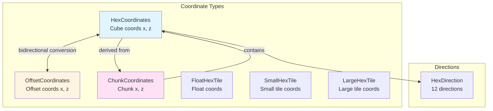
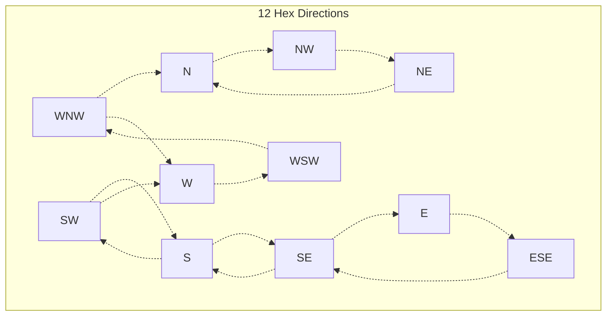

BitCraft implements a sophisticated hexagonal grid coordinate system that forms the foundation for all spatial operations, including movement, building placement, resource distribution, and world generation. This system uses cube coordinates for efficient arithmetic operations while providing seamless conversion to offset coordinates for serialization and chunk-based organization.

## Coordinate System Architecture

The hex grid system is built on a **cube coordinate representation** where each cell is defined by three axes (x, y, z) constrained by x + y + z = 0. This constraint allows the system to store only two coordinates (x and z) while computing y = -x - z, providing optimal memory efficiency and arithmetic simplicity.



The core `HexCoordinates` struct stores `x` and `z` as `i32` values along with a `dimension` field (`u32`) for multi-dimensional world support [hex_coordinates.rs#L11-L16](BitCraftServer/packages/game/src/game/coordinates/hex_coordinates.rs#L11-L16). This design enables the system to support multiple parallel dimensions (e.g., underworld, sky realms) while maintaining a unified coordinate framework.

<CgxTip>The cube coordinate system's constraint x + y + z = 0 is enforced implicitly through the y() method, which computes y = -x - z on-demand rather than storing it, reducing memory overhead by 33% while maintaining all geometric properties of full cube coordinates.</CgxTip>

## Hexagonal Geometry Constants

The system defines precise geometric relationships through constants in [consts.rs](BitCraftServer/packages/game/src/game/coordinates/consts.rs):

| Constant | Value | Purpose |
|----------|-------|---------|
| `RADIUS_RATIO` | 0.866025404 | Ratio between inner and outer radius (√3/2) |
| `TERRAIN_OUTER_RADIUS` | 10.0 | Outer radius of terrain hex cells |
| `TERRAIN_INNER_RADIUS` | 8.660254 | Inner radius of terrain hex cells |
| `OUTER_RADIUS` | 3.333... | Outer radius of player-scale hex cells |
| `INNER_RADIUS` | 2.88675 | Inner radius of player-scale hex cells |

The terrain cells are exactly 3× larger than player-scale cells, enabling efficient multi-resolution representation of the game world [consts.rs#L2-L5](BitCraftServer/packages/game/src/game/coordinates/consts.rs#L2-L5).

## Direction System

BitCraft implements a **12-direction hexagonal direction system** supporting both flat-top and pointy-top hex orientations. This enables fine-grained directional calculations for movement, line-of-sight, and AI behaviors [hex_direction.rs#L10-L23](BitCraftServer/packages/game/src/game/coordinates/hex_direction.rs#L10-L23).



The direction system provides arithmetic operators enabling rotation and navigation:
- **Add/Subtract**: Rotate clockwise or counter-clockwise
- **Opposite**: Get the facing direction (180° rotation)
- **Flat/Pointy traversal**: Navigate between adjacent hex faces or corners [hex_direction.rs#L45-L98](BitCraftServer/packages/game/src/game/coordinates/hex_direction.rs#L45-L98)

Direction arithmetic uses modular arithmetic with base 12, ensuring seamless wrap-around: `result = (s + o) % 12` for addition and Euclidean modulo for subtraction [hex_direction.rs#L48-L64](BitCraftServer/packages/game/src/game/coordinates/hex_direction.rs#L48-L64).

## Coordinate Transformations

### Hex to Offset Coordinates

The system provides seamless conversion between cube and offset coordinates for different use cases:
- **HexCoordinates**: Efficient arithmetic (neighbor calculations, distance, rotation)
- **OffsetCoordinates**: Serialization, storage, and compatibility with rectangular grid systems

Conversion from HexCoordinates to OffsetCoordinates uses the formula: `offset.x = hex.x + hex.z / 2`, `offset.z = hex.z` [offset_coordinates.rs#L33-L41](BitCraftServer/packages/game/src/game/coordinates/offset_coordinates.rs#L33-L41). The reverse conversion applies `hex.x = offset.x - offset.z / 2`, `hex.z = offset.z` [hex_coordinates.rs#L408-L426](BitCraftServer/packages/game/src/game/coordinates/hex_coordinates.rs#L408-L426).

### World Position Conversion

Coordinates can be converted to and from world-space positions (Vector2) using the hex grid geometry:

```rust
pub fn to_center_position_xz(&self, terrain: bool) -> Vector2 {
    let inner_radius = if terrain { TERRAIN_INNER_RADIUS } else { INNER_RADIUS };
    let outer_radius = if terrain { TERRAIN_OUTER_RADIUS } else { OUTER_RADIUS };
    let x = 2.0f32 * i_x * inner_radius + i_z * inner_radius;
    let z = 1.5f32 * i_z * outer_radius;
    Vector2 { x, y: z }
}
```

[hex_coordinates.rs#L365-L375](BitCraftServer/packages/game/src/game/coordinates/hex_coordinates.rs#L365-L375)

The reverse transformation performs round-trip conversion with coordinate validation to ensure floating-point errors don't produce invalid cube coordinates [hex_coordinates.rs#L377-L405](BitCraftServer/packages/game/src/game/coordinates/hex_coordinates.rs#L377-L405).

## Distance and Neighborhood Operations

### Manhattan Distance

The system computes hexagonal Manhattan distance using the cube coordinate property:

```rust
pub fn distance_to(&self, other: HexCoordinates) -> i32 {
    ((other.x - self.x).abs() + (other.y() - self.y()).abs() + (other.z - self.z).abs()) / 2
}
```

[hex_coordinates.rs#L187-L189](BitCraftServer/packages/game/src/game/coordinates/hex_coordinates.rs#L187-L189)

This formula provides O(1) distance calculation, critical for pathfinding, AI decision-making, and range-based abilities.

### Neighbor Navigation

The neighbor system supports single-step and multi-step navigation in any of the 12 directions [hex_coordinates.rs#L122-L146](BitCraftServer/packages/game/src/game/coordinates/hex_coordinates.rs#L122-L146). Each direction has a pre-computed offset:

| Direction | (x offset, z offset) | Type |
|-----------|---------------------|------|
| NE | (0, 1) | Flat |
| ENE | (1, 1) | Pointy |
| E | (1, 0) | Flat |
| ESE | (2, -1) | Pointy |
| SE | (1, -1) | Flat |
| S | (1, -2) | Pointy |
| SW | (0, -1) | Flat |
| WSW | (-1, -1) | Pointy |
| W | (-1, 0) | Flat |
| WNW | (-2, 1) | Pointy |
| NW | (-1, 1) | Flat |
| N | (-1, 2) | Pointy |

<CgxTip>The pointy directions use offsets of magnitude 2 in one axis because they navigate between hex corners rather than faces, requiring diagonal movement across the triangular lattice structure.</CgxTip>

### Ring and Radius Operations

The system provides efficient iteration over hexagonal rings and filled circles:

- `ring()`: Generate all coordinates at a specific radius from center
- `coordinates_in_radius()`: Generate all coordinates within a radius (excluding center)
- `coordinates_in_radius_with_center_iter()`: Lazy iterator for radius-based queries [hex_coordinates.rs#L297-L334](BitCraftServer/packages/game/src/game/coordinates/hex_coordinates.rs#L297-L334)

The ring implementation uses a direction-based traversal algorithm that starts at the top edge and iterates clockwise, providing O(radius) iteration efficiency [hex_coordinates.rs#L314-L330](BitCraftServer/packages/game/src/game/coordinates/hex_coordinates.rs#L314-L330).

## Chunk Organization

### Chunk Coordinates System

The world is organized into chunks for efficient streaming and persistence. `ChunkCoordinates` map to rectangular collections of hex tiles [chunk_coordinates.rs#L12-L88](BitCraftServer/packages/game/src/game/coordinates/chunk_coordinates.rs):

- Small hex tiles (player-scale): 3×3 terrain cells per small tile
- Chunks: Contain fixed dimensions of terrain cells
- Chunk indexing: `chunk_index = (dimension - 1) * 1000000 + z * 1000 + x + 1`

This indexing scheme supports up to 1000×1000 chunks per dimension with multi-dimensional support.

### Surrounding Chunk Queries

The `surrounding_and_including()` method generates a 3×3 grid of chunks centered on the target, with boundary validation against region constraints [chunk_coordinates.rs#L13-L46](BitCraftServer/packages/game/src/game/coordinates/chunk_coordinates.rs#L13-L46). This is essential for chunk loading/unloading during player movement.

<CgxTip>Chunk boundaries respect region constraints defined in `WorldRegionState`, preventing cross-region chunk queries that would violate logical world boundaries and supporting the game's region-based architecture.</CgxTip>

## Terrain Cell Specialization

### Corner Cell Detection

The system identifies "corner" cells where three hex tiles meet at a vertex. These cells have special gameplay significance for building placement and terrain interactions [hex_coordinates.rs#L254-L260](BitCraftServer/packages/game/src/game/coordinates/hex_coordinates.rs#L254-L260):

```rust
pub fn is_corner(&self) -> bool {
    let x = (self.x % 3 + 3) % 3;  // Handle negative coordinates
    let z = (self.z % 3 + 3) % 3;
    (x == z) && (x != 0)
}
```

Corner cells occur when x ≡ z (mod 3) but neither is 0, creating a diagonal pattern through the grid.

### Terrain Coordinate Mapping

Corner cells map to three different terrain cells depending on orientation (up-corner or down-corner) [hex_coordinates.rs#L191-L252](BitCraftServer/packages/game/src/game/coordinates/hex_coordinates.rs#L191-L252). This enables precise terrain elevation and biome mapping at tile vertices.

## Hashing and Serialization

### Compact Hash Representation

The system implements efficient 64-bit hashing for coordinate storage in data structures:

```rust
pub fn hashcode(&self) -> i64 {
    OffsetCoordinates::from(self).hashcode()
    // Packs: x (16 bits) | z (16 bits) | dimension (32 bits)
}
```

[offset_coordinates.rs#L20-L22](BitCraftServer/packages/game/src/game/coordinates/offset_coordinates.rs#L20-L22)

The 128-bit variant supports larger coordinate ranges for very large worlds [offset_coordinates.rs#L24-L26](BitCraftServer/packages/game/src/game/coordinates/offset_coordinates.rs#L24-L26).

<CgxTip>The 16-bit limit per coordinate in 64-bit hashing restricts coordinates to [-32768, 32767]. For world coordinates beyond this range, the system must use the 128-bit hashcode_long variant or coordinate-based lookup strategies.</CgxTip>

## Rotation and Geometric Operations

### Hex Rotation

The `rotate_around()` method rotates coordinates around a center point using cube coordinate algebra [hex_coordinates.rs#L168-L185](BitCraftServer/packages/game/src/game/coordinates/hex_coordinates.rs#L168-L185):

- Clockwise rotation: `x' = -y, z' = -x`
- Counter-clockwise rotation: `x' = -z, z' = -y`

Rotation is performed by transforming the offset from center, applying the rotation matrix, then adding back the center offset.

### Direction Approximation

For continuous position calculations, the system provides approximate direction finding using angular calculations [hex_coordinates.rs#L262-L278](BitCraftServer/packages/game/src/game/coordinates/hex_coordinates.rs#L262-L278). The angle between two positions is computed using atan2, then mapped to the nearest hex direction using predefined angle boundaries [hex_direction.rs#L166-L188](BitCraftServer/packages/game/src/game/coordinates/hex_direction.rs#L166-L188).

## Integration with Game Systems

The coordinate system integrates with multiple game subsystems:
- **Pathfinding**: Distance calculations and neighbor traversal enable A* pathfinding
- **Building placement**: Corner detection and ring operations support footprint validation
- **Chunk streaming**: Chunk coordinate conversion enables efficient world loading
- **Multi-dimensional support**: Dimension field enables parallel worlds (overworld, underground)

For understanding how these coordinates are applied in world generation, see [World Generator Architecture](6-world-generator-architecture). For movement and action systems using these coordinates, refer to [Player Movement and Actions](21-player-movement-and-actions).

## Performance Characteristics

| Operation | Time Complexity | Use Case |
|-----------|----------------|----------|
| Distance calculation | O(1) | Range checks, pathfinding |
| Single neighbor | O(1) | Movement, adjacency queries |
| Ring iteration | O(radius) | Area-of-effect, resource distribution |
| Hash computation | O(1) | HashMap keys, serialization |
| Position conversion | O(1) | Rendering, world-space operations |
| Surrounding chunks | O(1) - fixed 9 chunks | Chunk loading |

The coordinate system prioritizes O(1) operations for critical gameplay mechanics while providing efficient iteration capabilities for area-based queries.
