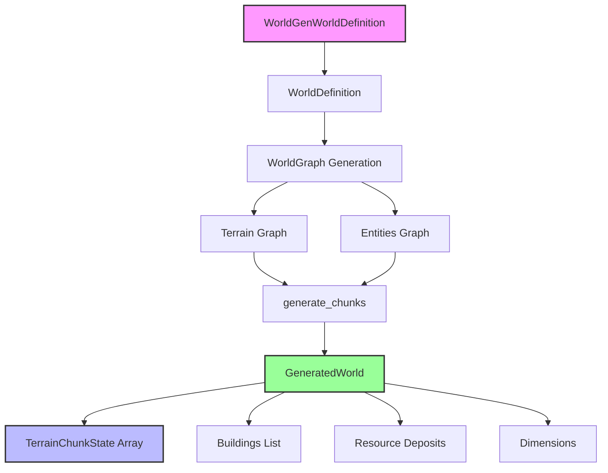
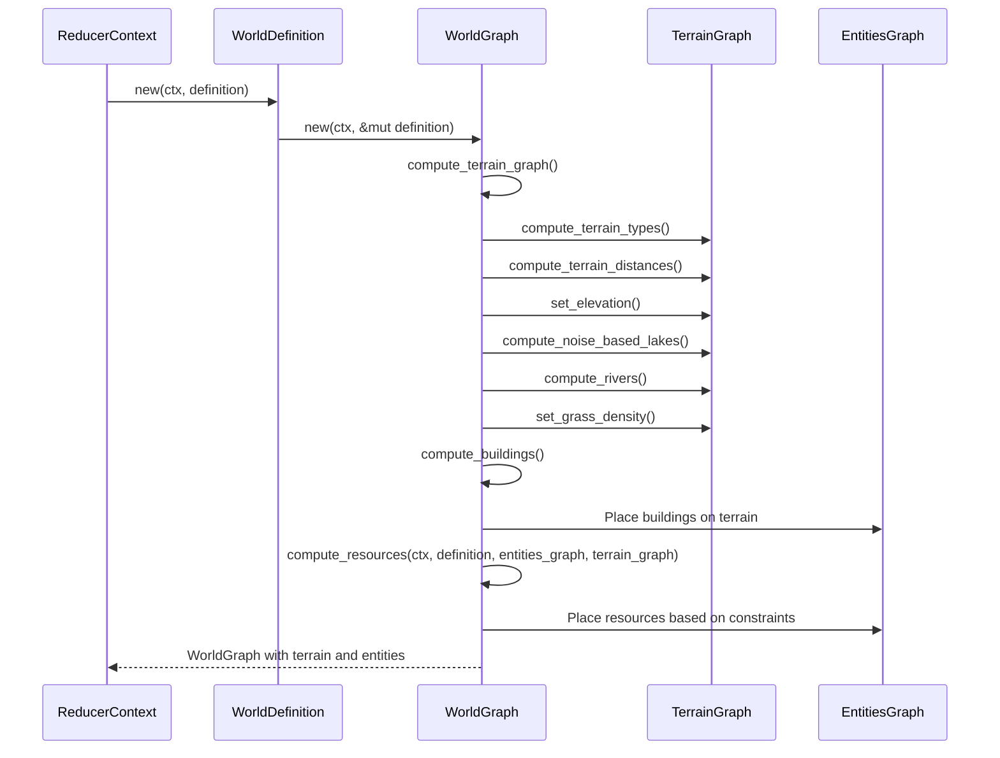

The World Generator Architecture is a sophisticated procedural generation system that creates persistent, feature-rich game worlds through a graph-based approach. This system transforms abstract configuration data into fully populated terrain with biomes, elevation, water bodies, buildings, and resources. The architecture is designed to support both server-side generation and client-side deterministic reproduction through shared configuration and algorithms.

## System Overview

The world generator operates as a multi-stage pipeline that processes configuration data through several transformation layers. At its core, the system uses hexagonal grid data structures (`HexGraph`) to represent terrain and entity information, enabling efficient spatial queries and neighbor-based computations.

**Sources:** [world_generator.rs](BitCraftServer/packages/game/src/game/world_gen/world_generator.rs#L1-L50), [world_definition.rs](BitCraftServer/packages/game/src/game/world_gen/world_definition.rs#L1-L50)

## Core Data Structures

The architecture relies on three primary data structures that define the world generation pipeline:

| Structure | Purpose | Key Components |
|-----------|---------|----------------|
| `WorldDefinition` | Configuration container for all generation parameters | Size, curves, biome maps, mountain maps, resource maps |
| `WorldGraph` | Intermediate representation containing generated terrain and entity data | `terrain_graph: HexGraph<TerrainNode>`, `entities_graph: HexGraph<EntityNode>` |
| `GeneratedWorld` | Final output ready for game systems | Chunks, buildings, deposits, enemies, NPCs, dimensions |

The `WorldDefinition` struct acts as the central configuration object, containing `AnimationCurve` instances for controlling elevation profiles, noise specifications, and biome-specific parameters. This design enables fine-grained control over terrain characteristics through data rather than code modifications.

**Sources:** [world_definition.rs](BitCraftServer/packages/game/src/game/world_gen/world_definition.rs#L18-L35), [world_gen.rs](BitCraftServer/packages/game/src/messages/world_gen.rs#L1-L30)

## Three-Phase Generation Pipeline

The WorldGraph creation follows a strict three-phase execution order to ensure dependencies are satisfied:

1. **Terrain Generation**: Creates the base topography with elevation, water levels, and biome assignments
2. **Building Generation**: Places pre-defined structures at appropriate locations
3. **Resource Generation**: Distributes resource deposits based on terrain and biome constraints

The pipeline is orchestrated by `WorldGraph::new()`, which logs each phase to provide visibility into the generation process. The terrain graph uses a coarser resolution than the entities graph (terrain is 1:1 with hex tiles, while entities uses a 3x multiplier for finer placement control).

**Sources:** [world_graph.rs](BitCraftServer/packages/game/src/game/world_gen/world_generation/world_graph.rs#L45-L60)

## Terrain Generation Subsystem

The terrain generation subsystem implements a multi-factor elevation calculation that combines procedural noise with distance-based modifiers and biome-specific characteristics. Each hexagonal cell receives elevation and water level values through a weighted composition of several algorithms.

The terrain computation proceeds through six distinct steps:

1. **Terrain Type Classification**: Determines whether each cell is land or water based on world map shape definitions
2. **Distance Field Calculation**: Computes distances to sea, water bodies, and biome boundaries for natural transitions
3. **Elevation Assignment**: Applies curves, noise layers, mountain peaks, and biome-specific modifiers
4. **Water Level Determination**: Sets water elevation based on terrain characteristics and lake generation
5. **Lake Generation**: Uses noise-based algorithms to create lakes with configurable depth and barriers
6. **River Generation**: Employs pathfinding to carve river channels following elevation gradients

<CgxTip>The distance field calculations use flood-fill algorithms to propagate distances from water bodies and biome boundaries, creating smooth transitions between terrain types. The `distance_to_sea_relative` and `distance_to_water_relative` normalized values (0.0-1.0) are critical for natural-looking coastlines and biome blending.</CgxTip>

The elevation calculation at each terrain node combines multiple factors: a base land curve controlled by distance to sea, contributions from nearby mountain peaks, biome-specific elevation curves, and noise-based elevation layers. The final elevation is clamped and optionally terraced based on biome configuration.

**Sources:** [world_graph.rs](BitCraftServer/packages/game/src/game/world_gen/world_generation/world_graph.rs#L61-L200), [world_graph.rs](BitCraftServer/packages/game/src/game/world_gen/world_generation/world_graph.rs#L200-L399)

## Graph-Based Representation

The architecture's strength lies in its use of `HexGraph<T>` data structures, which provide:

- **Spatial indexing**: Efficient neighbor queries for distance field calculations
- **Type safety**: Generic implementation handles both `TerrainNode` and `EntityNode` types
- **Flexible operations**: Support for flood fill, distance propagation, and iteration

The terrain graph and entities graph operate at different scales. The terrain graph contains one node per hexagonal tile, while the entities graph uses a 3x multiplier to allow for more precise entity placement between hex centers. This separation enables terrain generation to work at a coarser granularity while entity placement benefits from finer resolution.

Each `TerrainNode` contains comprehensive state including elevation, water level, node type (Land, Sea, Lake, River), biome assignment, distance fields, and density values. The `EntityNode` contains optional building or resource data that references the underlying terrain for placement decisions.

**Sources:** [world_graph.rs](BitCraftServer/packages/game/src/game/world_gen/world_generation/world_graph.rs#L20-L35), [world_generator.rs](BitCraftServer/packages/game/src/game/world_gen/world_generator.rs#L45-L90)

## Chunk Generation and Serialization

After the WorldGraph is constructed, the `generate_chunks()` function converts the graph data into the final `GeneratedWorld` structure that the game systems consume. This process:

1. **Creates dimension metadata**: Defines world boundaries and dimension properties
2. **Allocates chunk containers**: Creates a 2D grid of `TerrainChunkState` objects (default 32x32 tiles per chunk)
3. **Populates terrain cells**: Iterates through terrain graph nodes, converting each to a `TerrainCell` with proper surface type classification
4. **Places buildings**: Extracts building data from entities graph and creates `WorldGenGeneratedBuilding` instances
5. **Places resources**: Converts entity graph resource nodes to `WorldGenGeneratedResourceDeposit` instances

The chunk indexing scheme uses `chunk_index = (j * 1000 + i + 1)` to enable efficient runtime table access. Each terrain cell inherits elevation, water level, biome data, and zoning information from its corresponding terrain graph node.

**Sources:** [world_generator.rs](BitCraftServer/packages/game/src/game/world_gen/world_generator.rs#L54-L90), [world_generator.rs](BitCraftServer/packages/game/src/game/world_gen/world_generator.rs#L90-L200)

## Configuration System Architecture

The configuration system uses a layered approach where `WorldGenWorldDefinition` messages (defined in SpacetimeDB schemas) are converted to internal `WorldDefinition` structures. This separation enables:

- **Database serialization**: Message types can be stored and retrieved from SpacetimeDB
- **Type safety**: Internal structures use Rust-native types like `AnimationCurve` and `Vector2Int`
- **Validation**: Conversion process can validate and normalize configuration data
- **Extensibility**: New configuration parameters can be added without breaking existing data

Key configuration categories include:

| Configuration Category | Description | Example Parameters |
|------------------------|-------------|-------------------|
| World Size | Overall dimensions | size (x, y) |
| Terrain Shaping | Elevation profiles | land_curve, noise_influence, sea_level |
| Biomes | Biological regions | distance_to_sea_curve, terracing, grass_density |
| Mountains | Elevation features | center, radius, height, shape curve |
| Resources | Material deposits | clump_id, elevation ranges, biome chances |
| Buildings | Pre-placed structures | id, direction |

**Sources:** [world_gen.rs](BitCraftServer/packages/game/src/messages/world_gen.rs#L1-L50), [world_definition.rs](BitCraftServer/packages/game/src/game/world_gen/world_definition.rs#L37-L140)

## Integration with Game Systems

The generated world integrates with the broader game architecture through several mechanisms:

- **TerrainChunkState tables**: Each chunk is stored as a database entity containing terrain cells
- **Zoning system**: Special cell types like `ZONING_TYPE_PLAYER_START_CELL` mark areas with gameplay significance
- **Dimension system**: Worlds can contain multiple dimensions (e.g., overworld, interiors)
- **Entity spawning**: Generated buildings, resources, NPCs, and enemies become spawn points for game systems

The `ignore_claim_creation` flag in `GeneratedWorld` provides control over whether claims can be created during initial world population, useful for development and testing scenarios.

<CgxTip>The surface type classification system (`SurfaceType::Ocean`, `SurfaceType::Lake`, `SurfaceType::Ground`, `SurfaceType::River`, `SurfaceType::Swamp`) bridges the procedural generation with gameplay systems by providing semantic information about each cell's characteristics.</CgxTip>

**Sources:** [world_generator.rs](BitCraftServer/packages/game/src/game/world_gen/world_generator.rs#L10-L20), [world_generator.rs](BitCraftServer/packages/game/src/game/world_gen/world_generator.rs#L70-L90)

## Performance and Scalability Considerations

The architecture addresses performance through several design choices:

- **Chunk-based storage**: Terrain is organized into 32x32 cell chunks for efficient loading/unloading
- **Graph operations**: HexGraph provides O(1) neighbor access and optimized traversal algorithms
- **Lazy evaluation**: Many computations (like distance fields) are computed once and cached
- **Parallelizable stages**: The three-phase pipeline could potentially execute terrain and resource phases in parallel for different world regions

The system's memory footprint is managed by separating terrain generation (coarser resolution) from entity placement (finer resolution), allowing large worlds to be generated without excessive memory consumption.

**Sources:** [world_definition.rs](BitCraftServer/packages/game/src/game/world_gen/world_definition.rs#L11-L13), [world_graph.rs](BitCraftServer/packages/game/src/game/world_gen/world_generation/world_graph.rs#L40-L50)

## Next Steps

Understanding the World Generator Architecture provides the foundation for exploring specific generation techniques:

- **[Noise-Based Terrain Elevation](7-noise-based-terrain-elevation)**: Deep dive into the OpenSimplex noise implementation and layer blending
- **[Biome and Resource Distribution](8-biome-and-resource-distribution)**: Learn how biome definitions control ecosystem characteristics
- **[Resource Deposit Generation](9-resource-deposit-generation)**: Explore resource placement algorithms and clump generation

For broader architectural context, review the [Project Architecture](3-project-architecture) page to understand how world generation fits into the overall game system design.

**Sources:** [mod.rs](BitCraftServer/packages/game/src/game/world_gen/mod.rs#L1-L22), [world_generator.rs](BitCraftServer/packages/game/src/game/world_gen/world_generator.rs#L1-L50)
