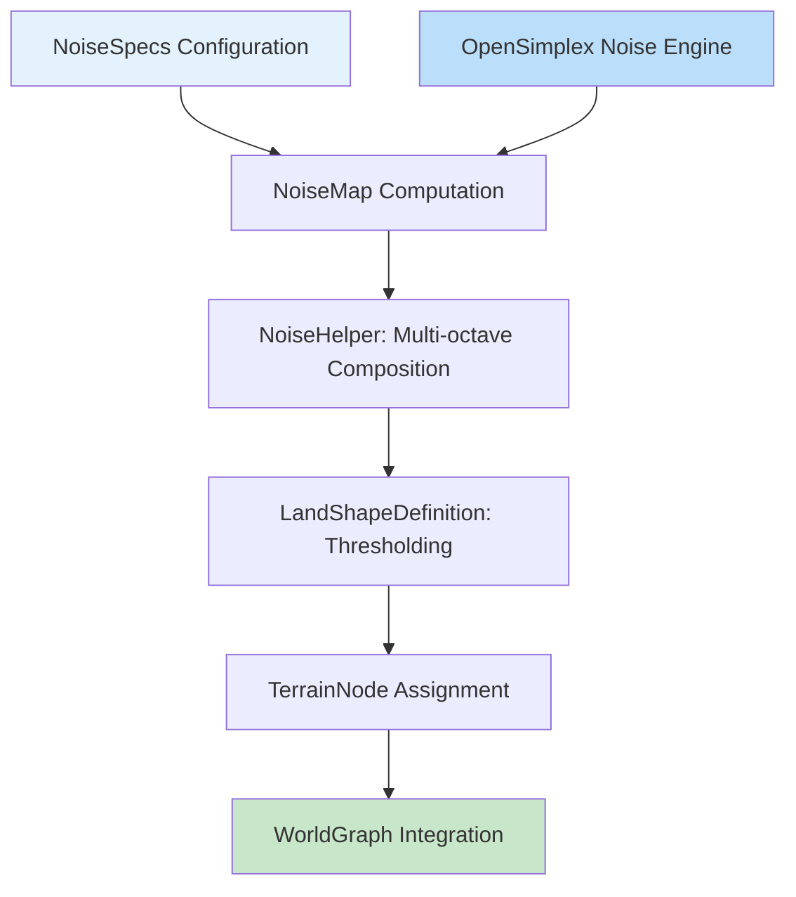
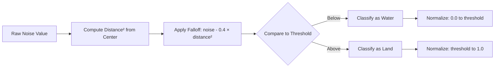

The noise-based terrain elevation system forms the foundational layer of BitCraft's procedural world generation, employing multi-octave OpenSimplex noise to create continuous, natural-looking elevation maps across hexagonal tile grids. This system enables deterministic terrain generation with configurable parameters for creating diverse landscapes from rolling plains to mountainous regions.

## Architecture Overview

The elevation system follows a layered architecture where noise functions generate raw height values that are transformed into hexagonal tile elevations through a structured pipeline. The system uses fractal Brownian motion (fBm) principles, combining multiple octaves of noise at different frequencies and amplitudes to achieve natural terrain detail.



The pipeline begins with noise specifications that define generation parameters, flows through the OpenSimplex noise engine for raw value generation, applies multi-octave composition in NoiseHelper, thresholds results in LandShapeDefinition, and ultimately assigns elevation values to TerrainNodes in the WorldGraph structure.

## Core Noise Configuration

Noise specifications define the fundamental parameters controlling terrain generation behavior. The **NoiseSpecs** struct encapsulates these parameters, enabling fine-grained control over elevation characteristics [noise_specs.rs#L5-L11](BitCraftServer/packages/game/src/game/world_gen/noise_specs.rs#L5-L11).

### Noise Parameter Structure

| Parameter | Type | Range | Effect |
|-----------|------|-------|--------|
| `seed` | `i32` | Any integer | Determines randomization, ensures reproducible generation |
| `scale` | `f32` | 0.0+ | Controls zoom level - lower values create larger features |
| `octaves` | `i32` | 1-8+ | Number of noise layers combined - higher = more detail |
| `persistence` | `f32` | 0.0-1.0 | Amplitude multiplier per octave - controls detail strength |
| `lacunarity` | `f32` | 1.0+ | Frequency multiplier per octave - controls detail frequency |
| `offset` | `Vector2` | Any | Spatial shift for tile continuity across chunks |

The seed parameter is critical for world consistency - the same seed always produces identical terrain. The offset is generated deterministically from the seed [noise_specs.rs#L22-L31](BitCraftServer/packages/game/src/game/world_gen/noise_specs.rs#L22-L31), ensuring seamless transitions between generated regions.

### Multi-Octave Composition

The **NoiseHelper** module implements the core fBm algorithm that combines multiple octaves of noise [noise_helper.rs#L7-L76](BitCraftServer/packages/game/src/game/world_gen/noise_helper.rs#L7-L76). Each octave represents the base noise pattern scaled by the lacunarity factor and attenuated by the persistence factor.

The composition formula applied for each sample point is:

```
height = Σ(0 to octaves-1) [noise_value × amplitude]
amplitude_n = persistence^n
frequency_n = lacunarity^n
```

This approach creates terrain with large-scale features (low octaves) overlaid with increasingly fine detail (high octaves). The normalization step using inverse interpolation ensures final values map to the 0-1 range regardless of configuration [noise_helper.rs#L68-L74](BitCraftServer/packages/game/src/game/world_gen/noise_helper.rs#L68-L74).

<CgxTip>
Persistence values typically range from 0.3-0.6 for natural terrain. Higher values (>0.7) create overly jagged landscapes, while lower values (<0.3) produce overly smooth, artificial-looking terrain.
</CgxTip>

## OpenSimplex Noise Implementation

The system employs **OpenSimplex noise**, an improved gradient noise algorithm that reduces axis-aligned artifacts compared to traditional Perlin noise. The implementation in [open_simplex_noise.rs](BitCraftServer/packages/game/src/game/world_gen/open_simplex_noise.rs#L1-L751) provides 2D noise evaluation with optimized gradient interpolation.

OpenSimplex noise was chosen over Perlin noise for its superior isotropic properties - terrain features appear equally detailed in all directions, avoiding the visual artifacts that can manifest along cardinal axes in standard implementations. The algorithm uses a carefully constructed lattice of gradient vectors and employs a squishing factor to achieve better angular coverage [open_simplex_noise.rs#L4-L7](BitCraftServer/packages/game/src/game/world_gen/open_simplex_noise.rs#L4-L7).

### Noise Evaluation

The core evaluation function maps continuous coordinate space to discrete lattice points, interpolates gradient contributions from surrounding lattice points, and returns a normalized value in the approximate range [-1, 1]. The noise helper transforms this to [0, 1] range through linear interpolation.

Thread-local caching of noise generators optimizes performance by reducing initialization overhead for repeated calls [noise_helper.rs#L106-L123](BitCraftServer/packages/game/src/game/world_gen/noise_helper.rs#L106-L123).

## Noise Map Computation

The **NoiseMap** struct manages the computation and storage of 2D noise grids, providing efficient spatial lookup for terrain generation [noise_map.rs#L5-L21](BitCraftServer/packages/game/src/game/world_gen/noise_map.rs#L5-L21). The computation process involves:

1. **Initialization**: Setting grid dimensions and step resolution
2. **Generation**: Computing noise values across the grid using NoiseHelper
3. **Caching**: Storing results for efficient repeated access

The step parameter enables adaptive resolution - larger steps compute fewer samples for performance, while smaller steps provide higher precision at computational cost [noise_map.rs#L29-L42](BitCraftServer/packages/game/src/game/world_gen/noise_map.rs#L29-L42). This is particularly useful for multi-level terrain generation where broad features can be computed at lower resolution while fine details require higher precision.

### Spatial Queries

NoiseMap provides two primary query methods:

- `get(x, y)`: Continuous coordinate lookup with automatic index mapping and bounds checking [noise_map.rs#L55-L67](BitCraftServer/packages/game/src/game/world_gen/noise_map.rs#L55-L67)
- `get_at_index(x, y)`: Direct array access for known valid indices [noise_map.rs#L69-L77](BitCraftServer/packages/game/src/game/world_gen/noise_map.rs#L69-L77)

The continuous query method uses `half_to_even` rounding for consistent behavior across coordinate systems, ensuring deterministic elevation values for given world positions.

## Elevation Layers and Blending

The **NoiseBasedElevationLayer** system allows stacking multiple noise-based elevation contributions, enabling complex terrain profiles through layer combination [noise_based_elevation_layer.rs#L6-L15](BitCraftServer/packages/game/src/game/world_gen/noise_based_elevation_layer.rs#L6-L15).

### Blending Modes

| Mode | Operation | Use Case |
|------|-----------|----------|
| `Add` | `elevation += layer_value` | Accumulating terrain features (mountains on plains) |
| `Override` | `elevation = layer_value` | Replacing underlying terrain (plateau insertion) |

The threshold parameter enables selective application - layers only affect terrain when their noise value exceeds the threshold [noise_based_elevation_layer.rs#L14-L18](BitCraftServer/packages/game/src/game/world_gen/noise_based_elevation_layer.rs#L14-L18). This enables creating features like mountain ranges that appear only in specific noise-defined regions.

## Land-Water Separation

The **LandShapeDefinition** component transforms continuous elevation values into discrete land/water classifications, applying threshold-based segmentation with falloff correction [land_shape_definition.rs#L5-L21](BitCraftServer/packages/game/src/game/world_gen/land_shape_definition.rs#L5-L21).

### Thresholding with Edge Falloff

The land thresholding process includes a distance-based falloff correction that ensures water bodies dominate at world edges:



This falloff technique prevents artificial land masses at world boundaries, creating natural-looking shorelines and ensuring proper continent shapes [land_shape_definition.rs#L38-L60](BitCraftServer/packages/game/src/game/world_gen/land_shape_definition.rs#L38-L60). The `0.4` multiplier determines falloff strength - higher values create more pronounced edge effects.

## Integration with Hex Grid

The final elevation values are assigned to **TerrainNode** entities within the hexagonal grid system [terrain_node.rs#L5-L38](BitCraftServer/packages/game/src/game/world_gen/world_generation/terrain_node.rs#L5-L38). Each TerrainNode stores:

- `elevation: i16` - Final height value in world units
- `water_level: i16` - Sea level for determining submersion
- `node_type: NodeType` - Classification (Land, Sea, Lake, River)

The world generation pipeline maps continuous noise values to discrete hex tiles using offset coordinate conversion, ensuring each tile receives a representative elevation value [world_generator.rs#L80-L121](BitCraftServer/packages/game/src/game/world_gen/world_generator.rs#L80-L121).

### Elevation Storage Precision

Elevation values are stored as 16-bit integers, providing sufficient precision for terrain features while minimizing memory overhead. The conversion from normalized 0-1 noise to world units typically involves multiplication by a scale factor (e.g., 100-500 units for total height range).

<CgxTip>
The choice between continuous elevation sampling (exact interpolation) and discrete tile sampling (nearest tile center) depends on use case. World generation typically uses discrete sampling for performance, while real-time systems like pathfinding may interpolate for smooth transitions.
</CgxTip>

## Next Steps

With noise-based elevation established, the next natural progression is understanding how these elevation values influence biome distribution and resource placement:

- **[Biome and Resource Distribution](8-biome-and-resource-distribution)** - Learn how elevation thresholds determine biome boundaries
- **[Resource Deposit Generation](9-resource-deposit-generation)** - See how elevation guides resource placement patterns
- **[World Generator Architecture](6-world-generator-architecture)** - Understand the broader system coordinating these components

The noise-based elevation system provides the foundational topography upon which all other world generation systems build, making it essential knowledge for modifying terrain characteristics or implementing custom world presets.
