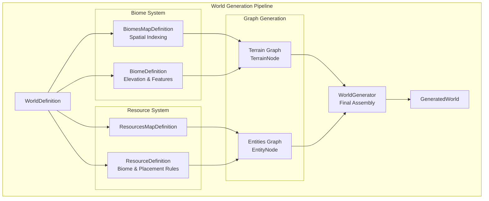
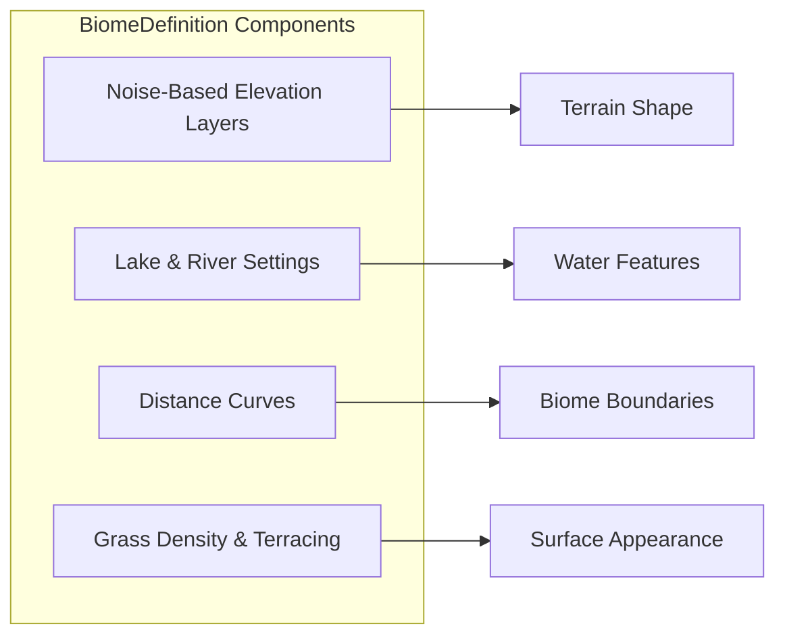
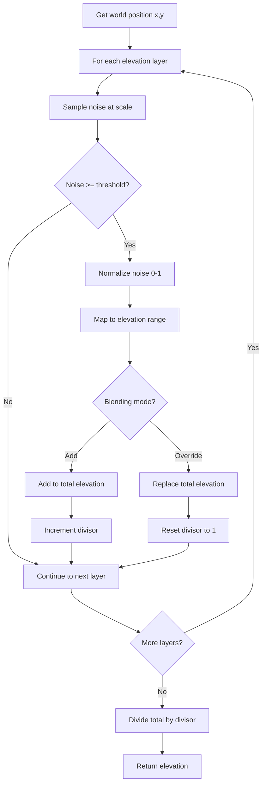
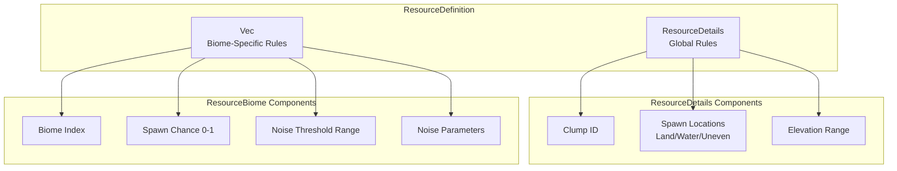
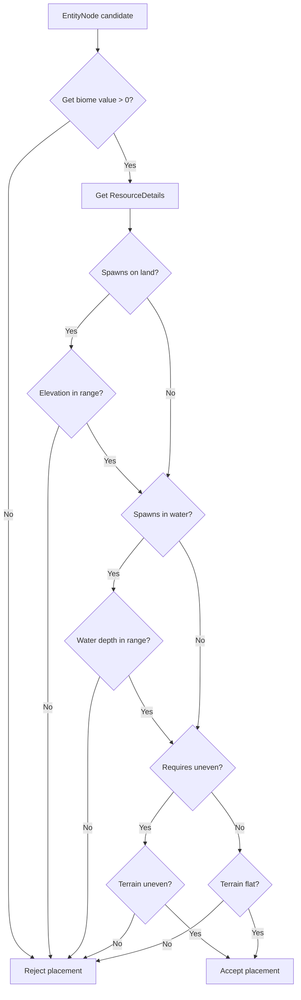

Understanding how BitCraft procedurally generates diverse biomes and distributes resources across its hexagonal world is essential for world designers and systems developers. This system leverages noise-based algorithms, elevation layers, and spatial mapping to create realistic and varied terrain with strategic resource placement. The biome and resource distribution systems work in concert to ensure each world generation produces unique yet balanced environments suitable for exploration, construction, and economic gameplay.

## Architecture Overview

The biome and resource distribution architecture follows a layered approach where terrain data flows through multiple processing stages before final entity placement. This design enables independent tuning of biome characteristics and resource patterns while maintaining spatial coherence across the world.

The generation pipeline begins with configuration definitions that drive the creation of terrain and entity graphs. These graphs represent the hexagonal grid structure with per-cell biome, elevation, and resource potential data. The final assembly converts graph data into actual terrain chunks and spawn entities.

Sources: [world_generator.rs](BitCraftServer/packages/game/src/game/world_gen/world_generator.rs#L20-L30), [world_graph.rs](BitCraftServer/packages/game/src/game/world_gen/world_generation/world_graph.rs)

## Biome Distribution System

### Biome Definition Structure

Each biome is defined through a comprehensive set of parameters that control its spatial distribution and terrain characteristics. The `BiomeDefinition` structure encapsulates elevation behavior, water features, and transition dynamics between adjacent biomes.

The elevation system uses multiple noise layers with configurable blending modes. Each layer defines a threshold value, an elevation range, and either additive or override blending behavior. This enables creating complex terrain shapes such as mountains, plateaus, and valleys through layer combinations.

Key biome definition parameters include:

| Parameter | Type | Purpose |
|-----------|------|---------|
| `distance_to_sea_curve` | AnimationCurve | Controls biome influence based on distance from sea |
| `transition_length` | i32 | Defines smoothness of biome boundaries |
| `noise_based_elevation_layers` | Vec<NoiseBasedElevationLayer> | Layered elevation calculation |
| `max_lake_depth` | i16 | Maximum depth for generated lakes |
| `lake_noise_specs` | NoiseSpecs | Lake placement noise parameters |
| `river_generation_settings` | Option<RiverGenerationSettings> | Optional river configuration |

Sources: [biome_definition.rs](BitCraftServer/packages/game/src/game/world_gen/biome_definition.rs#L13-L29)

### Elevation Calculation Process

The biome system calculates elevation by processing noise layers in sequence. Each layer samples simplex noise at specific scales and applies transformations based on threshold values.

The additive blending mode accumulates elevation contributions from multiple layers, while override mode allows specific layers to dominate terrain features. This flexibility enables creating mountains with multiple strata or flat regions with isolated peaks.

Sources: [biome_definition.rs](BitCraftServer/packages/game/src/game/world_gen/biome_definition.rs#L31-L62)

### Biome Map Spatial Indexing

The `BiomesMapDefinition` manages biome placement through an efficient spatial indexing system. Biomes are stored in a compressed format where each pixel represents a coordinate region, with optional spawn point markers encoded in the high bit.

The spatial coordinate system uses a diagonal mapping scheme where the pixel index is calculated as:
- If x ≥ y: `index = x² + y`
- If x < y: `index = y² + 2y + 2 - x`

This mapping provides O(1) access to biome data at any world position while minimizing memory usage for sparse biome distributions.

Sources: [biomes_map_definition.rs](BitCraftServer/packages/game/src/game/world_gen/biomes_map_definition.rs#L7-L91)

## Resource Distribution System

### Resource Definition Architecture

Resources are defined through a two-level structure that separates global resource characteristics from biome-specific placement rules. This design enables a single resource type to appear in multiple biomes with different frequencies and distributions.

The global `ResourceDetails` structure defines fundamental resource properties:

| Property | Type | Description |
|----------|------|-------------|
| `clump_id` | i32 | Identifier for resource cluster type |
| `spawns_on_land` | bool | Whether resource appears on terrain |
| `land_elevation_range` | Vector2Int | Valid elevation range for land spawn |
| `spawns_in_water` | bool | Whether resource appears underwater |
| `water_depth_range` | Vector2Int | Valid depth range for water spawn |
| `spawns_on_uneven_terrain` | bool | Whether resource spans elevation changes |

<CgxTip>
Resources can be configured to spawn on land, underwater, or both simultaneously. The system validates placement against terrain elevation and water depth at spawn time, ensuring resources only appear in valid locations. Uneven terrain resources like stone formations can span multiple elevation levels, while others like crops require flat ground.
</CgxTip>

Sources: [resource_definition.rs](BitCraftServer/packages/game/src/game/world_gen/resource_definition.rs#L26-L36)

### Biome-Specific Resource Configuration

Each resource can have multiple `ResourceBiome` entries, one per biome where it appears. This enables fine-grained control over resource distribution patterns across different environments.

The biome-specific configuration includes:

- **Biome Index**: Links to a specific biome from the biome map
- **Spawn Chance**: Probability factor (0.0 to 1.0) for resource occurrence
- **Noise Threshold**: Range [0,1] that noise values must fall within
- **Noise Specs**: Controls the spatial pattern of resource clusters

When determining if a resource spawns at a location, the system samples noise at the world position using the biome's noise specifications. If the noise value falls within the threshold range, the resource is eligible to spawn based on the biome's chance value.

Sources: [resource_definition.rs](BitCraftServer/packages/game/src/game/world_gen/resource_definition.rs#L38-L64)

## Terrain and Entity Integration

### Terrain Node Structure

The `TerrainNode` represents individual hexagonal cells in the terrain graph and stores all data needed for biome and resource placement decisions.

| Field | Type | Purpose |
|-------|------|---------|
| `coordinates` | HexCoordinates | World position |
| `node_type` | NodeType | Sea/Lake/Land/River classification |
| `biomes` | u32 | Biome identifier (lower 8 bits) |
| `distances_to_biomes` | Vec<i32> | Distance to each biome center |
| `biomes_multipliers` | Vec<f32> | Influence factors for blending |
| `elevation` | i16 | Terrain height value |
| `water_level` | i16 | Water surface height |
| `biome_density` | u32 | Vegetation density indicator |
| `lake_depth` | i16 | Depth if node is lake |

The `node_type` field determines how terrain cells interact with resources. Water nodes (Sea, Lake, River) only accept resources configured for underwater spawning, while Land nodes accept land-based resources. This segregation prevents impossible resource placements like trees in the ocean.

Sources: [terrain_node.rs](BitCraftServer/packages/game/src/game/world_gen/world_generation/terrain_node.rs#L8-L23)

### Entity Placement Logic

The `EntityNode` system handles final resource placement by evaluating terrain conditions against resource definitions. Each potential resource spawn location undergoes multiple validation checks:

The terrain integration ensures resources only appear in physically valid locations. For example, kelp requires underwater placement with appropriate depth, while stone formations may require uneven terrain spanning multiple elevation levels.

Sources: [entity_node.rs](BitCraftServer/packages/game/src/game/world_gen/world_generation/entity_node.rs#L100-L175)

### World Generation Assembly

The final assembly occurs in the `WorldGenerator`, which processes both terrain and entity graphs to produce the actual game world.

The generation process iterates through all entity nodes in the entities graph. For each node:
1. Building nodes create `WorldGenGeneratedBuilding` structures
2. Resource nodes create `WorldGenGeneratedResourceDeposit` structures
3. Coordinates are converted to offset positions for chunk placement

Resource deposits include direction information, allowing resources like trees or rocks to have varied orientations. The final generated world contains separate vectors for chunks, buildings, deposits, NPCs, enemies, and dropped inventories.

Sources: [world_generator.rs](BitCraftServer/packages/game/src/game/world_gen/world_generator.rs#L150-L215)

## Configuration and Tuning

### Noise Parameter Guidelines

Noise specifications control the spatial scale and detail of both biome boundaries and resource clusters. Key parameters include:

| Parameter | Effect | Typical Range |
|-----------|--------|---------------|
| `scale` | Feature size (lower = larger) | 0.001 - 0.1 |
| `octaves` | Detail layers | 1 - 6 |
| `persistence` | Amplitude reduction per octave | 0.3 - 0.6 |
| `lacunarity` | Frequency increase per octave | 2.0 - 2.5 |

Higher octave values create more detailed terrain and resource distributions but increase computational cost during world generation. Persistence values above 0.6 can produce noisy, chaotic terrain unsuitable for gameplay.

Sources: [noise_specs.rs](BitCraftServer/packages/game/src/game/world_gen/noise_specs.rs)

<CgxTip>
When tuning biome transitions, the `transition_length` parameter should align with the noise scale. Smaller transition values with large noise scales can create abrupt, unnatural biome boundaries. Aim for transition lengths of 3-5 hex cells for smooth natural-looking transitions.
</CgxTip>

## Next Steps

To deepen your understanding of BitCraft's world generation systems, explore these related topics:

- **[Noise-Based Terrain Elevation](7-noise-based-terrain-elevation)** - Learn the mathematical foundations of the noise functions that drive both biome and resource distribution patterns
- **[Resource Deposit Generation](9-resource-deposit-generation)** - Discover how individual resource deposits are constructed with health, direction, and regeneration mechanics
- **[World Generator Architecture](6-world-generator-architecture)** - Understand the complete world generation pipeline from seed to final terrain chunks

The biome and resource distribution systems provide the foundation for creating varied, playable worlds. By mastering these systems, you can design custom biomes with unique terrain characteristics and create strategic resource distributions that support your gameplay objectives.
