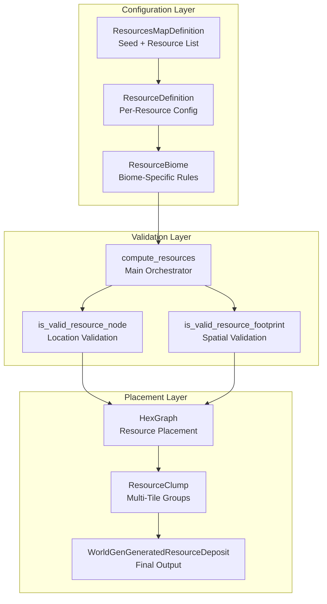
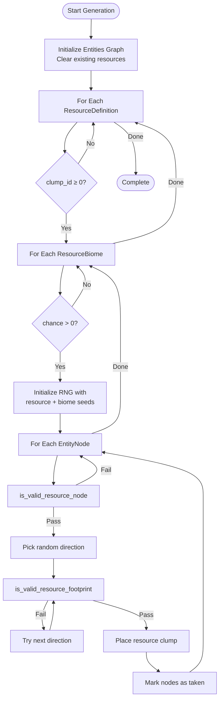

Resource deposit generation is a sophisticated procedural system that places natural resources (trees, rocks, mines, etc.) across the game world using noise-based distribution, biome filtering, and spatial validation. The system ensures resources appear in ecologically appropriate locations while respecting terrain constraints and preventing placement conflicts.

## Architecture Overview

The resource generation system operates as a three-layer architecture that processes resources through validation filters before final placement. The system leverages a higher-resolution entity graph (3× the terrain resolution) for fine-grained resource placement while referencing terrain data for elevation and biome constraints.



The generation process operates on a specialized graph structure where resources occupy the entities graph—a hexagonal grid with three times the resolution of the terrain graph—allowing for precise placement while still maintaining efficient querying. This dual-graph approach enables the system to validate resource placement against terrain constraints without maintaining redundant data.

Sources: [world_generator.rs](BitCraftServer/packages/game/src/game/world_gen/world_generator.rs#L26-L35), [world_graph.rs](BitCraftServer/packages/game/src/game/world_gen/world_generation/world_graph.rs#L24-L27)

## Core Data Structures

### ResourceDefinition

The `ResourceDefinition` struct encapsulates both global resource properties and biome-specific behaviors. Each resource can have multiple biome configurations, allowing it to appear with different characteristics in different biomes.

```rust
pub struct ResourceDefinition {
    pub resource_details: ResourceDetails,
    pub biomes: Vec<ResourceBiome>,
}
```

Sources: [resource_definition.rs](BitCraftServer/packages/game/src/game/world_gen/resource_definition.rs#L6-L10)

### ResourceDetails

This struct defines the physical constraints that govern where a resource type can spawn:

| Property | Type | Purpose |
|----------|------|---------|
| `clump_id` | `i32` | Reference to resource clump template for multi-tile groups |
| `spawns_on_land` | `bool` | Whether resource can appear on land terrain |
| `land_elevation_range` | `Vector2Int` | Valid elevation bounds for land spawning |
| `spawns_in_water` | `bool` | Whether resource can appear in water bodies |
| `water_depth_range` | `Vector2Int` | Valid water depth bounds for aquatic spawning |
| `spawns_on_uneven_terrain` | `bool` | Allow placement on terrain elevation changes |

Sources: [resource_definition.rs](BitCraftServer/packages/game/src/game/world_gen/resource_definition.rs#L34-L42)

### ResourceBiome

Biome-specific configurations control the probability and distribution pattern for each biome:

| Property | Type | Range | Purpose |
|----------|------|-------|---------|
| `biome_index` | `i32` | ≥ 0 | Target biome for this configuration |
| `chance` | `f32` | [0, 1] | Base spawn probability multiplier |
| `noise_threshold` | `Vector2` | [0, 1]² | Noise bounds for filtering locations |
| `noise_specs` | `NoiseSpecs` | - | Perlin noise parameters for distribution |

The noise threshold creates organic patterns by requiring noise values to fall within a specific range. Resources only spawn where the noise function produces values between `noise_threshold.x` and `noise_threshold.y`, creating natural clusters and voids.

Sources: [resource_definition.rs](BitCraftServer/packages/game/src/game/world_gen/resource_definition.rs#L44-L50)

## Generation Process

The resource generation pipeline follows a systematic validation-and-placement workflow:



Sources: [world_graph.rs](BitCraftServer/packages/game/src/game/world_gen/world_generation/world_graph.rs#L1317-L1438)

### Phase 1: Initialization

The system first clears any existing resource placements and initializes a tracking grid to prevent overlaps:

```rust
let graph_count = graph.count() as usize;
let mut taken_grid = vec![false; graph_count];
for i in 0..graph_count {
    let node = graph.get_mut(i as i32).unwrap();
    node.resource = None;
}
```

Each resource definition gets a unique seed derived from the world seed and resource index, ensuring deterministic but varied distribution across different world seeds.

Sources: [world_graph.rs](BitCraftServer/packages/game/src/game/world_gen/world_generation/world_graph.rs#L1329-L1337)

### Phase 2: Node Validation

The `is_valid_resource_node` function performs four critical checks before considering a location viable:

1. **Occupancy Check**: Node must not already contain a building or resource
2. **Biome Compatibility**: Biome multiplier at the location must be greater than zero
3. **Elevation Validation**: Terrain elevation must match resource constraints
4. **Noise and Probability Filter**: Noise value must fall within threshold range and pass probability check

The biome multiplier represents how strongly a given biome influences the terrain at that location. A value ≤ 0 indicates the resource shouldn't appear in that biome type.

Sources: [world_graph.rs](BitCraftServer/packages/game/src/game/world_gen/world_generation/world_graph.rs#L1277-L1315)

<CgxTip>The noise value calculation is normalized to [0, 1] by mapping the raw noise from the threshold range before being combined with the biome multiplier and base chance to determine the final spawn probability.</CgxTip>

### Phase 3: Footprint Validation

Multi-tile resources require spatial validation to ensure all tiles fit within the world bounds and don't conflict with other entities. The system attempts all six hexagonal directions and selects the first valid orientation:

```rust
let mut facing_direction = HexDirection::FLAT[map_random.usize_range(0, HexDirection::FLAT.len())];
let mut valid = false;
for _ in 0..HexDirection::FLAT.len() {
    if is_valid_resource_footprint(graph, terrain_graph, &node, &footprint, facing_direction, &resource) {
        valid = true;
        break;
    }
    if footprint.len() == 0 || (footprint.len() == 1 && footprint[0].x == 0 && footprint[0].z == 0) {
        break;
    }
    facing_direction = HexDirection::next_flat(facing_direction);
}
```

This rotational testing ensures resources can be placed even when the initial random direction isn't viable, while single-tile centered resources skip rotation for efficiency.

Sources: [world_graph.rs](BitCraftServer/packages/game/src/game/world_gen/world_generation/world_graph.rs#L1372-L1389)

### Phase 4: Resource Placement

Once a valid location and orientation are found, the system places the resource clump by iterating through each resource in the clump definition:

```rust
for i in 0..clump.resource_id.len() {
    let resource_id = clump.resource_id[i];
    let offset_x = clump.x[i];
    let offset_z = clump.z[i];
    let resource_dir = clump.direction[i];
    
    // ... footprint calculations ...
    
    taken_grid[taken_index as usize] = true;
    taken_node.resource = Some(ResourceData {
        details: if is_center { Some(resource) } else { None },
        direction,
        resource_id: if is_center { resource_id } else { 0 },
    });
}
```

Each tile in the clump is marked in the `taken_grid` to prevent future placements, with only the center tile containing the full resource details and other tiles storing minimal identification data.

Sources: [world_graph.rs](BitCraftServer/packages/game/src/game/world_gen/world_generation/world_graph.rs#L1393-L1434)

## Terrain Integration

Resources reference terrain data through the `EntityNode` helper methods that query the terrain graph:

### Elevation Querying

Resources must validate elevation against terrain constraints. The `is_valid_elevation` method (accessed through `EntityNode`) checks whether the terrain elevation at the entity location falls within the resource's configured range:

```rust
pub fn get_elevation(&self, terrain_graph: &HexGraph<TerrainNode>) -> i16 {
    let terrain_coordinates = self.coordinates.get_terrain_coordinates();
    // Query terrain nodes and return elevation
}
```

The entities graph uses 3× the resolution of terrain, so each entity node corresponds to a 3×3 grid of terrain nodes. The system samples from the primary terrain node for elevation validation.

Sources: [entity_node.rs](BitCraftServer/packages/game/src/game/world_gen/world_generation/entity_node.rs#L40-L80)

### Biome Integration

The biome multiplier system allows resources to respect biome boundaries. The `get_biome_value` method calculates the normalized biome strength:

```rust
pub fn get_biome_value(&self, biome_index: usize, terrain_graph: &HexGraph<TerrainNode>) -> f32 {
    let biome_multiplier = terrain_node.biomes_multipliers[biome_index];
    let total_biomes_multipliers = /* sum of all positive multipliers */;
    return biome_multiplier / total_biomes_multipliers;
}
```

This normalization ensures resources spawn proportionally to biome dominance at each location, creating smooth transitions rather than abrupt biome boundaries.

Sources: [entity_node.rs](BitCraftServer/packages/game/src/game/world_gen/world_generation/entity_node.rs#L119-L146)

<CgxTip>Biome multipliers are pre-computed during terrain generation and stored in the terrain graph, making resource biome queries O(1) operations during the placement phase.</CgxTip>

## Output Integration

Once resources are placed in the entities graph, they are converted to the final output format for world instantiation:

```rust
let resource_deposit = WorldGenGeneratedResourceDeposit {
    x: offset.x as i32,
    z: offset.z as i32,
    deposit: Some(ResourceState {
        resource_id: r.resource_id,
        direction_index: r.direction,
        ..Default::default()
    }),
    dimension: 1,
};
deposits.push(resource_deposit);
```

These deposits are included in the `GeneratedWorld` struct alongside terrain chunks and buildings, providing a complete snapshot of the procedurally generated world.

Sources: [world_generator.rs](BitCraftServer/packages/game/src/game/world_gen/world_generator.rs#L206-L218), [world_generator.rs](BitCraftServer/packages/game/src/game/world_gen/world_generator.rs#L15-L24)

## Configuration Parameters

### Noise Spec Configuration

The `NoiseSpecs` struct controls the procedural distribution pattern:

| Parameter | Effect | Typical Range |
|-----------|--------|---------------|
| `scale` | Feature size (lower = larger clusters) | 0.001 - 0.1 |
| `octaves` | Detail layers (higher = more detail) | 1 - 8 |
| `persistance` | Amplitude decay per octave | 0.1 - 0.7 |
| `lacunarity` | Frequency increase per octave | 1.5 - 3.0 |
| `offset` | Pattern shift for variety | Any value |

Lower scale values produce larger, more continuous resource patches, while higher scales create scattered individual deposits. Multiple octaves add fine-grained variation on top of the base distribution.

Sources: [noise_specs.rs](BitCraftServer/packages/game/src/game/world_gen/noise_specs.rs)

### Footprint System

The footprint system defines which tiles a resource occupies using `FootprintTile` entries:

| FootprintType | Description |
|---------------|-------------|
| `Hitbox` | Primary tile containing the resource |
| `Perimeter` | Blocked area around resource (cannot build) |

Multi-tile resources like mining clusters or tree groves use clumps that reference multiple resource instances with relative offsets and rotations, creating complex natural formations from simple definitions.

Sources: [world_graph.rs](BitCraftServer/packages/game/src/game/world_gen/world_generation/world_graph.rs#L1362-L1363)

## Next Steps

Understanding resource generation provides context for how the world populates with interactable content. For a deeper understanding of the terrain constraints that resources must respect, read about [Noise-Based Terrain Elevation](7-noise-based-terrain-elevation). To learn how resources are grouped into biomes, see [Biome and Resource Distribution](8-biome-and-resource-distribution). For information on how players interact with these resources, explore [Player Movement and Actions](21-player-movement-and-actions).
