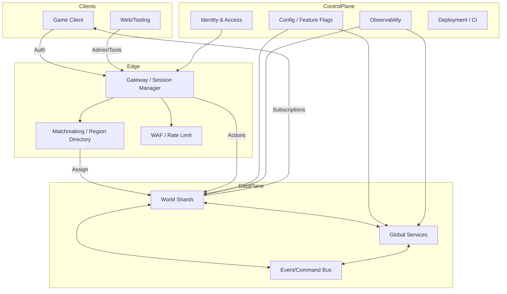

# 서버 아키텍처 (그린필드 최적화 설계안)

## 설계 전제
- 기존 BitCraftServer 코드/구조는 고려하지 않는다.
- 완전히 새로운 프로젝트로 설계한다.
- 서버 권위, 확장성, 보안, 운영성을 1급 목표로 둔다.

## 설계 목표
- 서버 권위: 모든 상태 변경은 서버에서만 확정.
- 성능/확장: 지역 샤딩 + 동적 인스턴싱 + 관심영역 기반 전파.
- 보안: 제로 트러스트, 최소 권한, 감사 로그 기본.
- 운영성: 롤링 배포, 무중단 확장, 장애 복구 용이.
- 유연성: 데이터 모델과 규칙을 구성/파라미터로 분리.

## 상위 수준 다이어그램

## 핵심 구성요소

### 1) Gateway / Session Manager
- TLS 종료, 세션 토큰 검증, IP 레이트리밋, 기본 봇 차단.
- 리전/샤드 배정과 세션 핸드오프 수행.
- 초고빈도 요청의 1차 필터(스팸/재전송/중복).

### 2) World Shards (게임 시뮬레이션)
- 지역 단위 서버 권위 시뮬레이션 실행.
- 관심영역(Area of Interest) 기반 구독/전파.
- 동적 리샤딩 지원(부하/혼잡도 기준).
- SpacetimeDB 인스턴스 단위로 분리(기본: Shard 1개 = DB 1개).
- 초기에는 리전 1개 = 샤드 1개, 이후 핫스팟 시 청크 단위 분할.

### 3) Global Services
- 계정/권한, 경제/경매, 길드/사회, 월드 전역 규칙 담당.
- 지역 간 합의가 필요한 상태만 보유.
- World Shard와 명시적 메시지로만 교신.
- 글로벌 모듈은 별도 SpacetimeDB 인스턴스로 분리 운영.

### 4) Event/Command Bus
- 비동기 처리가 필요한 이벤트 라우팅.
- 멱등 키 기반 중복 제거, 재처리 가능.
- 장애 시 재전송/복구 경로 제공.
- Bus는 외부 시스템(NATS/Kafka 등)으로 두고, 어댑터 서비스가 리듀서를 호출.

### 5) Control Plane
- 구성/플래그: 실시간 밸런스 수정, 기능 플래그 온/오프.
- Identity/IAM: 관리자/운영자/봇 계정 분리.
- Observability: 메트릭/트레이스/감사 로그.

## 데이터/상태 설계 원칙
- 상태는 테이블 중심(서버 권위)으로 관리.
- 규칙은 구성/파라미터로 외부화하여 배포 없이 조정 가능.
- 전역 상태는 요약/지표 중심으로 최소화.
- 이벤트 로그는 별도 파이프라인으로 분리(분석/리플레이).

## 동기화/메시징 전략
- 동기 요청: 플레이어 액션은 샤드에서 즉시 검증/적용.
- 비동기 요청: 전역 합의/정산/장기 작업은 버스 처리.
- 멱등 처리: `request_id` 기반 중복 제거.
- 순서 보장: 샤드 내부는 단일 파티션, 샤드 간은 약한 순서.

## 샤딩/스케일링 전략
- 기본 단위: World Shard = 공간/차원 단위.
- 리샤딩: 핫스팟 감지 시 타일/청크 단위 분할.
- 인스턴싱: 던전/인테리어/특수 이벤트는 별도 인스턴스.
- 캐시: 위치/타일/권한 캐시로 고빈도 조회 최적화.

## 보안 설계 (강화안)
- Zero Trust: 모든 요청은 토큰/서명 검증 필수.
- 최소 권한: 관리자/운영/봇 기능 분리.
- 공격 대응: 레이트리밋 + 행동 패턴 기반 차단.
- 감사 로그: 운영 조치/권한 변경은 반드시 기록.
- 데이터 보호: PII 분리 저장, 접근 감사 추적.

## 운영/관측성
- 핵심 지표: 리듀서 지연, 샤드 CPU, 메시지 지연, 오류율.
- 재시작 안전: 멱등 리듀서 + 체크포인트 기반 복구.
- 롤링 배포: 버전 간 호환 스키마 유지.
- 장애 대응: 샤드 재배치 및 핫스탠바이.

## 성능 최적화 포인트
- 관심영역 스트리밍으로 구독량 최소화.
- 핫 루프는 배치 업데이트로 전환.
- 배경 작업은 큐/워크스틸링로 분산.
- 큰 테이블은 요약/인덱스 테이블 분리.

## 개발/배포 파이프라인
- 정적 데이터 파이프라인 분리(빌드/배포와 독립).
- 피처 플래그로 단계적 롤아웃.
- 서버-클라 스키마 버전 동기화.

## DESIGN/05 데이터 모델과의 연결
- 데이터 모델은 아키텍처와 분리되어야 한다.
- 이 문서는 구조/흐름에 집중하고, 세부 스키마는 `DESIGN/05-data-model.md`에서 정의.
- 데이터 모델 변경은 마이그레이션 계획과 함께 반영.
