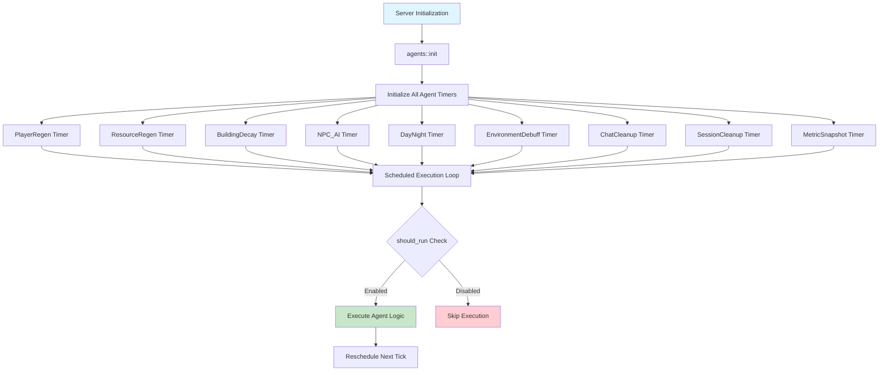

# Stitch 게임 Agent System 상세 설계

> **작성일**: 2026-02-01  
> **상태**: 설계 문서 (DESIGN/DETAIL)  
> **참고**: BitCraft Public Doc 10-14, BitCraftServer 구현 소스  

---

## 1. 개요

Stitch 게임의 Agent System은 SpacetimeDB의 scheduled table 기능을 활용하여 주기적으로 실행되는 백그라운드 작업을 관리하는 시스템이다. BitCraft의 아키텍처를 참고하되, Stitch의 요구사항에 맞게 단순화하고 최적화한다.

### 1.1 설계 목표

| 목표 | 설명 |
|------|------|
| **확장성** | 새로운 에이전트 추가가 쉬운 모듈화 구조 |
| **제어성** | 런타임에 tick 주기와 ON/OFF 동적 조정 가능 |
| **안정성** | 중복 실행 방지, 오류 격리, 자동 복구 |
| **성능** | 선택적 처리, 배치 연산, 불필요한 루프 방지 |
| **보안** | 서버/관리자 인증, 불법 호출 방지 |

### 1.2 에이전트 카테고리

| 카테고리 | 에이전트 | 주기 | 주요 책임 |
|----------|----------|------|-----------|
| **플레이어 관리** | PlayerRegen | Configurable (ms) | 체력/스태미나/포만감 재생 |
| | AutoLogout | 30초 | 비활성 플레이어 자동 로그아웃 |
| **월드 시뮬레이션** | NPC_AI | 300초 | NPC 이동, 행동, 상호작용 |
| | DayNight | 동적 | 낮/밤 주기 관리 |
| | EnvironmentDebuff | Configurable (ms) | 환경 효과 적용 |
| **리소스 관리** | ResourceRegen | Configurable (ms) | 고갈된 자원 재생성 |
| | Growth | Configurable (ms) | 자원 성장 단계 진행 |
| **건축/클레임** | BuildingDecay | Configurable (ms) | 건축물 내구도 감소 |
| | ClaimMaintenance | Configurable (ms) | 클레임 유지비 징수 |
| **시스템 유지보수** | ChatCleanup | 1시간 | 오래된 채팅 메시지 삭제 |
| | SessionCleanup | 5분 | 만료된 세션 정리 |
| | MetricSnapshot | 60초 | 경제/성능 메트릭 수집 |

---

## 2. 아키텍처 개요

### 2.1 시스템 구조



### 2.2 핵심 원칙

```rust
// 1. 모든 에이전트는 scheduled table 사용
#[spacetimedb::table(
    name = player_regen_loop_timer, 
    scheduled(player_regen_agent_loop, at = scheduled_at)
)]
pub struct PlayerRegenLoopTimer {
    #[primary_key]
    #[auto_inc]
    pub scheduled_id: u64,
    pub scheduled_at: spacetimedb::ScheduleAt,
}

// 2. 모든 에이전트는 동일한 보안 검증 패턴
fn player_regen_agent_loop(ctx: &ReducerContext, _timer: PlayerRegenLoopTimer) {
    // (1) 인증 검증
    if ServerIdentity::validate_server_or_admin(&ctx).is_err() {
        log::error!("Unauthorized access to player_regen agent");
        return;
    }
    
    // (2) 전역 활성화 플래그 검증
    if !agents::should_run(ctx) {
        return;
    }
    
    // (3) 실제 로직 실행
    // ...
    
    // (4) 다음 실행 예약
    reschedule_timer(ctx);
}

// 3. 중앙 집중식 초기화
pub mod agents {
    pub fn init(ctx: &ReducerContext) {
        player_regen_agent::init(ctx);
        auto_logout_agent::init(ctx);
        resource_regen_agent::init(ctx);
        building_decay_agent::init(ctx);
        npc_ai_agent::init(ctx);
        day_night_agent::init(ctx);
        environment_debuff_agent::init(ctx);
        chat_cleanup_agent::init(ctx);
        session_cleanup_agent::init(ctx);
        metric_snapshot_agent::init(ctx);
    }
}
```

---

## 3. 핵심 테이블 설계

### 3.1 Agent Control Tables

```rust
// feature_flags 테이블 확장 (DESIGN/05-data-model-tables/feature_flags.md)
#[spacetimedb::table(name = feature_flags, public)]
    pub struct FeatureFlags {
        #[primary_key]
        pub id: u32,
        pub agents_enabled: bool,           // 에이전트 전체 ON/OFF
        pub player_regen_enabled: bool,     // 개별 에이전트 제어
        pub auto_logout_enabled: bool,
        pub resource_regen_enabled: bool,
        pub building_decay_enabled: bool,
        pub npc_ai_enabled: bool,
        pub day_night_enabled: bool,
        pub environment_debuff_enabled: bool,
        pub chat_cleanup_enabled: bool,
        pub session_cleanup_enabled: bool,
        pub metric_snapshot_enabled: bool,
}

// balance_params에 에이전트 주기 설정 추가
// 키 패턴: "agent.{agent_name}_tick_millis"
// 예: "agent.player_regen_tick_millis" = "1000"
// 예: "agent.npc_ai_tick_millis" = "300000"
// 예: "agent.building_decay_tick_millis" = "60000"
```

### 3.2 Agent Timer Tables

```rust
// PlayerRegen 에이전트 타이머
#[spacetimedb::table(
    name = player_regen_loop_timer,
    scheduled(player_regen_agent_loop, at = scheduled_at)
)]
pub struct PlayerRegenLoopTimer {
    #[primary_key]
    #[auto_inc]
    pub scheduled_id: u64,
    pub scheduled_at: spacetimedb::ScheduleAt,
}

// ResourceRegen 에이전트 타이머
#[spacetimedb::table(
    name = resource_regen_loop_timer,
    scheduled(resource_regen_agent_loop, at = scheduled_at)
)]
    pub struct ResourceRegenLoopTimer {
        #[primary_key]
        #[auto_inc]
        pub scheduled_id: u64,
        pub scheduled_at: spacetimedb::ScheduleAt,
    }

// AutoLogout 에이전트 타이머
#[spacetimedb::table(
    name = auto_logout_loop_timer,
    scheduled(auto_logout_agent_loop, at = scheduled_at)
)]
pub struct AutoLogoutLoopTimer {
    #[primary_key]
    #[auto_inc]
    pub scheduled_id: u64,
    pub scheduled_at: spacetimedb::ScheduleAt,
}

// BuildingDecay 에이전트 타이머
#[spacetimedb::table(
    name = building_decay_loop_timer,
    scheduled(building_decay_agent_loop, at = scheduled_at)
)]
pub struct BuildingDecayLoopTimer {
    #[primary_key]
    #[auto_inc]
    pub scheduled_id: u64,
    pub scheduled_at: spacetimedb::ScheduleAt,
}

// NPC_AI 에이전트 타이머
#[spacetimedb::table(
    name = npc_ai_loop_timer,
    scheduled(npc_ai_agent_loop, at = scheduled_at)
)]
pub struct NpcAiLoopTimer {
    #[primary_key]
    #[auto_inc]
    pub scheduled_id: u64,
    pub scheduled_at: spacetimedb::ScheduleAt,
}

// DayNight 에이전트 타이머
#[spacetimedb::table(
    name = day_night_loop_timer,
    scheduled(day_night_agent_loop, at = scheduled_at)
)]
pub struct DayNightLoopTimer {
    #[primary_key]
    #[auto_inc]
    pub scheduled_id: u64,
    pub scheduled_at: spacetimedb::ScheduleAt,
}

// EnvironmentDebuff 에이전트 타이머
#[spacetimedb::table(
    name = environment_debuff_loop_timer,
    scheduled(environment_debuff_agent_loop, at = scheduled_at)
)]
pub struct EnvironmentDebuffLoopTimer {
    #[primary_key]
    #[auto_inc]
    pub scheduled_id: u64,
    pub scheduled_at: spacetimedb::ScheduleAt,
}

// ChatCleanup 에이전트 타이머
#[spacetimedb::table(
    name = chat_cleanup_loop_timer,
    scheduled(chat_cleanup_agent_loop, at = scheduled_at)
)]
pub struct ChatCleanupLoopTimer {
    #[primary_key]
    #[auto_inc]
    pub scheduled_id: u64,
    pub scheduled_at: spacetimedb::ScheduleAt,
}

// SessionCleanup 에이전트 타이머
#[spacetimedb::table(
    name = session_cleanup_loop_timer,
    scheduled(session_cleanup_agent_loop, at = scheduled_at)
)]
pub struct SessionCleanupLoopTimer {
    #[primary_key]
    #[auto_inc]
    pub scheduled_id: u64,
    pub scheduled_at: spacetimedb::ScheduleAt,
}

// MetricSnapshot 에이전트 타이머
#[spacetimedb::table(
    name = metric_snapshot_loop_timer,
    scheduled(metric_snapshot_agent_loop, at = scheduled_at)
)]
pub struct MetricSnapshotLoopTimer {
    #[primary_key]
    #[auto_inc]
    pub scheduled_id: u64,
    pub scheduled_at: spacetimedb::ScheduleAt,
}
```

### 3.3 Agent State Tables

```rust
// 리소스 재생 로그 (ResourceRegen 에이전트용)
#[spacetimedb::table(name = resource_regen_log)]
pub struct ResourceRegenLog {
    #[primary_key]
    pub entity_id: u64,  // resource_node.entity_id
    pub original_hex_x: i32,
    pub original_hex_z: i32,
    pub chunk_id: i64,
    pub resource_def_id: u32,
    pub depleted_at: u64,
    pub respawn_at: u64,
}

// 건축물 감가 상태 (BuildingDecay 에이전트용)
#[spacetimedb::table(name = building_decay_state)]
pub struct BuildingDecayState {
    #[primary_key]
    pub entity_id: u64,  // building_state.entity_id
    pub last_decay_at: u64,
    pub decay_accumulated: u32,  // 누적 감가량 (정수 연산용)
    pub maintenance_paid_until: u64,  // 유지비 납부 만료 시간
}

// 환경 효과 상태 (EnvironmentDebuff 에이전트용)
#[spacetimedb::table(name = environment_effect_state)]
pub struct EnvironmentEffectState {
    #[primary_key]
    pub entity_id: u64,  // player entity_id
    pub last_biome_id: u16,
    pub last_effect_at: u64,
    pub accumulated_exposure: u32,  // 누적 노출량
}

// 낮/밤 상태 (DayNight 에이전트용)
#[spacetimedb::table(name = day_night_state, public)]
pub struct DayNightState {
    #[primary_key]
    pub id: u32,  // always 0
    pub is_day: bool,
    pub day_start_at: u64,
    pub night_start_at: u64,
    pub cycle_number: u64,
}

// NPC 행동 예약 (NPC_AI 에이전트용)
#[spacetimedb::table(name = npc_action_schedule)]
pub struct NpcActionSchedule {
    #[primary_key]
    pub npc_id: u64,
    pub next_action_at: u64,
    pub action_type: u8,  // 0:이동, 1:대화, 2:거래, 3:퀘스트
    pub target_region_id: Option<u64>,
}
```

---

## 4. 에이전트 생명주기

### 4.1 초기화 단계

```rust
// agents/mod.rs
pub fn init(ctx: &ReducerContext) {
    // feature_flags 초기화 (없으면 기본값)
    if ctx.db.feature_flags().id().find(&0).is_none() {
        ctx.db.feature_flags().insert(FeatureFlags {
            id: 0,
            agents_enabled: true,
            player_regen_enabled: true,
            auto_logout_enabled: true,
            resource_regen_enabled: true,
            building_decay_enabled: true,
            npc_ai_enabled: true,
            day_night_enabled: true,
            environment_debuff_enabled: true,
            chat_cleanup_enabled: true,
            session_cleanup_enabled: true,
            metric_snapshot_enabled: true,
        });
    }
    
    // balance_params 기본값 설정
    init_default_agent_params(ctx);
    
    // 각 에이전트 초기화
    player_regen_agent::init(ctx);
    auto_logout_agent::init(ctx);
    resource_regen_agent::init(ctx);
    building_decay_agent::init(ctx);
    npc_ai_agent::init(ctx);
    day_night_agent::init(ctx);
    environment_debuff_agent::init(ctx);
    chat_cleanup_agent::init(ctx);
    session_cleanup_agent::init(ctx);
    metric_snapshot_agent::init(ctx);
}

fn init_default_agent_params(ctx: &ReducerContext) {
    let defaults = vec![
        ("agent.player_regen_tick_millis", "1000"),
        ("agent.auto_logout_tick_millis", "30000"),
        ("agent.resource_regen_tick_millis", "60000"),
        ("agent.building_decay_tick_millis", "60000"),
        ("agent.npc_ai_tick_millis", "300000"),
        ("agent.day_night_tick_millis", "1000"),  // 동적 계산됨
        ("agent.environment_debuff_tick_millis", "5000"),
        ("agent.chat_cleanup_tick_millis", "3600000"),
        ("agent.session_cleanup_tick_millis", "300000"),
        ("agent.metric_snapshot_tick_millis", "60000"),
    ];
    
    for (key, value) in defaults {
        if ctx.db.balance_params().key().find(&key.to_string()).is_none() {
            ctx.db.balance_params().insert(BalanceParams {
                key: key.to_string(),
                value: value.to_string(),
                updated_at: ctx.timestamp.as_micros() as u64,
            });
        }
    }
}

// 전역 실행 여부 확인
pub fn should_run(ctx: &ReducerContext) -> bool {
    if let Some(flags) = ctx.db.feature_flags().id().find(&0) {
        return flags.agents_enabled;
    }
    false
}

// 개별 에이전트 실행 여부 확인
pub fn should_run_agent(ctx: &ReducerContext, agent_name: &str) -> bool {
    if !should_run(ctx) {
        return false;
    }
    
    let flags = ctx.db.feature_flags().id().find(&0);
    match agent_name {
        "player_regen" => flags.map(|f| f.player_regen_enabled).unwrap_or(true),
        "auto_logout" => flags.map(|f| f.auto_logout_enabled).unwrap_or(true),
        "resource_regen" => flags.map(|f| f.resource_regen_enabled).unwrap_or(true),
        "building_decay" => flags.map(|f| f.building_decay_enabled).unwrap_or(true),
        "npc_ai" => flags.map(|f| f.npc_ai_enabled).unwrap_or(true),
        "day_night" => flags.map(|f| f.day_night_enabled).unwrap_or(true),
        "environment_debuff" => flags.map(|f| f.environment_debuff_enabled).unwrap_or(true),
        "chat_cleanup" => flags.map(|f| f.chat_cleanup_enabled).unwrap_or(true),
        "session_cleanup" => flags.map(|f| f.session_cleanup_enabled).unwrap_or(true),
        "metric_snapshot" => flags.map(|f| f.metric_snapshot_enabled).unwrap_or(true),
        _ => false,
    }
}
```

### 4.2 에이전트 구현 패턴

```rust
// agents/player_regen_agent.rs

pub fn init(ctx: &ReducerContext) {
    let tick_millis = get_agent_tick_millis(ctx, "player_regen");
    
    // 이미 존재하면 무시 (try_insert 사용)
    ctx.db.player_regen_loop_timer()
        .try_insert(PlayerRegenLoopTimer {
            scheduled_id: 0,
            scheduled_at: Duration::from_millis(tick_millis).into(),
        })
        .ok();
}

#[spacetimedb::reducer]
pub fn player_regen_agent_loop(
    ctx: &ReducerContext,
    _timer: PlayerRegenLoopTimer
) {
    // (1) 인증 검증
    if ServerIdentity::validate_server_or_admin(ctx).is_err() {
        log::error!("Unauthorized access to player_regen agent");
        return;
    }
    
    // (2) 실행 여부 확인
    if !agents::should_run_agent(ctx, "player_regen") {
        return;
    }
    
    // (3) 파라미터 로드
    let params = load_regen_params(ctx);
    
    // (4) 로그인된 플레이어만 처리 (성능 최적화)
    for session in ctx.db.session_state().iter() {
        if !session.is_online {
            continue;
        }
        
        let Some(mut resource) = ctx.db.resource_state()
            .entity_id()
            .find(&session.entity_id) 
        else {
            continue;
        };
        
        // (5) 재생 계산
        let now = ctx.timestamp.as_micros() as u64;
        let time_since_last = now.saturating_sub(resource.regen_ts);
        
        if time_since_last < params.tick_millis as u64 * 1000 {
            continue;  // 아직 tick 주기가 안 지남
        }
        
        // 전투 중인지 확인 (threat_state 활용)
        let in_combat = ctx.db.threat_state()
            .entity_id()
            .find(&session.entity_id)
            .map(|t| t.active_threats > 0)
            .unwrap_or(false);
        
        // 패시브/액티브 재생율 결정
        let regen_multiplier = if in_combat {
            params.active_regen_multiplier
        } else {
            1.0  // 전투 중이 아니면 전체 재생
        };
        
        // 체력 재생
        let health_regen = (params.base_health_regen * regen_multiplier) as u32;
        resource.hp = (resource.hp + health_regen).min(params.max_hp);
        
        // 스태미나 재생
        let stamina_regen = (params.base_stamina_regen * regen_multiplier) as u32;
        resource.stamina = (resource.stamina + stamina_regen).min(params.max_stamina);
        
        // 포만감 감소 (시간이 지나면 배고파짐)
        let satiation_decay = params.satiation_decay_per_tick;
        resource.satiation = resource.satiation.saturating_sub(satiation_decay);
        
        // 타임스탬프 업데이트
        resource.regen_ts = now;
        
        // 저장
        ctx.db.resource_state().entity_id().update(resource);
    }
    
    // (6) 다음 실행 예약
    let tick_millis = get_agent_tick_millis(ctx, "player_regen");
    ctx.db.player_regen_loop_timer()
        .try_insert(PlayerRegenLoopTimer {
            scheduled_id: 0,
            scheduled_at: (ctx.timestamp + Duration::from_millis(tick_millis)).into(),
        })
        .ok();
}

fn get_agent_tick_millis(ctx: &ReducerContext, agent_name: &str) -> u64 {
    let key = format!("agent.{}_tick_millis", agent_name);
    ctx.db.balance_params()
        .key()
        .find(&key)
        .and_then(|p| p.value.parse().ok())
        .unwrap_or(1000)  // 기본값 1초
}

struct RegenParams {
    tick_millis: u64,
    base_health_regen: f32,
    base_stamina_regen: f32,
    satiation_decay_per_tick: u32,
    active_regen_multiplier: f32,
    max_hp: u32,
    max_stamina: u32,
}

fn load_regen_params(ctx: &ReducerContext) -> RegenParams {
    // balance_params에서 로드, 없으면 기본값
    RegenParams {
        tick_millis: get_agent_tick_millis(ctx, "player_regen"),
        base_health_regen: 5.0,  // 초당 5 HP
        base_stamina_regen: 10.0,  // 초당 10 ST
        satiation_decay_per_tick: 1,  // tick마다 1 감소
        active_regen_multiplier: 0.5,  // 전투 중 50%만 재생
        max_hp: 1000,
        max_stamina: 500,
    }
}
```

### 4.3 런타임 타이머 업데이트

```rust
// agents/mod.rs

#[spacetimedb::reducer]
pub fn update_scheduled_timers_from_static_data(ctx: &ReducerContext) {
    // 관리자만 호출 가능
    if !ServerIdentity::is_admin(ctx) {
        log::error!("Unauthorized attempt to update agent timers");
        return;
    }
    
    // 각 에이전트의 update_timer 호출
    player_regen_agent::update_timer(ctx);
    auto_logout_agent::update_timer(ctx);
    resource_regen_agent::update_timer(ctx);
    building_decay_agent::update_timer(ctx);
    npc_ai_agent::update_timer(ctx);
    day_night_agent::update_timer(ctx);
    environment_debuff_agent::update_timer(ctx);
    chat_cleanup_agent::update_timer(ctx);
    session_cleanup_agent::update_timer(ctx);
    metric_snapshot_agent::update_timer(ctx);
    
    log::info!("All agent timers updated from balance_params");
}

// player_regen_agent.rs
pub fn update_timer(ctx: &ReducerContext) {
    let tick_millis = get_agent_tick_millis(ctx, "player_regen");
    let mut count = 0;
    
    for mut timer in ctx.db.player_regen_loop_timer().iter() {
        count += 1;
        timer.scheduled_at = (ctx.timestamp + Duration::from_millis(tick_millis)).into();
        ctx.db.player_regen_loop_timer()
            .scheduled_id()
            .update(timer);
        log::info!("PlayerRegen timer updated to {}ms", tick_millis);
    }
    
    // 중복 타이머 검출
    if count > 1 {
        log::error!("Multiple PlayerRegenLoopTimer detected! Count: {}", count);
    }
}
```

---

## 5. 개별 에이전트 설계

### 5.1 PlayerRegen 에이전트

```rust
// agents/player_regen_agent.rs

pub fn init(ctx: &ReducerContext) {
    let tick_millis = get_param(ctx, "agent.player_regen_tick_millis", 1000);
    ctx.db.player_regen_loop_timer()
        .try_insert(PlayerRegenLoopTimer {
            scheduled_id: 0,
            scheduled_at: Duration::from_millis(tick_millis).into(),
        })
        .ok();
}

#[spacetimedb::reducer]
pub fn player_regen_agent_loop(ctx: &ReducerContext, _timer: PlayerRegenLoopTimer) {
    if ServerIdentity::validate_server_or_admin(ctx).is_err() {
        return;
    }
    if !agents::should_run_agent(ctx, "player_regen") {
        return;
    }
    
    let params = ctx.db.balance_params();
    let min_seconds_to_passive_regen = params
        .key()
        .find(&"player.min_seconds_to_passive_regen".to_string())
        .and_then(|p| p.value.parse().ok())
        .unwrap_or(10);
    
    let now = ctx.timestamp.as_micros() as u64;
    
    for session in ctx.db.session_state().iter().filter(|s| s.is_online) {
        let Some(mut resource) = ctx.db.resource_state().entity_id().find(&session.entity_id) else {
            continue;
        };
        
        // 전투 상태 확인
        let in_combat = ctx.db.combat_state()
            .entity_id()
            .find(&session.entity_id)
            .map(|c| c.in_combat)
            .unwrap_or(false);
        
        // 캐릭터 스탯 로드 (character_stats)
        let stats = ctx.db.character_stats()
            .entity_id()
            .find(&session.entity_id);
        
        // 액티브 재생 (항상 적용)
        let active_health_regen = stats
            .map(|s| s.active_health_regen)
            .unwrap_or(5.0);
        
        let mut total_health_regen = active_health_regen;
        
        // 패시브 재생 (전투 중이 아니고, 마지막 피해 후 충분한 시간 지남)
        if !in_combat {
            let last_damage = ctx.db.combat_state()
                .entity_id()
                .find(&session.entity_id)
                .map(|c| c.last_damage_ts)
                .unwrap_or(0);
            
            let seconds_since_damage = (now - last_damage) / 1_000_000;
            if seconds_since_damage >= min_seconds_to_passive_regen as u64 {
                let passive_regen = stats
                    .map(|s| s.passive_health_regen)
                    .unwrap_or(10.0);
                total_health_regen += passive_regen;
            }
        }
        
        // 재생 적용
        let regen_amount = total_health_regen as u32;
        resource.hp = (resource.hp + regen_amount).min(1000);
        resource.regen_ts = now;
        
        ctx.db.resource_state().entity_id().update(resource);
    }
    
    // 다음 예약
    reschedule(ctx, "player_regen");
}
```

### 5.2 ResourceRegen 에이전트

```rust
// agents/resource_regen_agent.rs

pub fn init(ctx: &ReducerContext) {
    let tick_millis = get_param(ctx, "agent.resource_regen_tick_millis", 60000);
    ctx.db.resource_regen_loop_timer()
        .try_insert(ResourceRegenLoopTimer {
            scheduled_id: 0,
            scheduled_at: Duration::from_millis(tick_millis).into(),
        })
        .ok();
}

#[spacetimedb::reducer]
pub fn resource_regen_agent_loop(ctx: &ReducerContext, _timer: ResourceRegenLoopTimer) {
    if ServerIdentity::validate_server_or_admin(ctx).is_err() {
        return;
    }
    if !agents::should_run_agent(ctx, "resource_regen") {
        return;
    }
    
    let now = ctx.timestamp.as_micros() as u64;
    let mut respawned_count = 0;
    
    // resource_regen_log에서 재생성 시간이 지난 항목 처리
    for log in ctx.db.resource_regen_log().iter() {
        if log.respawn_at > now {
            continue;  // 아직 시간 안 됨
        }
        
        // 해당 위치에 이미 리소스가 있는지 확인
        let existing = ctx.db.resource_state()
            .iter()
            .filter(|r| r.hex_x == log.original_hex_x && r.hex_z == log.original_hex_z)
            .count();
        
        if existing > 0 {
            // 이미 리소스가 있으면 로그만 삭제
            ctx.db.resource_regen_log().entity_id().delete(log.entity_id);
            continue;
        }
        
        // 리소스 재생성
        let resource_def = ctx.db.resource_def()
            .id()
            .find(&log.resource_def_id)
            .unwrap();
        
        let new_resource = ResourceState {
            entity_id: ctx.db.resource_state().next_id(),
            hex_x: log.original_hex_x,
            hex_z: log.original_hex_z,
            chunk_id: log.chunk_id,
            resource_def_id: log.resource_def_id,
            current_amount: resource_def.max_amount,
            max_amount: resource_def.max_amount,
            is_depleted: false,
            facing: 0,  // 기본 방향
            growth_stage: 0,
        };
        
        ctx.db.resource_state().insert(new_resource);
        ctx.db.resource_regen_log().entity_id().delete(log.entity_id);
        
        respawned_count += 1;
    }
    
    log::info!("ResourceRegen: {} resources respawned", respawned_count);
    
    reschedule(ctx, "resource_regen");
}
```

### 5.3 BuildingDecay 에이전트

```rust
// agents/building_decay_agent.rs

pub fn init(ctx: &ReducerContext) {
    let tick_millis = get_param(ctx, "agent.building_decay_tick_millis", 60000);
    ctx.db.building_decay_loop_timer()
        .try_insert(BuildingDecayLoopTimer {
            scheduled_id: 0,
            scheduled_at: Duration::from_millis(tick_millis).into(),
        })
        .ok();
}

#[spacetimedb::reducer]
pub fn building_decay_agent_loop(ctx: &ReducerContext, _timer: BuildingDecayLoopTimer) {
    if ServerIdentity::validate_server_or_admin(ctx).is_err() {
        return;
    }
    if !agents::should_run_agent(ctx, "building_decay") {
        return;
    }
    
    let now = ctx.timestamp.as_micros() as u64;
    let decay_rate = get_param_f32(ctx, "building.decay_per_tick", 1.0);
    
    for mut building in ctx.db.building_state().iter() {
        // 클레임 내부 건물은 감가 면제 (또는 감소)
        let in_claim = ctx.db.claim_state()
            .iter()
            .filter(|c| c.contains(building.hex_x, building.hex_z))
            .count() > 0;
        
        let effective_decay = if in_claim {
            decay_rate * 0.1  // 클레임 내에서는 10%만 감가
        } else {
            decay_rate
        };
        
        // 유지비 확인
        let maintenance_paid = ctx.db.building_decay_state()
            .entity_id()
            .find(&building.entity_id)
            .map(|d| d.maintenance_paid_until > now)
            .unwrap_or(false);
        
        if maintenance_paid {
            continue;  // 유지비 납부됨
        }
        
        // 내구도 감소
        let decay_amount = effective_decay as u32;
        building.durability = building.durability.saturating_sub(decay_amount);
        
        // 내구도 0이면 파괴
        if building.durability == 0 {
            destroy_building(ctx, building.entity_id);
        } else {
            ctx.db.building_state().entity_id().update(building);
        }
    }
    
    reschedule(ctx, "building_decay");
}

fn destroy_building(ctx: &ReducerContext, entity_id: u64) {
    // 건물 상태 삭제
    ctx.db.building_state().entity_id().delete(entity_id);
    
    // 연결된 decay 상태 삭제
    ctx.db.building_decay_state().entity_id().delete(entity_id);
    
    // entity_core에서도 삭제
    ctx.db.entity_core().entity_id().delete(entity_id);
    
    log::info!("Building {} destroyed due to decay", entity_id);
}
```

### 5.4 NPC_AI 에이전트

```rust
// agents/npc_ai_agent.rs

pub fn init(ctx: &ReducerContext) {
    // NPC AI는 5분 주기 (300초)
    let tick_millis = get_param(ctx, "agent.npc_ai_tick_millis", 300000);
    ctx.db.npc_ai_loop_timer()
        .try_insert(NpcAiLoopTimer {
            scheduled_id: 0,
            scheduled_at: Duration::from_millis(tick_millis).into(),
        })
        .ok();
}

#[spacetimedb::reducer]
pub fn npc_ai_agent_loop(ctx: &ReducerContext, _timer: NpcAiLoopTimer) {
    if ServerIdentity::validate_server_or_admin(ctx).is_err() {
        return;
    }
    if !agents::should_run_agent(ctx, "npc_ai") {
        return;
    }
    
    let now = ctx.timestamp.as_micros() as u64;
    
    // 행동 예약 시간이 지난 NPC 처리
    for schedule in ctx.db.npc_action_schedule().iter() {
        if schedule.next_action_at > now {
            continue;
        }
        
        let Some(npc) = ctx.db.npc_state().npc_id().find(&schedule.npc_id) else {
            // NPC가 없으면 스케줄 삭제
            ctx.db.npc_action_schedule().npc_id().delete(schedule.npc_id);
            continue;
        };
        
        match schedule.action_type {
            0 => process_npc_movement(ctx, &npc, &schedule),
            1 => process_npc_conversation(ctx, &npc, &schedule),
            2 => process_npc_trade(ctx, &npc, &schedule),
            3 => process_npc_quest(ctx, &npc, &schedule),
            _ => {}
        }
    }
    
    reschedule(ctx, "npc_ai");
}

fn process_npc_movement(
    ctx: &ReducerContext,
    npc: &NpcState,
    schedule: &NpcActionSchedule
) {
    // LLM을 통해 다음 행동 결정
    let action_request = NpcActionRequest {
        request_id: ctx.db.npc_action_request().next_id(),
        npc_id: npc.npc_id,
        request_type: 0,  // 이동
        context: build_npc_context(ctx, npc),
        requested_at: ctx.timestamp.as_micros() as u64,
    };
    
    ctx.db.npc_action_request().insert(action_request);
    
    // 다음 스케줄 업데이트 (LLM 응답 후 처리됨)
    let next_action_delay = rand::random::<u64>() % 300000 + 60000;  // 1-6분 랜덤
    let mut new_schedule = schedule.clone();
    new_schedule.next_action_at = ctx.timestamp.as_micros() as u64 + next_action_delay;
    ctx.db.npc_action_schedule().npc_id().update(new_schedule);
}

fn build_npc_context(ctx: &ReducerContext, npc: &NpcState) -> String {
    // NPC 주변 상황 수집
    let nearby_players: Vec<_> = ctx.db.player_state()
        .iter()
        .filter(|p| {
            let dx = (p.hex_x - npc.hex_x).abs();
            let dz = (p.hex_z - npc.hex_z).abs();
            dx <= 5 && dz <= 5
        })
        .map(|p| format!("Player {} at ({}, {})", p.entity_id, p.hex_x, p.hex_z))
        .collect();
    
    let memory = ctx.db.npc_memory_short()
        .iter()
        .filter(|m| m.npc_id == npc.npc_id)
        .take(5)
        .map(|m| m.content.clone())
        .collect::<Vec<_>>()
        .join("; ");
    
    format!(
        "NPC {} at ({}, {}), Mood: {}, Nearby: [{}], Recent memories: {}",
        npc.npc_id, npc.hex_x, npc.hex_z, npc.mood,
        nearby_players.join(", "),
        memory
    )
}
```

### 5.5 DayNight 에이전트

```rust
// agents/day_night_agent.rs

pub fn init(ctx: &ReducerContext) {
    // 첫 번째 낮 시작
    let day_duration = get_param(ctx, "day_night.day_duration_seconds", 900);  // 15분
    
    ctx.db.day_night_state()
        .try_insert(DayNightState {
            id: 0,
            is_day: true,
            day_start_at: ctx.timestamp.as_micros() as u64,
            night_start_at: ctx.timestamp.as_micros() as u64 + (day_duration as u64 * 1_000_000),
            cycle_number: 1,
        })
        .ok();
    
    // 타이머 설정
    ctx.db.day_night_loop_timer()
        .try_insert(DayNightLoopTimer {
            scheduled_id: 0,
            scheduled_at: Duration::from_secs(day_duration as u64).into(),
        })
        .ok();
}

#[spacetimedb::reducer]
pub fn day_night_agent_loop(ctx: &ReducerContext, _timer: DayNightLoopTimer) {
    if ServerIdentity::validate_server_or_admin(ctx).is_err() {
        return;
    }
    if !agents::should_run_agent(ctx, "day_night") {
        return;
    }
    
    let Some(mut state) = ctx.db.day_night_state().id().find(&0) else {
        return;
    };
    
    let day_duration = get_param(ctx, "day_night.day_duration_seconds", 900);
    let night_duration = get_param(ctx, "day_night.night_duration_seconds", 900);
    
    let now = ctx.timestamp.as_micros() as u64;
    
    if state.is_day {
        // 낮 -> 밤 전환
        state.is_day = false;
        state.night_start_at = now;
        log::info!("Day {} ended. Night begins.", state.cycle_number);
        
        // 환경 효과: 야간 몬스터 스폰, 조명 변화 등
        trigger_night_effects(ctx);
        
        // 다음은 밤 종료 시간
        ctx.db.day_night_loop_timer()
            .try_insert(DayNightLoopTimer {
                scheduled_id: 0,
                scheduled_at: Duration::from_secs(night_duration as u64).into(),
            })
            .ok();
    } else {
        // 밤 -> 낮 전환
        state.is_day = true;
        state.day_start_at = now;
        state.cycle_number += 1;
        log::info!("Night ended. Day {} begins.", state.cycle_number);
        
        // 환경 효과: 주간 몬스터 디스폰, 조명 변화 등
        trigger_day_effects(ctx);
        
        // 다음은 낮 종료 시간
        ctx.db.day_night_loop_timer()
            .try_insert(DayNightLoopTimer {
                scheduled_id: 0,
                scheduled_at: Duration::from_secs(day_duration as u64).into(),
            })
            .ok();
    }
    
    ctx.db.day_night_state().id().update(state);
}

fn trigger_night_effects(ctx: &ReducerContext) {
    // 야간 몬스터 스폰
    // 길드/파티 버프 업데이트
    // NPC 행동 패턴 변경
}

fn trigger_day_effects(ctx: &ReducerContext) {
    // 몬스터 디스폰
    // 일일 퀘스트 리셋
    // 상점 재고 갱신
}
```

### 5.6 ChatCleanup 에이전트

```rust
// agents/chat_cleanup_agent.rs

pub fn init(ctx: &ReducerContext) {
    let tick_millis = get_param(ctx, "agent.chat_cleanup_tick_millis", 3600000);  // 1시간
    ctx.db.chat_cleanup_loop_timer()
        .try_insert(ChatCleanupLoopTimer {
            scheduled_id: 0,
            scheduled_at: Duration::from_millis(tick_millis).into(),
        })
        .ok();
}

#[spacetimedb::reducer]
pub fn chat_cleanup_agent_loop(ctx: &ReducerContext, _timer: ChatCleanupLoopTimer) {
    if ServerIdentity::validate_server_or_admin(ctx).is_err() {
        return;
    }
    if !agents::should_run_agent(ctx, "chat_cleanup") {
        return;
    }
    
    let retention_hours = get_param(ctx, "chat.retention_hours", 48);  // 2일
    let cutoff_micros = ctx.timestamp.as_micros() as u64 - (retention_hours as u64 * 3600 * 1_000_000);
    
    let mut deleted_count = 0;
    
    for message in ctx.db.chat_message().iter() {
        if message.sent_at < cutoff_micros {
            ctx.db.chat_message().message_id().delete(message.message_id);
            deleted_count += 1;
        }
    }
    
    log::info!("ChatCleanup: {} messages deleted (older than {} hours)", 
        deleted_count, retention_hours);
    
    reschedule(ctx, "chat_cleanup");
}
```

### 5.7 AutoLogout 에이전트

```rust
// agents/auto_logout_agent.rs

pub fn init(ctx: &ReducerContext) {
    let tick_millis = get_param(ctx, "agent.auto_logout_tick_millis", 30000);  // 30초
    ctx.db.auto_logout_loop_timer()
        .try_insert(AutoLogoutLoopTimer {
            scheduled_id: 0,
            scheduled_at: Duration::from_millis(tick_millis).into(),
        })
        .ok();
}

#[spacetimedb::reducer]
pub fn auto_logout_agent_loop(ctx: &ReducerContext, _timer: AutoLogoutLoopTimer) {
    if ServerIdentity::validate_server_or_admin(ctx).is_err() {
        return;
    }
    if !agents::should_run_agent(ctx, "auto_logout") {
        return;
    }

    let idle_secs = get_param(ctx, "session.auto_logout_idle_seconds", 900); // 15분
    let cutoff = ctx.timestamp.as_micros() as u64 - (idle_secs as u64 * 1_000_000);

    for session in ctx.db.session_state().iter() {
        if session.last_active_at < cutoff {
            // sign_out 로직 호출 (중복 호출 방지 체크 포함)
            force_sign_out(ctx, session.session_id);
        }
    }

    reschedule(ctx, "auto_logout");
}
```

### 5.8 SessionCleanup 에이전트

```rust
// agents/session_cleanup_agent.rs

pub fn init(ctx: &ReducerContext) {
    let tick_millis = get_param(ctx, "agent.session_cleanup_tick_millis", 300000);  // 5분
    ctx.db.session_cleanup_loop_timer()
        .try_insert(SessionCleanupLoopTimer {
            scheduled_id: 0,
            scheduled_at: Duration::from_millis(tick_millis).into(),
        })
        .ok();
}

#[spacetimedb::reducer]
pub fn session_cleanup_agent_loop(ctx: &ReducerContext, _timer: SessionCleanupLoopTimer) {
    if ServerIdentity::validate_server_or_admin(ctx).is_err() {
        return;
    }
    if !agents::should_run_agent(ctx, "session_cleanup") {
        return;
    }

    let expire_secs = get_param(ctx, "session.cleanup_expire_seconds", 86400); // 24시간
    let cutoff = ctx.timestamp.as_micros() as u64 - (expire_secs as u64 * 1_000_000);

    for session in ctx.db.session_state().iter() {
        if session.last_active_at < cutoff {
            ctx.db.session_state().session_id().delete(session.session_id);
        }
    }

    reschedule(ctx, "session_cleanup");
}
```

---

## 6. 보안 및 권한

### 6.1 ServerIdentity 모듈

```rust
// auth/server_identity.rs

pub struct ServerIdentity;

impl ServerIdentity {
    /// 서버 자신 또는 관리자만 접근 가능
    pub fn validate_server_or_admin(ctx: &ReducerContext) -> Result<(), Error> {
        let caller = ctx.sender;
        
        // 서버 자신의 Identity인 경우
        if is_server_identity(&caller) {
            return Ok(());
        }
        
        // 관리자 권한 확인
        if is_admin(ctx, &caller) {
            return Ok(());
        }
        
        Err(Error::Unauthorized)
    }
    
    /// 관리자 여부 확인
    pub fn is_admin(ctx: &ReducerContext, identity: &Identity) -> bool {
        ctx.db.role_binding()
            .iter()
            .filter(|r| r.identity == *identity && r.role == "admin")
            .count() > 0
    }
    
    fn is_server_identity(identity: &Identity) -> bool {
        // SpacetimeDB의 서버 Identity는 특별한 형태
        // 실제 구현에서는 환경 변수나 설정에서 서버 Identity 비교
        false  // TODO: 실제 서버 Identity 확인 로직
    }
}
```

### 6.2 에이전트 보안 체크리스트

| 체크 항목 | 구현 위치 | 설명 |
|-----------|-----------|------|
| 서버/관리자 인증 | 각 에이전트 loop 시작 | `ServerIdentity::validate_server_or_admin` 호출 |
| 전역 활성화 플래그 | `agents::should_run` | `feature_flags.agents_enabled` 확인 |
| 개별 활성화 플래그 | `agents::should_run_agent` | 각 에이전트별 enabled 플래그 확인 |
| 중복 타이머 방지 | `try_insert` 사용 | 이미 존재하는 타이머는 무시 |
| 런타임 파라미터 검증 | `get_param` 함수 | 유효하지 않은 값은 기본값 사용 |

---

## 7. 성능 최적화

### 7.1 선택적 처리 (Selective Processing)

```rust
// 플레이어 재생 - 온라인 플레이어만 처리
for session in ctx.db.session_state().iter().filter(|s| s.is_online) {
    // 처리
}

// 리소스 재생 - 재생성 시간이 지난 것만 처리
let now = ctx.timestamp.as_micros() as u64;
for log in ctx.db.resource_regen_log().iter().filter(|l| l.respawn_at <= now) {
    // 처리
}

// 건축물 감가 - 내구도가 있는 것만 처리
for building in ctx.db.building_state().iter().filter(|b| b.durability > 0) {
    // 처리
}
```

### 7.2 배치 연산

```rust
// 단일 트랜잭션에서 여러 업데이트 수행
let updates: Vec<_> = ctx.db.some_table()
    .iter()
    .filter(|item| should_update(item))
    .collect();

for item in updates {
    let mut updated = item.clone();
    updated.value += 1;
    ctx.db.some_table().primary_key().update(updated);
}
```

### 7.3 조기 종료

```rust
// 조건이 맞지 않으면 즉시 리턴
if !meets_condition(ctx) {
    return;
}

// 시간 기반 조기 종료
let max_execution_time = Duration::from_millis(100);
let start = ctx.timestamp;

for item in ctx.db.large_table().iter() {
    if ctx.timestamp - start > max_execution_time {
        log::warn!("Agent timeout, rescheduling");
        break;
    }
    // 처리
}
```

---

## 8. 모니터링 및 디버깅

### 8.1 에이전트 로깅

```rust
// 에이전트 실행 로그
#[spacetimedb::table(name = agent_execution_log)]
pub struct AgentExecutionLog {
    #[primary_key]
    #[auto_inc]
    pub log_id: u64,
    pub agent_name: String,
    pub started_at: u64,
    pub completed_at: u64,
    pub items_processed: u32,
    pub success: bool,
    pub error_message: Option<String>,
}

// 각 에이전트에서 로깅
pub fn log_execution<F>(
    ctx: &ReducerContext,
    agent_name: &str,
    operation: F
) where F: FnOnce() -> Result<u32, String> {
    let started_at = ctx.timestamp.as_micros() as u64;
    
    match operation() {
        Ok(count) => {
            ctx.db.agent_execution_log().insert(AgentExecutionLog {
                log_id: ctx.db.agent_execution_log().next_id(),
                agent_name: agent_name.to_string(),
                started_at,
                completed_at: ctx.timestamp.as_micros() as u64,
                items_processed: count,
                success: true,
                error_message: None,
            });
        }
        Err(err) => {
            ctx.db.agent_execution_log().insert(AgentExecutionLog {
                log_id: ctx.db.agent_execution_log().next_id(),
                agent_name: agent_name.to_string(),
                started_at,
                completed_at: ctx.timestamp.as_micros() as u64,
                items_processed: 0,
                success: false,
                error_message: Some(err),
            });
            log::error!("Agent {} failed: {}", agent_name, err);
        }
    }
}
```

### 8.2 에이전트 메트릭

```rust
// 에이전트 성능 메트릭
#[spacetimedb::table(name = agent_metric, public)]
pub struct AgentMetric {
    #[primary_key]
    pub metric_id: u64,
    pub agent_name: String,
    pub timestamp: u64,
    pub execution_time_ms: u32,
    pub items_processed: u32,
    pub memory_usage_kb: u32,
}

// MetricSnapshot 에이전트에서 수집
#[spacetimedb::reducer]
pub fn metric_snapshot_agent_loop(ctx: &ReducerContext, _timer: MetricSnapshotLoopTimer) {
    // 최근 실행 로그 분석
    let recent_logs: Vec<_> = ctx.db.agent_execution_log()
        .iter()
        .filter(|l| l.started_at > ctx.timestamp.as_micros() as u64 - 60000000)  // 최근 1분
        .collect();
    
    for log in recent_logs {
        let exec_time_ms = ((log.completed_at - log.started_at) / 1000) as u32;
        
        ctx.db.agent_metric().insert(AgentMetric {
            metric_id: ctx.db.agent_metric().next_id(),
            agent_name: log.agent_name.clone(),
            timestamp: log.completed_at,
            execution_time_ms: exec_time_ms,
            items_processed: log.items_processed,
            memory_usage_kb: 0,  // SpacetimeDB에서 메모리 측정은 제한적
        });
    }
    
    reschedule(ctx, "metric_snapshot");
}
```

---

## 9. 구현 체크리스트

### Phase 1: 핵심 인프라
- [ ] `agents/mod.rs` - 중앙 집중식 모듈
- [ ] `agents/mod.rs` - `init()` 함수
- [ ] `agents/mod.rs` - `should_run()` 함수
- [ ] `agents/mod.rs` - `should_run_agent()` 함수
- [ ] `agents/mod.rs` - `update_scheduled_timers_from_static_data` 리듀서
- [ ] `auth/server_identity.rs` - `ServerIdentity` 모듈
- [ ] `feature_flags` 테이블에 에이전트 제어 플래그 추가
- [ ] `balance_params` 기본값 설정 함수

### Phase 2: 에이전트 타이머 테이블
- [ ] `PlayerRegenLoopTimer` 테이블
- [ ] `AutoLogoutLoopTimer` 테이블
- [ ] `ResourceRegenLoopTimer` 테이블
- [ ] `BuildingDecayLoopTimer` 테이블
- [ ] `NpcAiLoopTimer` 테이블
- [ ] `DayNightLoopTimer` 테이블
- [ ] `EnvironmentDebuffLoopTimer` 테이블
- [ ] `ChatCleanupLoopTimer` 테이블
- [ ] `SessionCleanupLoopTimer` 테이블
- [ ] `MetricSnapshotLoopTimer` 테이블

### Phase 3: 에이전트 상태 테이블
- [ ] `ResourceRegenLog` 테이블
- [ ] `BuildingDecayState` 테이블
- [ ] `EnvironmentEffectState` 테이블
- [ ] `DayNightState` 테이블
- [ ] `NpcActionSchedule` 테이블

### Phase 4: 개별 에이전트 구현
- [ ] `PlayerRegen` 에이전트
- [ ] `AutoLogout` 에이전트
- [ ] `ResourceRegen` 에이전트
- [ ] `BuildingDecay` 에이전트
- [ ] `NPC_AI` 에이전트
- [ ] `DayNight` 에이전트
- [ ] `EnvironmentDebuff` 에이전트
- [ ] `ChatCleanup` 에이전트
- [ ] `SessionCleanup` 에이전트
- [ ] `MetricSnapshot` 에이전트

### Phase 5: 모니터링 및 도구
- [ ] `AgentExecutionLog` 테이블
- [ ] `AgentMetric` 테이블
- [ ] 에이전트 활성화/비활성화 관리 도구
- [ ] 실시간 에이전트 상태 조회 리듀서

### Phase 6: 테스트
- [ ] 단위 테스트 (각 에이전트)
- [ ] 통합 테스트 (에이전트 간 상호작용)
- [ ] 부하 테스트 (대량의 엔티티 처리)
- [ ] 장애 복구 테스트 (에이전트 중단 후 재개)

---

## 10. 참고 자료

### BitCraft 문서 참고
- `10-agent-lifecycle-and-scheduling.md` - 에이전트 생명주기 및 스케줄링
- `11-player-regeneration-and-stamina-systems.md` - 플레이어 재생 시스템
- `12-building-decay-agent.md` - 건축물 감가 에이전트
- `13-npc-ai-and-behavior.md` - NPC AI 시스템
- `14-environment-debuffs-and-status-effects.md` - 환경 효과 시스템

### BitCraftServer 구현 참고
- `packages/game/src/agents/mod.rs` - 에이전트 모듈
- `packages/game/src/agents/player_regen_agent.rs` - 플레이어 재생
- `packages/game/src/agents/building_decay_agent.rs` - 건축물 감가
- `packages/game/src/agents/npc_ai_agent.rs` - NPC AI
- `packages/game/src/agents/day_night_agent.rs` - 낮/밤 주기

### Stitch 설계 참고
- `DESIGN/05-data-model-tables/resource_state.md` - 리소스 상태
- `DESIGN/05-data-model-tables/building_state.md` - 건축물 상태
- `DESIGN/05-data-model-tables/npc_state.md` - NPC 상태
- `DESIGN/05-data-model-tables/balance_params.md` - 밸런스 파라미터
- `DESIGN/05-data-model-tables/feature_flags.md` - 기능 플래그

---

## 11. 용어 정의

| 용어 | 설명 |
|------|------|
| **Agent** | 주기적으로 실행되는 백그라운드 작업 |
| **Scheduled Table** | `scheduled` 속성으로 특정 시간에 리듀서를 트리거하는 SpacetimeDB 테이블 |
| **Timer Table** | 에이전트의 다음 실행 시간을 저장하는 scheduled 테이블 |
| **Tick** | 에이전트의 한 번의 실행 주기 |
| **Reschedule** | 다음 실행 시간을 설정하는 행위 |
| **Decay** | 건축물의 내구도가 시간이 지남에 따라 감소하는 것 |
| **Regen** | 체력/스태미나/자원이 시간이 지남에 따라 회복/재생성되는 것 |
| **LLM** | Large Language Model - NPC AI에서 사용되는 대형 언어 모델 |
