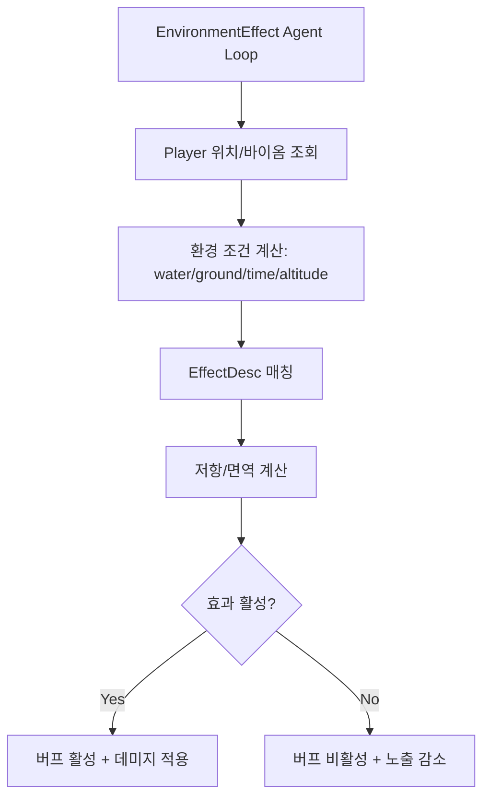

# Stitch 게임 Environment Debuffs & Status Effects 상세 설계

> **작성일**: 2026-02-01  
> **상태**: 설계 문서 (DESIGN/DETAIL)  
> **참고**: BitCraftPublicDoc/14, BitCraftServer 구현 (아이디어 참고용)  

---

## 1. 개요

Environment Debuff & Status Effects 시스템은 플레이어가 위치한 환경(바이옴, 수중/지상, 시간대, 고도 등)에 따라 **지속 피해/상태 효과**를 자동 적용하는 메커니즘이다. Stitch에서는 BitCraft의 구조를 참고하되, **밸런스 파라미터와 정적 데이터 중심**으로 확장 가능하게 설계한다.

### 1.1 설계 목표

| 목표 | 설명 |
|------|------|
| **데이터 주도** | CSV/정적 데이터로 효과를 정의하고 코드 변경 최소화 |
| **확장성** | 새로운 환경 효과/저항 타입 추가가 쉬운 구조 |
| **성능** | 온라인 플레이어만 처리, 바이옴 캐시 재사용 |
| **안정성** | 중복 타이머 방지, 버프 상태와 데미지 분리 |
| **일관성** | 기존 Buff/Health/CharacterStats 파이프라인과 통합 |

---

## 2. 시스템 아키텍처

### 2.1 구성 요소

- **EnvironmentEffect Agent**: 일정 주기로 환경 컨텍스트 평가 및 적용
- **Static Data**: 환경 효과 정의(EnvironmentEffectDesc)
- **Buff System**: 상태 효과 표시/아이콘/파라미터 적용
- **Health System**: 지속 피해 적용 및 사망 처리

### 2.2 기본 흐름



---

## 3. 데이터 모델

### 3.1 정적 데이터 테이블

#### 3.1.1 EnvironmentEffectDesc (신규)

```rust
#[spacetimedb::table(name = environment_effect_desc, public)]
pub struct EnvironmentEffectDesc {
    #[primary_key]
    pub id: i32,

    pub name: String,
    pub buff_id: i32,                 // 적용할 BuffDesc.id
    pub hazard_tag: HazardTag,        // Biome/Tile에서 매칭할 태그
    pub requires_water: bool,         // true면 수중에서만 활성
    pub requires_ground: bool,        // true면 지상에서만 활성
    pub min_altitude: i32,            // 고도 제한 (optional)
    pub max_altitude: i32,
    pub day_only: bool,               // 낮/밤 조건
    pub night_only: bool,

    pub damage_per_tick: f32,         // tick당 피해
    pub damage_type: DamageType,      // Fire/Cold/Toxic 등
    pub resistance_stat: StatType,    // 대응 저항 스탯
    pub resistance_threshold: i32,    // 저항 기준치

    pub exposure_per_tick: i32,       // 노출 누적량
    pub max_exposure: i32,            // 누적 최대
    pub exposure_decay_per_tick: i32, // 비활성 시 감소량

    pub tick_interval_millis: i32,    // 개별 효과 주기 (0이면 에이전트 주기 사용)
    pub priority: i32,                // 동일 카테고리 충돌 처리용
}
```

**설명**
- `hazard_tag`는 바이옴/타일에 부여된 위험 태그와 매칭한다.
- `buff_id`는 시각/효과 표현용이며, **데미지는 별도 파이프라인**에서 적용한다.
- `tick_interval_millis`는 특정 효과만 느리게/빠르게 적용하기 위한 옵션이다.

#### 3.1.2 HazardTag (신규 Enum)

```rust
pub enum HazardTag {
    Cold,
    Heat,
    Toxic,
    Radiation,
    Spore,
    Sandstorm,
    AcidRain,
}
```

### 3.2 런타임 상태 테이블

#### 3.2.1 EnvironmentEffectState (확장)

```rust
#[spacetimedb::table(name = environment_effect_state)]
pub struct EnvironmentEffectState {
    #[primary_key]
    pub entity_id: u64,    // player entity_id

    pub last_biome_id: u16,
    pub last_evaluated_at: u64,
    pub is_submerged: bool,
}
```

#### 3.2.2 EnvironmentEffectExposure (신규)

```rust
#[spacetimedb::table(name = environment_effect_exposure)]
pub struct EnvironmentEffectExposure {
    #[primary_key]
    #[auto_inc]
    pub exposure_id: u64,

    pub entity_id: u64,
    pub effect_id: i32,
    pub exposure: i32,
    pub last_tick_at: u64,
}
```

**인덱스 권장**
- `entity_id` 인덱스: 플레이어별 노출 조회
- `effect_id` 인덱스: 효과별 통계

---

## 4. 파라미터 설계 (Balance Params)

| 키 | 타입 | 기본값 | 설명 |
|----|------|--------|------|
| `agent.environment_effect_tick_millis` | i32 | 5000 | 에이전트 기본 주기 |
| `environment.damage_min_interval_millis` | i32 | 1000 | 피해 적용 최소 간격 |
| `environment.exposure_decay_multiplier` | f32 | 1.0 | 비활성 시 노출 감소 스케일 |
| `environment.exposure_gate_threshold` | i32 | 0 | 노출 누적 임계값(>0이면 누적형) |

---

## 5. 환경 효과 평가 알고리즘

### 5.1 처리 대상

- **온라인 플레이어**만 평가 (`session_state.is_online == true`)
- 플레이어 좌표는 `mobile_entity_state`에서 조회
- 바이옴/수중 여부는 `TerrainChunkCache` 사용

### 5.2 핵심 로직 (의사코드)

```rust
fn environment_effect_agent_loop(ctx) {
  require_server_or_admin(ctx);
  if !agents::should_run_agent(ctx, "environment_effect") { return; }

  let tick_millis = get_param("agent.environment_effect_tick_millis", 5000);
  let effects = load_environment_effect_desc(ctx);
  let mut terrain_cache = TerrainChunkCache::empty();

  for player in online_players(ctx) {
    let coord = get_player_coord(ctx, player.entity_id);
    let cell = terrain_cache.get_cell(ctx, coord);
    let biome_id = cell.biome_id();
    let is_submerged = cell.is_submerged();

    let context = build_environment_context(ctx, player.entity_id, biome_id, is_submerged);

    for effect in effects.iter() {
      if !matches_conditions(effect, &context) { deactivate_effect(ctx, player, effect); continue; }

      if is_resisted(ctx, player.entity_id, effect) { deactivate_effect(ctx, player, effect); continue; }

      activate_buff_if_needed(ctx, player, effect);
      apply_damage_if_due(ctx, player, effect, tick_millis);
      accumulate_exposure(ctx, player, effect);
    }

    decay_unmatched_exposures(ctx, player, &effects);
    upsert_environment_state(ctx, player, biome_id, is_submerged);
  }

  reschedule_timer(ctx, tick_millis);
}
```

### 5.3 조건 매칭 규칙

- `hazard_tag`가 **현재 바이옴의 위험 태그**에 포함되어야 함
- `requires_water`/`requires_ground` 조건 중 하나라도 불일치하면 비활성
- `day_only`/`night_only`는 `day_night_state` 기준으로 평가
- 고도 조건은 `min_altitude/max_altitude` 범위

### 5.4 저항 계산

```rust
fn is_resisted(ctx, entity_id, effect) -> bool {
  let stat = CharacterStatsState::get_entity_stat(ctx, entity_id, effect.resistance_stat);
  stat >= effect.resistance_threshold
}
```

**확장 규칙**
- 버프/장비 효과로 저항 값이 가산될 수 있음
- 특정 효과는 `immune_tag`로 완전 면역 가능

---

## 6. Buff/Health 통합

### 6.1 Buff 활성/비활성

- 활성 조건이 참이고 현재 버프가 없으면 `buff::activate`
- 활성 조건이 거짓인데 버프가 있다면 `buff::deactivate`
- **버프 활성 여부와 데미지 적용을 분리**하여 후속 확장(슬로우, 시야 감소 등)을 허용

### 6.2 데미지 적용

```rust
if effect_active && damage_due {
  let mut health = ctx.db.health_state().entity_id().find(&entity_id)?;
  health.add_health_delta(-effect.damage_per_tick, ctx.timestamp);
  update_health_and_check_death(ctx, &mut terrain_cache, health, entity_id, None);
}
```

---

## 7. 스태킹/충돌 규칙

### 7.1 버프 카테고리 기반 충돌

- 동일 카테고리의 효과는 `priority`가 높은 것만 활성
- `priority`가 동일하면 **가장 최근 조건 충족**을 우선

### 7.2 다중 피해 허용

- 서로 다른 `damage_type`은 동시 적용 가능
- 동일 `damage_type`은 최대 1개만 적용 (기본)

---

## 8. 성능 최적화

- `EnvironmentEffectDesc`는 **루프 시작 시 캐싱**
- `TerrainChunkCache` 재사용으로 바이옴 조회 비용 절감
- 노출 테이블은 `entity_id` 인덱스로 빠르게 조회
- `tick_interval_millis`가 큰 효과는 **스킵 가능**

---

## 9. 테이블/구현 변경 요약

### 신규 테이블

- `environment_effect_desc` (정적 데이터)
- `environment_effect_exposure` (노출 누적 상태)

### 확장/연동 테이블

- `environment_effect_state` (기존 설계 확장)
- `feature_flags`에 `environment_effect_enabled` 추가
- `balance_params`에 `agent.environment_effect_tick_millis`

---

## 10. 구현 체크리스트

- [ ] `EnvironmentEffectDesc` 정적 데이터 로딩
- [ ] `EnvironmentEffectExposure` 테이블 및 인덱스 추가
- [ ] `environment_effect_agent_loop` 구현
- [ ] `agents::init`에 타이머 등록
- [ ] `update_scheduled_timers_from_static_data`에 업데이트 추가
- [ ] 클라이언트 구독 필터 설계 (`environment_effect_state`, `active_buff_state`)

---

## 11. 참고 (아이디어 출처)

- `BitCraftPublicDoc/14-environment-debuffs-and-status-effects.md`
- `BitCraftPublic/BitCraftServer/packages/game/src/agents/environment_debuff_agent.rs`
- `BitCraftPublic/BitCraftServer/packages/game/src/game/entities/buff.rs`
