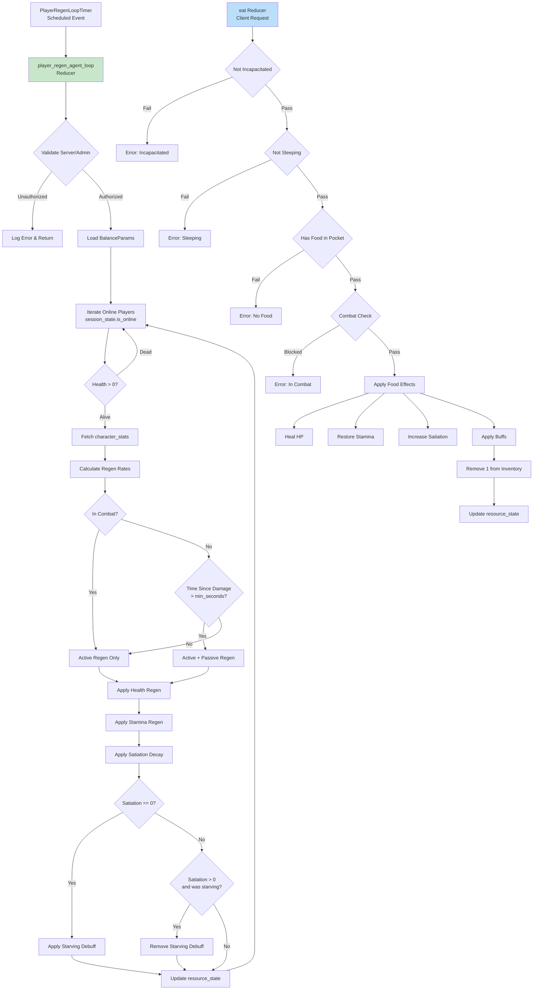

# Stitch 플레이어 재생/스태미나/포만감 시스템 상세 설계

> **작성일**: 2026-02-01  
> **상태**: DESIGN/DETAIL - 상세 구현 설계  
> **참고**: BitCraft 11-player-regeneration-and-stamina-systems.md, BitCraftServer 구현 소스  
> **범위**: PlayerRegenAgent, Health/Stamina/Satiation 상태 관리, 음식 소비 시스템

---

## 1. 개요

Stitch 게임의 플레이어 재생 시스템은 체력(HP), 스태미나, 포만감을 관리하는 핵심 자원 시스템이다. BitCraft의 이중 재생(Active + Passive) 메커니즘을 참고하되, Stitch의 실시간성과 간결성을 고려해 단순화한 구조를 적용한다.

### 1.1 핵심 특성

| 특성 | 설명 | BitCraft 대비 변경점 |
|------|------|---------------------|
| **이중 재생** | Active(항상) + Passive(지연/비전투) | 동일, 파라미터명 단순화 |
| **전투 영향** | 전투 중 패시브 재생 차단 | 동일 |
| **타임스탬프 추적** | 마지막 감소 시점 기록 | 동일 |
| **클램핑** | [0, Max] 범위 제한 | 동일 |
| **포만감** | 시간 경과 감소 + 음식 회복 | BitCraft와 유사 |
| **굶주림** | 포만감 0 시 디버프 부여 | BitCraft Starving 유사 |

### 1.2 시스템 구조



---

## 2. 테이블 설계

### 2.1 재생 에이전트 타이머

```rust
// agents/player_regen_agent.rs

use std::time::Duration;
use spacetimedb::{ReducerContext, Table, Timestamp};

/// PlayerRegen 에이전트 스케줄 타이머
#[spacetimedb::table(
    name = player_regen_loop_timer,
    scheduled(player_regen_agent_loop, at = scheduled_at)
)]
pub struct PlayerRegenLoopTimer {
    #[primary_key]
    #[auto_inc]
    pub scheduled_id: u64,
    pub scheduled_at: spacetimedb::ScheduleAt,
}
```

**설계 포인트:**
- `scheduled_id`: 0으로 고정 (단일 타이머)
- `scheduled_at`: 다음 실행 시간 (balance_params에서 주기 조회)

### 2.2 플레이어 자원 상태 (기존 확장)

```rust
// DESIGN/05-data-model-tables/resource_state.md 확장

#[spacetimedb::table(name = resource_state, public)]
pub struct ResourceState {
    #[primary_key]
    pub entity_id: u64,           // player_state.entity_id FK
    
    // 현재 자원량
    pub hp: u32,                  // 현재 체력 (0 ~ max_hp)
    pub stamina: u32,             // 현재 스태미나 (0 ~ max_stamina)
    pub satiation: u32,           // 현재 포만감 (0 ~ max_satiation)
    
    // 타임스탬프 (재생 쿨다운 계산용)
    pub last_damage_ts: u64,      // 마지막 피해 시점 (micros)
    pub last_stamina_use_ts: u64, // 마지막 스태미나 사용 시점 (micros)
    pub last_regen_ts: u64,       // 마지막 재생 적용 시점 (micros)
}
```

**필드 설명:**
| 필드 | 타입 | 설명 |
|------|------|------|
| `last_damage_ts` | u64 | 마지막 피해 시점 (passive health regen 쿨다운용) |
| `last_stamina_use_ts` | u64 | 마지막 스태미나 소모 시점 (passive stamina regen 쿨다운용) |
| `last_regen_ts` | u64 | 마지막 재생 처리 시점 (tick 간격 조절용) |

**인덱스:**
```rust
// resource_state.entity_id() - PK (기본)
// 추가 인덱스 불필요 (PK로 모든 조회 수행)
```

### 2.3 캐릭터 스탯 (재생 관련 필드)

```rust
// DESIGN/05-data-model-tables/character_stats.md 확장

#[spacetimedb::table(name = character_stats, public)]
pub struct CharacterStats {
    #[primary_key]
    pub entity_id: u64,
    
    // 기존 필드...
    
    // 재생 관련 스탯
    pub max_hp: u32,              // 최대 체력
    pub max_stamina: u32,         // 최대 스태미나
    pub max_satiation: u32,       // 최대 포만감
    
    pub active_hp_regen: f32,     // 액티브 체력 재생 (tick당)
    pub passive_hp_regen: f32,    // 패시브 체력 재생 (tick당, 비전투+쿨다운 후)
    pub active_stamina_regen: f32,// 액티브 스태미나 재생 (tick당)
    pub passive_stamina_regen: f32,// 패시브 스태미나 재생 (tick당, 쿨다운 후)
    pub satiation_decay: f32,     // 포만감 감소 (tick당)
}
```

### 2.4 굶주림 디버프 상태

```rust
// 새 테이블: starving_state

#[spacetimedb::table(name = starving_state, public)]
pub struct StarvingState {
    #[primary_key]
    pub entity_id: u64,           // player_state.entity_id
    pub started_at: u64,          // 굶주림 시작 시점
    pub buff_id: u32,             // 적용 중인 디버프 ID
}
```

**설계 포인트:**
- 포만감이 0이 되면 자동 생성
- 포만감이 0보다 커지면 자동 삭제
- `buff_state`와 연동하여 디버프 효과 적용

### 2.5 음식 정의 (정적 데이터)

```rust
// static_data/food_def.rs

#[spacetimedb::table(name = food_def, public)]
pub struct FoodDef {
    #[primary_key]
    pub food_id: u32,
    pub item_def_id: u32,         // item_def.id FK (어떤 아이템을 음식으로 사용)
    
    // 회복 효과
    pub hp_restore: i32,          // 체력 회복량 (음수=독성)
    pub hp_restore_up_to: u32,    // 회복 상한 (0=제한없음)
    pub stamina_restore: i32,     // 스태미나 회복량
    pub stamina_restore_up_to: u32,// 스태미나 회복 상한
    pub satiation_restore: u32,   // 포만감 회복량
    
    // 제약
    pub consumable_in_combat: bool,// 전투 중 사용 가능 여부
    
    // 버프 효과 (JSON 또는 별도 테이블)
    pub buff_ids: Vec<u32>,       // 부여할 버프 ID 목록
    pub buff_durations: Vec<u32>, // 버프 지속시간 (초)
}
```

---

## 3. 에이전트 구현

### 3.1 초기화

```rust
// agents/player_regen_agent.rs

use std::time::Duration;
use spacetimedb::{log, ReducerContext, Table, Timestamp};
use crate::{
    character_stats, combat_state, resource_state, session_state,
    starving_state, buff_state, feature_flags, balance_params,
    CharacterStats, ResourceState, SessionState, CombatState,
};

/// 에이전트 초기화 - 서버 시작 시 호출
pub fn init(ctx: &ReducerContext) {
    let tick_millis = get_regen_tick_millis(ctx);
    
    // 타이머가 없으면 생성 (try_insert로 중복 방지)
    let _ = ctx.db.player_regen_loop_timer().try_insert(
        PlayerRegenLoopTimer {
            scheduled_id: 0,
            scheduled_at: (ctx.timestamp + Duration::from_millis(tick_millis)).into(),
        }
    );
    
    log::info!("PlayerRegenAgent initialized with tick: {}ms", tick_millis);
}

/// 런타임 파라미터 업데이트
pub fn update_timer(ctx: &ReducerContext) {
    let tick_millis = get_regen_tick_millis(ctx);
    let mut count = 0;
    
    for mut timer in ctx.db.player_regen_loop_timer().iter() {
        count += 1;
        timer.scheduled_at = (ctx.timestamp + Duration::from_millis(tick_millis)).into();
        ctx.db.player_regen_loop_timer()
            .scheduled_id()
            .update(timer);
        log::info!("PlayerRegen timer updated: {}ms", tick_millis);
    }
    
    if count > 1 {
        log::error!("Multiple PlayerRegenLoopTimer detected: {}", count);
    }
}

fn get_regen_tick_millis(ctx: &ReducerContext) -> u64 {
    ctx.db.balance_params()
        .key()
        .find(&"agent.player_regen_tick_millis".to_string())
        .and_then(|p| p.value.parse().ok())
        .unwrap_or(1000) // 기본값: 1초
}
```

### 3.2 메인 루프

```rust
#[spacetimedb::reducer]
pub fn player_regen_agent_loop(
    ctx: &ReducerContext,
    _timer: PlayerRegenLoopTimer
) {
    // (1) 보안 검증
    if !validate_server_or_admin(ctx) {
        log::error!("Unauthorized access to player_regen_agent_loop");
        return;
    }
    
    // (2) 전역 활성화 확인
    if !is_agent_enabled(ctx) {
        return;
    }
    
    // (3) 파라미터 로드
    let params = load_regen_params(ctx);
    let now = ctx.timestamp.as_micros() as u64;
    
    // (4) 온라인 플레이어 순회
    for session in ctx.db.session_state().iter().filter(|s| s.is_online) {
        process_player_regen(ctx, session.entity_id, &params, now);
    }
    
    // (5) 다음 실행 예약
    reschedule_timer(ctx, &params);
}

fn process_player_regen(
    ctx: &ReducerContext,
    entity_id: u64,
    params: &RegenParams,
    now: u64
) {
    // resource_state 조회
    let Some(mut resource) = ctx.db.resource_state()
        .entity_id()
        .find(&entity_id) 
    else {
        return;
    };
    
    // 사망 상태 확인
    if resource.hp == 0 {
        return;
    }
    
    // character_stats 조회
    let Some(stats) = ctx.db.character_stats()
        .entity_id()
        .find(&entity_id)
    else {
        return;
    };
    
    // 전투 상태 확인
    let in_combat = ctx.db.combat_state()
        .entity_id()
        .find(&entity_id)
        .map(|c| c.in_combat)
        .unwrap_or(false);
    
    // === 체력 재생 ===
    let health_regen = calculate_health_regen(
        &stats, &resource, in_combat, params.min_seconds_to_passive_regen, now
    );
    
    if health_regen > 0.0 {
        let new_hp = ((resource.hp as f32 + health_regen) as u32)
            .min(stats.max_hp);
        if new_hp != resource.hp {
            resource.hp = new_hp;
        }
    }
    
    // === 스태미나 재생 ===
    let stamina_regen = calculate_stamina_regen(
        &stats, &resource, params.min_seconds_to_passive_regen, now
    );
    
    if stamina_regen > 0.0 {
        let new_stamina = ((resource.stamina as f32 + stamina_regen) as u32)
            .min(stats.max_stamina);
        if new_stamina != resource.stamina {
            resource.stamina = new_stamina;
        }
    }
    
    // === 포만감 감소 ===
    let satiation_decay = calculate_satiation_decay(&stats, &resource);
    
    if satiation_decay > 0 {
        let new_satiation = resource.satiation.saturating_sub(satiation_decay);
        
        // 굶주림 상태 전환 처리
        if resource.satiation > 0 && new_satiation == 0 {
            // 포만감이 0이 되면 굶주림 디버프 적용
            apply_starving_debuff(ctx, entity_id);
        } else if resource.satiation == 0 && new_satiation > 0 {
            // 포만감이 0에서 회복되면 디버프 해제
            remove_starving_debuff(ctx, entity_id);
        }
        
        resource.satiation = new_satiation;
    }
    
    // 타임스탬프 업데이트
    resource.last_regen_ts = now;
    
    // 저장
    ctx.db.resource_state().entity_id().update(resource);
}

fn calculate_health_regen(
    stats: &CharacterStats,
    resource: &ResourceState,
    in_combat: bool,
    min_seconds_to_passive: u64,
    now: u64
) -> f32 {
    let mut regen = stats.active_hp_regen;
    
    // 패시브 재생: 비전투 상태 + 충분한 시간 경과
    if !in_combat {
        let seconds_since_damage = (now - resource.last_damage_ts) / 1_000_000;
        if seconds_since_damage >= min_seconds_to_passive {
            regen += stats.passive_hp_regen;
        }
    }
    
    regen
}

fn calculate_stamina_regen(
    stats: &CharacterStats,
    resource: &ResourceState,
    min_seconds_to_passive: u64,
    now: u64
) -> f32 {
    let mut regen = stats.active_stamina_regen;
    
    // 패시브 재생: 충분한 시간 경과 (스태미나는 전투 여부와 무관)
    let seconds_since_use = (now - resource.last_stamina_use_ts) / 1_000_000;
    if seconds_since_use >= min_seconds_to_passive {
        regen += stats.passive_stamina_regen;
    }
    
    regen
}

fn calculate_satiation_decay(stats: &CharacterStats, _resource: &ResourceState) -> u32 {
    // tick당 포만감 감소량
    stats.satiation_decay as u32
}

fn apply_starving_debuff(ctx: &ReducerContext, entity_id: u64) {
    // starving_state 생성
    let _ = ctx.db.starving_state().try_insert(StarvingState {
        entity_id,
        started_at: ctx.timestamp.as_micros() as u64,
        buff_id: 1, // Starving 디버프 ID
    });
    
    // buff_state에 디버프 추가
    // (buff 시스템과 연동)
    log::info!("Player {} is now starving", entity_id);
}

fn remove_starving_debuff(ctx: &ReducerContext, entity_id: u64) {
    // starving_state 삭제
    ctx.db.starving_state().entity_id().delete(entity_id);
    
    // buff_state에서 디버프 제거
    log::info!("Player {} is no longer starving", entity_id);
}

fn reschedule_timer(ctx: &ReducerContext, params: &RegenParams) {
    let _ = ctx.db.player_regen_loop_timer().try_insert(
        PlayerRegenLoopTimer {
            scheduled_id: 0,
            scheduled_at: (ctx.timestamp + Duration::from_millis(params.tick_millis)).into(),
        }
    );
}

fn validate_server_or_admin(ctx: &ReducerContext) -> bool {
    // ServerIdentity 검증 로직
    // (auth 모듈에서 구현)
    true // TODO: 실제 검증 구현
}

fn is_agent_enabled(ctx: &ReducerContext) -> bool {
    ctx.db.feature_flags()
        .id()
        .find(&0)
        .map(|f| f.player_regen_enabled)
        .unwrap_or(true)
}
```

### 3.3 파라미터 구조

```rust
struct RegenParams {
    tick_millis: u64,
    min_seconds_to_passive_regen: u64,
}

fn load_regen_params(ctx: &ReducerContext) -> RegenParams {
    RegenParams {
        tick_millis: ctx.db.balance_params()
            .key()
            .find(&"agent.player_regen_tick_millis".to_string())
            .and_then(|p| p.value.parse().ok())
            .unwrap_or(1000),
        min_seconds_to_passive_regen: ctx.db.balance_params()
            .key()
            .find(&"player.min_seconds_to_passive_regen".to_string())
            .and_then(|p| p.value.parse().ok())
            .unwrap_or(10),
    }
}
```

---

## 4. 음식 소비 시스템

### 4.1 eat 리듀서

```rust
// handlers/player/eat.rs

use spacetimedb::{ReducerContext, Table};
use crate::{
    resource_state, inventory_container, inventory_slot, food_def,
    combat_state, buff_state, player_state,
    ResourceState, InventoryContainer, FoodDef,
};

#[spacetimedb::reducer]
pub fn eat(
    ctx: &ReducerContext,
    container_id: u64,
    slot_index: u32
) -> Result<(), String> {
    let caller = ctx.sender;
    
    // (1) 플레이어 엔티티 조회
    let player = ctx.db.player_state()
        .iter()
        .find(|p| p.identity == caller)
        .ok_or("Player not found")?;
    
    let entity_id = player.entity_id;
    
    // (2) 사망 상태 확인
    let resource = ctx.db.resource_state()
        .entity_id()
        .find(&entity_id)
        .ok_or("Resource state not found")?;
    
    if resource.hp == 0 {
        return Err("You are incapacitated.".to_string());
    }
    
    // (3) 수면 상태 확인
    if is_sleeping(ctx, entity_id) {
        return Err("You cannot eat while sleeping.".to_string());
    }
    
    // (4) 인벤토리 확인
    let container = ctx.db.inventory_container()
        .container_id()
        .find(&container_id)
        .ok_or("Container not found")?;
    
    if container.owner_entity_id != entity_id {
        return Err("Not your inventory.".to_string());
    }
    
    let slot = ctx.db.inventory_slot()
        .iter()
        .find(|s| s.container_id == container_id && s.slot_index == slot_index)
        .ok_or("Slot not found")?;
    
    let item_instance_id = slot.item_instance_id
        .ok_or("Nothing to eat")?;
    
    // (5) 아이템이 음식인지 확인
    let item_instance = ctx.db.item_instance()
        .item_instance_id()
        .find(&item_instance_id)
        .ok_or("Item not found")?;
    
    let food_def = ctx.db.food_def()
        .item_def_id()
        .find(&item_instance.item_def_id)
        .ok_or("Item cannot be eaten")?;
    
    // (6) 전투 중 사용 제한 확인
    if !food_def.consumable_in_combat {
        let in_combat = ctx.db.combat_state()
            .entity_id()
            .find(&entity_id)
            .map(|c| c.in_combat)
            .unwrap_or(false);
        
        if in_combat {
            return Err("Cannot eat this while in combat.".to_string());
        }
    }
    
    // (7) 효과 적용
    let stats = ctx.db.character_stats()
        .entity_id()
        .find(&entity_id)
        .ok_or("Character stats not found")?;
    
    let mut resource = resource;
    let mut updated = false;
    
    // 체력 회복
    if food_def.hp_restore != 0 {
        apply_hp_restore(&mut resource, &stats, &food_def)?;
        updated = true;
    }
    
    // 스태미나 회복
    if food_def.stamina_restore != 0 {
        apply_stamina_restore(&mut resource, &stats, &food_def)?;
        updated = true;
    }
    
    // 포만감 회복
    if food_def.satiation_restore > 0 {
        resource.satiation = (resource.satiation + food_def.satiation_restore)
            .min(stats.max_satiation);
        
        // 포만감이 0에서 회복되면 굶주림 디버프 해제
        if resource.satiation > 0 {
            remove_starving_debuff(ctx, entity_id);
        }
        updated = true;
    }
    
    // (8) 버프 적용
    for (i, buff_id) in food_def.buff_ids.iter().enumerate() {
        let duration = food_def.buff_durations.get(i).copied().unwrap_or(300);
        apply_food_buff(ctx, entity_id, *buff_id, duration)?;
    }
    
    // (9) 자원 상태 저장
    if updated {
        ctx.db.resource_state().entity_id().update(resource);
    }
    
    // (10) 아이템 소모
    consume_food_item(ctx, container_id, slot_index, item_instance_id)?;
    
    Ok(())
}

fn apply_hp_restore(
    resource: &mut ResourceState,
    stats: &CharacterStats,
    food: &FoodDef
) -> Result<(), String> {
    let hp_restore = food.hp_restore;
    
    if food.hp_restore_up_to == 0 {
        // 상한 없이 전체 범위에서 회복/피해
        let new_hp = if hp_restore > 0 {
            (resource.hp + hp_restore as u32).min(stats.max_hp)
        } else {
            resource.hp.saturating_sub((-hp_restore) as u32)
        };
        resource.hp = new_hp;
    } else if hp_restore > 0 {
        // 상한까지 회복 (예: 최대 50%까지만 회복)
        let max_restore = food.hp_restore_up_to.min(stats.max_hp);
        let new_hp = (resource.hp + hp_restore as u32).min(max_restore);
        resource.hp = new_hp;
    } else {
        // 상한까지 피해 (예: 최소 10%까지만 피해)
        let min_hp = food.hp_restore_up_to;
        let new_hp = resource.hp.saturating_sub((-hp_restore) as u32)
            .max(min_hp);
        resource.hp = new_hp;
    }
    
    // 피해를 받았으면 타임스탬프 업데이트 (재생 쿨다운 리셋)
    if hp_restore < 0 {
        resource.last_damage_ts = spacetimedb::Timestamp::now().as_micros() as u64;
    }
    
    Ok(())
}

fn apply_stamina_restore(
    resource: &mut ResourceState,
    stats: &CharacterStats,
    food: &FoodDef
) -> Result<(), String> {
    let stamina_restore = food.stamina_restore;
    
    if food.stamina_restore_up_to == 0 {
        // 상한 없음
        let new_stamina = if stamina_restore > 0 {
            (resource.stamina + stamina_restore as u32).min(stats.max_stamina)
        } else {
            resource.stamina.saturating_sub((-stamina_restore) as u32)
        };
        resource.stamina = new_stamina;
    } else if stamina_restore > 0 {
        // 상한까지 회복
        let max_restore = food.stamina_restore_up_to.min(stats.max_stamina);
        let new_stamina = (resource.stamina + stamina_restore as u32).min(max_restore);
        resource.stamina = new_stamina;
    } else {
        // 상한까지 소모
        let min_stamina = food.stamina_restore_up_to;
        let new_stamina = resource.stamina.saturating_sub((-stamina_restore) as u32)
            .max(min_stamina);
        resource.stamina = new_stamina;
    }
    
    // 스태미나 소모 시 타임스탬프 업데이트
    if stamina_restore < 0 {
        resource.last_stamina_use_ts = spacetimedb::Timestamp::now().as_micros() as u64;
    }
    
    Ok(())
}

fn apply_food_buff(
    ctx: &ReducerContext,
    entity_id: u64,
    buff_id: u32,
    duration_secs: u32
) -> Result<(), String> {
    // buff_state에 버프 추가
    // (buff 시스템과 연동)
    Ok(())
}

fn consume_food_item(
    ctx: &ReducerContext,
    container_id: u64,
    slot_index: u32,
    item_instance_id: u64
) -> Result<(), String> {
    // item_stack 수량 감소
    let mut stack = ctx.db.item_stack()
        .item_instance_id()
        .find(&item_instance_id)
        .ok_or("Item stack not found")?;
    
    if stack.quantity > 1 {
        stack.quantity -= 1;
        ctx.db.item_stack().item_instance_id().update(stack);
    } else {
        // 수량 0이면 아이템 삭제
        ctx.db.item_stack().item_instance_id().delete(item_instance_id);
        ctx.db.item_instance().item_instance_id().delete(item_instance_id);
        
        // 슬롯 비우기
        let mut slot = ctx.db.inventory_slot()
            .iter()
            .find(|s| s.container_id == container_id && s.slot_index == slot_index)
            .ok_or("Slot not found")?;
        slot.item_instance_id = None;
        // 복합키 업데이트 필요 (SpacetimeDB 방식에 따라 다름)
    }
    
    Ok(())
}

fn is_sleeping(ctx: &ReducerContext, entity_id: u64) -> bool {
    // action_state에서 수면 상태 확인
    ctx.db.action_state()
        .iter()
        .any(|a| a.entity_id == entity_id && a.action_type == "sleep")
}
```

---

## 5. 타임스탬프 관리

### 5.1 감소 시점 추적

```rust
// handlers/combat/apply_damage.rs

pub fn apply_damage(
    ctx: &ReducerContext,
    target_id: u64,
    damage: u32
) -> Result<(), String> {
    let Some(mut resource) = ctx.db.resource_state()
        .entity_id()
        .find(&target_id)
    else {
        return Err("Target not found".to_string());
    };
    
    // 체력 감소
    let new_hp = resource.hp.saturating_sub(damage);
    resource.hp = new_hp;
    
    // 마지막 피해 시점 기록 (패시브 재생 쿨다운용)
    resource.last_damage_ts = ctx.timestamp.as_micros() as u64;
    
    ctx.db.resource_state().entity_id().update(resource);
    
    // 사망 체크
    if new_hp == 0 {
        handle_death(ctx, target_id)?;
    }
    
    Ok(())
}

// handlers/player/consume_stamina.rs

pub fn consume_stamina(
    ctx: &ReducerContext,
    entity_id: u64,
    amount: u32
) -> Result<bool, String> {
    let Some(mut resource) = ctx.db.resource_state()
        .entity_id()
        .find(&entity_id)
    else {
        return Err("Resource state not found".to_string());
    };
    
    if resource.stamina < amount {
        return Ok(false); // 스태미나 부족
    }
    
    resource.stamina -= amount;
    
    // 마지막 사용 시점 기록 (패시브 재생 쿨다운용)
    resource.last_stamina_use_ts = ctx.timestamp.as_micros() as u64;
    
    ctx.db.resource_state().entity_id().update(resource);
    
    Ok(true)
}
```

---

## 6. 밸런스 파라미터

### 6.1 기본값

```rust
// balance_params 기본값 설정

pub fn init_default_regen_params(ctx: &ReducerContext) {
    let defaults = vec![
        // 에이전트 주기
        ("agent.player_regen_tick_millis", "1000"),
        
        // 패시브 재생 쿨다운
        ("player.min_seconds_to_passive_regen", "10"),
        
        // 초기 스탯 (레벨 1 기준)
        ("stats.level1.max_hp", "100"),
        ("stats.level1.max_stamina", "50"),
        ("stats.level1.max_satiation", "100"),
        ("stats.level1.active_hp_regen", "1.0"),      // 초당 1 HP
        ("stats.level1.passive_hp_regen", "5.0"),     // 초당 5 HP (비전투)
        ("stats.level1.active_stamina_regen", "2.0"), // 초당 2 ST
        ("stats.level1.passive_stamina_regen", "8.0"),// 초당 8 ST
        ("stats.level1.satiation_decay", "0.5"),      // 초당 0.5 감소
    ];
    
    for (key, value) in defaults {
        if ctx.db.balance_params().key().find(&key.to_string()).is_none() {
            ctx.db.balance_params().insert(BalanceParams {
                key: key.to_string(),
                value: value.to_string(),
                updated_at: ctx.timestamp.as_micros() as u64,
            });
        }
    }
}
```

### 6.2 파라미터 설명

| 파라미터 | 기본값 | 설명 |
|----------|--------|------|
| `agent.player_regen_tick_millis` | 1000 | 재생 에이전트 실행 주기 (ms) |
| `player.min_seconds_to_passive_regen` | 10 | 패시브 재생 활성화까지 필요한 시간 (초) |
| `stats.level1.max_hp` | 100 | 레벨 1 최대 체력 |
| `stats.level1.max_stamina` | 50 | 레벨 1 최대 스태미나 |
| `stats.level1.max_satiation` | 100 | 레벨 1 최대 포만감 |
| `stats.level1.active_hp_regen` | 1.0 | 틱당 액티브 체력 재생 (tick=1초) |
| `stats.level1.passive_hp_regen` | 5.0 | 틱당 패시브 체력 재생 |
| `stats.level1.active_stamina_regen` | 2.0 | 틱당 액티브 스태미나 재생 |
| `stats.level1.passive_stamina_regen` | 8.0 | 틱당 패시브 스태미나 재생 |
| `stats.level1.satiation_decay` | 0.5 | 틱당 포만감 감소 |

---

## 7. 뷰/RLS 정의

### 7.1 resource_state 뷰

```sql
-- PublicView: HP%만 공개
CREATE VIEW resource_state_publicview AS
SELECT 
    entity_id,
    CAST((hp * 100 / NULLIF(max_hp, 0)) AS INTEGER) as hp_percent
FROM resource_state
JOIN character_stats USING (entity_id);

-- PartyView: 파티 멤버는 상세 정보 공개
CREATE VIEW resource_state_partyview AS
SELECT r.entity_id, r.hp, r.stamina, r.satiation
FROM resource_state r
WHERE EXISTS (
    SELECT 1 FROM party_member pm
    WHERE pm.entity_id = r.entity_id
    AND pm.party_id IN (
        SELECT party_id FROM party_member 
        WHERE entity_id = :viewer_entity_id
    )
);

-- SelfView: 본인 전체 정보
CREATE VIEW resource_state_selfview AS
SELECT *
FROM resource_state
WHERE entity_id = :viewer_entity_id;
```

---

## 8. 구현 체크리스트

### Phase 1: 테이블
- [ ] `player_regen_loop_timer` scheduled 테이블
- [ ] `resource_state` - last_damage_ts, last_stamina_use_ts, last_regen_ts 추가
- [ ] `character_stats` - 재생 관련 스탯 필드 추가
- [ ] `starving_state` 새 테이블
- [ ] `food_def` 새 테이블

### Phase 2: 에이전트
- [ ] `player_regen_agent.rs` 모듈 생성
- [ ] `init()` 함수 구현
- [ ] `player_regen_agent_loop()` 리듀서 구현
- [ ] `update_timer()` 함수 구현
- [ ] 재생 계산 로직 구현
- [ ] 굶주림 디버프 처리 구현

### Phase 3: 핸들러
- [ ] `eat` 리듀서 구현
- [ ] 체력/스태미나 회복 로직 구현
- [ ] 아이템 소모 로직 구현
- [ ] 타임스탬프 업데이트 로직 (피해/소모 시)

### Phase 4: 통합
- [ ] `agents::init()`에서 호출 연결
- [ ] balance_params 기본값 설정
- [ ] feature_flags 플래그 추가
- [ ] 다른 시스템과의 타임스탬프 연동

### Phase 5: 테스트
- [ ] 재생 속도 테스트
- [ ] 패시브 재생 쿨다운 테스트
- [ ] 전투 중 재생 차단 테스트
- [ ] 음식 소비 테스트
- [ ] 굶주림 디버프 테스트

---

## 9. 참고 자료

### BitCraft 문서
- `11-player-regeneration-and-stamina-systems.md` - 재생 시스템 개요
- `14-environment-debuffs-and-status-effects.md` - 디버프 시스템
- `15-player-state-management.md` - 플레이어 상태 관리

### BitCraftServer 소스
- `agents/player_regen_agent.rs` - 재생 에이전트 구현
- `game/entities/health_state.rs` - 체력 상태 관리
- `game/entities/stamina_state.rs` - 스태미나 상태 관리
- `game/entities/satiation_state.rs` - 포만감 상태 관리
- `game/handlers/player/eat.rs` - 음식 소비 핸들러

### Stitch 설계
- `DESIGN/05-data-model-tables/resource_state.md`
- `DESIGN/05-data-model-tables/character_stats.md`
- `DESIGN/05-data-model-tables/buff_state.md`
- `DESIGN/DETAIL/agent-system-design.md`
