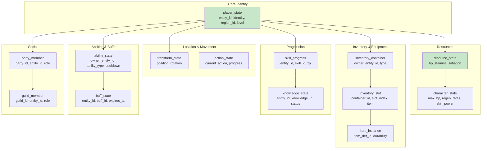
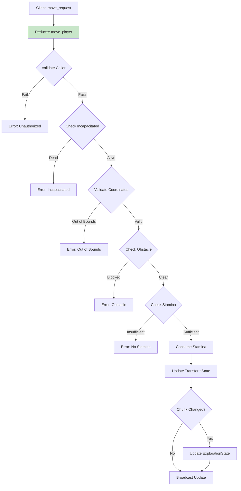

# Stitch 플레이어 상태 관리 시스템 상세 설계

> **작성일**: 2026-02-01  
> **상태**: DESIGN/DETAIL - 상세 구현 설계  
> **참고**: BitCraft 15-player-state-management.md, BitCraftServer 구현 소스  
> **범위**: PlayerState, 이동/탐험, 스탯 집계, 스킬/경험치, 능력/쿨다운

---

## 1. 개요

Stitch의 플레이어 상태 관리 시스템은 분산 컴포넌트 아키텍처를 채택한다. 각 플레이어 속성(위치, 체력, 인벤토리, 스탯 등)은 별도 테이블로 분리되어 효율적인 쿼리와 선택적 동기화를 가능하게 한다.

### 1.1 아키텍처 특성

| 특성 | 설명 | BitCraft 대비 변경점 |
|------|------|---------------------|
| **컴포넌트 분리** | 위치/체력/인벤토리/스탯 별도 테이블 | 동일 |
| **PK 통일** | 모든 테이블이 `entity_id` (u64) 사용 | 동일 |
| **스탯 집계** | 장비+버프+지식 소스에서 동적 계산 | 동일 |
| **이동 검증** | 경계 체크 + 충돌 + 스태미나 | 단순화 |
| **청크 기반** | 3x3 관심영역 스트리밍 | 동일 |
| **스킬 시스템** | 사용 기반 해금 + 멘토링 | Stitch 특화 |

### 1.2 컴포넌트 다이어그램



---

## 2. 테이블 설계

### 2.1 플레이어 기본 상태

```rust
// DESIGN/05-data-model-tables/player_state.md

#[spacetimedb::table(name = player_state, public)]
pub struct PlayerState {
    #[primary_key]
    pub entity_id: u64,           // entity_core에서 생성된 ID
    pub identity: Identity,       // SpacetimeDB Identity (인증)
    pub region_id: u64,           // 현재 region
    pub instance_id: Option<u64>, // 현재 instance (던전/인테리어 등)
    pub level: u32,               // 총합 레벨 (스킬 레벨 기반 계산)
    pub created_at: u64,          // 계정 생성 시점
    pub last_login: u64,          // 마지막 로그인
    pub last_logout: u64,         // 마지막 로그아웃
    pub play_time_seconds: u64,   // 누적 플레이 시간
    pub is_bot: bool,             // 봇 계정 플래그
}
```

**인덱스:**
```rust
#[index(name = idx_identity, fields = [identity])]
#[index(name = idx_region, fields = [region_id])]
```

### 2.2 변환 상태 (위치/이동)

```rust
// DESIGN/05-data-model-tables/transform_state.md

#[spacetimedb::table(name = transform_state, public)]
pub struct TransformState {
    #[primary_key]
    pub entity_id: u64,
    
    // 현재 위치
    pub hex_x: i32,               // 헥스 그리드 X
    pub hex_z: i32,               // 헥스 그리드 Z
    pub dimension: u16,           // 차원 ID (0=오버월드)
    
    // 목표 위치 (이동 중)
    pub dest_hex_x: i32,
    pub dest_hex_z: i32,
    pub is_moving: bool,
    
    // 회전/방향
    pub facing: u8,               // 0-5 (헥스 방향)
    
    // 메타데이터
    pub updated_at: u64,          // 마지막 업데이트 시점
}
```

**설계 포인트:**
- `hex_x`, `hex_z`는 헥스 그리드 좌표 (BitCraft의 FloatHexTile 단순화)
- `dimension`으로 다차원 지원 (오버월드, 던전, 인테리어 등)
- 이동 중이면 `is_moving=true`, `dest_*`에 목표 좌표 저장

### 2.3 행동 상태

```rust
// DESIGN/05-data-model-tables/action_state.md

#[spacetimedb::table(name = action_state, public)]
pub struct ActionState {
    #[primary_key]
    pub entity_id: u64,
    
    pub action_type: String,      // "move", "gather", "craft", "attack", "sleep", etc.
    pub action_layer: u8,         // 0=Base, 1=UpperBody (BitCraft 스타일)
    pub progress: f32,            // 0.0 ~ 1.0 진행률
    pub started_at: u64,          // 시작 시점
    pub estimated_end_at: u64,    // 예상 종료 시점
    pub cooldown_until: u64,      // 쿨다운 종료 시점
    pub is_interrupted: bool,     // 중단 가능 여부
}
```

### 2.4 탐험 상태

```rust
// DESIGN/05-data-model-tables/exploration_state.md (새 테이블)

#[spacetimedb::table(name = exploration_state)]
pub struct ExplorationState {
    #[primary_key]
    pub entity_id: u64,
    
    // 발견한 청크 목록 (압축 저장)
    pub explored_chunks: Vec<u64>, // chunk_index 목록
    
    // 발견한 관심 지점
    pub discovered_ruins: Vec<u64>,    // ruins_id 목록
    pub discovered_claims: Vec<u64>,   // claim_id 목록
    
    // 메타데이터
    pub last_explored_at: u64,
}
```

**설계 포인트:**
- `explored_chunks`는 비트마스크 또는 RLE로 압축 가능
- 클라이언트는 3x3 청크 단위로 스트리밍 요청

---

## 3. 이동 시스템

### 3.1 이동 검증 흐름



### 3.2 이동 리듀서

```rust
// handlers/player/move_player.rs

use spacetimedb::{ReducerContext, Table};
use crate::{
    player_state, transform_state, resource_state, exploration_state,
    character_stats, action_state, terrain_chunk,
};

#[spacetimedb::reducer]
pub fn move_player(
    ctx: &ReducerContext,
    target_hex_x: i32,
    target_hex_z: i32,
    is_running: bool,
) -> Result<(), String> {
    let caller = ctx.sender;
    
    // (1) 플레이어 조회
    let player = ctx.db.player_state()
        .iter()
        .find(|p| p.identity == caller)
        .ok_or("Player not found")?;
    
    let entity_id = player.entity_id;
    
    // (2) 현재 위치 조회
    let mut transform = ctx.db.transform_state()
        .entity_id()
        .find(&entity_id)
        .ok_or("Transform not found")?;
    
    // (3) 사망 상태 확인
    let resource = ctx.db.resource_state()
        .entity_id()
        .find(&entity_id)
        .ok_or("Resource state not found")?;
    
    if resource.hp == 0 {
        return Err("You are incapacitated.".to_string());
    }
    
    // (4) 현재 행동 확인
    if is_action_blocking_move(ctx, entity_id) {
        return Err("Cannot move while performing this action.".to_string());
    }
    
    // (5) 좌표 유효성 검사
    if !is_valid_coordinate(target_hex_x, target_hex_z) {
        return Err("Invalid coordinates.".to_string());
    }
    
    // (6) 경계 체크
    let region = ctx.db.region_state()
        .region_id()
        .find(&player.region_id)
        .ok_or("Region not found")?;
    
    if target_hex_x < region.min_x || target_hex_x > region.max_x ||
       target_hex_z < region.min_z || target_hex_z > region.max_z {
        return Err("Target is outside world bounds.".to_string());
    }
    
    // (7) 장애물 체크
    if is_tile_blocked(ctx, target_hex_x, target_hex_z, transform.dimension) {
        return Err("Target tile is blocked.".to_string());
    }
    
    // (8) 스태미나 계산
    let move_cost = calculate_move_cost(ctx, entity_id, is_running)?;
    
    if resource.stamina < move_cost {
        return Err("Not enough stamina.".to_string());
    }
    
    // (9) 스태미나 소모
    let mut resource = resource;
    resource.stamina -= move_cost;
    resource.last_stamina_use_ts = ctx.timestamp.as_micros() as u64;
    ctx.db.resource_state().entity_id().update(resource);
    
    // (10) 위치 업데이트
    let old_chunk = get_chunk_index(transform.hex_x, transform.hex_z);
    let new_chunk = get_chunk_index(target_hex_x, target_hex_z);
    
    transform.hex_x = target_hex_x;
    transform.hex_z = target_hex_z;
    transform.updated_at = ctx.timestamp.as_micros() as u64;
    transform.is_moving = false;
    
    ctx.db.transform_state().entity_id().update(transform);
    
    // (11) 청크 변경 시 탐험 업데이트
    if old_chunk != new_chunk {
        update_exploration(ctx, entity_id, new_chunk)?;
    }
    
    // (12) 클레임/구조물 발견
    check_discovery(ctx, entity_id, target_hex_x, target_hex_z)?;
    
    Ok(())
}

fn is_valid_coordinate(x: i32, z: i32) -> bool {
    // 최소값 1 (BitCraft의 0,0 floating point 이슈 회피)
    x >= 1 && z >= 1
}

fn get_chunk_index(hex_x: i32, hex_z: i32) -> u64 {
    // 청크 크기 32x32 기준
    let chunk_x = (hex_x - 1) / 32;
    let chunk_z = (hex_z - 1) / 32;
    ((chunk_z as u64) << 32) | (chunk_x as u64)
}

fn is_tile_blocked(
    ctx: &ReducerContext,
    hex_x: i32,
    hex_z: i32,
    dimension: u16
) -> bool {
    // terrain_chunk에서 타일 정보 조회
    if let Some(chunk) = get_chunk_for_tile(ctx, hex_x, hex_z, dimension) {
        // 타일 타입이 Walkable인지 확인
        let tile_type = get_tile_type(&chunk, hex_x, hex_z);
        return !is_walkable(tile_type);
    }
    false
}

fn calculate_move_cost(
    ctx: &ReducerContext,
    entity_id: u64,
    is_running: bool
) -> Result<u32, String> {
    let stats = ctx.db.character_stats()
        .entity_id()
        .find(&entity_id)
        .ok_or("Character stats not found")?;
    
    // 기본 이동 비용
    let base_cost = if is_running { 2 } else { 1 };
    
    // 버프/디버프 적용
    let mut cost = base_cost;
    
    // buff_state에서 이동 비용 수정자 조회
    for buff in ctx.db.buff_state().iter().filter(|b| b.entity_id == entity_id) {
        if buff.buff_id == 1 { // starving debuff
            cost += 1; // 굶주림 시 이동 비용 증가
        }
    }
    
    Ok(cost)
}

fn is_action_blocking_move(ctx: &ReducerContext, entity_id: u64) -> bool {
    ctx.db.action_state()
        .iter()
        .filter(|a| a.entity_id == entity_id)
        .any(|a| {
            matches!(a.action_type.as_str(), 
                "sleep" | "craft" | "gather" | "climb" | "use_elevator")
        })
}

fn update_exploration(
    ctx: &ReducerContext,
    entity_id: u64,
    new_chunk: u64
) -> Result<(), String> {
    let Some(mut exploration) = ctx.db.exploration_state()
        .entity_id()
        .find(&entity_id)
    else {
        // 최초 탐험 상태 생성
        ctx.db.exploration_state().insert(ExplorationState {
            entity_id,
            explored_chunks: vec![new_chunk],
            discovered_ruins: vec![],
            discovered_claims: vec![],
            last_explored_at: ctx.timestamp.as_micros() as u64,
        });
        return Ok(());
    };
    
    // 중복 체크 후 추가
    if !exploration.explored_chunks.contains(&new_chunk) {
        exploration.explored_chunks.push(new_chunk);
        exploration.last_explored_at = ctx.timestamp.as_micros() as u64;
        ctx.db.exploration_state().entity_id().update(exploration);
    }
    
    Ok(())
}

fn check_discovery(
    ctx: &ReducerContext,
    entity_id: u64,
    hex_x: i32,
    hex_z: i32
) -> Result<(), String> {
    // 청크 내 ruins 발견
    // 청크 내 claim 발견
    // (discovery 시스템과 연동)
    Ok(())
}
```

---

## 4. 스탯 집계 시스템

### 4.1 스탯 소스

```mermaid
flowchart LR
    A[Base Stats<br/>character_stats] --> E[Final Stats]
    B[Equipment<br/>equipment_state] --> E
    C[Active Buffs<br/>buff_state] --> E
    D[Knowledge<br/>knowledge_state] --> E
    
    E --> F[Stats Calculation]
    F --> G[Flat Bonuses]
    F --> H[Percent Bonuses]
    G --> I[(Base + Flat) * (1 + Pct)]
    H --> I
    I --> J[Clamp to Min/Max]
    
    style E fill:#c8e6c9
```

### 4.2 스탯 집계 구현

```rust
// entities/player_state.rs - PlayerState impl

use std::collections::HashMap;
use spacetimedb::{ReducerContext, Table};
use crate::{
    player_state, character_stats, equipment_state, buff_state, knowledge_state,
    item_instance, item_def,
};

impl PlayerState {
    /// 스탯 집계 및 계산
    pub fn collect_stats(ctx: &ReducerContext, entity_id: u64) -> Result<CharacterStats, String> {
        let base_stats = ctx.db.character_stats()
            .entity_id()
            .find(&entity_id)
            .ok_or("Character stats not found")?;
        
        let mut flat_bonuses: HashMap<StatType, f32> = HashMap::new();
        let mut pct_bonuses: HashMap<StatType, f32> = HashMap::new();
        
        // (1) 장비 스탯 수집
        collect_equipment_stats(ctx, entity_id, &mut flat_bonuses, &mut pct_bonuses)?;
        
        // (2) 버프 스탯 수집
        collect_buff_stats(ctx, entity_id, &mut flat_bonuses, &mut pct_bonuses)?;
        
        // (3) 지식 스탯 수집
        collect_knowledge_stats(ctx, entity_id, &mut flat_bonuses, &mut pct_bonuses)?;
        
        // (4) 최종 스탯 계산
        let mut final_stats = base_stats.clone();
        
        for (stat_type, flat) in flat_bonuses {
            let current = get_stat_value(&final_stats, stat_type);
            let pct = pct_bonuses.get(&stat_type).copied().unwrap_or(0.0);
            let new_value = (current + flat) * (1.0 + pct);
            
            // Clamp to min/max
            let clamped = clamp_stat(stat_type, new_value);
            set_stat_value(&mut final_stats, stat_type, clamped);
        }
        
        // 변경사항 저장
        if !stats_equal(&base_stats, &final_stats) {
            ctx.db.character_stats().entity_id().update(final_stats.clone());
        }
        
        Ok(final_stats)
    }
    
    /// 특정 스킬 레벨 조회
    pub fn get_skill_level(ctx: &ReducerContext, entity_id: u64, skill_id: u32) -> u32 {
        let progress = ctx.db.skill_progress()
            .iter()
            .find(|sp| sp.entity_id == entity_id && sp.skill_id == skill_id);
        
        match progress {
            Some(sp) => calculate_level_from_xp(sp.xp),
            None => 0,
        }
    }
    
    /// 최고 스킬 레벨 조회 (ANY_SKILL 용)
    pub fn get_max_skill_level(ctx: &ReducerContext, entity_id: u64) -> u32 {
        ctx.db.skill_progress()
            .iter()
            .filter(|sp| sp.entity_id == entity_id)
            .map(|sp| calculate_level_from_xp(sp.xp))
            .max()
            .unwrap_or(0)
    }
    
    /// 레벨 요구사항 충족 확인
    pub fn meets_level_requirement(
        ctx: &ReducerContext,
        entity_id: u64,
        skill_id: u32,
        required_level: u32
    ) -> bool {
        let player_level = if skill_id == 0 { // 0 = ANY_SKILL
            Self::get_max_skill_level(ctx, entity_id)
        } else {
            Self::get_skill_level(ctx, entity_id, skill_id)
        };
        
        player_level >= required_level
    }
}

fn collect_equipment_stats(
    ctx: &ReducerContext,
    entity_id: u64,
    flat: &mut HashMap<StatType, f32>,
    pct: &mut HashMap<StatType, f32>,
) -> Result<(), String> {
    // equipment_state에서 장착 아이템 조회
    let equipment = ctx.db.equipment_state()
        .iter()
        .filter(|e| e.entity_id == entity_id);
    
    for slot in equipment {
        let Some(item_instance_id) = slot.item_instance_id else {
            continue;
        };
        
        let item = ctx.db.item_instance()
            .item_instance_id()
            .find(&item_instance_id)
            .ok_or("Item not found")?;
        
        let item_def = ctx.db.item_def()
            .item_def_id()
            .find(&item.item_def_id)
            .ok_or("Item def not found")?;
        
        // item_def에서 스탯 보너스 추출
        for stat_bonus in &item_def.stat_bonuses {
            if stat_bonus.is_percentage {
                *pct.entry(stat_bonus.stat_type).or_insert(0.0) += stat_bonus.value;
            } else {
                *flat.entry(stat_bonus.stat_type).or_insert(0.0) += stat_bonus.value;
            }
        }
    }
    
    Ok(())
}

fn collect_buff_stats(
    ctx: &ReducerContext,
    entity_id: u64,
    flat: &mut HashMap<StatType, f32>,
    pct: &mut HashMap<StatType, f32>,
) {
    let now = ctx.timestamp.as_micros() as u64;
    
    // 활성 버프 조회 (만료되지 않은)
    for buff in ctx.db.buff_state()
        .iter()
        .filter(|b| b.entity_id == entity_id && b.expires_at > now) 
    {
        let buff_def = ctx.db.buff_def()
            .buff_id()
            .find(&buff.buff_id);
        
        let Some(def) = buff_def else { continue };
        
        for stat_mod in &def.stat_modifiers {
            if stat_mod.is_percentage {
                *pct.entry(stat_mod.stat_type).or_insert(0.0) += stat_mod.value;
            } else {
                *flat.entry(stat_mod.stat_type).or_insert(0.0) += stat_mod.value;
            }
        }
    }
}

fn collect_knowledge_stats(
    ctx: &ReducerContext,
    entity_id: u64,
    flat: &mut HashMap<StatType, f32>,
    pct: &mut HashMap<StatType, f32>,
) {
    // 습득한 지식 조회
    for knowledge in ctx.db.knowledge_state()
        .iter()
        .filter(|k| k.entity_id == entity_id && k.status == "acquired")
    {
        let knowledge_def = ctx.db.knowledge_def()
            .knowledge_id()
            .find(&knowledge.knowledge_id);
        
        let Some(def) = knowledge_def else { continue };
        
        for stat_bonus in &def.stat_bonuses {
            if stat_bonus.is_percentage {
                *pct.entry(stat_bonus.stat_type).or_insert(0.0) += stat_bonus.value;
            } else {
                *flat.entry(stat_bonus.stat_type).or_insert(0.0) += stat_bonus.value;
            }
        }
    }
}

#[derive(Clone, Copy, PartialEq, Eq, Hash)]
enum StatType {
    MaxHp,
    MaxStamina,
    MaxSatiation,
    HpRegen,
    StaminaRegen,
    AttackPower,
    Defense,
    MoveSpeed,
    // ... etc
}

fn get_stat_value(stats: &CharacterStats, stat_type: StatType) -> f32 {
    match stat_type {
        StatType::MaxHp => stats.max_hp as f32,
        StatType::MaxStamina => stats.max_stamina as f32,
        StatType::MaxSatiation => stats.max_satiation as f32,
        StatType::HpRegen => stats.active_hp_regen,
        StatType::StaminaRegen => stats.active_stamina_regen,
        _ => 0.0,
    }
}

fn set_stat_value(stats: &mut CharacterStats, stat_type: StatType, value: f32) {
    match stat_type {
        StatType::MaxHp => stats.max_hp = value as u32,
        StatType::MaxStamina => stats.max_stamina = value as u32,
        StatType::MaxSatiation => stats.max_satiation = value as u32,
        StatType::HpRegen => stats.active_hp_regen = value,
        StatType::StaminaRegen => stats.active_stamina_regen = value,
        _ => {}
    }
}

fn clamp_stat(stat_type: StatType, value: f32) -> f32 {
    let (min, max) = match stat_type {
        StatType::MaxHp => (1.0, 10000.0),
        StatType::MaxStamina => (1.0, 5000.0),
        StatType::HpRegen => (0.0, 100.0),
        StatType::StaminaRegen => (0.0, 100.0),
        _ => (0.0, 999999.0),
    };
    
    value.clamp(min, max)
}

fn stats_equal(a: &CharacterStats, b: &CharacterStats) -> bool {
    a.max_hp == b.max_hp &&
    a.max_stamina == b.max_stamina &&
    a.active_hp_regen == b.active_hp_regen &&
    a.passive_hp_regen == b.passive_hp_regen
}

fn calculate_level_from_xp(xp: u64) -> u32 {
    // XP 곡선: 레벨^2 * 100
    // 예: Lv1=100, Lv2=400, Lv3=900, Lv4=1600, Lv5=2500
    let level = ((xp as f64) / 100.0).sqrt() as u32;
    level.max(1)
}
```

---

## 5. 스킬/경험치 시스템

### 5.1 스킬 테이블

```rust
// DESIGN/05-data-model-tables/skill_progress.md

#[spacetimedb::table(name = skill_progress)]
pub struct SkillProgress {
    #[primary_key]
    pub entity_id: u64,
    #[primary_key]
    pub skill_id: u32,
    
    pub xp: u64,                  // 누적 경험치
    pub xp_partial: f32,          // 소수점 경험치
    pub last_gained_at: u64,      // 마지막 획득 시점
}

// 스킬 정의 (정적 데이터)
#[spacetimedb::table(name = skill_def, public)]
pub struct SkillDef {
    #[primary_key]
    pub skill_id: u32,
    pub name: String,
    pub category: String,         // "combat", "crafting", "gathering", "social"
    pub description: String,
    pub max_level: u32,
    pub xp_curve_type: u8,        // 0=linear, 1=exponential, 2=diminishing
}
```

### 5.2 경험치 획득

```rust
// handlers/skill/add_skill_xp.rs

#[spacetimedb::reducer]
pub fn add_skill_xp(
    ctx: &ReducerContext,
    skill_id: u32,
    amount: f32,
) -> Result<(), String> {
    let caller = ctx.sender;
    
    // 플레이어 조회
    let player = ctx.db.player_state()
        .iter()
        .find(|p| p.identity == caller)
        .ok_or("Player not found")?;
    
    let entity_id = player.entity_id;
    
    // 스킬 존재 확인
    let skill_def = ctx.db.skill_def()
        .skill_id()
        .find(&skill_id)
        .ok_or("Skill not found")?;
    
    // 현재 진행 조회 또는 생성
    let mut progress = ctx.db.skill_progress()
        .iter()
        .find(|sp| sp.entity_id == entity_id && sp.skill_id == skill_id)
        .unwrap_or_else(|| {
            let new_progress = SkillProgress {
                entity_id,
                skill_id,
                xp: 0,
                xp_partial: 0.0,
                last_gained_at: 0,
            };
            ctx.db.skill_progress().insert(new_progress.clone());
            new_progress
        });
    
    // XP 추가 (소수점 포함)
    let total_xp = progress.xp as f64 + progress.xp_partial as f64 + amount as f64;
    progress.xp = total_xp as u64;
    progress.xp_partial = (total_xp - progress.xp as f64) as f32;
    progress.last_gained_at = ctx.timestamp.as_micros() as u64;
    
    // 최대 레벨 체크
    let current_level = calculate_level_from_xp(progress.xp);
    if current_level > skill_def.max_level {
        progress.xp = calculate_xp_for_level(skill_def.max_level);
        progress.xp_partial = 0.0;
    }
    
    // 레벨업 체크 및 처리
    let old_level = calculate_level_from_xp(progress.xp - amount as u64);
    if current_level > old_level {
        handle_level_up(ctx, entity_id, skill_id, current_level)?;
    }
    
    ctx.db.skill_progress().update(progress);
    
    Ok(())
}

fn handle_level_up(
    ctx: &ReducerContext,
    entity_id: u64,
    skill_id: u32,
    new_level: u32
) -> Result<(), String> {
    log::info!("Player {} skill {} leveled up to {}", entity_id, skill_id, new_level);
    
    // 스탯 재집계 (새 레벨에 따른 스탯 증가)
    PlayerState::collect_stats(ctx, entity_id)?;
    
    // 새로운 능력 해금
    unlock_abilities_for_level(ctx, entity_id, skill_id, new_level)?;
    
    // 업적/퀘스트 알림
    // (achievement/quest 시스템과 연동)
    
    Ok(())
}

fn calculate_xp_for_level(level: u32) -> u64 {
    (level as u64).pow(2) * 100
}

fn unlock_abilities_for_level(
    ctx: &ReducerContext,
    entity_id: u64,
    skill_id: u32,
    level: u32
) -> Result<(), String> {
    // 해당 레벨에서 해금되는 능력 조회
    let unlocks = ctx.db.ability_unlock_def()
        .iter()
        .filter(|u| u.skill_id == skill_id && u.required_level == level);
    
    for unlock in unlocks {
        // ability_state에 추가
        let ability = AbilityState {
            entity_id: ctx.db.ability_state().next_id(),
            owner_entity_id: entity_id,
            ability_type: unlock.ability_type.clone(),
            cooldown_until: 0,
            use_count: 0,
        };
        
        ctx.db.ability_state().insert(ability);
    }
    
    Ok(())
}
```

---

## 6. 능력/쿨다운 시스템

### 6.1 능력 테이블

```rust
// DESIGN/05-data-model-tables/ability_state.md

#[spacetimedb::table(name = ability_state, public)]
pub struct AbilityState {
    #[primary_key]
    pub entity_id: u64,           // 능력 고유 ID
    
    pub owner_entity_id: u64,     // 소유 플레이어
    pub ability_type: String,     // "attack", "heal", "buff", "craft", etc.
    pub ability_def_id: u32,      // ability_def 참조
    
    // 쿨다운
    pub cooldown_until: u64,      // 쿨다운 종료 시점 (micros)
    pub use_count: u32,           // 사용 횟수 (통계용)
    
    // 위치 정보 (UI용)
    pub toolbar_slot: Option<u8>, // 툴바 슬롯 (0-9)
}

// 능력 정의 (정적 데이터)
#[spacetimedb::table(name = ability_def, public)]
pub struct AbilityDef {
    #[primary_key]
    pub ability_def_id: u32,
    pub ability_type: String,
    pub name: String,
    pub description: String,
    pub base_cooldown_secs: u32,
    pub required_skill_id: Option<u32>,
    pub required_skill_level: u32,
    pub required_weapon_type: Option<String>,
    pub stamina_cost: u32,
    pub hp_cost: u32,
}
```

### 6.2 능력 사용

```rust
// handlers/ability/use_ability.rs

#[spacetimedb::reducer]
pub fn use_ability(
    ctx: &ReducerContext,
    ability_entity_id: u64,
    target_entity_id: Option<u64>,
) -> Result<(), String> {
    let caller = ctx.sender;
    let now = ctx.timestamp.as_micros() as u64;
    
    // (1) 능력 조회
    let mut ability = ctx.db.ability_state()
        .entity_id()
        .find(&ability_entity_id)
        .ok_or("Ability not found")?;
    
    // (2) 소유권 확인
    let player = ctx.db.player_state()
        .iter()
        .find(|p| p.identity == caller)
        .ok_or("Player not found")?;
    
    if ability.owner_entity_id != player.entity_id {
        return Err("Not your ability".to_string());
    }
    
    // (3) 쿨다운 확인
    if ability.cooldown_until > now {
        let remaining = (ability.cooldown_until - now) / 1_000_000;
        return Err(format!("Cooldown: {} seconds remaining", remaining));
    }
    
    // (4) 능력 정의 조회
    let ability_def = ctx.db.ability_def()
        .ability_def_id()
        .find(&ability.ability_def_id)
        .ok_or("Ability definition not found")?;
    
    // (5) 자원 확인 (체력/스태미나)
    let mut resource = ctx.db.resource_state()
        .entity_id()
        .find(&player.entity_id)
        .ok_or("Resource state not found")?;
    
    if resource.stamina < ability_def.stamina_cost {
        return Err("Not enough stamina".to_string());
    }
    
    if resource.hp <= ability_def.hp_cost {
        return Err("Not enough health".to_string());
    }
    
    // (6) 자원 소모
    resource.stamina -= ability_def.stamina_cost;
    resource.hp -= ability_def.hp_cost;
    ctx.db.resource_state().entity_id().update(resource);
    
    // (7) 쿨다운 설정
    let cooldown_micros = (ability_def.base_cooldown_secs as u64) * 1_000_000;
    
    // 캐릭터 스탯에서 쿨다운 감소율 적용
    let stats = ctx.db.character_stats()
        .entity_id()
        .find(&player.entity_id)
        .unwrap_or_default();
    
    let cooldown_reduction = stats.cooldown_reduction; // 0.0 ~ 0.5
    let final_cooldown = (cooldown_micros as f64 * (1.0 - cooldown_reduction as f64)) as u64;
    
    ability.cooldown_until = now + final_cooldown;
    ability.use_count += 1;
    ctx.db.ability_state().entity_id().update(ability);
    
    // (8) 능력 효과 실행
    execute_ability_effect(ctx, &ability_def, player.entity_id, target_entity_id)?;
    
    Ok(())
}

fn execute_ability_effect(
    ctx: &ReducerContext,
    ability_def: &AbilityDef,
    caster_id: u64,
    target_id: Option<u64>,
) -> Result<(), String> {
    match ability_def.ability_type.as_str() {
        "attack" => execute_attack(ctx, caster_id, target_id, ability_def),
        "heal" => execute_heal(ctx, caster_id, target_id, ability_def),
        "buff" => execute_buff(ctx, caster_id, target_id, ability_def),
        "craft" => execute_craft(ctx, caster_id, ability_def),
        _ => Err("Unknown ability type".to_string()),
    }
}
```

### 6.3 장비 변경 시 능력 업데이트

```rust
// handlers/inventory/on_equip_changed.rs

pub fn on_equip_changed(
    ctx: &ReducerContext,
    entity_id: u64,
    slot: String,
    old_item: Option<u64>,
    new_item: Option<u64>,
) -> Result<(), String> {
    // 무기 슬롯 변경 시에만 처리
    if slot != "weapon" {
        return Ok(());
    }
    
    let old_weapon_type = old_item.and_then(|id| get_weapon_type(ctx, id));
    let new_weapon_type = new_item.and_then(|id| get_weapon_type(ctx, id));
    
    // 무기 타입이 변경되면 관련 능력 재설정
    if old_weapon_type != new_weapon_type {
        reset_weapon_abilities(ctx, entity_id, new_weapon_type)?;
    }
    
    // 스탯 재집계
    PlayerState::collect_stats(ctx, entity_id)?;
    
    Ok(())
}

fn reset_weapon_abilities(
    ctx: &ReducerContext,
    entity_id: u64,
    weapon_type: Option<String>,
) -> Result<(), String> {
    // 기존 무기 능력 제거
    let existing_weapon_abilities: Vec<_> = ctx.db.ability_state()
        .iter()
        .filter(|a| {
            a.owner_entity_id == entity_id && 
            a.ability_type == "weapon_skill"
        })
        .collect();
    
    for ability in existing_weapon_abilities {
        ctx.db.ability_state().entity_id().delete(ability.entity_id);
    }
    
    // 새 무기 능력 추가
    if let Some(weapon_type) = weapon_type {
        let weapon_abilities = ctx.db.ability_def()
            .iter()
            .filter(|d| d.required_weapon_type.as_ref() == Some(&weapon_type))
            .filter(|d| d.required_skill_level == 1); // 기본 능력만
        
        for def in weapon_abilities {
            let ability = AbilityState {
                entity_id: ctx.db.ability_state().next_id(),
                owner_entity_id: entity_id,
                ability_type: "weapon_skill".to_string(),
                ability_def_id: def.ability_def_id,
                cooldown_until: 0,
                use_count: 0,
                toolbar_slot: None,
            };
            
            ctx.db.ability_state().insert(ability);
        }
    }
    
    Ok(())
}
```

---

## 7. 뷰/RLS 정의

### 7.1 player_state 뷰

```sql
-- PublicView: 기본 정보만 공개
CREATE VIEW player_state_publicview AS
SELECT 
    entity_id,
    region_id,
    level
FROM player_state;

-- PartyView: 파티 멤버 추가 정보
CREATE VIEW player_state_partyview AS
SELECT 
    p.entity_id,
    p.region_id,
    p.level,
    p.last_login
FROM player_state p
WHERE EXISTS (
    SELECT 1 FROM party_member pm
    WHERE pm.entity_id = p.entity_id
    AND pm.party_id IN (
        SELECT party_id FROM party_member 
        WHERE entity_id = :viewer_entity_id
    )
);

-- GuildView: 길드 멤버 정보
CREATE VIEW player_state_guildview AS
SELECT 
    p.entity_id,
    p.region_id,
    p.level
FROM player_state p
WHERE EXISTS (
    SELECT 1 FROM guild_member gm
    WHERE gm.entity_id = p.entity_id
    AND gm.guild_id IN (
        SELECT guild_id FROM guild_member 
        WHERE entity_id = :viewer_entity_id
    )
);

-- SelfView: 본인 전체
CREATE VIEW player_state_selfview AS
SELECT *
FROM player_state
WHERE identity = :viewer_identity;
```

### 7.2 transform_state 뷰

```sql
-- PublicView: 위치 정보 (AOI 기반 필터링)
CREATE VIEW transform_state_publicview AS
SELECT *
FROM transform_state
WHERE region_id = :viewer_region_id
AND hex_x BETWEEN :min_x AND :max_x
AND hex_z BETWEEN :min_z AND :max_z;
```

---

## 8. 구현 체크리스트

### Phase 1: 테이블
- [ ] `player_state` - 기본 플레이어 정보
- [ ] `transform_state` - 위치/이동 정보
- [ ] `action_state` - 현재 행동 정보
- [ ] `exploration_state` - 탐험 진행 정보
- [ ] `skill_progress` - 스킬 XP 정보
- [ ] `ability_state` - 능력/쿨다운 정보

### Phase 2: 이동 시스템
- [ ] `move_player` 리듀서 구현
- [ ] 좌표 유효성 검증
- [ ] 경계/장애물 체크
- [ ] 스태미나 소모 계산
- [ ] 탐험 업데이트 연동
- [ ] 발견 시스템 연동

### Phase 3: 스탯 집계
- [ ] `collect_stats` 구현
- [ ] 장비 스탯 수집
- [ ] 버프 스탯 수집
- [ ] 지식 스탯 수집
- [ ] 스탯 계산 및 클램핑

### Phase 4: 스킬/경험치
- [ ] `add_skill_xp` 리듀서
- [ ] 레벨업 처리
- [ ] 능력 해금 연동

### Phase 5: 능력 시스템
- [ ] `use_ability` 리듀서
- [ ] 쿨다운 관리
- [ ] 자원 소모 (HP/ST)
- [ ] 장비 변경 시 능력 업데이트

### Phase 6: 통합
- [ ] 뷰/RLS 설정
- [ ] 스탯 변경 이벤트 연동
- [ ] 전투 시스템 연동
- [ ] 퀘스트/업적 연동

---

## 9. 참고 자료

### BitCraft 문서
- `15-player-state-management.md` - 플레이어 상태 관리
- `21-player-movement-and-actions.md` - 이동/행동 시스템
- `28-quest-and-achievement-system.md` - 퀘스트/업적

### BitCraftServer 소스
- `game/entities/player_state.rs` - 플레이어 상태 구현
- `game/entities/character_stats.rs` - 스탯 집계
- `game/handlers/player/player_move.rs` - 이동 핸들러
- `game/handlers/player/init_toolbelt.rs` - 장비/능력 초기화

### Stitch 설계
- `DESIGN/05-data-model-tables/player_state.md`
- `DESIGN/05-data-model-tables/transform_state.md`
- `DESIGN/05-data-model-tables/resource_state.md`
- `DESIGN/05-data-model-tables/character_stats.md`
- `DESIGN/05-data-model-tables/skill_progress.md`
- `DESIGN/DETAIL/agent-system-design.md`
