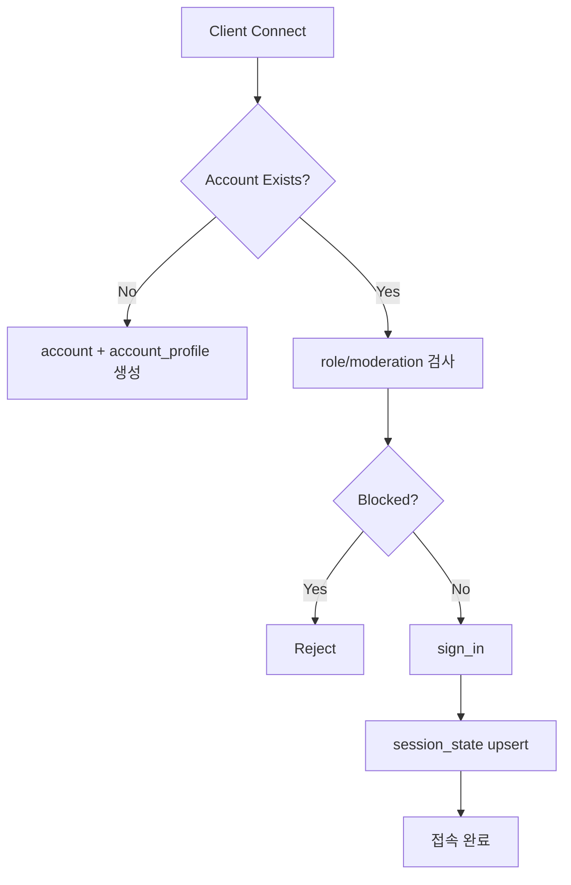

# Stitch 인증/세션/권한 부트스트랩 상세 설계

> **작성일**: 2026-02-01
> **상태**: DESIGN/DETAIL - 상세 구현 설계
> **참고**: BitCraftPublicDoc/20 (아이디어 참고용)
> **범위**: 계정/세션/역할/제재, 서버 인증 흐름, 보안 정책

---

## 1. 개요

Stitch의 인증/권한 시스템은 **Identity 기반 계정 관리**, **세션 상태 추적**, **역할(Role) 기반 접근 제어**, **제재/차단**으로 구성된다. 이 문서는 DESIGN/05 데이터 모델을 기반으로 서버 핸들러 흐름과 안전장치를 정의한다.

### 1.1 설계 목표

| 목표 | 설명 |
|------|------|
| **안전성** | 세션 하이재킹/재사용 방지, 권한 우회 차단 |
| **일관성** | 모든 리듀서에서 동일한 검증 함수 사용 |
| **운영성** | 운영자/GM 역할 분리, 제재/감사 로그 연계 |
| **확장성** | OAuth/게스트/외부 ID 연동 확장 가능 |

---

## 2. 데이터 모델 요약

### 2.1 계정/프로필

- `account`: Identity 단위 계정 생성 시점/상태 저장.
- `account_profile`: 표시명/아바타/로케일 공개 정보.

### 2.2 세션

- `session_state`: 활성 세션의 `identity`, `region_id`, `last_active_at` 저장.
- 세션 테이블은 **클라이언트에 공개하지 않음** (RLS/뷰 제한).

### 2.3 역할/제재

- `role_binding`: 운영자/GM/모더레이터 등 역할 부여.
- `moderation_flag`: 자동/수동 제재 점수 및 사유 추적.

---

## 3. 인증/세션 라이프사이클

### 3.1 기본 흐름



### 3.2 sign_in 검증 체크리스트

- Identity 유효성/중복 세션 여부 확인
- `moderation_flag` 상태 점수 확인
- 서버 수용 상태(`feature_flags` 또는 운영자 설정)
- 최초 접속 시 기본 프로필/튜토리얼 플래그 설정

### 3.3 세션 갱신/활성도

- `session_touch` 리듀서(또는 서버 내부 핸들러)로 `last_active_at` 갱신
- 클라이언트 요청마다 직접 갱신하지 않고, **주기적 핑/행동 이벤트**로만 갱신

### 3.4 sign_out 및 정리

- `session_state` 삭제
- 전투/행동/거래 세션 정리
- 임시 버프/상태의 보존 규칙 적용

---

## 4. 역할(Role) 및 운영 권한

### 4.1 역할 계층(예시)

| 역할 | 설명 |
|------|------|
| Player | 기본 플레이어 |
| Mod | 채팅/세션 제재 |
| Gm | 운영 기능(로그/보상) |
| Admin | 전체 권한 |

### 4.2 권한 검사 원칙

- 리듀서 시작 시 `require_role(ctx, Role::X)`로 통일
- Dev/Local 환경에서는 **명시적 플래그**로만 우회 허용

---

## 5. 제재/차단

### 5.1 자동 제재

- `moderation_flag.score`가 임계치 이상이면 로그인 차단
- 자동 제재는 **일괄 해제 리듀서**와 분리

### 5.2 수동 제재

- 운영자 리듀서로 점수/사유 갱신
- 모든 변경은 감사 로그에 기록(별도 테이블/외부 로깅)

---

## 6. 리듀서/API 설계

### 6.1 계정 초기화

```rust
#[spacetimedb::reducer]
pub fn account_bootstrap(ctx: &ReducerContext, display_name: String) -> Result<(), String> {
    let identity = ctx.sender;

    if ctx.db.account().identity().find(&identity).is_none() {
        ctx.db.account().insert(Account {
            identity,
            created_at: ctx.timestamp.as_micros() as u64,
            status: 0,
        });
    }

    if ctx.db.account_profile().identity().find(&identity).is_none() {
        ctx.db.account_profile().insert(AccountProfile {
            identity,
            display_name,
            avatar_id: 0,
            locale: "en".to_string(),
        });
    }

    Ok(())
}
```

### 6.2 세션 생성

```rust
#[spacetimedb::reducer]
pub fn sign_in(ctx: &ReducerContext, region_id: u64) -> Result<u64, String> {
    let identity = ctx.sender;
    ensure_not_blocked(ctx, identity)?;

    let session_id = ctx.db.session_state().next_id();
    ctx.db.session_state().insert(SessionState {
        session_id,
        identity,
        region_id,
        last_active_at: ctx.timestamp.as_micros() as u64,
    });

    Ok(session_id)
}
```

### 6.3 세션 종료

```rust
#[spacetimedb::reducer]
pub fn sign_out(ctx: &ReducerContext, session_id: u64) -> Result<(), String> {
    let session = ctx.db.session_state().session_id().find(&session_id)
        .ok_or("Session not found")?;

    if session.identity != ctx.sender {
        return Err("Unauthorized".to_string());
    }

    ctx.db.session_state().session_id().delete(session_id);
    Ok(())
}
```

---

## 7. 보안 정책

### 7.1 세션 하이재킹 방지

- `session_state`는 **private**로만 유지
- 세션 갱신은 서버 내부 또는 제한된 리듀서로만 허용

### 7.2 요청 재생 공격 방지

- `last_active_at`와 `nonce`(옵션)로 반복 요청 검증
- 중요한 리듀서에는 **idempotency key** 적용

### 7.3 rate limit

- `balance_params`에 `auth.rate_limit_per_minute` 등 추가
- 과도 요청 시 `moderation_flag` 누적

---

## 8. 구독/RLS 규칙

- `account`, `session_state`, `role_binding`, `moderation_flag`는 public 구독 금지
- `account_profile`은 PublicView로 제한된 정보만 공개

---

## 9. 구현 체크리스트

- [ ] account/account_profile bootstrap 리듀서
- [ ] sign_in/sign_out 리듀서
- [ ] session_touch/heartbeat 핸들러
- [ ] role_binding 관리 리듀서 (Admin only)
- [ ] moderation_flag 업데이트 리듀서 (Admin/Mod)
- [ ] 공통 권한 검사 유틸 (`require_role`)

---

## 10. 관련 문서

- DESIGN/05-data-model-tables/account.md
- DESIGN/05-data-model-tables/account_profile.md
- DESIGN/05-data-model-tables/session_state.md
- DESIGN/05-data-model-tables/role_binding.md
- DESIGN/05-data-model-tables/moderation_flag.md
- DESIGN/DETAIL/stitch-permission-access-control.md
