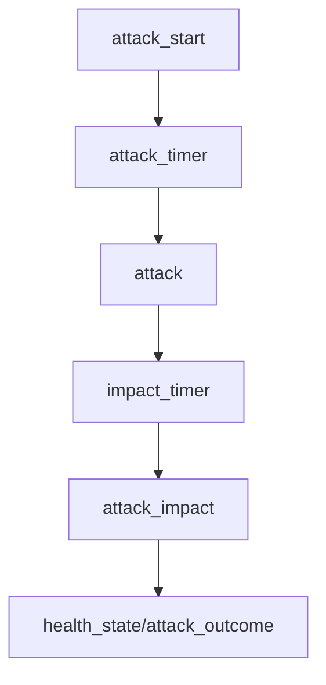

# Stitch 전투/PvP 시스템 상세 설계

> **작성일**: 2026-02-01  
> **상태**: DESIGN/DETAIL - 상세 구현 설계  
> **참고**: BitCraftPublicDoc 및 BitCraftServer 구현 패턴은 영감용 참고  
> **범위**: 전투 흐름, 피해 계산, 위협/스케일링, PvP 듀얼

---

## 1. 전투 아키텍처

- 서버 권위형 **다단계 공격 처리**를 사용한다.
- `attack_start -> attack_timer -> attack -> impact_timer -> attack_impact` 구조.



---

## 2. 테이블 설계 (요약)

### 2.1 combat_state
```rust
#[spacetimedb::table(name = combat_state, public)]
pub struct CombatState {
  #[primary_key]
  pub entity_id: u64,
  pub last_attacked_timestamp: u64,
  pub global_cooldown: Option<ActionCooldown>,
  pub last_performed_action_entity_id: u64,
}
```

### 2.2 attack_timer / impact_timer
```rust
#[spacetimedb::table(name = attack_timer, public, scheduled(attack_scheduled, at = scheduled_at))]
pub struct AttackTimer {
  #[primary_key]
  #[auto_inc]
  pub scheduled_id: u64,
  pub scheduled_at: spacetimedb::ScheduleAt,
  pub attacker_entity_id: u64,
  pub defender_entity_id: u64,
  pub combat_action_id: i32,
  pub attacker_type: u8,
  pub defender_type: u8,
}
```

### 2.3 threat_state / enemy_scaling_state
```rust
#[spacetimedb::table(name = threat_state, public)]
pub struct ThreatState {
  #[primary_key]
  pub entity_id: u64,
  pub owner_entity_id: u64,
  pub target_entity_id: u64,
  pub threat: f32,
}

#[spacetimedb::table(name = enemy_scaling_state, public)]
pub struct EnemyScalingState {
  #[primary_key]
  pub entity_id: u64,
  pub enemy_scaling_id: u64,
}
```

### 2.4 duel_state
```rust
#[spacetimedb::table(name = duel_state, public)]
pub struct DuelState {
  #[primary_key]
  pub entity_id: u64,
  pub player_entity_ids: Vec<u64>,
  pub loser_index: i32,
  pub out_of_range_timestamps: Vec<u64>,
}
```

### 2.5 attack_outcome
```rust
#[spacetimedb::table(name = attack_outcome, public)]
pub struct AttackOutcome {
  #[primary_key]
  pub attack_id: u64,
  pub src_id: u64,
  pub dst_id: u64,
  pub dmg: u32,
  pub ts: u64,
}
```

### 2.6 combat_metric (요약 로그)
```rust
#[spacetimedb::table(name = combat_metric, public)]
pub struct CombatMetric {
  #[primary_key]
  pub metric_id: u64,
  pub src_id: u64,
  pub dst_id: u64,
  pub dmg_sum: u64,
  pub window_start: u64,
  pub window_end: u64,
}
```

---

## 3. 공격 처리 파이프라인

### 3.1 attack_start (입력 검증)
- 공격자/대상 존재 확인
- 능력 보유/쿨다운/스태미나 확인
- 범위/무기 타입/티어 검증

### 3.2 attack (핵심 전투 로직)
- 멀티 타겟 탐색(반경/타겟팅 매트릭스)
- 투사체 기반 지연(거리/속도)

### 3.3 attack_impact
- 피해 계산
- 위협 갱신
- 내구도 감소
- 사망 처리 및 경험치 분배

### 3.4 서버 검증 규칙
- 공격 시작 시점에 **거리/무기/스태미나/쿨다운** 검증
- 타격 시점에 **거리 재검증** 및 대상 상태(무적/비활성) 확인
- `attack_outcome`은 **서버만 작성**

### 3.5 공격 결과 브로드캐스트
- `attack_outcome`은 AOI 기반으로만 노출
- 연속 타격 결과는 `combat_metric`에 집계

---

## 4. 피해 계산 공식

### 4.1 기본 공식
- 무기 피해 롤 + 스탯 보너스
- 방어력 감소(감쇠)
- 멀티 타겟 보정

```text
damage_roll = rand(min_damage, max_damage)
bonus_damage = ceil(strength * strength_multiplier / (1.0 / weapon_cooldown) / 15)
damage = damage_roll + bonus_damage
reduction = armor / (armor + 2000)
mitigated = damage * (1.0 - reduction)
```

### 4.2 회피 판정
- `accuracy` vs `evasion * 0.1` 난수 비교.
- 헌팅(채집/사냥)은 회피 판정 제외.

---

## 5. 위협(Threat) 및 스케일링

- `add_threat`: 일반 공격/피해 기반 위협 증가
- `equalize_threat_then_add`: 도발(taunt) 용도
- 위협 개수 변화 시 `EnemyScalingState::update`

```text
threat = base_threat + threat_per_damage * damage
```

---

## 6. PvP/듀얼 시스템

### 6.1 듀얼 감시 에이전트
- 1초 간격 루프
- 로그아웃/사망/거리 초과 시 패배 처리

### 6.2 타게팅 매트릭스
- PvE/PvP 허용 범위를 정적 데이터로 제어
- 듀얼은 매트릭스 제한을 우회 가능

---

## 7. 내구도/자원 소모

- 공격 성공 후 무기 내구도 감소
- 헌팅/전투 무기 유형 분기 처리
- 스태미나 소모는 `attack_start` 시점에 검증

---

## 8. 에이전트

- `duel_agent` : 듀얼 타임아웃 감시
- `enemy_regen_agent` : 전투 종료 후 회복
- `attack_timer` / `impact_timer` : 지연 처리

---

## 9. 구독 설계

- 전투 관련 테이블은 AOI 기반 구독
- `attack_outcome`은 전투 반경 내 플레이어만 구독
- `combat_metric`은 전역 공개 대신 요약/지연 전송

---

## 10. 보안/치트 방지

- 쿨다운/거리/스태미나/무기 검증 2중 체크
- 공격 시작/타격 분리로 클라 예측 조작 차단

---

## 11. 관련 문서

- DESIGN/05-data-model-tables/combat_state.md
- DESIGN/05-data-model-tables/threat_state.md
- DESIGN/05-data-model-tables/attack_outcome.md
- DESIGN/05-data-model-tables/combat_metric.md
