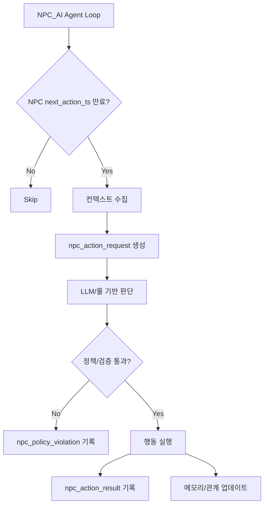

# Stitch NPC AI/행동 시스템 상세 설계

> **작성일**: 2026-02-01
> **상태**: DESIGN/DETAIL - 상세 구현 설계
> **참고**: BitCraftPublicDoc/13 (아이디어 참고용)
> **범위**: NPC 행동 결정, LLM 요청 파이프라인, 대화/관계/메모리

---

## 1. 개요

Stitch의 NPC AI는 **주기적 에이전트 실행**과 **행동 요청 파이프라인**으로 구성된다. NPC는 대화/거래/퀘스트 제공자 역할을 수행하며, 플레이어 행동 및 주변 상황을 기반으로 행동을 선택한다.

### 1.1 설계 목표

| 목표 | 설명 |
|------|------|
| **확장성** | 행동 타입 추가 시 최소 변경 |
| **안전성** | LLM 응답 검증/정책 위반 차단 |
| **성능** | 온라인 플레이어 근처 NPC만 처리 |
| **일관성** | 행동 요청-결과 기록을 표준화 |

---

## 2. 핵심 흐름



---

## 3. 데이터 모델 요약

### 3.1 NPC 상태/스케줄

- `npc_state`: role/mood/next_action_ts
- `npc_action_schedule`: 다음 행동 유형/타겟 지역

### 3.2 행동 요청/결과

- `npc_action_request`: LLM 요청 payload 저장 (private)
- `npc_action_result`: 결과 상태/적용 시간

### 3.3 대화/메모리/관계

- `npc_conversation_session`, `npc_conversation_turn`
- `npc_memory_short`, `npc_memory_long`
- `npc_relation`
- `npc_response_cache` (중복 질의 캐시)
- `npc_policy_violation` (정책 위반 기록)
- `npc_cost_metrics` (비용/토큰 측정)

---

## 4. 행동 타입

| 타입 | 설명 | 연동 시스템 |
|------|------|-------------|
| Move | 이동/순찰/위치 변경 | pathfinding, transform_state |
| Talk | 대화 응답 | conversation_session/turn |
| Trade | 거래/바터 제안 | trade/auction/barter |
| Quest | 퀘스트 제안/진행 | quest/achievement |

행동 타입은 `npc_action_request.type`으로 분기하며, 실행 결과는 `npc_action_result.status`로 기록한다.

---

## 5. LLM 요청 파이프라인

### 5.1 요청 생성

```rust
fn create_action_request(ctx: &ReducerContext, npc_id: u64, action_type: u8, payload: String) {
    ctx.db.npc_action_request().insert(NpcActionRequest {
        request_id: ctx.db.npc_action_request().next_id(),
        npc_id,
        type: action_type,
        payload,
    });
}
```

### 5.2 검증 규칙

- 행동 결과는 **화이트리스트 스키마**로 검증
- 금지된 표현/민감 주제는 `npc_policy_violation` 기록 후 무효 처리
- 비용 초과 응답은 `npc_response_cache`로 대체

---

## 6. 대화 시스템

### 6.1 세션 생명주기

- `npc_conversation_session` 생성 → 턴 기록 → 종료
- 세션 만료는 `last_ts` 기준으로 정리 에이전트에서 처리

### 6.2 턴 기록

- `npc_conversation_turn`은 사용자 입력/응답 요약만 저장
- 민감 데이터는 **요약/마스킹** 처리

---

## 7. 메모리/관계 업데이트

- `npc_memory_short`: 최근 사건 요약
- `npc_memory_long`: 중요 이벤트 장기 저장
- `npc_relation`: 호감/신뢰 스코어 누적

메모리 업데이트는 **행동 결과 적용 후**에만 수행한다.

---

## 8. 성능/안정성

- 온라인 플레이어 AOI 내 NPC만 평가
- 요청/응답 캐시로 중복 생성 방지
- LLM 실패 시 룰 기반 폴백

---

## 9. 구현 체크리스트

- [ ] NPC_AI 에이전트에서 next_action_ts 갱신
- [ ] 행동 요청 생성/결과 기록
- [ ] 정책 위반 기록 및 차단
- [ ] 대화 세션 생성/만료 정리
- [ ] 메모리/관계 업데이트 로직

---

## 10. 관련 문서

- DESIGN/DETAIL/agent-system-design.md
- DESIGN/05-data-model-tables/npc_state.md
- DESIGN/05-data-model-tables/npc_action_schedule.md
- DESIGN/05-data-model-tables/npc_action_request.md
- DESIGN/05-data-model-tables/npc_action_result.md
- DESIGN/05-data-model-tables/npc_conversation_session.md
- DESIGN/05-data-model-tables/npc_conversation_turn.md
- DESIGN/05-data-model-tables/npc_memory_short.md
- DESIGN/05-data-model-tables/npc_memory_long.md
- DESIGN/05-data-model-tables/npc_relation.md
- DESIGN/05-data-model-tables/npc_response_cache.md
- DESIGN/05-data-model-tables/npc_policy_violation.md
- DESIGN/05-data-model-tables/npc_cost_metrics.md
